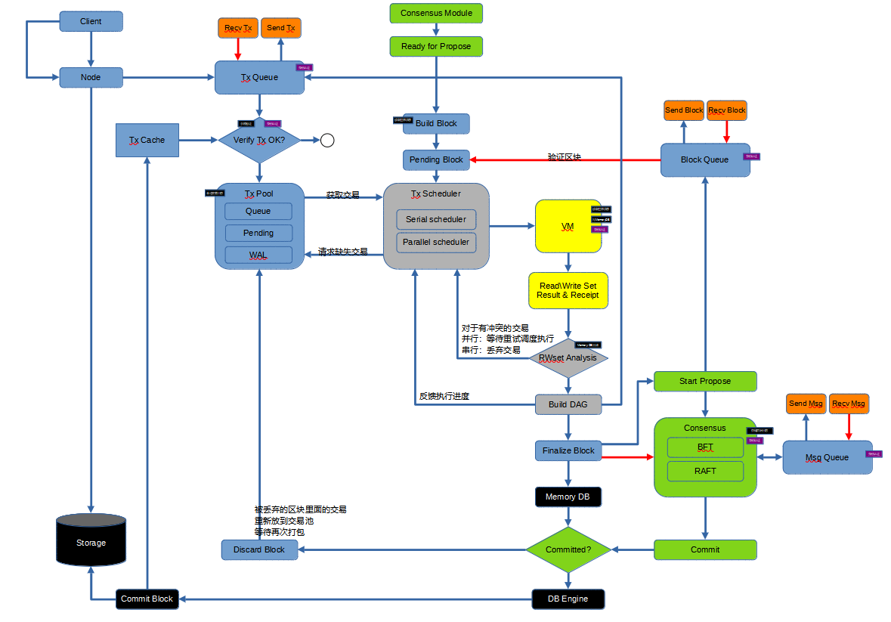
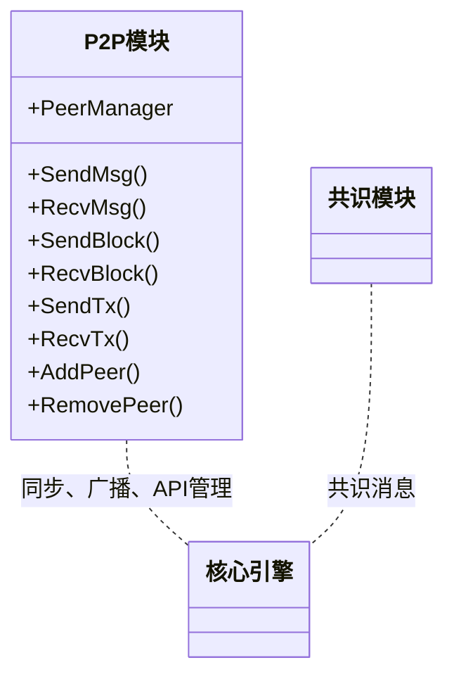
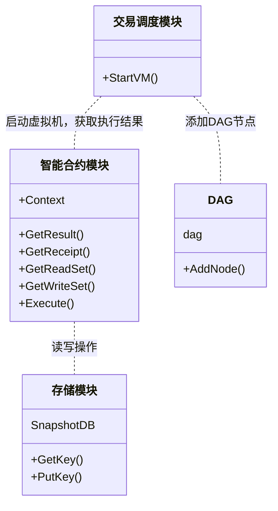

# 1. 总述

## 1.1 ChainMaker概述

ChainMaker是将区块链深度模块化，抽象区块链整体执行流程，以支持广域场景的，用于生成区块链系统的标准、组件和工具集合。

本期概要设计着重于ChainMaker的模块化及各模块通用流程、接口的说明。

## 1.2 文档读者

ChainMaker的设计、研发、测试和系统运维人员。

## 1.3 ChainMaker版本规划

- ChainMaker整体规划


|                   | **V1.0**（**2020.12**）            | **V2.0**                     | **V3.0**                 |
| ----------------- | ---------------------------------- | ---------------------------- | ------------------------ |
| 核心引擎          | 实现各子模块管理和调度             | 优化                         | 优化                     |
| 节点组网          | libp2p（4/7/10节点）               | 大范围组网优化               | 结合混合共识和多类型节点 |
| 身份权限管理      | 公私钥+白名单                      | 证书+细粒度权限（合约/操作） | DID                      |
| 共识算法          | BFT                                | hotstuff共识                 | 混合共识/竞争性共识/性能 |
| 智能合约          | WASM通用合约                       | WASM（RUST）                 | WASM多语言/其他合约引擎  |
| 交易调度          | 无冲突并行DAG                      | 有冲突并行DAG，合约重新执行  | 支持跨链的合约反向操作   |
| 交易接收和校验    | 队列持久化+防重                    | 双花验证，交易补偿           | 跨链交易验证             |
| 跨链              | --                                 | --                           | 中继方式的跨链           |
| 隐私保护          | --                                 | 聚合签名/零知识证明          | MPC                      |
| 账本存储          | levelDB/rocksDB                    | 定制合约账本管理/可分片/DAG  | 多存储适配               |
| 装配线            | --                                 | 定制版本配置自动生成         | 定制版本模块组装自动打包 |
| RPC接口、CLI及SDK | RPC服务端接口、CLI及SDK（go+java） |                              |                          |
| 密码算法          | go版本国密、ECDSA（确定曲线）      |                              |                          |
| 管理平台          | 基础配置，区块浏览，运行情况       | BaaS（节点管理、合约管理）   |                          |
| 监控&运维         | 资源和系统监控                     | 自动化发布，大屏监控         |                          |
| 测试工具          | 测试模式下mock模拟共识异常         | 自动化测试工具               |                          |

- V1.0版本两次迭代

|                   | 第一次迭代（2020.10）              | **V1.0**（**2020.12**）      |
| ----------------- | ---------------------------------- | ---------------------------- |
| 核心引擎          | 实现各子模块管理和调度             | 实现各子模块管理和调度       |
| 节点组网          | libp2p（4节点）  gRPC              | libp2p（4/7/10节点）         |
| 身份权限管理      | 公私钥+白名单                      | 公私钥+白名单                |
| 共识算法          | ***腾讯确定具体算法***             | BFT                          |
| 智能合约          | WASM通用合约                       | WASM通用合约                 |
| 交易调度          | 并行                               | 无冲突并行DAG                |
| 交易接收和校验    | 防重                               | 队列持久化+防重              |
| 跨链              | --                                 | --                           |
| 隐私保护          | --                                 | --                           |
| 账本存储          | levelDB                            | levelDB/rocksDB              |
| 装配线            | --                                 | --                           |
| RPC接口、CLI及SDK | RPC服务端接口、CLI及SDK（go+java） | --                           |
| 密码算法          | go版本国密、ECDSA（确定曲线）      |                              |
| 管理平台          |                                    | 基础配置，区块浏览，运行情况 |
| 监控&运维         |                                    | 资源和系统监控               |
| 测试工具          |                                    | 测试模式下mock模拟共识异常   |


# 2. 整体架构

## 2.1 区块产生流程


## 2.2 联盟链与公有链基本流程


## 2.3 模块架构

【微芯院】更新版本，【腾讯】可先参照2.5小节流程设计




## 2.4 模块说明

【微芯院】	

## 2.5 整体流程

### 2.5.1 交易处理

【微芯院】Txid的两种机制


### 2.5.2 构建候选区块


### 2.5.3 验证候选区块


### 2.5.4 共识落块


### 2.5.5 智能合约生命周期管理

【微芯院】

### 2.5.6 共识节点动态增删

【腾讯】

### 2.5.7 区块同步及验证

【腾讯，参考下图】


# 3. 模块流程

## 3.1 核心引擎

【微芯院】

### 3.1.1 模块功能说明


### 3.1.2 模块流程


### 3.1.3 模块接口

与网络和身份权限管理模块间采用接口调用或管道传递指针的方式

与其他模块采用管道或RPC+protobuf通信方式


## 3.2 P2P模块

模块功能：帮助上层管理复杂的p2p网路。

模块内部实现节点的状态管理、邻居管理、区块、交易消息同步和广播。对外提供的服务包括：区块、交易、共识消息的收发、节点增删的API接口。




采用libp2p作为连接库，使用KAD算法建立网络。

### 3.2.1 网络结构


### 3.2.2 节点类型

- 轻节点
  保存区块头信息以及自己相关的交易数据，通过全节点进行交易验证。轻节点参与交易和区块信息的全网广播。
- 全节点
  保存所有区块的数据，可以在本地直接验证交易数据的有效性。全节点参与交易和区块信息的全网广播。
- 种子节点
  新节点通过先连接到种子节点，然后发现其他节点。
- 共识节点
  共识节点必须是一个全节点，执行交易，生成DAG，打包成区块，并发送至其他共识节点进行共识。

### 3.2.3 节点状态


### 3.2.4 邻居发现过程


## 3.3 密码算法模块

【腾讯，国密算法公钥及参数信息配置，与加密通信的结合】


## 3.4 身份权限管理

【腾讯，节点管理、证书配置、权限管理及其相应的数据模型的扩展】


## 3.5 共识算法

### 3.5.1 模块流程


### 3.5.2 模块接口

模块内通用共识消息

```protobuf
enum ConsensusType {
  POW = 0;
  PBFT = 1;
  TENDERMINT = 2;
  HOTSTUFF = 3;
  RAFT = 4;
}

message ConsensusMsg {
  ConsensusType type = 1;
  string ChainId = 2;
  Signature Signature = 3;
  oneof msg {
    PoWMsg pow = 4;
    PBFTMsg pbft = 5;
    TendermintMsg tendermint = 6;
    HotstuffMsg hotstuff = 7;
    RAFTMsg raft = 8;
  }
}
```

各类共识算法需在此基础上扩展。

### 3.5.3 共识算法流程梳理

- BFT共识算法

【腾讯】


## 3.6 智能合约

【微芯院】

外部依赖

- 被执行的指令代码的账户地址
- 最近的256个区块头
- 要执行的代码
- 执行的输入参数
- 合约的状态数据



## 3.7 交易调度

### 3.7.1 交易调度流程


### 3.7.2 交易调度示意

- 构建读写集

|      | 读集       | 写集 | 结果 | 回执 |
| ---- | ---------- | ---- | ---- | ---- |
| Tx1  | Key1，Key2 | Key3 |      |      |
| Tx2  | Key1，Key2 |      |      |      |
| Tx3  | Key2       |      |      |      |
| Tx4  | Key3       |      |      |      |

- 构建DAG

根据读写集转换为下表，这个过程可以一边执行交易，一边生成。实际采用链表，每执行一笔交易，就可以分析读写冲突，并生成DAG里面的一个节点。

|      | Key1 | Key2 | Key3 |
| ---- | ---- | ---- | ---- |
| Tx1  | 读   | 读   | 写   |
| Tx2  | 读   | 读   |      |
| Tx3  |      | 读   |      |
| Tx4  |      |      | 读   |

- 交易调度示意图


## 3.8 交易校验

【微芯院】


## 3.9 账本存储

### 3.9.1 模块功能说明

本期采用rocksDB或levelDB作为账本存储的数据库。

账本数据库存储结构详见第6章。

### 3.9.2 模块流程


### 3.9.3 模块接口

面向核心引擎模块的接口

```go
type DbStore interface {
	DeleteBlock(blockHash types.Hash) error
	HasBlock(blockHash types.Hash) (bool, error)
	GetBlock(blockHash types.Hash) (*pb.Block, error)
	GetBlockAt(height int64) (*pb.Block, error)
	GetBlockSize(blockHash types.Hash) (int, error)
	PutBlock(block *pb.Block) error
	PutManyBlock(blocks []*pb.Block) error
	GetTx(transactionHash types.Hash) (*pb.Transaction, error)
	GetTxByTxid(txid []byte) (*pb.Transaction, error)
	GetTxs(TxKey []byte) ([]*pb.Transaction, error)
	QueryBlockHeader(blockid []byte) (*pb.Block, error)
	HasTx(txid []byte) (bool, error)
	UpdateLast(types.Hash) error
	GetLast() (types.Hash, error)
}

type Database interface {
	Open(path string, options map[string]interface{}) error
	Put(key []byte, value []byte) error
	Get(key []byte) ([]byte, error)
	Has(key []byte) (bool, error)
	Delete(key []byte) error
	Close()
	NewBatch() Batch
	NewIteratorWithRange(start []byte, limit []byte) Iterator
	NewIteratorWithPrefix(prefix []byte) Iterator
}

type Batch interface {
	ValueSize() int
	Write() error
	Reset()
	Put(key []byte, value []byte) error
	Delete(key []byte) error
	PutIfAbsent(key []byte, value []byte) error
	Exist(key []byte) bool
}

type Iterator interface {
	Key() []byte
	Value() []byte
	Next() bool
	Prev() bool
	Last() bool
	First() bool
	Error() error
	Release()
}
```

## 3.10 多语言SDK

【腾讯】


## 3.11 核心数据模型

【微芯院，扩展支持多链、多合约调用】

【腾讯，补充身份权限管理、跨链等场景相关字段】

- block定义

block为区块总结构体，block结构按其三个子部分，即区块头、DAG读写集以及原始交易集，分别独立存储。

```go
type Block struct {
	state         protoimpl.MessageState
	sizeCache     protoimpl.SizeCache
	unknownFields protoimpl.UnknownFields

	Header *Header        `protobuf:"bytes,1,opt,name=header,proto3" json:"header,omitempty"`
	Dag    *DAG           `protobuf:"bytes,2,opt,name=dag,proto3" json:"dag,omitempty"`
	Txs    []*Transaction `protobuf:"bytes,3,rep,name=txs,proto3" json:"txs,omitempty"`
}
```

- header定义

header即区块头，独立存储在KV库的不同Column Family里，CF命名可参考：ChainId（子链标识）+Header+扩展编号（000开始，未来分片扩展）。

key：BlockHeight+BlockHash。

value：按照下述结构图，其余字段，按照XX格式序列化后存储。

```go
type Signature struct {
	state         protoimpl.MessageState
	sizeCache     protoimpl.SizeCache
	unknownFields protoimpl.UnknownFields

PublicKeys [][]byte `protobuf:"bytes,1,rep,name=public_keys,json=publicKeys,proto3" json:"public_keys,omitempty"`
Signature  []byte   `protobuf:"bytes,2,opt,name=signature,proto3" json:"signature,omitempty"`

}
```


- 交易定义

交易独立存储在KV库的不同Column Family里，CF命名可参考：ChainId（子链标识）+Tx+扩展编号（000开始，未来分片扩展）。

key：TxId+BlockHeight+TxHash。

value：按照下述结构图，其余字段，按照XX格式序列化后存储。

```go
type Transaction struct {
	state         protoimpl.MessageState
	sizeCache     protoimpl.SizeCache
	unknownFields protoimpl.UnknownFields

	Metadata      *Transaction_MetaData `protobuf:"bytes,1,opt,name=metadata,proto3" json:"metadata,omitempty"`                                // 交易元数据
	Contract      *Contract             `protobuf:"bytes,2,opt,name=contract,proto3" json:"contract,omitempty"`                                // 合约调用
	SenderAddress []byte                `protobuf:"bytes,3,opt,name=sender_address,json=senderAddress,proto3" json:"sender_address,omitempty"` // 交易发送者地址
	Result        *Transaction_Result   `protobuf:"bytes,4,opt,name=result,proto3" json:"result,omitempty"`                                    // 返回
	TxHash        []byte                `protobuf:"bytes,5,opt,name=tx_hash,json=txHash,proto3" json:"tx_hash,omitempty"`                      // 交易哈希 Contract+sender_address
	Signature     *Signature            `protobuf:"bytes,6,opt,name=signature,proto3" json:"signature,omitempty"`                              // 交易签名 Contract+sender_address
}

type Transaction_MetaData struct {
	state         protoimpl.MessageState
	sizeCache     protoimpl.SizeCache
	unknownFields protoimpl.UnknownFields

	Height      []byte `protobuf:"bytes,1,opt,name=height,proto3" json:"height,omitempty"`                               // 交易所属块高度
	TxId        []byte `protobuf:"bytes,2,opt,name=tx_id,json=txId,proto3" json:"tx_id,omitempty"`                       // 交易标识，便于外围应用系统检索本交易
	TxTimestamp int64  `protobuf:"varint,3,opt,name=tx_timestamp,json=txTimestamp,proto3" json:"tx_timestamp,omitempty"` // 交易时间戳
	Expiration  int64  `protobuf:"varint,4,opt,name=expiration,proto3" json:"expiration,omitempty"`                      // 交易有效期
	RefBlock    []byte `protobuf:"bytes,5,opt,name=ref_block,json=refBlock,proto3" json:"ref_block,omitempty"`           // 本交易引用的块高度
}

type Contract struct {
	state         protoimpl.MessageState
	sizeCache     protoimpl.SizeCache
	unknownFields protoimpl.UnknownFields

	Type       Contract_ContractType `protobuf:"varint,1,opt,name=type,proto3,enum=pb.Contract_ContractType" json:"type,omitempty"`
	Parameters []byte                `protobuf:"bytes,2,opt,name=parameters,proto3" json:"parameters,omitempty"` // 合约参数
}

type Transaction_Result struct {
	state         protoimpl.MessageState
	sizeCache     protoimpl.SizeCache
	unknownFields protoimpl.UnknownFields

	Code     Transaction_Result_Code `protobuf:"varint,1,opt,name=code,proto3,enum=pb.Transaction_Result_Code" json:"code,omitempty"`
	Logs     [][]byte                `protobuf:"bytes,2,rep,name=logs,proto3" json:"logs,omitempty"`
	TxReads  []*Transaction_TxRead   `protobuf:"bytes,3,rep,name=tx_reads,json=txReads,proto3" json:"tx_reads,omitempty"`
	TxWrites []*Transaction_TxWrite  `protobuf:"bytes,4,rep,name=tx_writes,json=txWrites,proto3" json:"tx_writes,omitempty"`
}
```

- DAG定义

DAG独立存储在KV库的不同Column Family里，CF命名可参考：ChainId（子链标识）+DAG+扩展编号（000开始，未来分片扩展）。

key：BlockHeight+BlockHash+DagDigest。

value：按照下述结构图，TxHashes和Vertexes，按照XX格式序列化后存储。

```go
type DAG struct {
	state         protoimpl.MessageState
	sizeCache     protoimpl.SizeCache
	unknownFields protoimpl.UnknownFields

	TxHashes [][]byte                `protobuf:"bytes,1,rep,name=tx_hashes,json=txHashes,proto3" json:"tx_hashes,omitempty"`
	Vertexes map[int32]*DAG_Neighbor `protobuf:"bytes,2,rep,name=vertexes,proto3" json:"vertexes,omitempty" protobuf_key:"varint,1,opt,name=key,proto3" protobuf_val:"bytes,2,opt,name=value,proto3"`
}

type DAG_Neighbor struct {
	state         protoimpl.MessageState
	sizeCache     protoimpl.SizeCache
	unknownFields protoimpl.UnknownFields

	Neighbors []int32 `protobuf:"varint,1,rep,packed,name=neighbors,proto3" json:"neighbors,omitempty"`
}
```

- 状态数据定义

待补充


# 4. 内部接口

【待双方下一阶段补充扩展】

## 4.1 协议说明

模块间交互使用protobuf进行消息序列化。

进程内模块使用管道交互，跨进程的模块基于RPC通信。

## 4.2 主要数据模型

```protobuf
syntax = "proto3";

package pb;
enum AccountType {
  Normal = 0;
}

message Contract {
  enum ContractType {
    CreateAccountContract = 0;
    TransferContract = 1;

    CreateSmartContract = 11;
    CallSmartContract = 12;
  }
  ContractType type = 1;
  bytes parameters = 2;// 合约参数
}

message TxRead {
  bytes key = 1;// 读集对应的key
  bytes ref_txid = 2;// 读集属于哪一个txid
  int32 ref_offset = 3;// 读集属于哪一个txid的哪一个offset
}

message TxWrite {
  bytes key = 1;// 写集对应的key
  bytes value = 2;// 写集对应的value
}

message Snapshot {
  bytes database_pointer = 1;
  repeated TxRead tx_reads = 3;
  repeated TxWrite tx_writes = 4;
}

message Transaction {
  message Result {
    enum Code {
      SUCCESS = 0;
      ILLEGAL_OPERATION = 1;
    }
    Code code = 1;
    repeated bytes logs = 2;
    bytes read_write_set_digest = 5;// 读写集特征摘要
  }

  message MetaData {
    bytes height = 1;// 交易所属块高度
    bytes tx_id = 2;// 交易标识，便于外围应用系统检索本交易
    int64 tx_timestamp = 3;// 交易时间戳
    int64 expiration = 4;// 交易有效期
    bytes ref_block = 5;// 本交易引用的块高度
  }

  MetaData metadata = 1;// 交易元数据
  Contract contract = 2;// 合约调用
  bytes sender_address = 3;// 交易发送者地址
  Result result = 4;// 返回
  bytes tx_hash = 5;// 交易哈希 Contract+sender_address
  Signature signature = 6;// 交易签名 Contract+sender_address
}

//使用邻接表存储DAG
//transaction_hashes里面存储了交易的拓扑排序
//vertexes按照拓扑排序后的顺序号表示交易
message DAG {
  message Neighbor {
    repeated int32 neighbors = 1;
  }
  repeated bytes tx_hashes = 1;
  map<int32, Neighbor> vertexes = 2;
}

message Signature {
  repeated bytes public_keys = 1; // TODO 算法类型
  bytes signature = 2;
}

message Block {
  Header header = 1;
  DAG dag = 2;
  repeated Transaction txs = 3;
}

message Header {
  int64 block_height = 1;// 块高度
  bytes pre_block_hash = 2;// 前块哈希
  bytes block_hash = 3;// 本块哈希（块标识）
  bytes block_version = 4;// 版本
  bytes dag_digest = 5;// 保存DAG特征摘要
  bytes state_root = 6;// 状态树根 非MPT
  int64 block_timestamp = 7;// 区块时间戳
  bytes proposer_public_key = 8;// 提案节点标识（公钥）
  bytes consensus_args = 9;// 共识参数，此处存放影响块hash计算的信息
  bytes additional_data = 10;// 扩展字段，此处存放不影响块hash计算的信息
  int64 txs_count = 11;// 本块交易笔数，便于统计
  Signature signature = 12;// 提案者对本块签名
}


```

### 4.1.1 节点广播


### 4.1.2 节点同步


## 4.2 消息类型

### 4.2.1 节点间心跳


### 4.2.2 节点数据同步

交易、区块

几种同步方式：Fast、Full

考虑拜占庭作恶

### 4.2.3 共识相关

区块（含DAG）、共识消息


# 5. 外部接口

【待双方下一阶段补充扩展】

## 5.1 协议说明


## 5.2 XXX接口


## 5.3 XXX接口


## 5.4 返回码


# 6. 账本KV存储结构

【腾讯】

## 6.1 区块存储结构


## 6.2 交易存储结构


## 6.3 读写集存储结构


## 6.4 状态数据存储结构


## 6.5 索引存储结构


# 7. 其他模块

## 7.1 管理平台

主要功能

1. 区块链系统Dashboard：系统节点数、全网节点状态、区块总高度、总交易数、近10个区块信息（动态更新）
2. 节点管理，节点所属机构信息、节点部署信息、节点公钥地址、节点服务的自动化部署
3. 智能合约管理，智能合约版本管理，智能合约发布管理
4. 区块浏览器，区块查询（按块哈希、块高度）、交易查询（按TxID、交易哈希）

## 7.2 监控&运维

可采用Grafana+prometheus或Zabbix

系统级监控：监控服务器资源，包括：CPU、内存、磁盘、网络IO等。

应用级监控：监控区块链系统的关键指标，如：进程的内存使用、进程CPU使用、进程文件句柄数情况、Txpool大小、出块时间、共识状态、智能合约引擎执行情况、交易接收和处理吞吐量等。

## 7.3 测试工具

ChainMaker借鉴测试驱动开发的思想，在研发阶段注重单元测试

本系统具有完整且配套的测试用例。

对于拜占庭错误的复杂异常场景，ChainMaker的核心模块应具有mock能力，在测试模式下，可以按照预置的规则模拟异常情况（如篡改消息、超时响应、重放通信报文等），方便测试。

# 8. 日志说明

## 8.1 日志文件规划

区块链系统日志文件分为系统日志、简要日志、事件日志、异常交易处理日志四类。不要向进程标准输出文件中写入日志的数据。系统日志、简要日志、事件日志，建议按小时切分；异常交易处理日志，建议按日切分。

四类日志文件：

- 系统日志：可理解为详细日志，包含系统关键处理节点的日志信息，如：交易接收、交易验证、候选区块产生、智能合约调用、合约调用结果、共识各投票阶段、账本数据库操作等。为了日志检索方便，每行日志中应包含具有唯一性的标识，如：TxID、TxHash、BlockHeight、BlockHash等。每行日志的时间戳精确到毫秒。
- 简要日志：标识没比Tx或Block的处理结果，每个Tx或Block在最终处理结束（落块）后记录，只记录一行。便于快速分析系统运行情况，如：系统是否存活、系统吞吐量、各类Tx的处理汇总统计等。
- 事件日志：区块链系统事件处理的一种方式，在交易落块后，如果需要对该交易做后续处理，需在事件日志中记录，一笔交易一行。
- 异常交易处理日志：某些可以预见且可以补救的处理异常，将Tx相关数据记录在此日志中，可用于系统恢复后的交易补偿处理。

## 8.2 日志级别规划

ChainMaker使用四种日志级别：

Debug：调试使用，在正式环境运行时会屏蔽掉。

Info：正式环境设置的日志级别，仅在系统处理的关键环节输出日志。

Warn：可以预判到的异常情况，且有异常处理机制，不会导致数据不一致、系统被挂起等严重问题，打印此日志进行告警。

Error：未预判的异常情况，异常处理机制不完备，可能对系统可用性、安全性、一致性带来影响。

日志模块可使用zap。


