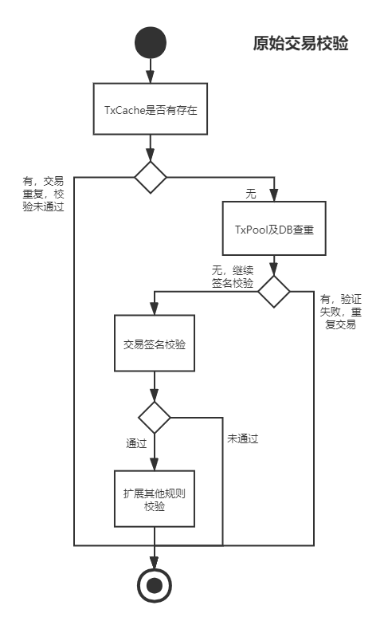

# 1. 总述

## 1.1 ChainMaker概述

ChainMaker是将区块链深度模块化，抽象区块链整体执行流程，以支持广域场景的，用于生成区块链系统的标准、组件和工具集合。

本期概要设计着重于ChainMaker的模块化及各模块通用流程、接口的说明。

<u>从基础数据结构和接口设计上需考虑未来的规划，如：对于多链、跨链、多种共识算法、账本存储的可扩展性。具体模块内部设计优先针对本期实施范围细化。</u>

## 1.2 文档读者

ChainMaker的设计、研发、测试和系统运维人员。

## 1.3 术语解释


## 1.4 ChainMaker版本规划

- ChainMaker整体规划

|                   | **V1.0**（**2020.11）              | **V2.0**                     | **V3.0**                 |
| ----------------- | ---------------------------------- | ---------------------------- | ------------------------ |
| 核心引擎          | 实现各子模块管理和调度             | 优化                         | 优化                     |
| 节点组网          | libp2p（4/7/10节点）               | 大范围组网优化               | 结合混合共识和多类型节点 |
| 身份权限管理      | 公私钥和证书+白名单                | 证书+细粒度权限（合约/操作） | DID                      |
| 共识算法          | BFT                                | hotstuff共识                 | 混合共识/竞争性共识/性能 |
| 智能合约          | WASM通用合约（go和java）           | WASM多语言                   | 其他合约引擎             |
| 交易调度          | 无冲突并行DAG                      | 有冲突并行DAG，合约重新执行  | 支持跨链的合约反向操作   |
| 交易接收和校验    | 队列持久化+防重                    | 双花验证，交易补偿           | 跨链交易验证             |
| 跨链              | --                                 | --                           | 中继方式的跨链           |
| 隐私保护          | --                                 | 聚合签名/零知识证明          | MPC                      |
| 账本存储          | levelDB/rocksDB                    | 定制合约账本管理/可分片/DAG  | 多存储适配               |
| 装配线            | --                                 | 定制版本配置自动生成         | 定制版本模块组装自动打包 |
| RPC接口、CLI及SDK | RPC服务端接口、CLI及SDK（go+java） |                              |                          |
| 密码算法          | go版本国密、ECDSA（确定曲线）      |                              |                          |
| 管理平台          | 基础配置，区块浏览，运行情况       | BaaS（节点管理、合约管理）   |                          |
| 监控&运维         | 资源和系统监控                     | 自动化发布，大屏监控         |                          |
| 测试工具          | 测试模式下mock模拟共识异常         | 自动化测试工具               |                          |

- V1.0版本两次迭代

|                      | 第一次迭代（2020.10）              | **V1.0**（**2020.11）        | 待完成                                                       |
| -------------------- | ---------------------------------- | ---------------------------- | ------------------------------------------------------------ |
| 整体架构             |                                    |                              | 明超                                                         |
| 1.核心引擎           | 实现各子模块管理和调度             | 实现各子模块管理和调度       | 区块提议\*、校验\*(振远、殷舒)                               |
| 2.节点组网           | libp2p（4节点）  gRPC              | libp2p（4/7/10节点）         | libp2p国密集成（瑞波）                                       |
| 3.身份权限管理       | 公私钥+白名单                      | 公私钥和证书+白名单          | 公私钥对接其他模块\*（张韬、瑞波、振远、殷舒），证书开发     |
| 4.共识算法           | TBFT                               | TBFT                         | 区块广播\*（智超），共识投票\*（#1）                         |
| 5.区块及状态同步     |                                    |                              | 方案及开发\*（李欣），独立模块                               |
| 6.智能合约           | WASM通用合约（go和C++）            | WASM通用合约（go和C++）      | 10月通用合约（读+写）（振远、石鑫）                          |
| 7.交易调度           | 并行                               | 无冲突并行DAG                | DAG生成\*（振远，瑞波）                                      |
| 8.TxPool             | 校验和防重                         | 队列持久化，校验和防重       | 交易并行校验\*（殷舒），队列持久化                           |
| 9.跨链               | --                                 | --                           |                                                              |
| 10.隐私保护          | --                                 | --                           |                                                              |
| 11.账本存储          | levelDB                            | levelDB/rocksDB              | columnfamily定义\*，key定义\*，所有接口实现\*，levelDB分表（长辉） |
| 12.链启动            |                                    |                              | 链初始化\*，启动\*，创世块\*（明超、#2、#3）                 |
| 13.配置链            |                                    |                              | 配置合约\*，配置加载\*（#4）                                 |
| 14.装配线            | --                                 | --                           | go的依赖注入                                                 |
| 15.RPC接口、CLI及SDK | RPC服务端接口、CLI及SDK（go+java） | --                           | RPC接口定义\*、CLI\*和SDK封装\*（Kevin、Jason）              |
| 16.密码算法          | go版本国密、ECDSA（确定曲线）      |                              | 优化，与其他模块对接，gRPC国密\*（Jason）                    |
| 17.管理平台          |                                    | 基础配置，区块浏览，运行情况 | dashboard、区块浏览【前端】                                  |
| 18.监控&运维         |                                    | 资源和系统监控               | 基于docker、K8s的资源监控【docker、K8s】                     |
| 19.测试工具          |                                    | 测试模式下mock模拟共识异常   | 测试用例                                                     |


# 2. 整体架构

## 2.1 区块产生流程


## 2.2 联盟链与公有链基本流程


## 2.3 模块架构

【腾讯】可先参照2.5小节流程设计


## 2.5 模块说明

- 核心引擎——核心引擎是链工厂的主程序，根据模块之间的依赖关系和配置参数调用其他模块， 完成区块链系统的整体功能；
- P2P——对节点p2p网络进行管理，实现节点发现，邻居管理、节点的状态管理、区块及交易消息同步和广播；
- 密码算法——密码学模块需实现加解密、哈希、认证与证明等基础功能接口，供其他模块使用；
- 身份权限管理——身份管理模块需实现权限配置与权限校验接口，对成员接入、智能合约调用等操作权限进行控制；
- 共识算法——共识算法模块需实现共识接口，输出在网络节点达成一致的区块数据；
- 智能合约——合约引擎模块需在资源受限的安全环境内模拟执行接口，根据给定的用户输入生成读写集合；
- 交易调度——交易调度模块需实现交易打包与排序接口，将输入的一批交易生成基于DAG的执行计划；
- 交易验证——对原始交易合法性的校验，如：交易签名合法性、防重、防双花等；
- TxPool交易池——包含接收原始交易的队列、交易验证和已验证交易的交易池，需支持批量操作，可按照预定规则批量持久化至磁盘；
- 账本存储——数据存储模块需实现最基本的CRUD接口，方便对数据库进行增删改查的操作，需支持多类型数据库的账本存储；
- 多语言SDK——符合系统RPC接入标准的SDK，方便应用系统接入，需支持多语言，如：java、go等。
- 系统管理，管理新建链、安装合约等。
  
## 2.6 整体流程

### 2.6.1 交易提交至交易池


### 2.6.2 构建候选区块
- 构建候选区块


- 构建候选区块中断


- 打包区块条件判断


### 2.6.3 验证候选区块


### 2.6.4 共识落块


### 2.6.5 智能合约生命周期管理


### 2.6.6 共识节点动态增删

【腾讯】

### 2.6.7 区块同步及验证

【腾讯，参考下图】


#### 2.6.7.1 区块同步
- 主要变化
  - 上图是基于，共识提案区块高度大于（本地区块高度+1）的场景，由共识模块触发区块同步；
  - 10.12的内部沟通会明确了区块同步作为独立运行的服务，独立与共识服务；

- 区块同步的大致过程如下：
  - 获取区块高度差
  - 选择同步节点
  - 发送获取区块数据的请求
  - 接收区块数据
  - 检查共识结果
  - 区块内交易的执行和校验
  - 区块提交

- 获取区块高度差
  - 区块同步服务周期广播本节点的区块高度
  - 同时，接收其他节点的广播，建立节点的区块高度视图

- 选择同步节点
  - 目前简化处理，选择高度最大的节点同步区块

#### 2.6.7.2 缓存待提交的同步区块
达到类似下图的效果：


# 3. 模块流程

## 3.1 核心引擎

### 3.1.1 模块流程

- 核心引擎初始化


- 核心引擎交易处理


初始化流程

引用


### 3.1.2 模块接口

与网络和身份权限管理模块间采用接口调用或管道传递指针的方式

与其他模块采用管道或RPC+protobuf通信方式


## 3.2 P2P模块

模块功能：帮助上层管理复杂的p2p网路。

模块内部实现节点的状态管理、邻居管理、区块、交易消息同步和广播。对外提供的服务包括：区块、交易、共识消息的收发、节点增删的API接口。


采用libp2p作为连接库，使用KAD算法建立网络。

### 3.2.1 网络结构


### 3.2.2 节点类型

- 轻节点
  保存区块头信息以及自己相关的交易数据，通过全节点进行交易验证。轻节点参与交易和区块信息的全网广播。
- 全节点
  保存所有区块的数据，可以在本地直接验证交易数据的有效性。全节点参与交易和区块信息的全网广播。
- 种子节点
  新节点通过先连接到种子节点，然后发现其他节点。
- 共识节点
  共识节点必须是一个全节点，执行交易，生成DAG，打包成区块，并发送至其他共识节点进行共识。

### 3.2.3 节点状态


### 3.2.4 邻居发现过程


## 3.3 密码算法模块

【腾讯，国密算法公钥及参数信息配置，与加密通信的结合】

> 该节以下为草稿，待讨论。

### 3.3.1 支持加密算法

> 一期优先来支持国密算法

- 对称密码
  - `SM4`
  - `AES`

- 非对称密码
  - `SM2`
  - `RSA`
  - `Secp256k1`
  - `ECDSA_P256`
  - `ECDSA_P384`
  - `ECDSA_P521`
  - `Ed25519`
- 哈希算法
  - `SM3`
  - `SHA256`
  - `Keccak256`

### 3.3.2 国密技术选型

| 可选方案                                                     | 特点                                                         |
| ------------------------------------------------------------ | ------------------------------------------------------------ |
| [tjfoc](https://github.com/tjfoc)/[gmsm](https://github.com/tjfoc/gmsm) | 开源<br />纯Go语言实现<br />支持SM2/SM3/SM4                  |
| [guanzhi](https://github.com/guanzhi)/[GmSSL](https://github.com/guanzhi/GmSSL) | 开源<br />C实现<br />基于OpenSSL开发，保持了接口兼容，工具丰富<br />支持SM2/SM3/SM4/SM9/ZUC等国密算法 |
| [TencentSM](http://techmap.oa.com/project/9631)              | 腾讯自研，尚未开源                                           |

### 3.3.3 实现方案

```go
package crypto

// 秘钥类型
type KeyType int
const (
	// 对称秘钥
	AES KeyType = iota
	SM4

	// 非对称秘钥
	RSA
	Secp256k1
	SM2
	ECDSA_P256
	ECDSA_P384
	ECDSA_P521
	Ed25519
)

// === 秘钥接口 ===
type Key interface {
	// 获取秘钥字节数组
	Bytes() ([]byte, error)

	// 获取秘钥类型
	Type() KeyType
    
    // 获取编码后字符串格式秘钥
    String() (string, error)
}

// === 对称秘钥加解密接口 ===
type SymmetricKey interface {
	Key

	// 加密接口
	Encrypt(plain []byte) (cipher []byte, err error)

	// 解密接口
	Decrypt(cipher []byte) (plain []byte, err error)
}

// === 非对称秘钥签名+验签接口 ===
// 私钥签名接口
type PrivateKey interface {
	Key

	// 私钥签名
	Sign(data []byte) ([]byte, error)

	// 返回公钥
	PublicKey() PublicKey
}

// 公钥验签接口
type PublicKey interface {
	Key

	// 公钥验签
	Verify(data []byte, sig []byte) (bool, error)
}
```

### 3.3.4 提供接口

#### （1）非对称加密

```go
// 生成公私钥对
func GenerateKeyPair(keyType crypto.KeyType) (crypto.PrivateKey, error) {}
// func GenerateKeyPair(keyType crypto.KeyType) (pk string, sk string, err error) {}

// 签名
func Sign(keyType crypto.KeyType, sk string, data []byte) (sign string,  err error) {}

// 验签
func Verify(keyType crypto.KeyType, pk string, sign string, data []byte) (bool, error) {}
```

#### （2）对称加密

```go
// 创建对称秘钥对象
func GenerateSymKey(opt crypto.KeyType, key []byte) (crypto.SymmetricKey, error) {}

// 加密
func (symKey *SymKey) Encrypt(plain []byte) ([]byte, error) {}

// 解密
func (symKey *SymKey) Decrypt(crypted []byte) ([]byte, error) {}
```


## 3.4 身份权限管理

ChainMaker身份、权限管理机制分为两个模式：联盟链有身份模式和公链无身份模式。在联盟链模式下，所有与区块链账本、数据库、配置等交互的主体都会被赋予一个组织和身份。只有在所属身份具备某个特定权限时，才能成功执行对应的交互操作。在公链模式下，任意主体都能与区块链账本、数据库进行交互。

### 联盟链模式下的身份、权限管理方式

#### 组织内分层的身份管理


身份与证书绑定，使用X509证书的OU字段设置主体的身份。

组织管理员Admin：证书由组织自行提供（自签名生成，或者向CA机构申请），OU字段可以为空或admin，证书在组织加入区块链通道时存入配置块。

组织其他成员证书（共识节点ConsensusNode，其他节点Node，用户User）：由Admin证书的私钥签发，并在OU字段设置对应身份信息。

成员集合Member：所有成员类型，Admin、ConsensusNode、Node、User，都是Member的子集。
除Member外，其他各身份是互斥的。

```
enum OrganizationalRole {
	Member = 0;
	Admin = 1;
	ConsensusNode = 2;
	Node = 3;
	User = 4;
}
```

#### 权限管理

Read、Write分别是对链上数据进行读、写的权限。

Consensus是赋予共识节点竞选leader、投票、出块的权限。

Admin是组织管理员权限，通常也会赋予修改配置的权限。

以上所有权限可供存于一个主体上。

```
enum Privilege {
	Read = 1;
	Write = 2;
	Consensus = 4;
	Admin = 8;
}

```

#### 权限与身份的关联

Consensus和Admin权限为系统分发，而读写权限默认赋予给具有Member身份的主体。可通过配置调整对不同事物的身份-权限策略。区块相关的身份-权限策略在配置块中保存，合约相关的身份-权限策略随合约一起上链。

#### 组织加入流程

新组织加入，通过共识将组织根证书存上区块链配置区块。

#### 节点、用户加入组织流程

节点、用户向组织管理者（根证书）申请带有对应身份的证书。

#### 认证鉴权信息的压缩

可以将证书的SKI或者公钥哈希作为键，将证书或公钥本身作为值，以此制作一个链上字典。在一个主体（非组织管理员）第一次向区块链发起请求时，从请求中提取出证书或公钥存入字典。交易中只需要存入SKI或公钥哈希，重放验证区块时只需从字典中提取出对应的证书或公钥即可。

### 公链模式下的身份、权限管理

分为超级用户和普通用户，普通用户所有参与者身份等同，只能修改自己公钥或地址相关的数据库条目，而超级用户可以修改配置。公链模式下，超级用户的公钥、证书、或地址写进配置区块。

### 身份、权限及策略的使用

在发起交易、区块配置变更、共识等区块链事件发生时，要验证发起者的权限。

对于联盟链，需要根据对应事件所配置的策略，先验证签名，然后验证证书链，最后验证发起者证书内的身份是否符合策略。三个验证都通过，才会模拟执行该交易生成读写集，并将其放进候选区块中参与下一轮共识。出新块时，所有其他节点都需要验证每一笔交易的签名、证书链、和身份策略匹配情况。在出新块的共识过程中，各节点需要验证其他节点发出信息的签名和身份（ConsensusNode）。

对于公链，修改配置区块的请求必须带有超级用户的签名，使用现有配置块中的公钥或证书进行验证。发起其他交易请求时，需要使用涉及到的地址所对应的公钥或证书来验证请求中的签名。通常地址就是证书的SKI或者公钥的哈希。


## 3.5 共识算法

### 3.5.1 模块流程


### 3.5.2 模块接口

模块内通用共识消息

```protobuf
enum ConsensusType {
  POW = 0;
  PBFT = 1;
  TENDERMINT = 2;
  HOTSTUFF = 3;
  RAFT = 4;
}

message ConsensusMsg {
  ConsensusType type = 1;
  string ChainId = 2;
  Signature Signature = 3;
  oneof msg {
    PoWMsg pow = 4;
    PBFTMsg pbft = 5;
    TendermintMsg tendermint = 6;
    HotstuffMsg hotstuff = 7;
    RAFTMsg raft = 8;
  }
}
```

各类共识算法需在此基础上扩展。

### 3.5.3 共识算法流程梳理

- BFT共识算法

【腾讯】


## 3.6 智能合约

### 3.6.1 模块说明

ChainMaker的智能合约虚拟机模块需要考虑以下问题：

- 隔离运行：每个虚拟机都运行在隔离的环境中，确保资源访问安全性，只能修改属于该合约自己的状态记录
- 合约终止：合约需要有执行终止条件，以限制对资源的消耗。终止条件可以是按照时间、指令数量、指令执行代价（类似ETH gas）等方式
- 智能合约开发环境：提供基于ChainMaker区块链的智能合约开发环境
- 轻量化实现：提供轻量级虚拟机，可以快速启动和快速运行，占用系统资源小
- 支持高级语言：支持Java、Go等高级语言的编写智能合约代码
- 测试和验证：提供测试合约代码，要求执行的结果是正确可验证的
- 低耦合设计：要求虚拟机可以在ChainMaker提供的数据接口上，就可以独立运行而不依赖其他的环境
- 跨合约调用：支持多层的跨合约相互调用
- 工具链和文档：提供各种工具、虚拟机设计实现文档、API文档，降低编写智能合约的入门难度
- 并行调用：ChainMaker将通过并行调用的方式，启动虚拟机

ChainMaker将能够支持多种形式的虚拟机，并且把虚拟机看作是一个黑匣子，为虚拟机提供统一的数据访问和密码算法访问接口。当一批交易被发送至虚拟机时，虚拟机将解析交易中的智能合约调用参数，并且在运行时，通过数据访问接口获取运行时必要的数据，最后执行生成交易的读写集、交易执行结果和交易执行的日志信息。

虚拟机本身应当是无状态的，不需要存储额外的数据。当交易批量地、持续地发送给虚拟机时，虚拟机需要并行启动多个实例来执行这些交易里对智能合约的调用。随后由ChainMaker来根据交易执行的读写集来分析和解决交易的冲突。


### 3.6.2 接口设计

在ChainMaker的交易调度模块启动虚拟机时，会通过接口调用的方式调用，同时存储接口和密码算法接口将被**注入**到虚拟机中，供智能合约调用。

其中存储接口store_interface将能够对三类数据进行操作：

- ChainData：链数据库，主要包含历史区块、历史交易等数据
- StateDB：状态数据库，主要为智能合约的状态数据
- ReadWriteSet：读写集，智能合约类型的交易预执行过程中，虚拟机对ChainData和StateDB的模拟读写，将记录在ReadWriteSet。

#### 3.6.2.1 vm_interface接口

创建智能合约，该接口需要虚拟机实现，并由ChainMaker的交易调度模块来调用。

```
	import "chainmaker-go/pb"

type VM interface {

	//创建智能合约 ABI？
	// 入参
	// byteCode 字节码
	// input 构造函数入参
	// option 可选项
	// 返回
	// []*pb.TxRead 读集
	// []*pb.TxWrite 写集
	// []byte 结果
	// []byte 日志
	Create(byteCode []byte, input []byte, option map[string]string) ([]*pb.TxRead, []*pb.TxWrite, []byte, []byte)

	//执行智能合约
	// 入参
	// address 合约地址
	// input 函数入参
	// 返回
	// []*pb.TxRead 读集
	// []*pb.TxWrite 写集
	// []byte 结果
	// []byte 日志
	Call(address []byte, input []byte, ABI??) ([]*pb.TxRead, []*pb.TxWrite, []byte, []byte)
}

```


#### 3.6.2.2 store_interface接口

store_interface为虚拟机提供对ChainData、StateDB、ReadWriteSet的读写能力。（需要请百度的专家进行评估）

```
type ContractStore interface {
	//StateDB & ReadWriteSet
	//获取合约账户状态、Code
	ReadState(address []byte, key []byte) ([]byte, error)
	//写入合约账户状态
	WriteState(address []byte, key []byte, value []byte) error
	//删除合约账户状态
	DeleteState(address []byte, key []byte) error


	//ChainData
	//获取智能合约发布者
	GetPublisher(address []byte) []byte
	//获取智能合约的调用者
	GetCaller() []byte
	//获取当前区块高度
	GetCurrentBlockHeight() int64
	//获取当前区块链Hash
	GetCurrentBlockHash() []byte

	//Log
	WriteLog(address []byte, key []byte, value []byte) error
	
	//Result
	WriteResult(address []byte, key []byte, value []byte) error

}

```

### 3.6.3 字节码

- 编译，通过编译器，将高级语言java、go等编译为wasm字节码

- 存储，wasm字节码将以状态的形式存储在StateDB中，在创建智能合约的时候写入到StateDB
- 调用，在启动虚拟机执行时，字节码从StateDB中通过GetState获取到以后，以解释执行或者编译执行的方式运行。

### 3.6.4 合约终止

当智能合约被虚拟机中止执行时，应通过store_interface写入Result，表明终止的原因

## 3.7 交易调度

### 3.7.1 交易调度流程


### 3.7.2 交易调度示意

- 构建读写集

|      | 读集       | 写集 | 结果 | 回执 |
| ---- | ---------- | ---- | ---- | ---- |
| Tx1  | Key1，Key2 | Key3 |      |      |
| Tx2  | Key1，Key2 |      |      |      |
| Tx3  | Key2       |      |      |      |
| Tx4  | Key3       |      |      |      |

- 构建DAG

根据读写集转换为下表，这个过程可以一边执行交易，一边生成。实际采用链表，每执行一笔交易，就可以分析读写冲突，并生成DAG里面的一个节点。

|      | Key1 | Key2 | Key3 |
| ---- | ---- | ---- | ---- |
| Tx1  | 读   | 读   | 写   |
| Tx2  | 读   | 读   |      |
| Tx3  |      | 读   |      |
| Tx4  |      |      | 读   |

- 交易调度示意图


## 3.8 交易与区块校验

### 3.8.1 原始交易校验



### 3.8.2 候选区块交易校验


## 3.9 账本存储

### 3.9.1 模块功能说明

本期采用rocksDB或levelDB作为账本存储的数据库。

账本数据库存储结构详见第6章。

### 3.9.2 模块流程


### 3.9.3 模块接口

面向核心引擎模块的接口

```go
type DbStore interface {
	DeleteBlock(blockHash types.Hash) error
	HasBlock(blockHash types.Hash) (bool, error)
	GetBlock(blockHash types.Hash) (*pb.Block, error)
	GetBlockAt(height int64) (*pb.Block, error)
	GetBlockSize(blockHash types.Hash) (int, error)
	PutBlock(block *pb.Block) error
	PutManyBlock(blocks []*pb.Block) error
	GetTx(transactionHash types.Hash) (*pb.Transaction, error)
	GetTxByTxid(txid []byte) (*pb.Transaction, error)
	GetTxs(TxKey []byte) ([]*pb.Transaction, error)
	QueryBlockHeader(blockid []byte) (*pb.Block, error)
	HasTx(txid []byte) (bool, error)
	UpdateLast(types.Hash) error
	GetLast() (types.Hash, error)
}

type Database interface {
	Open(path string, options map[string]interface{}) error
	Put(key []byte, value []byte) error
	Get(key []byte) ([]byte, error)
	Has(key []byte) (bool, error)
	Delete(key []byte) error
	Close()
	NewBatch() Batch
	NewIteratorWithRange(start []byte, limit []byte) Iterator
	NewIteratorWithPrefix(prefix []byte) Iterator
}

type Batch interface {
	ValueSize() int
	Write() error
	Reset()
	Put(key []byte, value []byte) error
	Delete(key []byte) error
	PutIfAbsent(key []byte, value []byte) error
	Exist(key []byte) bool
}

type Iterator interface {
	Key() []byte
	Value() []byte
	Next() bool
	Prev() bool
	Last() bool
	First() bool
	Error() error
	Release()
}
```

## 3.10 多语言SDK

### 3.10.1 语言支持
第一期支持JAVA及GO语言的客户端SDK

### 3.10.2 核心业务接口
交易/上链相关
1.	执行合约交易上链
2.	执行合约不上链

系统配置管理相关
1.	合约上链
2.  更新链配置
3.  创建新链（需要支持多链，系统链）

账本/链查询相关
1.	查询区块高度/交易笔数
2.	通过交易id查询区块/只查询单体交易
3.	通过区块高度查询区块
4.  通过发起者id查询交易列表（需要账本支持索引）账本文件会庞大，索引越多写入越慢!
5.  通过合约id查询交易列表（需要账本支持索引）账本文件会庞大，索引越多写入越慢!
6.	查询配置块
   - 6.1  查询链上合约列表
   - 6.2  查询链上共识节点列表
   - 6.3  查询链上参与方组织
   - 6.4  查询链上吊销证书列表


服务/资源相关
1.	节点列表
2.  链列表


账本监听
1.	监听区块
2.  监听交易
3.  监听合约事件

证书CA服务
1.	创建用户/证书
2.	吊销用户/证书
3.	生成吊销列表
4.	查询用户列表


### 3.10.3 服务端接口

1.  节点请求
```protobufer
service Node {
	rpc ProposalRequest(SignedRequest) returns (ProposalResponse) {}
}
```

2.  长连接获取区块事件
```protobufer
service BlockEvent {
	rpc Retrieve(stream BlockEvent) returns (stream Observe) {}
}
```

## 3.11 核心数据模型

【腾讯，补充身份权限管理、跨链等场景相关字段】

- block定义

```protobuf
message Block {
  Header header = 1;// 区块头
  DAG dag = 2;// 本块交易的DAG
  repeated Transaction txs = 3;// 本块交易集合
  AdditionalData additional_data =4;// 块附加数据，不参与哈希计算
}
message AdditionalData {
  QuorumCert quorum_cert = 1;// 流水线BFT共识扩展
  repeated bytes extra_data = 2;// 扩展字段，此处存放不影响块hash计算的信息
}
```

- header定义

```protobuf
message Header {
  bytes chain_id = 1;// 子链标识
  int64 block_height = 2;// 块高度
  bytes pre_block_hash = 3;// 前块哈希
  bytes block_hash = 4;// 本块哈希（块标识），除block_hash和signature以外，其余字段参与block_hash计算
  bytes block_version = 5;// 版本
  bytes dag_digest = 6;// 保存DAG特征摘要，对DAG的pb序列化后进行一次哈希计算的摘要，用于对本块的DAG进行校验
  bytes read_write_set_root = 7;// 本块读写集，使用区块中每笔交易Result中read_write_set_digest生成merkle树得到的根哈希，用于对本块读写集进行校验
  bytes tx_root = 8;// 交易的merkle树根哈希，用于本块交易存在证明校验
  int64 block_timestamp = 9;// 区块时间戳
  bytes proposer = 10;// 提案节点标识
  bytes consensus_args = 11;// 共识参数，此处存放影响块hash计算的信息
  int64 tx_count = 12;// 本块交易笔数，便于统计
  Signature signature = 13;// 使用提案者私钥对block_hash签名计算得出
}
message Signature {
  repeated bytes signers = 1;// 签名者
  bytes signature = 2;// 签名
}
```


- 交易定义

```protobuf
message Transaction {
  message Result {
    enum Code {
      INVALID_OPERATION = 0;
      SUCCESS = 1;
    }
    Code code = 1;// 合约执行结果返回码
    repeated bytes events = 2;// 用于事件机制
    bytes read_write_set_digest = 3;// 本交易的读写集特征摘要
  }

  bytes chain_id = 1;// 子链标识
  int64 height = 2;// 交易所属块高度，提案、共识不需要，落块时需要保存，便于检索
  bytes tx_id = 3;// 交易标识，便于外围应用系统检索本交易，也用于防重放攻击，建议：时间戳（毫秒数，8字节）+合约标识（6字节，contract_id后6字节）+序列（2字节，自增或随机）
  int64 tx_timestamp = 4;// 交易时间戳，毫秒数，UTC+8
  int64 expiration = 5;// 交易过期时间，毫秒数，非必填，UTC+8
  repeated Contract contracts = 6;// 合约调用
  bytes sender = 7;// 交易发送者
  repeated Result results = 8;// 合约执行返回
  bytes tx_hash = 9;// 交易哈希，除height、results、tx_hash、signature以外字段计算，进行一次哈希计算得出
  Signature signature = 10;// 交易签名
  repeated bytes payload = 11;// 交易的扩展数据
}
message Contract {
  bytes contract_id = 1;// 合约标识，应用端定义，保证不重复
  bytes version = 2;// 合约版本
  bytes method = 3;// 调用函数名
  repeated bytes parameters = 4;// 合约参数
}
```

- DAG定义

```protobuf
//使用邻接表存储DAG
//tx_hashes里面存储了交易的拓扑排序
//vertexes按照拓扑排序后的顺序号表示交易
message DAG {
  message Neighbor {
    repeated int32 neighbors = 1;// 邻居节点，即与该交易有读写冲突的关联交易
  }
  repeated bytes tx_ids = 1;// 交易标识列表
  map<int32, Neighbor> vertexes = 2;// <交易拓扑排序的序号，与该交易有关联的交易拓扑排序的序号>
}
message TxRead {
  bytes key = 1;// 读集对应的key
  bytes ref_tx_id = 2;// 读集属于哪一个txid
  int32 ref_offset = 3;// 读集属于哪一个txid的哪一个offset
  bytes contract_id = 4;// 跨合约调用，对方合约标识
}
message TxWrite {
  bytes key = 1;// 写集对应的key
  bytes value = 2;// 写集对应的value
  bytes contract_id = 3;// 跨合约调用，对方合约标识
}
```

- 状态数据定义

待补充


# 4. 内部接口

【待双方下一阶段补充扩展】

## 4.1 协议说明

模块间交互支持两种方式：1）进程内函数调用；2）跨进程RPC调用，RPC服务端接收请求，再内部函数调用。如下图所示：


### 模块数据同步


### 4.1.2 节点同步


## 4.2 消息类型

### 4.2.1 节点间心跳


### 4.2.2 节点数据同步

交易、区块

几种同步方式：Fast、Full

考虑拜占庭作恶

### 4.2.3 共识相关

区块（含DAG）、共识消息


# 5. 外部接口

【待双方下一阶段补充扩展】

## 5.1 协议说明


## 5.2 XXX接口


## 5.3 XXX接口


## 5.4 返回码


# 6. 账本KV存储结构

【腾讯】

## 6.1 区块存储结构

区块结构分为三部分，区块头、DAG、区块体（原始交易集），以KV的形式存储区块头：

key：BlockHeaderPrefix+ChainId+BlockNum.

value: {BlockHeader, DAG}，value包括区块头与DAG的序列化后的数据，以及交易的txid集合，并且DAG中已经包含区块txid的列表。

由于区块信息散步在多个kv项中，查询一个完整的区块需要查询多个kv数据再合并成一个完整的区块，先查询区块链头，恢复区块头与DAG，再根据DAG中的txid列表，依次查询交易数据恢复交易集列表，组成区块体

## 6.2 交易存储结构

Key：TransactionPrefix+ChainId+TxID

Value: Transaction序列化后的数据

## 6.3 读写集存储结构

读写集与交易关联，存储txid与读写集的kv集

Key: RWSetPrefix+ChainId+TxID

Value: [{ContractId, TxRead, TxWrite}, …]

## 6.4 状态数据存储结构
状态数据按合约的ContractId进行分表。

Key: StateWorldPrefix+ChainId+ContractId+stateKey

Value: {stateValue, version}， version由blockNum+txNum

## 6.5 索引存储结构
1. blockHash -> blockNum
2. blockNum+txNum -> txid

# 7. 其他模块

## 7.1 管理平台

主要功能

1. 区块链系统Dashboard：系统节点数、全网节点状态、区块总高度、总交易数、近10个区块信息（动态更新）
2. 节点管理，节点所属机构信息、节点部署信息、节点公钥地址、节点服务的自动化部署
3. 智能合约管理，智能合约版本管理，智能合约发布管理
4. 区块浏览器，区块查询（按块哈希、块高度）、交易查询（按TxID、交易哈希）

## 7.2 监控&运维

可采用Grafana+prometheus或Zabbix

系统级监控：监控服务器资源，包括：CPU、内存、磁盘、网络IO等。

应用级监控：监控区块链系统的关键指标，如：进程的内存使用、进程CPU使用、进程文件句柄数情况、Txpool大小、出块时间、共识状态、智能合约引擎执行情况、交易接收和处理吞吐量等。

## 7.3 测试工具

ChainMaker借鉴测试驱动开发的思想，在研发阶段注重单元测试

本系统具有完整且配套的测试用例。

对于拜占庭错误的复杂异常场景，ChainMaker的核心模块应具有mock能力，在测试模式下，可以按照预置的规则模拟异常情况（如篡改消息、超时响应、重放通信报文等），方便测试。

# 8. 日志说明

## 8.1 日志文件规划

区块链系统日志文件分为系统日志、简要日志、事件日志、异常交易处理日志四类。不要向进程标准输出文件中写入日志的数据。系统日志、简要日志、事件日志，建议按小时切分；异常交易处理日志，建议按日切分。

四类日志文件：

- 系统日志：可理解为详细日志，包含系统关键处理节点的日志信息，如：交易接收、交易验证、候选区块产生、智能合约调用、合约调用结果、共识各投票阶段、账本数据库操作等。为了日志检索方便，每行日志中应包含具有唯一性的标识，如：TxID、TxHash、BlockHeight、BlockHash等。每行日志的时间戳精确到毫秒。
- 简要日志：标识没比Tx或Block的处理结果，每个Tx或Block在最终处理结束（落块）后记录，只记录一行。便于快速分析系统运行情况，如：系统是否存活、系统吞吐量、各类Tx的处理汇总统计等。
- 事件日志：区块链系统事件处理的一种方式，在交易落块后，如果需要对该交易做后续处理，需在事件日志中记录，一笔交易一行。
- 异常交易处理日志：某些可以预见且可以补救的处理异常，将Tx相关数据记录在此日志中，可用于系统恢复后的交易补偿处理。

## 8.2 日志级别规划

ChainMaker使用四种日志级别：

Debug：调试使用，在正式环境运行时会屏蔽掉。

Info：正式环境设置的日志级别，仅在系统处理的关键环节输出日志。

Warn：可以预判到的异常情况，且有异常处理机制，不会导致数据不一致、系统被挂起等严重问题，打印此日志进行告警。

Error：未预判的异常情况，异常处理机制不完备，可能对系统可用性、安全性、一致性带来影响。

日志模块可使用zap。


