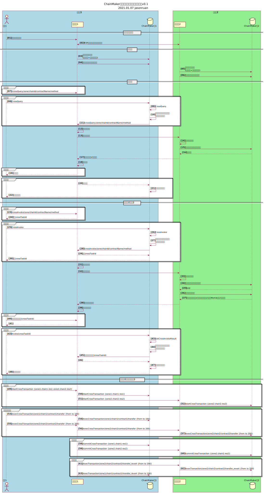

# ChainMaker跨链细化方案讨论纪要

[TOC]

## 0 整体方案

V1阶段，先以独立的跨链代理实现同构跨链功能，包括数据验证、事务调度、数据网关三个组件。

1. 数据验证

2. 1. 证明某个交易存在于目标链上已提交的区块中。
   2. 采用轻节点的方式，收集目标链的区块头、交易默克尔树等信息。
   3. 收集目标链的创世区块与配置区块，确保目标链配置更新后，仍能验证交易。

3. 事务调度

4. 1. 保障跨链事务的原子性，一笔跨链交易在多条链上同时执行或不执行。
   2. 支持：两阶段提交（必选）；哈希时间锁（可选）。
   3. 跨链合约的抽象接口处理：包括预执行、确认/回滚等操作。

5. 数据网关

6. 1. 作为区块链对外的网关，负责跨链消息的转发功能。
   2. 抽象通用的跨链API(HTTP协议)，屏蔽底层链API细节。

## 1 数据验证模块

## 2 事务调度模块

## 3 跨链网关模块

