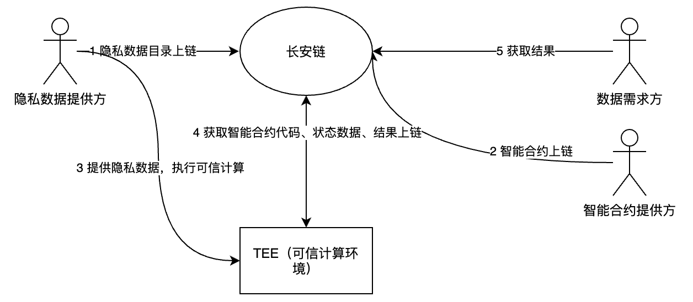
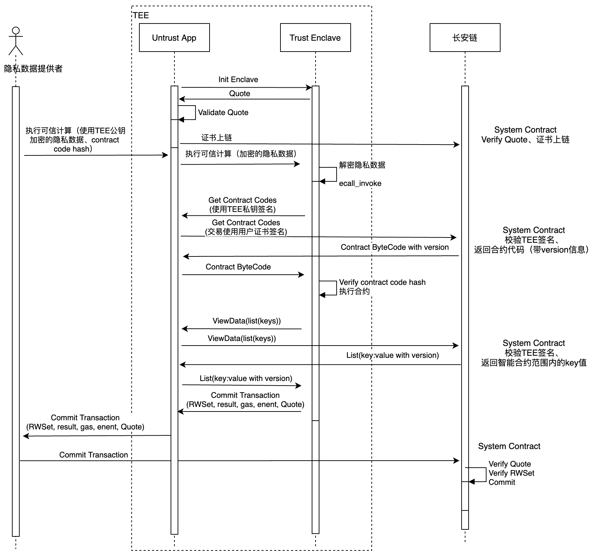

[TOC]

# ChainMaker隐私计算方案

## 1 总体方案

说明：隐私计算的智能合约包括两个合约，一个是TEE执行的合约，另一个是提供查询以及结果上链功能的合约

## 2 隐私计算执行过程

说明：最终结果的交易提交可以由隐私数据提供者进行，也可以由TEE网关直接提交上链。

## 3 隐私计算的结果的提交验证

隐私计算的结果在上链时，链需要对执行的输入参数进行校验，以确保输入参数是从链上获取的正确的值。隐私计算的合约在执行过程中可能需要从链上获取多个数据，而在计算的过程中链本身的区块也在增加，因此可能会跨多个区块执行。而跨区块执行会带来如下问题：

- **不可重复读**

  多次从链上获取一个Key值结果不一致

- **幻读**

  同样条件的多次范围查询结果集不一致
- **合约执行过中输入参数无法校验**

  隐私计算合约输入值由于新区块的产生被覆盖，在提交隐私计算结果上链时无法校验

为了解决这两个问题，在隐私计算上引入事务机制。这两个问题都可以通过事务的隔离级别来解决。

### 3.1 事务的解决的问题

- 脏读

  读取到其他事务的中间值，在其他事务撤消后，此中间值不存在

- 不可重复读

  相同记录多次读取的值不一致
- 幻读

  多次读取结果集数量不一致

### 3.2 事务的隔离级别

- **READ UNCOMMITED** 

未提交读，事务中的修改即使还没提交，对其他事务是可见的，或者说事务可以读取到尚未提交的事务修改内容，此级别数据库使用写锁实现，读不加锁，写加写锁。

优点：读写并行

缺点是会出现脏读、不可重复读、幻读。

- **READ COMMITED** 

提交读，事务中的修改在提交之后才对其他事务可见，或者说事务只能读取到已经提交的事务修改，此级别数据库使用MVCC+排它锁实现，读取数据使用MVCC，多次读取读出的可能是不同的版本。写数据使用排他锁。

优点：读写并行，没有脏读

缺点：会出现不可重复读、幻读

- **REPEATABLE READ**

可重复读，事务在执行过程中多次读取的值是一致的，此级别数据使用读写锁或者MVCC实现，使用读写锁实现时，读加读锁，写加写锁。这样在同一个事务中，只要读锁不释放，另外一个事务的写锁就只能等待，实现了可重复读。数据库事务默认的隔离级别。使用MVCC实现时，可以实现读写并行，一个事务内的多次读取使用相同的版本号，从而达到可重复读。

优点：可重复读。

缺点：会出现幻读。

- **SERIALIZABLE**

串行执行，数据库使用排它锁实现。

优点：有效避免脏读、不可重复读、幻读问题

缺点：并发量低

- **SNAPSHOT ISOLATION**

快照隔离，实现并行读写，有冲突时首个提交者成功。基于MVCC实现。

优点：避免脏读、不可重复读和幻读问题

缺点：可能执行失败

### 3.3 隐私计算中的隔离级别

在长安链中，由于交易在提交之前，写入的值不会进入存储，因此也不会出现脏读问题，只需要解决幻读和不可重复读的问题。在隐私计算中引入事务后，同时需要兼顾可并发性。在区块链上使用锁会导致较高复杂度，同时也会造成多个交易的顺序执行，所以选择基于MVCC实现的SNAPSHOT ISOLATION隔离级别。