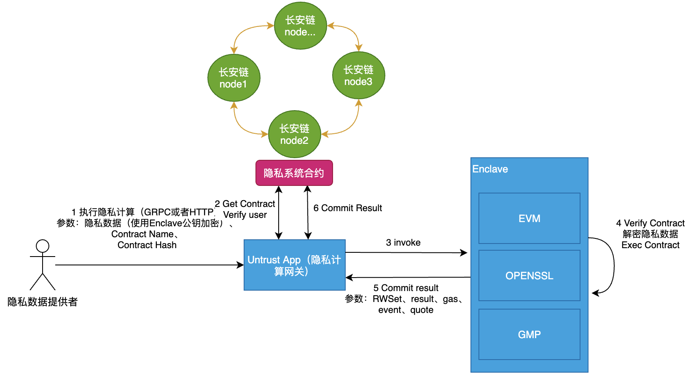

[TOC]

# ChainMaker隐私计算方案

## 1 总体方案

说明：隐私计算的智能合约包括两个合约，一个是TEE执行的合约，另一个是提供查询以及结果上链功能的合约

## 2 隐私计算初始化流程

可信计算环境初始化主要完成Enclave初始化、远程证明（Quote校验）和证书上链三部分工作。

## 3 执行隐私计算流程

## 4 系统合约

系统合约负责主要负责如下内容

- 隐私合约代码查询
- 隐私合约结果上链
- 隐私合约状态查询

## 5 隐私计算网关

隐私计算网关主要负责如下内容

- 隐私计算环境初始化

- 提供隐私计算请求接口（HTTP或GRPC）

- 链交互（隐私计算结果上链、链上数据查询）

  

## 6 合并流程

说明：最终结果的交易提交可以由隐私数据提供者进行，也可以由TEE网关直接提交上链。