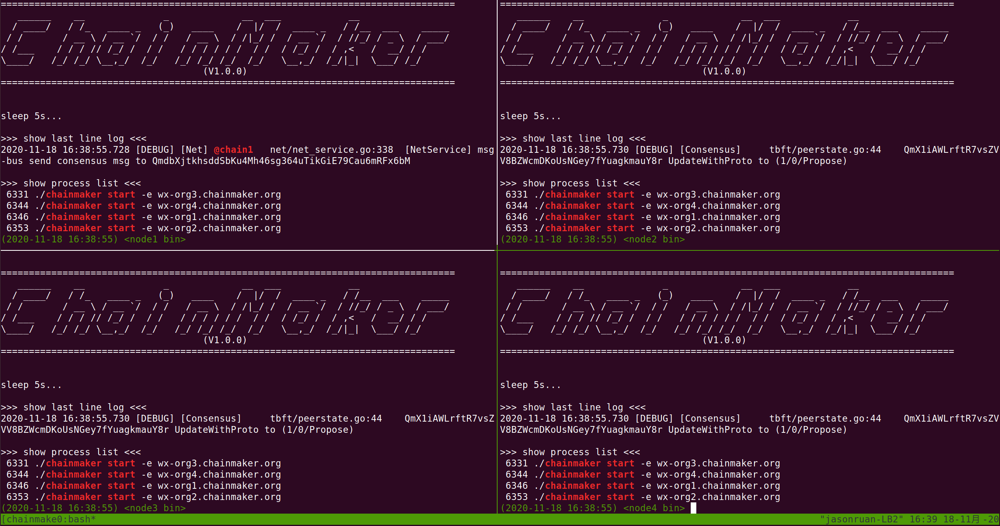

# ChainMaker集群快速搭建指南

*2020.11.18 jasonruan*

[TOC]

## 准备

> - 源码获取并进入脚本目录
>
> ```bash
> $ git clone --recursive git@git.code.tencent.com:ChainMaker/chainmaker-go.git
> $ cd chainmaker-go/scripts
> ```

## 一键集群节点证书及配置生成

- 执行下面命令将生成单链4节点的集群证书和配置

> 生成的证书及配置文件位于目录：`chainmaker-go/build`
>
> 默认生成的配置文件，适用于集群的单机启动，如果需要在不同机器启动节点，请修改配置模板文件：`chainmaker-go/config/config_tpl/chainconfig/bc_4_7.yml`，将`127.0.0.1`修改为具体机器IP，再执行`prepare.sh`脚本

```bash
$ ./prepare.sh 
invalid params
Usage:  
  prepare.sh node_cnt(1/4/7) chain_cnt(1-4) p2p_port_prefix(default:1130) rpc_port_prefix(default:1230)
    eg1: prepare.sh 4 1
    eg2: prepare.sh 4 1 1130 1230

$ ./prepare.sh 4 1
begin check params...
begin generate certs, cnt: 4
begin generate node1 config...
begin generate node2 config...
begin generate node3 config...
begin generate node4 config...
```

## 一键安装包制作

- 执行下面命令，将进行`ChainMaker`主程序的编译，并结合上一步生成的配置文件和证书，打包合成安装包

> 生成的安装包位于目录：`chainmaker-go/build/release`

```
$ ./build_release.sh
```

- 安装包目录结构

```bash
chainmaker-go/build/release
├── chainmaker-V1.0.0-wx-org1.chainmaker.org-20201118161129-x86_64.tar.gz
├── chainmaker-V1.0.0-wx-org2.chainmaker.org-20201118161129-x86_64.tar.gz
├── chainmaker-V1.0.0-wx-org3.chainmaker.org-20201118161129-x86_64.tar.gz
├── chainmaker-V1.0.0-wx-org4.chainmaker.org-20201118161129-x86_64.tar.gz
└── crypto-config-20201118161129.tar.gz
```

## 一键集群启动

```bash
$ ./cluster_quick_start.sh
```

- 执行该脚本，将复用当前终端，开启4个会话，并打印最后一行日志及进程信息，便于观察进程启动是否正常



- 要实现上面效果，需要安装[tmux](https://linuxize.com/post/getting-started-with-tmux/)，如不安装，还可以采用`normal`方式，启动集群

  > 执行该脚本，将直接解压各节点安装包，调用bin目录下的restart.sh脚本进行启动

```bash
$ ./cluster_quick_start.sh normal
```