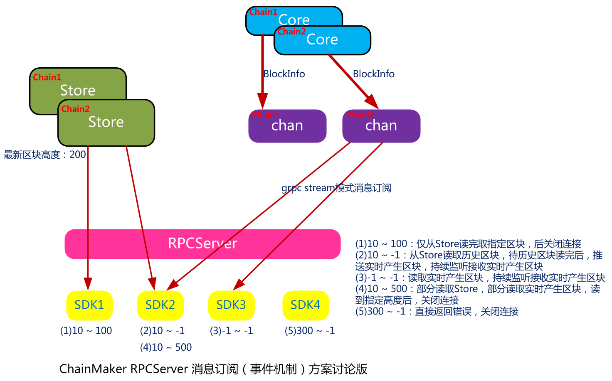

# RPCServer消息订阅（事件机制）概要设计

*2020.11.10 jasonruan*

## 1 整体流程



## 2 功能说明

一期将实现区块消息订阅和交易消息订阅功能。

### 2.1 区块消息订阅

客户端可以指定的区块高度开始和结束范围来订阅区块消息，`RPCServer`将从历史存储或实时区块或两者兼具中，来获得指定区块，推送给已订阅客户端。

### 2.2 交易消息订阅

同区块消息订阅，客户端同样可以指定的区块高度开始和结束范围来订阅区块消息，根据订阅请求`payload`指定的交易类型和`TxId`列表，过滤出指定的交易，推送给已订阅的客户端。

## 3 接口定义

### 3.1 新增grpc接口

> pb/api/rpc_node.proto

```protobuf
service RpcNode {
	rpc SendRequest(TxRequest) returns (TxResponse) {};
	rpc Subscribe(TxRequest) returns (stream SubscribeResult) {};    // 采用服务端单向stream流模式实现消息订阅接口
}
```

### 3.2 新增TxType

> pb/common/request.proto

```protobuf
// transaction type definition
enum TxType {
	......
    // subscribe block info
    SUBSCRIBE_BLOCK_INFO = 6;
    // subscribe tx info
    SUBSCRIBE_TX_INFO = 7;
```

### 3.3 新增请求payload

> pb/common/request.proto

```protobuf
// 区块消息
message SubscribeBlockPayload {
    int64 start_block       = 1;    // 开始区块高度，<-1：非法；-1：最新区块；>=0：指定区块起始高度
    int64 end_block         = 2;    // 结束区块高度，<-1：非法；-1：最新区块；>=0：指定区块结束高度
    bool with_rw_set        = 3;    // 是否获取读写集
}

// 交易消息
message SubscribeTxPayload {
    int64 start_block       = 1;    // 开始区块高度，<-1：非法；-1：最新区块；>=0：指定区块起始高度
    int64 end_block         = 2;    // 结束区块高度，<-1：非法；-1：最新区块；>=0：指定区块结束高度
    TxType tx_type          = 3;    // 指定订阅交易类型，不填写将订阅所有交易类型消息
    repeated string tx_Ids  = 4;    // 订阅交易ID列表，不填写将订阅所有交易
}
```

### 3.4 新增订阅响应

> pb/common/result.proto

```protobuf
message SubscribeResult {
    // 当TxType为SUBSCRIBE_BLOCK_INFO, 解析为：pb.BlockInfo
    // 当TxType为SUBSCRIBE_TX_INFO，解析为：pb.Transaction
    bytes data = 1;
}
```


