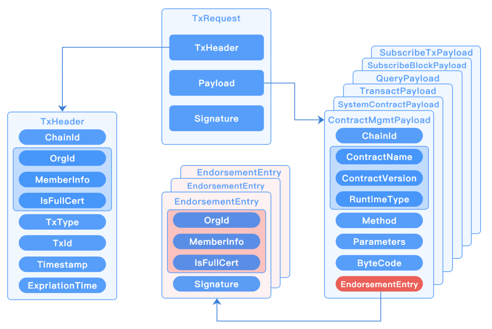

# RPC服务
## 概述

`RPCServer`采用`gRPC`实现的远程过程调用系统，采用`HTTP/2` 传输协议，使用`Protobuf` 作为接口描述语言，实现系统间的高效交互。

功能上支持处理节点请求、基于流模式的消息订阅，通信上支持`TLS`单向和双向认证、流控机制等。

## 配置说明

```yml
rpc:
  # 模式，当前仅支持grpc方式
  provider: grpc
  # 监听端口
  port: 12301
  # 检查链配置TrustRoots证书变化时间间隔，实现自动刷新，单位：s，最小值为10s
  check_chain_conf_trust_roots_change_interval: 60
  # 流量控制配置，采用令牌桶限流
  ratelimit:
    # 每秒补充令牌数，取值：-1-不受限；0-默认值（10000）
    token_per_second: -1
    # 令牌桶大小，取值：-1-不受限；0-默认值（10000）
    token_bucket_size: -1
  subscriber:
    # 历史消息订阅流控，实时消息订阅不会进行流控
    ratelimit:
      # 每秒补充令牌数，取值：-1-不受限；0-默认值（1000）
      token_per_second: 100
      # 令牌桶大小，取值：-1-不受限；0-默认值（1000）
      token_bucket_size: 100
  tls:
    # TLS模式:
    #   disable - 不启用TLS
    #   oneway  - 单向认证
    #   twoway  - 双向认证
    mode:           twoway
    priv_key_file:  ./certs/node/consensus1/consensus1.tls.key
    cert_file:      ./certs/node/consensus1/consensus1.tls.crt
```

## 接口定义

```protobuf
service RpcNode {
	// 交易消息请求处理
	rpc SendRequest(TxRequest) returns (TxResponse) {};

	// 消息订阅请求处理
	rpc Subscribe(TxRequest) returns (stream SubscribeResult) {};

	// 更新日志级别
	rpc RefreshLogLevelsConfig(LogLevelsRequest) returns (LogLevelsResponse) {};

	// 获取长安链版本
	rpc GetChainMakerVersion(ChainMakerVersionRequest) returns(ChainMakerVersionResponse) {};

	// 检查链配置并动态加载新链
	rpc CheckNewBlockChainConfig(CheckNewBlockChainConfigRequest) returns (CheckNewBlockChainConfigResponse) {};
}
```

## 关键逻辑

### 交易请求结构说明

交易请求（`TxRequest`）包含交易头（`TxHeader`）、`Payload`和签名（`Signature`），`Payload`是字节数组，根据不同的`TxType`可以解码成各种类型的`Payload`。




### 消息订阅（事件通知）实现原理


（1）订阅者发起消息订阅请求，当前支持订阅区块消息和交易消息；

（2）如果只是订阅历史数据，直接从账本存储（`Store`）中获取后返回给订阅者；

（3）如果需要订阅实时数据，则会有`Subscriber`发起订阅事件，将`chan`注册到订阅者列表中，当`Core`模块有新区块产生，会发送事件通知，通过`chan`通知到`Subscriber`，通过`RPCServer`返回给订阅者；

（4）如果需要同时订阅历史和实时数据，则会分别从账本存储（`Store`）以及消息订阅发布者获取，而后返回给订阅者；

（5）若订阅消息发送完，`RPCServer`会主动关闭订阅通道，避免资源浪费。

### 限流说明

`RPCServer`采用令牌桶方式进行限流，可以对**接口请求调用**和**消息订阅事件推送**分别进行限流，后者仅会对历史消息进行流控，对实时消息未做限制（实时消息可以通过接口请求调用限流来进行流控）。

- 接口请求调用限流配置

```yaml
  # 流量控制配置，采用令牌桶限流
  ratelimit:
    # 每秒补充令牌数，取值：-1-不受限；0-默认值（10000）
    token_per_second: -1
    # 令牌桶大小，取值：-1-不受限；0-默认值（10000）
    token_bucket_size: -1
```

- 消息订阅事件推送限流配置

```yaml
  subscriber:
    # 历史消息订阅流控，实时消息订阅不会进行流控
    ratelimit:
      # 每秒补充令牌数，取值：-1-不受限；0-默认值（1000）
      token_per_second: 100
      # 令牌桶大小，取值：-1-不受限；0-默认值（1000）
      token_bucket_size: 100
```

