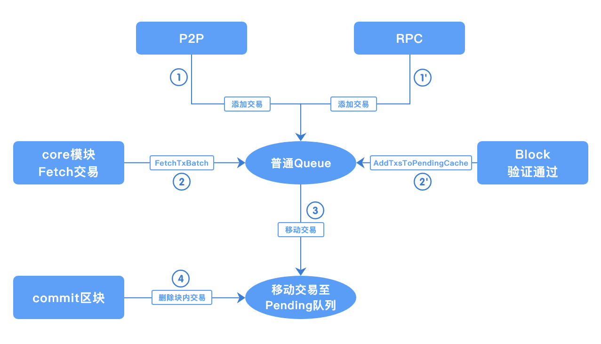

# 交易缓存

## 概述

区块链中，交易池模块负责缓存节点从网络中接收的待处理交易，在节点生成新的区块，从交易池获取交易并打包至区块内进行上链。

## 交易种类

交易池缓存两种类型的交易：

*	配置型交易：用来修改链配置；如果区块内含有配置型交易，则该区块被限制为有且仅有一笔交易
*	非配置型交易：创建合约、调用合约、冻结合约等。

## 模块设计

交易池采用模块化设计，使用接口将具体实现与其它模块进行解耦，以便后续迭代添加不同的实现。节点从网络接收到交易时，基于当前节点的状态，验证该交易的有效性（是否超时、是否已上链、是否已在交易池中等），仅当交易有效时，才会被添加至交易池中。

`TxPool` 接口描述

方法 | 解释
----|-----
`Start() error` | 启动交易池模块
`Stop() error` | 停止交易池模块
`AddTx(tx *common.Transaction, source TxSource) error` | 添加交易至交易池
`TxExists(tx *common.Transaction) bool` | 查询交易是否存在
`GetTxByTxId(txId string) (tx *common.Transaction, inBlockHeight int64)`| 依据txId，查询交易信息
`GetTxsByTxIds(txIds []string)  (txsRet map[string]*common.Transaction, txsHeightRet map[string]int64)`| 批量查询交易信息
`RetryAndRemoveTxs(retryTxs []*common.Transaction, removeTxs []*common.Transaction)`| 在交易池中添加、删除传入的交易，详细解释见**交易池状态变动**
`FetchTxBatch(blockHeight int64) []*common.Transaction` | 获取交易池中缓存的部分待打包交易，并将这部分交易从普通队列移动至待删除队列
`AddTxsToPendingCache(txs []*common.Transaction, blockHeight int64)`| 当区块验证通过后，将块内交易添加至待删除队列，并从普通队列中删除

| 交易池类型   | 适用场景                 |
| ------------ | ------------------------ |
| single交易池 | 所有的共识场景           |
| batch交易池  | 不适用于hotstuff共识场景 |

## single 交易池实现

single交易池，对池内的状态更新是以单笔交易为基准的，如：添加交易、广播交易、从交易池fetch、删除交易等。

交易池内的队列分为两种：普通队列、待删除队列

*	普通队列：存储待打包的区块交易
*	待删除队列：存储已入块、待区块上链后删除的交易

添加至交易池的交易来源 TxSource，有三种类型：`RPC`、`P2P`、`INTERNAL`，不同来源的交易，对应不同的检查.

*	RPC：来自RPC的交易不验证基础的交易信息（如交易ID、时间戳是否符合规范）、不验证交易者的证书；因为RPC模块已做此类校验；成功添加至交易池的交易会广播给其它连接的节点
*	P2P：其它节点的广播的交易，进行所有的校验
*	INTERNAL：如果节点在同一高度接收到多个验证有效的区块，当其中某个区块上链后，其余的相同高度区块内的交易会被重新添加进交易池，防止这些交易被抛弃。

为兼容不同的共识算法，交易在交易池中会被记录更多信息，如区块高度信息，高度有三种状态；

*	`-1`：表示该交易池中不存在该交易
*	`0`: 表示交易存在于交易池的待打包队列中
*	`>0`: 表示交易存在于某个待提交的区块内，高度为该区块的高度

交易池的状态变动，主要有如下几种情况：

*	接收交易：将接收到验证通过后的交易，存储至待打包的队列中
*	生成区块：调用交易池的`FetchTxBatch`实现，从交易池获取部分待打包交易，并将这些交易从普通队列移动至待删除队列
*	验证区块：区块验证通过后，调用交易池的`AddTxsToPendingCache`，将块内的交易从交易池的普通的队列移动至待删除队列，如果块内不在交易池的普通队列中，则直接添加至待删除队列中
*	提交区块：调用交易池的`RetryAndRemoveTxs `实现，先将同一高度其他区块的交易添加至交易池的普通队列中，同时这些交易如果存在于待删除队列，则将其从待删除移除；再将块内交易从交易池的所有队列中移除（普通队列、待删除队列）

## batch交易池实现

batch交易池是交易池的另一种实现方式，池内状态的更新是以批次作为基准的；如：添加交易至队列、广播交易、从交易池获取等。

同时因为池内的状态更新是以批次为操作单位，来减少链上运行过程中交易池的时间消耗；所以无法支持 流水线的hotstuff共识，因为该共识需要对每笔交易添加额外的状态记录（即：交易所在的待提交区块高度信息，详细解释见上）

`FetchTxBatch`: 因不支持hotstuff，参数blockHeight无使用

`GetTxByTxId`: 因不支持hotstuff，返回的交易高度信息无意义

`GetTxsByTxIds`: 因不支持hotstuff，返回的交易高度信息无意义

`AddTxsToPendingCache`: 因不支持hotstuff，该方法无实现

添加至batch交易池的交易来源与single相同：`RPC`、`P2P`、`INTERNAL`，所做检查也相同，但在添加至交易池时有区别

* RPC：来自RPC的单笔交易，在检查通过后先缓存在临时队列中，每隔一段时间，将该临时队列内的交易打包为批次，添加到交易池的普通队列内
* P2P：因为batch交易池的P2P广播是以批次为单位，当其它节点接收到广播的批次交易时，将该批次内验证通过的交易作为一个新的批次加入至普通队列内
* INTERNAL：将其它模块重新放回交易池的交易，作为一个新的批次添加至普通队列

## 模块间交互

交易池主要与RPC、MsgBus、Core、BlockChainStore模块进行交互；

*	从`RPC`模块接收客户端发送的交易
*	从`MsgBus`模块接收其它节点广播的交易
*	`BlockChainStore`来验证交易是否已存在于链上
*	节点生成、验证、提交区块时，`Core`模块调用相应的接口，修改交易池的状态

流程图如下：

## 参数配置

txpool 在节点配置中，有如下配置参数。

| 参数名称               | 类型   | 默认值    | 释义                                      |
| ---------------------- | ------ | --------- | ----------------------------------------- |
| pool_type              | string | Single    | 启动的交易池类型，有single、batch两种类型 |
| max_txpool_size        | Int    | 5120      | 交易池储存普通交易的数量上限              |
| max_config_txpool_size | Int    | 10        | 交易池储存配置交易的数量上限              |
| batch_max_size         | int    | 50000     | 批量交易池，每个批次最多包含的交易数量    |
| batch_create_timeout   | int    | 1000 微秒 | 批量交易池，定时创建批次的时间间隔        |