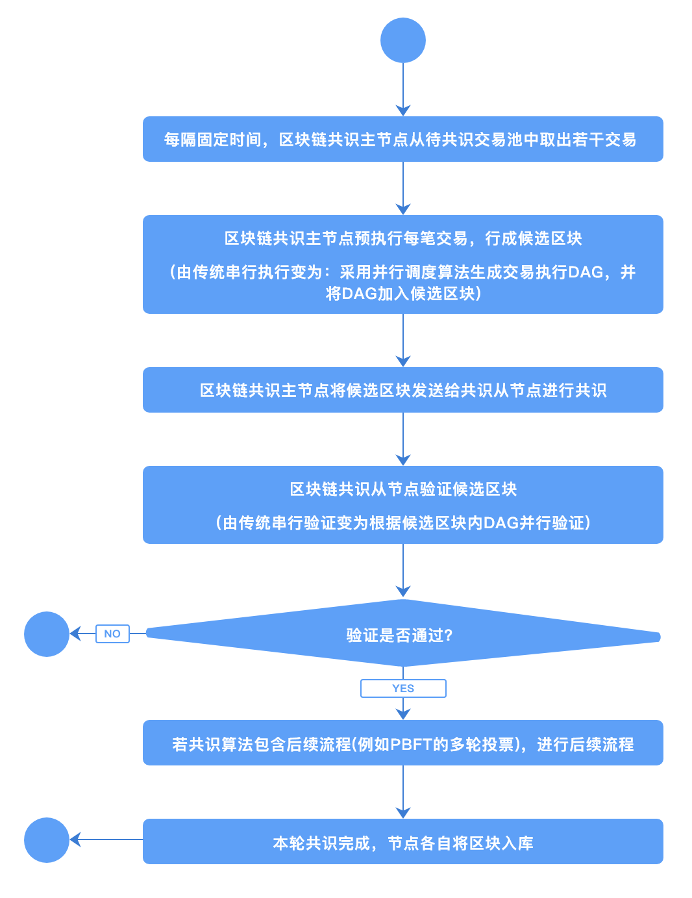
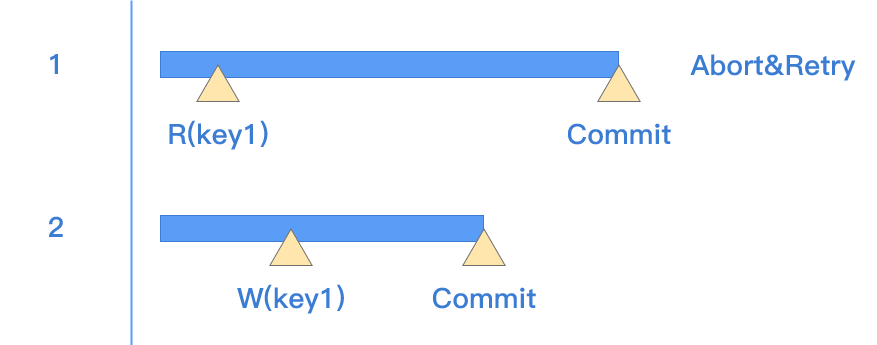

# 并行调度

长安链支持块内通用交易的并行调度执行，以加速区块链整体处理性能。区块提议节点在提议过程中运行并行调度算法，产生块内交易并行执行顺序关系。执行顺序可利用有向无环图，也就是`DAG`表示，`DAG`中节点代表交易，边代表交易间`happens-before`关系。网络中其他节点在验证区块时，可根据此`DAG`并行验证块内交易，产生交易的读写集合，而后根据读写集合验证提议区块中`DAG`的有效性。

整体流程如下图所示：

## 并行调度算法分类

根据对同一批交易调度产生的`DAG`是否随机，并行调度算法可分为：

- `确定性调度算法`：即针对同一批交易调度产生的`DAG`结果是确定性的。此类算法的优点是DAG产生稳定且可复现，因此理论上讲DAG可不包含在区块内，各验证节点运行并行调度算法即可进行校验。
- `随机性调度算法`：即针对同一批交易调度产生的`DAG`结果是随机的，即使同一节点针对同一批交易连续运行两次调度算法产生的结果也可能不同。此类算法往往调度速度较快，但因存在随机性，DAG必须打包至区块中并由其他节点据此验证。

在长安链1.0中，实现了一种`随机性调度算法`，以最大化交易处理能力。

## 长安链并行调度算法

长安链并行调度算法示意图如下，主要思想是交易分为执行`execute`和生效`commit`两步，若交易执行期间读集未被其他交易更改，则交易可生效；否则需要重试执行此交易。

主要步骤为：

1. 将所有交易并行执行，在执行中所有的写操作都在内存缓存中；
2. 每笔交易结束时，查看读集中所有的key是否被其他交易修改，若无则将交易写集生效（`ApplyTxSimContext`），若有则将交易重新加入待执行队列；
3. 待所有交易执行完毕后，分析所有交易的读写集，构建`DAG`。若交易间存在“读-写”、“写-读”、“写-写”冲突，根据执行时的先后顺序构建DAG中的边。

因存在冲突的两笔交易执行时间存在随机性，最终构建的`DAG`也无法预测，所以此算法为随机性调度算法。在进行冲突检测时，长安链应用了位图等数据结构进行工程优化，以提升执行效率。

