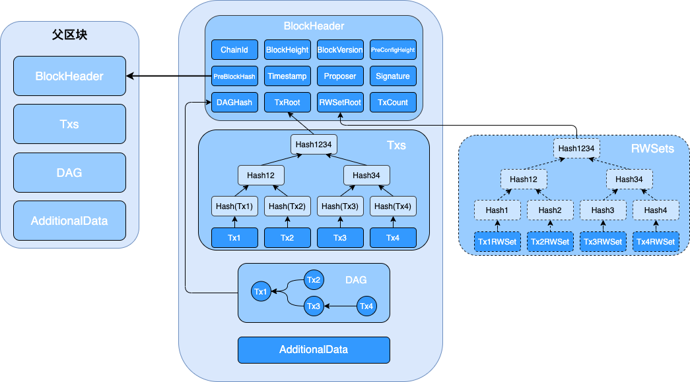
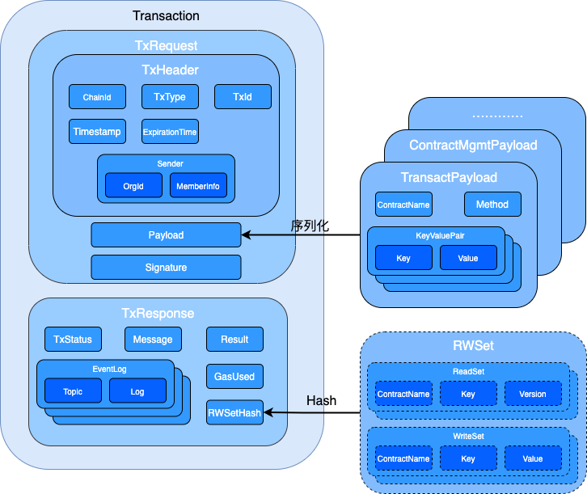

# 数据结构

长安链（ChainMaker）核心数据结构皆采用protobuf3语法进行定义，以方便在不同的语言之间进行通信。长安链数据结构模型定义在chainmaker-go/pb/proto目录下，并按功能和使用范围，分为：

* `accesscontrol` 与访问控制相关的用户账户、组织角色等对象
* `api` 与客户端SDK相关的对象
* `common` 核心区块头、交易、结果对象
* `config` 区块节点配置和网络配置等相关对象
* `consensus` 与共识相关的对象，不同的共识算法会有不同的共识对象
* `discovery` 用于P2P网络发现的对象
* `net` 用于P2P网络广播的消息对象
* `store` 进行账本和状态数据存储使用的对象
* `sync` 同步数据使用的相关对象
* `txpool` 交易池相关对象

ChainMaker官方提供ChainMaker协议的Golang实现，根据protobuf3数据模型定义，生成Golang代码在chainmaker-go/pb/protogo目录下。
## 核心数据模型

### 区块
#### 结构示意图



#### 整体结构

```go
// Block definition
message Block {
    // header of the block
    BlockHeader header = 1;

    // execution sequence of intra block transactions is generated by proposer
    DAG dag = 2; // 本块交易的DAG
    repeated Transaction txs = 3;

    // stores the voting information of the current block
    // not included in block hash value calculation
    AdditionalData additional_data = 4;
}

// block additional data
message AdditionalData {
    // extra data, with map type, excluded in hash calculation
    map<string, bytes> extra_data = 1;
}

// transaction execution sequence
// Using adjacency table storage
message DAG {
    // Neighbor node: related party transactions with reading and writing conflicts
    message Neighbor {
        repeated int32 neighbors = 1;
    }

    // sequence number of transaction topological sort
    //the sequence number of the transaction topological sort associated with the transaction
    repeated Neighbor vertexes = 2;
}
```

* Header：区块头
* Dag：块内交易的执行依赖顺序，由Proposer生成，如果为空则表示本区块的所有交易都可以并行执行，不存在前后依赖关系
* Txs：块内交易列表
* AdditionalData：区块产生以后附加的数据，不参与区块的散列值计算。可用于存储当前区块的投票信息，交易过滤等，具体内容根据链上配置的内容而决定

#### 区块头

```go
// header of the block
message BlockHeader {
    // blockchain identifier
    string chain_id = 1;

    // block height
    int64 block_height = 2;

    // previous block hash
    bytes pre_block_hash = 3;

    // block hash (block identifier)
    bytes block_hash = 4; // 本块哈希（块标识），除block_hash和signature以外，其余字段参与block_hash计算

    // previous config block height, used to trace anc check if chain config is valid
    int64 pre_conf_height = 5;

    // block version
    bytes block_version = 6;

    // Save the DAG feature summary, and hash the DAG after Pb serialization
    // hash of serialized DAG
    bytes dag_hash = 7;

    // The root hash of Merkle tree generated by read_write_set_digest in the result of each transaction in the block
    // used to verify the read-write set of the block
    bytes rw_set_root = 8;

    // merkle root of transactions
    // used to verify the existence of this transactions
    bytes tx_root = 9;

    // the time stamp of the block
    int64 block_timestamp = 10;

    // proposal node identifier
    bytes proposer = 11;

    // consensus parameters
    // used to store information include in block hash calculation
    bytes consensus_args = 12;

    // count of transactions
    int64 tx_count = 13;

    // signature of proposer
    bytes signature = 14;
}
```

- ChainId：链标识，用于区分不同的链，在多子链的情况下可区分不同的子链
- BlockHeight：区块高度，创世区块高度为0
- PreBlockHash：上个区块的散列值
- BlockHash：本区块的散列值
- PreConfHeight：上一次修改链配置的区块高度，在这个高度的区块中，只存在一笔交易，为配置交易，其中保存了区块链的配置信息，包括本区块应该采用的共识算法，加密算法等
- BlockVersion：区块版本
- DagHash：当前区块Dag的散列值
- RwSetRoot：区块读写集的Merkle Root
- TxRoot：区块交易的Merkle Root
- BlockTimestamp：区块的时间戳
- Proposer：区块的生成者标识
- ConsensusArgs：共识参数
- TxCount：交易数量
- Signature：区块生成者的签名


### 交易结构
#### 交易结构示意图


####  交易结构定义
```go
// a transaction includes request and its result
message Transaction {
    // header of the transaction
    TxHeader header = 1;

    // payload of the request
    bytes request_payload = 2;

    // signature of request bytes(including header and payload)
    bytes request_signature = 3;

    // result of the transaction, can be marshalled according to tx_type in header
    Result result = 4;
}
```

* Header：交易头
* RequestPayload：交易的载荷数据，根据TxType可以反序列化出Payload具体的数据类型
* RequestSignature：交易发送者的签名
* Result：交易结果，由Proposer生成区块时进行计算、赋值

#### 交易头

```go
// header of the request
message TxHeader {
    // blockchain identifier
    string chain_id = 1;

    // sender identifier
    accesscontrol.SerializedMember sender = 2;

    // transaction type
    TxType tx_type = 3;

    // transaction id set by sender, should be unique
    string tx_id = 4;

    // transaction timestamp, in unix timestamp format, seconds
    int64 timestamp = 5;

    // expiration timestamp in unix timestamp format
    // after that the transaction is invalid if it is not included in block yet
    int64 expiration_time = 6;
}

// Serialized member of blockchain
message SerializedMember {
    // organization identifier of the member
    string org_id = 1;

    // member identity related info bytes
    bytes member_info = 2;

    // use cert compression
    // todo: is_full_cert -> compressed
    bool is_full_cert = 3;
}
```

* ChainId：链标识，表名本交易是针对哪条链的，防止一个交易在多个链中被打包
* Sender：交易发送者信息
  * OrgId：成员所属机构编号
  * MemberInfo：成员的身份信息，可以是证书信息也可以是证书标识，依赖于IsFullCert字段
  * IsFullCert：是否为全量证书，如果是，则MemberInfo填写用户证书的信息；如果不是，则MemberInfo填写用户证书标识（该标识需通过证书上链接口提前在链上登记）
* TxType：交易类型，有8种
* TxId：交易ID，用做该交易的全局唯一性标识
* Timestamp：生成交易的unix时间戳，当proposer从交易池获取交易时，用来检测该交易是否超时未上链；如果超时，该交易将从交易池删除
* ExpirationTime：交易的到期的unix时间，单位秒，不为0时，交易必须在该时间戳之前被打包上链


#### 交易结果

```go
// tx result, part of a transaction in block
message Result {
    // response code
    TxStatusCode code = 1;
    // returned data, set in smart contract
    ContractResult contract_result = 2;
    // hash of the transaction's read-write set
    bytes rw_set_hash = 3;
}

// invoke user contract method return UserContractReturnPayload
// Unmarshal from TransactResult.TxResponse.payload
message ContractResult {
    // user contract defined return code, 0-ok, 1-error. for example, insufficient balance in token transfer
    ContractResultCode code = 1;
    // user contract defined result
    bytes result = 2;
    // user contract defined result message
    string message = 3;
    // gas used by current contract(include contract call)
    int64  gas_used = 4;
}

type TxStatusCode int32
type ContractResultCode int32
```

* Code：交易执行结果的状态
* ContractResult：合约执行结果
  * Code：合约执行结果的状态
  * Result：合约执行返回的结果
  * Message：合约执行后的消息
  * GasUsed：合约执行消耗的Gas数量
* RwSetHash：交易执行结果的读写集哈希

### 交易请求结构

```go
// transaction request proposed by user
message TxRequest {
    // header of the request
    TxHeader header = 1;

    // payload of the request, can be unmarshalled according to tx_type in header
    bytes payload = 2;

    // signature of [header bytes || payload bytes]
    bytes signature = 3;
}
```
用户发起一个交易请求的完整结构，包括：
* Header：交易头，详解见上述描述
* Payload：交易载荷数据，根据Header中的TxType决定具体的载荷数据类型
* Signature：用户对这个交易请求的签名

### 交易响应结构

```go
// tx request - tx response, only for RPC response
message TxResponse {
    // response code
    TxStatusCode code = 1;
    // response message
    string message = 2;
    // returned data, set in smart contract
    ContractResult contract_result = 3;
} 
```

* Code：交易执行结果的状态
* Message：交易执行后，合约输出的消息
* ContractResult：合约执行结果
### 交易执行结果的读写集
#### 读写集
```go
// TxRWSet describes all the operations of a transaction on ledger
message TxRWSet {
    // transaction identifier
    string tx_id = 1;
    // read set
    repeated TxRead tx_reads = 2;
    // write set
    repeated TxWrite tx_writes = 3;
}
```
读写集为交易合约正常执行后对其世界状态的改变情况的反应，主要包括：
* TxId 本读写集是由哪个交易产生的
* TxRead 读集列表
* TxWrite 写集列表
#### 读对象
读集主要用于在并发执行合约交易后判断并发的交易之间是否存在数据（版本）冲突，如果冲突则需要在DAG结构中反映交易之间的依赖情况，并调整冲突交易的执行顺序，重新执行合约。
```go
// TxRead describes a read operation on a key
message TxRead {
    // read key
    bytes key = 1;
    // the value of the key
    bytes value = 2;
    // contract name, used in cross-contract calls
    // set to null if only the contract in transaction request is called
    string contract_name = 3;
    // read key version
    KeyVersion version = 4;
}
```
一条交易读主要包括：
* ContractName 本读记录是读的哪个合约的状态数据
* Key 本记录读取的状态键值信息
* Version 读取到的版本
* Value 读取到的值，后期考虑将Value移除，只需要依靠Version即可进行冲突判断。
#### 写对象
交易正常执行完毕后，如果世界状态发生了更改，那么写集就会记录详细的更改记录。
```go
// TxRead describes a write/delete operation on a key
message TxWrite {
    // write key
    bytes key = 1;
    // write value
    bytes value = 2;
    // contract name, used in cross-contract calls
    // set to null if only the contract in transaction request is called
    string contract_name = 3;
}
```
交易写包括以下内容：
* ContractName 对哪个合约的状态数据进行了更改
* Key 被修改的状态键值
* Value 修改后的状态值