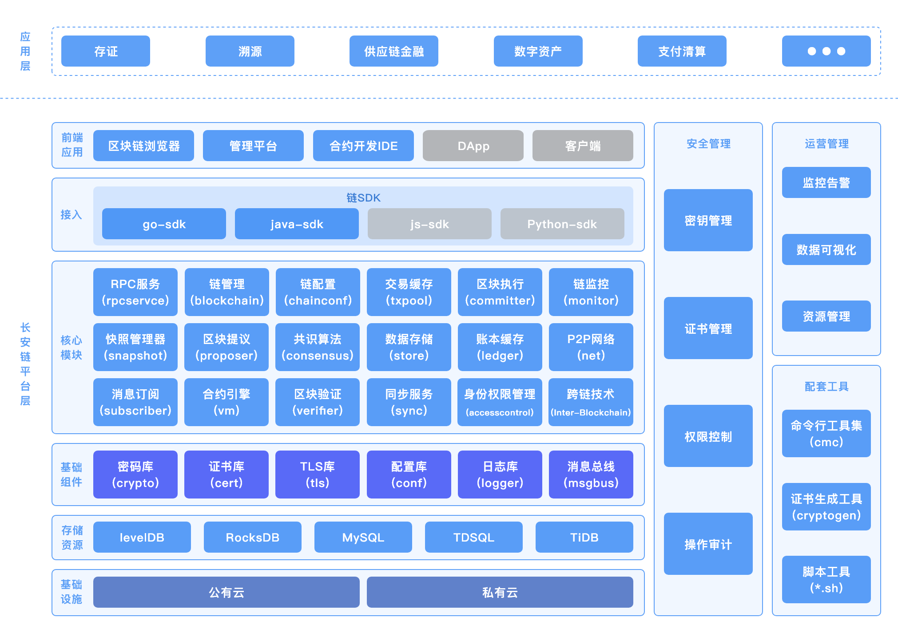

# 整体架构
## 逻辑架构

长安链逻辑架构如下图所示。主要包含以下元素：

- 共识节点（`consensus node`）：参与区块链网络中共识投票、交易执行、区块验证和记账的节点。
- 同步节点 (`sync node`)：或称见证节点，参与区块和交易同步、区块验证，交易执行，并记录完整账本数据，但不参与共识投票。
- 轻节点 (`light node`)：参与同步和校验区块头信息、验证交易存在性的节点。
- SDK：帮助用户通过RPC和区块链网络进行连接，完成合约创建、调用、链管理等功能。
- 区块链浏览器 (`ChainMaker broswer`)：通过可视化界面为用户展示区块信息、交易信息、节点信息等区块链信息。
- 管理平台 (`management platform`)：通过可视化界面方便用户对链进行管理、信息浏览和资源监控等。
- 合约IDE (`contract IDE`)：智能合约在线开发环境，长安链所有合约支持语言均可在该IDE上开发和编译。
- 命令行工具集 (`ChainMaker CLI, cmc`)：使用户可以用命令行的方式对链进行部署和管理操作，例如证书生成、链配置、交易发送等。

## 层级架构

自下而上，长安链由以下层级构成：

- 基础设施层：包括虚拟机、物理机等，为长安链提供基础运行环境。
- 存储资源层：为长安链节点提供数据存储服务，具体情况可参见[数据存储](./数据存储.md)章节。
- 基础组件层：为长安链节点提供密码学、配置、日志、常用数据结构等通用技术组件，具体可见[chainmaker-common](https://git.chainmaker.org.cn/chainmaker/chainmaker-common)项目。
- 核心模块层：长安链共识算法、核心引擎、虚拟机等核心模块，核心模块均采用可插拔设计，为可装配区块链奠定基础。
- 接入层：多语言链SDK，方便应用开发者与链交互。
- 前端应用层：包括区块链管理平台、区块链浏览器、合约开发IDE等，方便用户直接访问区块链底层平台。

