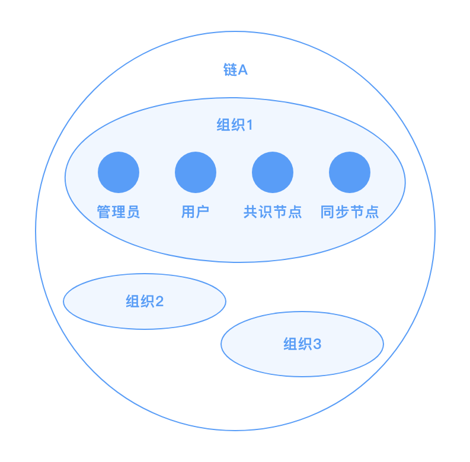

# 身份权限管理

## 概述

在区块链中，身份权限模块负责解决两个问题：

- 如何标识区块链节点、交易发送者等链上参与成员？
- 如何管理发送交易、查询交易、配置更新等链上操作权限？

传统的中心化信息系统中，往往采用用户名来标识用户，采用基于角色的权限控制 `role based access control, RBAC`模型、权限控制列表 `access control list, ACL` 等来管控操作权限。在区块链中，中心化的用户注册和登录不再可行，需采用基于密码学的方式进行用户标识，而权限控制仍可采用`RBAC、ACL`等传统方式。在长安链1.0版本中，面向**联盟链**场景，实现了一种**基于数字证书的用户标识体系**、**基于角色的权限控制体系**。后续迭代中，将支持更为丰富的身份权限管理模型。

## 用户标识

### 用户标识方法（账户体系）

区块链中，可采用公钥、地址（公钥哈希）、数字证书等方式来标识链上用户身份，具体对比如下表所示：

| 标识方法             | 标识长度 | 外部依赖             | 附加信息                               |
| -------------------- | -------- | -------------------- | -------------------------------------- |
| 公钥/地址            | 小       | 无                   | 不能附加额外信息                       |
| 数字证书             | 大       | 需依赖CA版发数字证书 | 可在证书字段中附加组织、角色等额外信息 |
| 分布式数字身份 (DID) | 小       | 需依赖 DID 支撑平台  | 可在 DID 文档中附加额外信息            |

长安链1.0版本采用数字证书来标识链上成员。换言之，每个加入区块链网络中的节点和用户，需在加入前获得经认可的CA版发的数字证书，且每条发出的消息需附加数字签名，供其他成员进行合法性校验。

### 长安链用户体系

面向联盟链场景，长安链的链上用户体系如下图所示：

一条链由多个组织构成，每个组织下拥有一个或多个区块链节点和用户（类型详见下文中*[角色类型](# 角色类型)*）。每个组织在创世块中的` trust root` 字段定义组织根证书，若链上成员拥有某根证书版发的合法证书，则视为该成员为此组织下的合法用户。

## 权限管理

长安链1.0中采用了基于角色的权限控制模型，如下图所示。具体来说，需将用户绑定到某一组织的一个或多个角色上，再将链上资源（即链上需要进行权限管理的操作）绑定至特定的组织、角色，即可完成资源和用户的关联。

### 角色类型

长安链中，定义了以下几种角色类型：

- 共识节点 `consensus`：有权参与区块共识流程的链上节点；
- 同步节点`common`：无权参与区块共识流程，但可在链上中同步数据的节点；
- 管理员 `admin`：可代表组织进行链上治理的用户；
- 用户 `client`：无权进行链上治理，但可发送和查询交易的用户。

### 权限定义方法

长安链采用三段式语法定义资源的访问权限：规则 (`rule`)、组织列表 (`orgList`)、角色列表 (`roleList`)

- 规则：以关键字的形式描述了需要多少个组织的用户共同认可才可访问资源，合法的规则包括：
  - `ALL`：要求 `orgList` 列表中所有组织参与，每个组织至少提供一个符合 `roleList` 要求角色的签名；
  - `ANY`：要求 `orgList` 列表中任意一个组织提供符合 `roleList` 要求角色的签名；
  - `MAJORITY`：要求联盟链中过半数组织提供各自 `admin` 角色的签名；
  - 一个以字符串形式表达的**整数** (e.g., "3")：要求`orgList` 列表中大于或等于规定数目的组织提供符合 `roleList` 要求角色的签名；
  - 一个以字符串形式表达的**分数** (e.g., "2/3") ：要求`orgList` 列表中大于或等于规定比例的组织提供符合 `roleList` 要求角色的签名；
  - `SELF`：要求资源所属的组织提供符合 `roleList` 要求角色的签名，在此关键字下，`orgList`中的组织列表信息不生效，该规则目前只适用于修改组织根证书、修改组织共识节点地址这两个操作的权限配置；
  - `FORBIDDEN`：此规则表示禁止所有人访问，在此关键字下，`orgList`和 `roleList` 不生效。
- 组织列表：合法的组织列表集合，组织需出现在配置文件的 `trust root` 中，若为空则默认出现在 `trust root` 中的所有组织；
- 角色列表：合法的角色列表集合，若为空则默认所有角色。

示例如下：

| 权限定义                                     | 说明                                                         |
| -------------------------------------------- | ------------------------------------------------------------ |
| `ALL` `[org1, org2, org3]` `[admin, client]` | 三个组织各自提供至少一个管理员或普通用户提供签名才可访问对应资源           |
| `1/2` `[] ` `[admin]`                        | 链上所有组织中过半数组织的管理员提供签名才可访问对应资源（自定义版本的`MAJORITY`规则）     |
| `SELF` `[] ` `[admin]`                       | 资源所属组织的管理员提供签名才可访问对应资源，例如组织管理员有权修改各自组织的根证书 |

权限配置的方法可参考《[配置变更](../operation/配置变更.md)》部分。

### 权限管理流程

长安链中，权限控制的整体流程为：

1. **配置加载**：链初始化时，加载配置文件中定义的资源名称和权限的对应关系，若无则加载默认配置；
2. **权限定位**：需要鉴权时，根据上下文确定访问的资源名称，找到对应的权限定义；
3. **签名校验**：根据用户提供的签名背书列表，校验签名是否满足权限定义的最低要求，返回鉴权成功或失败。

