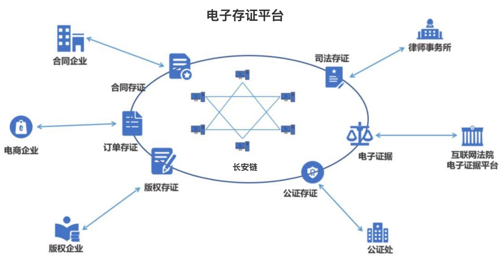

# 政务场景

## 电子存证

### 问题
电子存证是指以电子数据形式存储的证据信息。根据 IDC 报告显示，截至 2019 年 6 月，中国网民规模达 8.54 亿，即使通讯用户规模达到 8.25 亿，预计到 2020 年全球的数据总量将超过 4 万亿 GB，。长期以来传统网络数据由于数量大、易灭失等特点使得传统公证处的证据保全公证效率低且程序复杂费用高，为解决这一问题目前主流的电子存证方式包括：

1.前端存证应用+公证/鉴定机构等权威机构背书
2.前端存证应用+存证机构自行验证的方式

 尽管在相关立法的推动下，电子存证得到了一定程度的发展，但仍存在传统举证中原件易被修改、单方存储存在安全风险、传统公证模式成本高等业务痛点，在我国数字经济快速发达的今天，区块链技术的应用将会改变这一现状。

### 解决方案
区块链在保障公平竞争”，完善产权保护制度，加强区块链技术在存证等方面的应用有重要的价值，在产业中涉及到电子存证的有多方，
区块链技术凭借自身技术特点，基于分布式存储的信息存储方式能够为电子证据的大规模落地提供强有力的支持。区块链技术通过采取时间戳在对电子存证进行存储的同时，通过即时可信时间戳将电子存证在链上固定，从而确保电子存证的真实性。区块链数据作为一种采用链式结构存储数据的方式，通过电子存证时间戳即可实现链上数据的不可篡改以及完整性。通过将区块链技术应用于电子存证领域，确保链上存证信息在数据生成、收集、存储和传输各环节的透明可追溯，从而为落的企业、个人提供完善可追踪的司法保护系统， 创新创业发展氛围提供法律保障。

## 数字身份
### 问题
自互联网时代以来，社会个体的传统身份证明方式实现由线下纸质证明到线上数字证明的迭代，而每个数字身份过程则包括：注册、签发、验证和管理四个步骤，且包含身份所有者（用户）、身份提供方（签发机构）、身份证明需求方（需要使用身份验证的特定场景）。数字身份关联到个体行为的方方面面，而相关信息则由政府权威部门进行签发，在实际操作中由于不同行业和部门之间身份验证系统各不相同，因此信息主体在不同部门之间需要进行身份的重复确认，这一过程一方面造成资源浪费、跨部门身份认证效率低下。尽管 eID 的出现一定程度上解决了信息重复认证的问题，但未能形成更广泛的身份信息的绑定和数据的综合利用。当前以 CA 系统为核心的数字身份认证机制一方面由于认证环节多、任务繁重造成身份认证的效率低下，且易受到网络攻击，威胁用户信息的网络安全。
### 解决方案
通过分布式区块链身份认证的方式，在解决 CA 系统潜在的如中心失效、网络安全等问题的同时，以分布式数字证书签发的方式实现链上身份信息共识，通过区块链 PKI 系统可以优化改善传统 PKI 系统的证书申请、签发、验证和管理全流程运行模式。具体而言，在证书申请时，用户可通过自己生成公私钥并将公钥和用于验证个人身份信息的数据发给验证节点进行证书的申请；在证书签发时，通过验证用户信息真实性从而对相关数字证书进行上链； 在证书撤销时，验证节点根据用户提交的信息验证用户身份，在审核证书撤销请求通过后，将未纳入区块的合法证书信息以及证书状态上链；在证书更新时，证书用户通过向区块链网络发起证书更新请求，提交待更新的证书，新产生的证书以及证实身份的信息，最后再由验证节点进行验证和上链。通过实现数字身份上链，有利于北京统一的居住证制度，打造共建共治共享的社会治理格局，深化户籍制度改革，实行以公民身份号码为唯一标识、统一的居住证制度。

## 碳交易

长安链推动碳交易产业发展

### 背景

国家电网有限公司董事长、党组书记辛保安表示，国家电网公司认真学习贯彻习近平总书记重要讲话和指示精神，主动服务国家重大战略实施，正在研究制定“碳达峰、碳中和”行动方案，努力为推动能源清洁低碳转型、促进绿色发展贡献力量。区块链作为极具创新潜力的现代信息技术，能够较好地支撑碳足迹全生命周期的可信记录、碳排放全要素的可信流转，可以为碳交易提供更安全、更高效、更经济的市场环境，以及可视、可信、可靠的监管环境。国家电网公司成立了央企首家区块链专业公司，牵头搭建中央企业区块链合作创新平台，加大区块链等先进技术攻关力度，深化在电力交易、电网调度、营销服务等领域应用，开展了60余项区块链典型应用创新探索。

### 应用

八家中央企业发布“区块链+碳交易”生态网络场景。
 一是碳资产交易。聚合产业链上下游相关信息，实现碳交易从排放权获取、交易、流通，到交易核销、统计的全流程数据上链存储与可信共享应用，支撑政府加快完善碳交易机制，促进碳交易市场的透明化、有序化、便捷化。
 二是清洁能源消纳。建成基于区块链的清洁能源消纳平台，构建灵活的能源交易模式、高效的资源配置体系和智能化的补贴核算机制，推动发电侧、电网侧与需求侧凝聚清洁能源消纳合力，积极服务我国新能源发展。
 三是冬奥绿电溯源。将可再生能源发电、配套电网输电、冬奥场馆用电等关键环节数据上链，首次建立了基于区块链的绿电溯源机制，并制定我国首个绿电交易规则——《京津冀绿色电力市场化交易规则》，构建了按需生产、合理调度、智能交易的绿色电力保障方案。
 辛保安表示，实现“碳达峰、碳中和”目标，区块链技术大有可为。国家电网公司将在各部委、各级政府部门的指导支持下，秉持开放合作理念，携手上下游企业，聚合优质资源，继续加大区块链技术应用推广力度，加快建设更加绿色、智慧、安全、友好的能源互联网，为长安链提供丰富多元的应用场景，全面助力北京国际科技创新中心建设。

