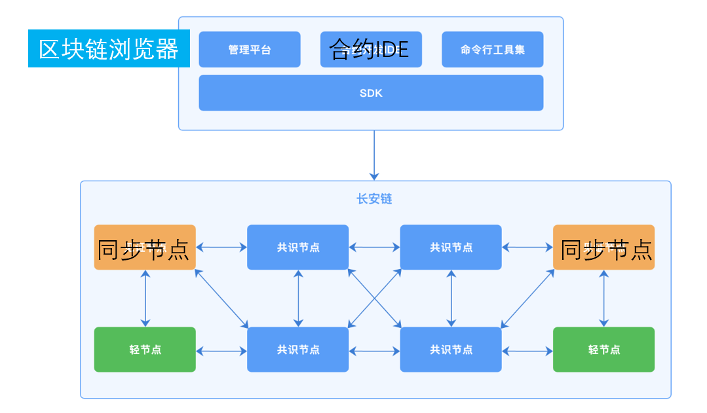
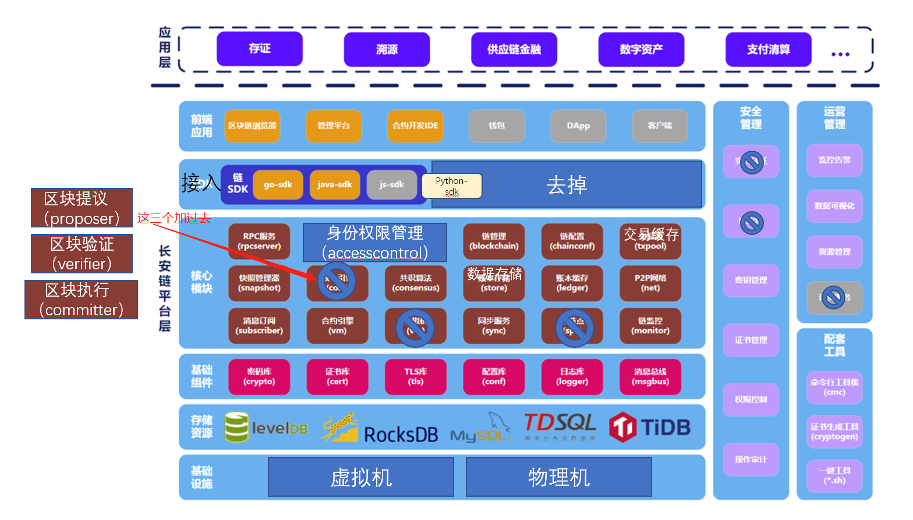

# 整体架构

## 逻辑架构

长安链逻辑架构如下图所示。主要包含以下元素：

- Consensus Node：共识节点，参与共识投票、交易执行、区块验证和记账的节点。
- Sync Node：同步节点，或称为见证节点，节点会同步、验证区块，执行交易，并记录完整账本数据，不参与共识投票。
- Light Node：轻节点，从共识节点同步数据，校验数据合法性，过滤同组织的交易并存储；不具备接收交易请求和广播交易的功能。
- SDK：即客户端SDK，帮助用户通过RPC和链进行沟通，完成合约创建、调用、链管理等功能。
- Tools：长安链提供一系列工具集方便用户命令行方式对链部署和管理操作。比如证书生成、链配置、快速部署等。
- 长安链 Management Platform：区块链管理平台，包括链管理、区块信息检索、可视化监控等功能。
- 长安链 IDE：智能合约在线开发环境，长安链所有合约支持语言均可在该IDE上开发、编译、调试。

## 层级架构

自下而上，长安链由以下层级构成：

- 基础设视层：包括公有云、私有云、物理机等，为长安链提供基础运行环境；
- 存储资源层：为长安链节点提供数据存储服务，具体情况可参见[数据存储](./8、数据存储.md)章节；
- 基础组件层：为长安链节点提供密码学、配置、日志、常用数据结构等通用技术组件，具体可见*chainmaker-common*项目；
- 核心模块层：长安链共识算法、核心引擎、虚拟机等核心模块，核心模块均采用可插拔设计，为可装配区块链奠定基础；
- SDK层：包括多语言链SDK、多语言合约SDK，前者方便应用开发者与链交互，后者为用户编写智能合约合约提供扩展能力；
- 前端应用层：包括区块链管理平台、区块链浏览器、合约开发IDE等，方便用户直接访问区块链底层平台。

