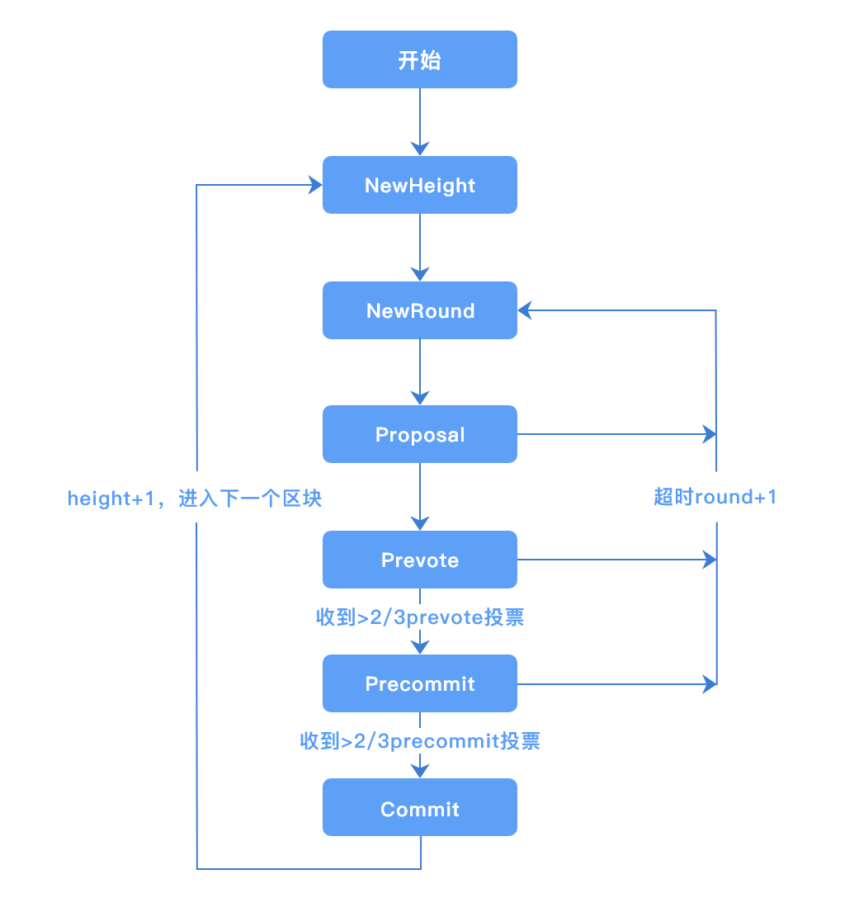

# 共识算法

[TOC]

## 共识算法简介
共识算法是指在分布式场景中，多个节点为了达成相同的数据状态而运行的一种分布式算法。
在分布式场景中，可能出现网络丢包、时钟飘逸、节点宕机、节点作恶等等故障情况，共识算法需要能够容忍这些错误，保证多个节点取得相同的数据状态。
根据故障类型的不同，可以经共识算法分为两类：
  1. 容忍宕机错误类算法（crash fault tolerant consensus algorithm），可以容忍网络丢包、时钟飘逸、部分节点宕机这种节点为良性的错误。常见算法有 Paxos、Raft。
  2. 容忍拜占庭错误类算法（byzantine fault tolerant consensus algorithm），可以容忍部分节点任意类型错误，包括节点作恶的情况。常见算法有 PBFT、PoW、PoS等。

### 公链共识
公链的特点是节点数量多且节点分布分散，主要使用的共识算法有PoW和PoS，这两种共识的优点是可以支持的节点数量多，缺点是TPS较低和交易确认时间长。

### 联盟链共识
联盟链的特点是节点之间网络较为稳定且节点有准入要求，根据需要容忍的错误类型可以选择Raft和PBFT类算法，这类算法的优点是TPS较高且交易可以在毫秒级确认，缺点是支持的节点数量有限，通常不多于100个节点。

### 公链共识和联盟链共识的对比

| 共识       | 支持的节点数量 | TPS   | 交易时延 |
| ---        | ---            | ---   | ---      |
| 公有链共识 | 10000+         | 10+   | 10min+   |
| 联盟链共识 | 100+           | 1000+ | 1s+      |

## 长安链中的共识
长安链目前支持Solo，Raft，TBFT 三种共识类型。三种共识对比如下：

| 共识类型 | 故障节点数为n(n>=0)时，网络中最少节点数 | 使用场景                                         |
| ---      | ---                                     | ---                                              |
| Solo     | Solo只支持1个节点                       | 主要用于测试及搭建demo                           |
| Raft     | 2n+1                                    | 联盟链中不需要考虑恶意节点，且需要性能较高的场景 |
| TBFT     | 3n+1                                    | 联盟链中需要考虑恶意节点的场景                   |

### Solo

#### 什么是SOLO共识算法
SOLO是单节点无共识投票过程的“共识算法”。

#### SOLO共识算法的用途
1. 快速部署单节点运行，降低试用门槛；
2. 供开发人员进行除网络和共识模块的全流程测试；

#### 如何使用SOLO共识算法
部署一个长安链节点，将链配置（参见配置模块，链配置章节）的共识算法进行如下修改，清除数据启动即可：

```shell
#共识配置
consensus:
  # 共识类型(0-SOLO,1-TBFT,2-MBFT,3-HOTSTUFF,4-RAFT,10-POW)
  type: 0
```

### Raft
#### 什么是Raft共识算法
[Raft算法](https://en.wikipedia.org/wiki/Raft_(algorithm))是目前使用最广泛的非拜占庭错误类共识算法。
Raft算法主要依靠投票机制和日志复制机制来实现节点间的共识。节点通过投票选出一个leader，由leader负责处理所有请求，再将请求以日志的方式复制到其他节点。

#### Raft共识算法的用途
1. 不考虑恶意节点的多节点环境 
2. 需要支持高TPS的环境 

#### Raft共识接口说明
Raft 实现了长安链的ConsensusEngine接口。
Start 方法用来初始化Raft内部状态及启动Raft实例。
Stop 方法用来停止Raft实例。

```go
type ConsensusEngine interface {      
  // Init starts the consensus engine.
  Start() error                       
                                      
  // Stop stops the consensus engine. 
  Stop() error                        
}  
```

#### Raft共识与核心引擎交互图
```
  ┌──────────┐        ┌──────────────┐        ┌───────────┐
  |   Core   |        |Raft Consensus|        |Other Nodes|
  └──────────┘        └──────────────┘        └───────────┘
       │                     │                     │
       │   ProposesalState   │                     │
       │◄────────────────────│                     │
       │                     │                     │
       │      Proposal       │                     │
       │────────────────────►│                     │
       │                     │  Log Replication    │
       │                     │────────────────────►│
       │                     │                     │
       │                     │       Vote          │
       │                     │◄────────────────────│
       │       Verify        │                     │
       │◄────────────────────│                     │
       │                     │                     │
       │     VerifyResult    │                     │
       │────────────────────►│                     │
       │                     │                     │
       │       Commit        │                     │
       │◄────────────────────│                     │
       │                     │                     │

```
#### 如何使用Raft共识算法
Raft共识建议配置节点数为2n+1(n>=0)，将链配置（参见配置模块，链配置章节）的共识算法进行如下修改，清除数据启动即可：
   
```shell
#共识配置
consensus:
  # 共识类型(0-SOLO,1-TBFT,2-MBFT,3-HOTSTUFF,4-RAFT,10-POW)
  type: 4
  nodes:                                                                                                                                 
    - org_id: "wx-org1.chainmaker.org"                                                                                                   
      address:                                                                                                                           
        - "/ip4/127.0.0.1/tcp/11301/p2p/QmcQHCuAXaFkbcsPUj7e37hXXfZ9DdN7bozseo5oX4qiC4"                                                  
    - org_id: "wx-org2.chainmaker.org"                                                                                                   
      address:                                                                                                                           
        - "/ip4/127.0.0.1/tcp/11302/p2p/QmeyNRs2DwWjcHTpcVHoUSaDAAif4VQZ2wQDQAUNDP33gH"                                                  
    - org_id: "wx-org3.chainmaker.org"                                                                                                   
      address:                                                                                                                           
        - "/ip4/127.0.0.1/tcp/11303/p2p/QmXf6mnQDBR9aHauRmViKzSuZgpumkn7x6rNxw1oqqRr45"                                                  
```

### TBFT
#### 算法简述
TBFT 是一种拜占庭容错的共识算法，可以在拜占庭节点数小于总数1/3的情况下，保证系统的安全运行。
TBFT 的每轮共识可以分为5个步骤：
1. NewRound: 共识投票的准备阶段，会初始化共识相关状态
2. Proposal: 提案阶段，leader节点会打包区块，并广播给follwer节点
3. Prevote: 预投票阶段，follower节点在收到proposal并验证proposal合法后，广播自己的prevote投票到其他节点
4. Precommit: 预提交阶段，节点收到 >2/3 针对proposal的prevote投票后，广播自己的precommit投票到其他节点
5. Commit: 提交阶段，节点收到 >2/3 针对proposal的precommit投票后，提交proposal中的区块到账本

其中共识投票是指其中的Proposal，Prevote，Precommit三个阶段。 阶段图示如下：


流程图如下：


#### 与PBFT的区别
TBFT基于Tendermint算法，与PBFT的最大区别在于：PBFT有一个固定的leader节点打包交易，当leader节点故障的时候会
使用view-change子协议更换leader；而在TBFT中，leader是轮换的，每提交n个块（可以配置）leader会轮换成下一个节点。
因此，TBFT比PBFT有更好的公平性。

#### 与msgbus交互流程


ProposaState: TBFT发送给核心引擎本节点在当前高度是否是leader节点，核心引擎判断是否需要打包区块 <br>
Proposal: 核心引擎打包区块并发送给TBFT <br>
Verify: 当本节点收到主节点发来的区块后，向核心引擎验证区块读写集等信息 <br>
VerifyResult: 核心引擎返回给TBFT Verify的结果，当区块合法时，本节点将会投票给区块 <br>
Commit: TBFT完成共识后，向核心引擎发送提交区块的信号，核心引擎提交区块到账本 <br>
BlockInfo: 核心引擎告知TBFT已提交区块的高度等信息，TBFT进入下一个高度 <br>

#### 接口说明
TBFT 实现了长安链的`ConsensusEngine`接口。
`Start` 方法用来初始化TBFT内部状态及启动TBFT实例。
`Stop` 方法用来停止TBFT实例。
```go
type ConsensusEngine interface {      
  // Init starts the consensus engine.
  Start() error                       
                                      
  // Stop stops the consensus engine. 
  Stop() error                        
}    
```

#### 数据结构
```protobuf
// TBFTMsgType defines different type message in tbft
enum TBFTMsgType {
  propose   = 0;
  prevote   = 1;
  precommit = 2;
  state     = 3;
}

message TBFTMsg {
  TBFTMsgType type = 1;
  bytes msg        = 2;
}

// Proposal defined a consesensus proposal which can 
// be gossiped to other node and can be serilized 
// for persistent store.
message Proposal {
  string voter                 = 1;
  int64 height                 = 2;
  int32 round                  = 3;
  int32 pol_round              = 4;
  Block block                  = 5;
  EndorsementEntry endorsement = 6;
}

// VoteType represents the type of vote
enum VoteType {
  VotePrevote   = 0;
  VotePrecommit = 1;
}

// Vote represents a tbft vote
message Vote {
  VoteType type = 1;
  string voter  = 2;
  int64 height  = 3;
  int32 round   = 4;
  bytes hash    = 5;
  EndorsementEntry endorsement = 6;
}

// Step represents the step in a round 
enum Step {
  NewHeight     = 0;
  NewRound      = 1;
  Propose       = 2;
  Prevote       = 3;
  PrevoteWait   = 4;
  Precommit     = 5;
  PrecommitWait = 6;
  Commit        = 7;
}
```

#### 配置参数
TBFT 可以通过在配置块中的`ext_config`字段配置相关参数：
1. "TBFT_propose_timeout": 提案的超时时间，如10s, 1m
2. "TBFT_propose_delta_timeout": 每轮提案超时增加的时间，如10s, 1m
3. "TBFT_blocks_per_proposer": 每个节点连续出块数，如 3
