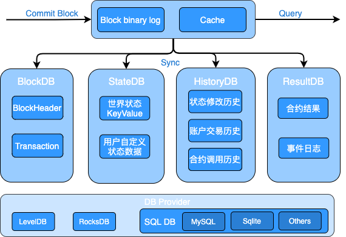

## 存储模块

### 概述

存储模块负责持久化存储链上的区块、交易、状态、历史读写集等账本数据，并对外提供上述数据的查询功能。区块链以区块为单位进行批量的数据提交，一次区块提交会涉及到多项账本数据的提交，比如：交易提交，状态数据修改等，所以存储模块需要维护账本数据的原子性。长安链支持常用的数据库来存储账本数据，如LevelDB、RocksDB、MySQL等数据库，业务可选择其中任意一种数据库来部署区块链。

账本数据主要分为3类：

1. 区块数据，记录区块元信息和交易数据：
   - 区块元数据包括：区块头、区块DAG、区块中交易的txid列表，additionalData等；
   - 交易数据，既序列化后的交易体，为了提供对单笔交易数据的查询，所以对交易数据进行了单独存储。
2. 状态数据，记录智能合约中读写的链上状态数据，既世界状态。
3. 历史读写集数据，长安链对每笔交易在执行过程中的所读写的状态数据集进行了单独保存，可用于后续追溯交易、状态数据的变迁过程。

### 存储模块运行逻辑

针对上述3类账本数据，长安链分别实现了3个DB类，分别是：Block DB、State DB、History DB。采用多个数据库之后，就需要维护数据库之间的数据一致性，避免仅有部分数据库提交后，发生程序中断而导致不同数据库间的数据不一致，因此，长安链引入了Block binary log组件来持久化存储区块的原始内容，用于重启过程中的数据恢复，类似于数据库中的预写式日志(wal)的功能。 



#### 区块提交流程

1. 首先将序列化后的区块、读写集数据、以及最新的区块高度写入Block binary log，用于异常中断后的数据恢复。为了提高性能，加入一层cache，新区块提交请求在更新完Block binary log之后，再将区块数据写入cache，在更新完log和cache后，提交即可返回，由后台线程异步更新Block DB、State DB和History DB。
2. 在Block DB中记录区块元信息与交易信息，其中交易信息以TxID作为key存储，区块信息以BlockHeight作为key存储，区块元信息中只记录交易ID列表，同时索引BlockHash到BlockHeight的映射关系。Block DB中额外记录了当前最新的区块高度（LastBlockHeight）作为checkpoint，用以重启后的数据恢复。
3. 在State DB中保存state数据，key为合约名与对象主键的组合：<contractName, ObjectKey>，同时记录最新的区块高度（LastBlockHeight）作为checkpoint。
4. 在History DB中记录交易的读写集，读写集以TxID作为key，同时记录最新的区块高度（LastBlockHeight）作为checkpoint。

#### 账本恢复流程

如果区块正在提交过程中，节点因异常退出，节点在下次启动时存储模块会进入恢复流程：

1. 分别从Block binary log、Block DB、State DB、History DB中获取最新的区块高度，以Block binary log中的区块高度作为基准高度，判断其他DB是否落后基准高度。
2. 如果有某个DB落后基准高度，则从Block bianry log中获取缺失的区块及读写集，依次提交到落后DB中。
3. 所有DB同步到基准高度后，存储模块启动完成，节点进入正常流程。

#### 存储接口说明

```go
// BlockchainStore provides handle to store instances
type BlockchainStore interface {

	// PutBlock commits the block and the corresponding rwsets in an atomic operation
	PutBlock(block *pb.Block, txRWSets []*pb.TxRWSet) error

	// GetBlockByHash returns a block given it's hash, or returns nil if none exists.
	GetBlockByHash(blockHash []byte) (*pb.Block, error)

	// BlockExists returns true if the black hash exist, or returns false if none exists.
	BlockExists(blockHash []byte) (bool, error)

	// GetBlock returns a block given it's block height, or returns nil if none exists.
	GetBlock(height int64) (*pb.Block, error)

	// GetLastConfigBlock returns the last config block.
	GetLastConfigBlock() (*pb.Block, error)

	// GetBlockByTx returns a block which contains a tx.
	GetBlockByTx(txId string) (*pb.Block, error)

	// GetBlockWithRWSets returns a block and the corresponding rwsets given
	// it's block height, or returns nil if none exists.
	GetBlockWithRWSets(height int64) (*pb.BlockWithRWSet, error)

	// GetTx retrieves a transaction by txid, or returns nil if none exists.
	GetTx(txId string) (*pb.Transaction, error)

	// TxExists returns true if the tx exist, or returns false if none exists.
	TxExists(txId string) (bool, error)

	// GetTxConfirmedTime returns the confirmed time for given tx
	GetTxConfirmedTime(txId string) (int64, error)

	// GetLastBlock returns the last block.
	GetLastBlock() (*pb.Block, error)

	// ReadObject returns the state value for given contract name and key, or returns nil if  none exists.
	ReadObject(contractName string, key []byte) ([]byte, error)

	// SelectObject returns an iterator that contains all the key-values between given key ranges.
	// startKey is included in the results and limit is excluded.
	SelectObject(contractName string, startKey []byte, limit []byte) Iterator

	// GetTxRWSet returns an txRWSet for given txId, or returns nil if none exists.
	GetTxRWSet(txId string) (*pb.TxRWSet, error)

	// GetTxRWSetsByHeight returns all the rwsets corresponding to the block,
	// or returns nil if zhe block does not exist
	GetTxRWSetsByHeight(height int64) ([]*pb.TxRWSet, error)

	// GetDBHandle returns the database handle for given dbName
	GetDBHandle(dbName string) DBHandle

	// Close closes all the store db instances and releases any resources held by BlockchainStore
	Close() error
}
```

#### 数据库

##### 概述

存储模块中的Block DB、State DB、History DB等都是封装后的DB对象，其具体实现要基于特定的数据库引擎，比如LevelDB、RocksDB、MySQL等数据库引擎。为了实现可插拔的数据库引擎，长安链在数据库引擎之上封装了一层接口，并将LevelDB、RocksDB、MySQL等数据库封装成DB provider。用户可以根据业务需求选择合适的数据库引擎作为长安链的底层存储组件。

##### 支持的数据库类型

长安链目前支持3种数据库引擎可供选择，分别是LevelDB、RocksDB、MySQL。

- LevelDB，默认采用的数据库引擎，LevelDB作为一款嵌入式KV数据库，默认集成在长安链节点中，无需部署，性能也相对关系型数据要更好。
- RocksDB，作为LevelDB的增强版本，也是嵌入式KV数据库，性能比LevelDB更高，但是需要额外的编译与安装部署。
- MySQL，关系型数据库，支持schema和富查询，性能较KV数据库低，目前关系型数据库与区块链的状态数据并不能很好的结合，导致很少有区块链采用关系型数据库作为状态数据库。原因主要有两点：1.区块链需要对智能合约所读写的状态数据做严格的控制和校验，而SQL语句相对区块链来说过于灵活，难以控制；2.需要提前创建库表和索引，需要针对不同的智能合约创建不同的数据库表结构，不够灵活。目前长安链支持MySQL存储引擎，在系统数据如Block DB上支持区块元信息、交易信息的关系型语义，但状态数据库仅支持kv的方式，不支持智能合约以SQL的方式读写状态数据(world state)。

##### 配置说明

节点本地配置文件chainmaker.yml中存储部分的配置说明

```yml
storage:
	provider: LevelDB	#数据库类型，支持LevelDB，RocksDB，MySQL或分布式MySQL
	store_path: ../data/ledgerData  #账本的存储路径， 包括LevelDB、RocksDB的数据目录，Block binary log的数据目录
	write_buffer_size: 4	#LevelDB、RocksDB的write_buffer_size， 单位为MB，默认为4M
	bloom_filter_bits: 10	#LevelDB、RocksDB的布隆过滤器参数，为每个key分配的额外bit空间，默认为10，如果少于或等于0，则不开启布隆过滤。
	disable_historydb: false	#是否禁用历史读写集的存储功能， 默认为false，也就是保存历史读写集。
	mysql:	#MySQL相关配置，只有provider选择MySQL时才需要配置，LevelDB和RocksDB可以忽略
		dsn: user:password@tcp(ip:port)/	#mysql的连接信息，包括用户名、密码、ip、port等，示例：root:admin@tcp(127.0.0.1:3306)/
		max_idle_conns: 10	#连接池中维持的最大的空闲连接数，默认为10
		max_open_conns: 10	#最大的可用连接数，默认为10
		conn_max_lifetime: 60	#连接维持的最长时间，单位秒，默认为60
```

##### 安装说明

###### RocksDB安装部署

RocksDB是使用C++开发的开源嵌入式数据库，长安链采用golang开发，为了集成RocksDB，目前长安链使用了gorocksdb第三方开源的golang库，gorocksdb需要依赖RocksDB的库文件，因此如果选用RocksDB作为存储数据库，需要在本地安装RocksDB的环境，并使用条件编译来集成RocksDB。过程如下：

- 1.RocksDB安装：https://github.com/facebook/rocksdb/blob/master/INSTALL.md
- 2.gorocksdb安装：https://github.com/tecbot/gorocksdb
- 3.使用rocksdb需要通过-tag方式启动，build方式：

```shell
go build -tags=rocksdb 
```

Linux下Rocksdb环境安装

1 安装依赖

安装gcc、zlib、snappy、lz4等依赖工具

```shell
yum -y install lrzsz git gcc gcc-c++ lz4-devel
yum -y install snappy snappy-devel zlib zlib-devel bzip2 bzip2-devel lz4 lz4-devel zstd
```

2 安装cmake

gflags-2.2.2对cmake版本有要求，所以需要指定版本的cmake

```shell
curl -O   https://cmake.org/files/v3.6/cmake-3.6.0-Linux-x86_64.tar.gz
mv cmake-3.6.0-Linux-x86_64.tar.gz /opt/
cd /opt/
tar -xvzf cmake-3.6.0-Linux-x86_64.tar.gz
yum remove cmake

cat >>/etc/profile <<EOF

export PATH=\$PATH:/opt/cmake-3.6.0-Linux-x86_64/bin

EOF
source /etc/profile
```

3 安装gflags

```shell
wget -O gflags-2.2.2.tar.gz https://github.com/gflags/gflags/archive/v2.2.2.tar.gz
tar -xvzf gflags-2.2.2.tar.gz
cd gflags-2.2.2/
mkdir build
cd build/
cmake -DBUILD_SHARED_LIBS=ON -DBUILD_STATIC_LIBS=ON -DINSTALL_HEADERS=ON -DINSTALL_SHARED_LIBS=ON -DINSTALL_STATIC_LIBS=ON ..
make
make install

cat >>/etc/profile <<EOF

export LD_LIBRARY_PATH=\$LD_LIBRARY_PATH:/usr/local/lib
EOF
source /etc/profile
```

4 下载并安装rocksdb

```shell
wget -O rocksdb-5.18.3.tar.gz https://github.com/facebook/rocksdb/archive/v5.18.3.tar.gz
tar -xzvf rocksdb-5.18.3.tar.gz

cd rocksdb-5.18.3
mkdir build
cd build

cmake -DCMAKE_INSTALL_PREFIX=/usr/local/rocksdb ..

make
make install

cat >>/etc/profile <<EOF

export CPLUS_INCLUDE_PATH=\$CPLUS_INCLUDE_PATH:/usr/local/rocksdb/include/
export LD_LIBRARY_PATH=\$LD_LIBRARY_PATH:/usr/local/rocksdb/lib64/
export LIBRARY_PATH=\$LIBRARY_PATH:/usr/local/rocksdb/lib64/

EOF

source /etc/profile
```

5 使用测试

```shell
[root@VM-219-157-centos /opt/rocksdb-5.18.3/build]# cd tools/
[root@VM-219-157-centos /opt/rocksdb-5.18.3/build/tools]# ll
total 2608
drwxr-xr-x 12 root root    4096 Dec 25 10:38 CMakeFiles
-rw-r--r--  1 root root     269 Dec 25 10:38 CTestTestfile.cmake
-rw-r--r--  1 root root   18973 Dec 25 10:38 Makefile
-rw-r--r--  1 root root     988 Dec 25 10:38 cmake_install.cmake
-rwxr-xr-x  1 root root  232649 Dec 25 10:55 db_repl_stress
-rwxr-xr-x  1 root root  233443 Dec 25 10:55 db_sanity_test
-rwxr-xr-x  1 root root 1338230 Dec 25 10:55 db_stress
-rwxr-xr-x  1 root root   48060 Dec 25 10:55 ldb
-rwxr-xr-x  1 root root  207347 Dec 25 10:55 rocksdb_dump
-rwxr-xr-x  1 root root  207358 Dec 25 10:55 rocksdb_undump
-rwxr-xr-x  1 root root    8571 Dec 25 10:55 sst_dump
-rwxr-xr-x  1 root root  350147 Dec 25 10:55 write_stress
[root@VM-219-157-centos /opt/rocksdb-5.18.3/build/tools]#
[root@VM-219-157-centos /opt/rocksdb-5.18.3/build/tools]#
[root@VM-219-157-centos /opt/rocksdb-5.18.3/build/tools]#
[root@VM-219-157-centos /opt/rocksdb-5.18.3/build/tools]# ./ldb -help
ldb - RocksDB Tool

commands MUST specify --db=<full_path_to_db_directory> when necessary

The following optional parameters control if keys/values are input/output as hex or as plain strings:
  --key_hex : Keys are input/output as hex
  --value_hex : Values are input/output as hex
  --hex : Both keys and values are input/output as hex

The following optional parameters control the database internals:
  --column_family=<string> : name of the column family to operate on. default: default column family
  --ttl with 'put','get','scan','dump','query','batchput' : DB supports ttl and value is internally timestamp-suffixed
  --try_load_options : Try to load option file from DB.
  --ignore_unknown_options : Ignore unknown options when loading option file.
  --bloom_bits=<int,e.g.:14>
  --fix_prefix_len=<int,e.g.:14>
  --compression_type=<no|snappy|zlib|bzip2|lz4|lz4hc|xpress|zstd>
  --compression_max_dict_bytes=<int,e.g.:16384>
  --block_size=<block_size_in_bytes>
  --auto_compaction=<true|false>
  --db_write_buffer_size=<int,e.g.:16777216>
  --write_buffer_size=<int,e.g.:4194304>
  --file_size=<int,e.g.:2097152>


Data Access Commands:
  put <key> <value>  [--ttl]
  get <key> [--ttl]
  batchput <key> <value> [<key> <value>] [..] [--ttl]
  scan [--from] [--to]  [--ttl] [--timestamp] [--max_keys=<N>q]  [--start_time=<N>:- is inclusive] [--end_time=<N>:- is exclusive] [--no_value]
  delete <key>
  deleterange <begin key> <end key>
  query [--ttl]
    Starts a REPL shell.  Type help for list of available commands.
  approxsize [--from] [--to]
  checkconsistency


Admin Commands:
  dump_wal --walfile=<write_ahead_log_file_path> [--header]  [--print_value]  [--write_committed=true|false]
  compact [--from] [--to]
  reduce_levels --new_levels=<New number of levels> [--print_old_levels]
  change_compaction_style --old_compaction_style=<Old compaction style: 0 for level compaction, 1 for universal compaction> --new_compaction_style=<New compaction style: 0 for level compaction, 1 for universal compaction>
  dump [--from] [--to]  [--ttl] [--max_keys=<N>] [--timestamp] [--count_only] [--count_delim=<char>] [--stats] [--bucket=<N>] [--start_time=<N>:- is inclusive] [--end_time=<N>:- is exclusive] [--path=<path_to_a_file>]
  load [--create_if_missing] [--disable_wal] [--bulk_load] [--compact]
  manifest_dump [--verbose] [--json] [--path=<path_to_manifest_file>]
  list_column_families full_path_to_db_directory
  dump_live_files
  idump [--from] [--to]  [--input_key_hex] [--max_keys=<N>] [--count_only] [--count_delim=<char>] [--stats]
  repair
  backup [--backup_env_uri]  [--backup_dir]  [--num_threads]  [--stderr_log_level=<int (InfoLogLevel)>]
  restore [--backup_env_uri]  [--backup_dir]  [--num_threads]  [--stderr_log_level=<int (InfoLogLevel)>]
  checkpoint [--checkpoint_dir]
  write_extern_sst <output_sst_path>
  ingest_extern_sst <input_sst_path> [--move_files]  [--snapshot_consistency]  [--allow_global_seqno]  [--allow_blocking_flush]  [--ingest_behind]  [--write_global_seqno]

[root@VM-219-157-centos /opt/rocksdb-5.18.3/build/tools]#
[root@VM-219-157-centos /opt/rocksdb-5.18.3/build/tools]# pwd
/opt/rocksdb-5.18.3/build/tools
[root@VM-219-157-centos /opt/rocksdb-5.18.3/build/tools]# ll /tmp/
total 32
srwxrwxrwx 1 root root    0 Dec 18 23:04 agent_cmd.sock
drwxr-xr-x 2 root root 4096 Dec 25 10:14 commandnotfound
-rw-r--r-- 1 root root   53 Dec 17 10:44 cpuidle_support.log
-rw-r--r-- 1 root root 2513 Dec 17 10:43 cvm_init.log
-rw-r--r-- 1 root root  297 Dec 17 10:44 net_affinity.log
-rw-r--r-- 1 root root   26 Dec 17 10:44 nv_gpu_conf.log
-rw-r--r-- 1 root root  155 Dec 17 10:44 setRps.log
drwx------ 3 root root 4096 Dec 17 10:44 systemd-private-e9868203df724169bf07a791d55819cd-ntpd.service-mA2nuw
-rw-r--r-- 1 root root 2017 Dec 17 10:44 virtio_blk_affinity.log
[root@VM-219-157-centos /opt/rocksdb-5.18.3/build/tools]# ./ldb --db=/tmp/test_db --create_if_missing put a1 b1
OK

[root@VM-219-157-centos /opt/rocksdb-5.18.3/build/tools]# ./ldb --db=/tmp/test_db scan
a1 : b1

[root@VM-219-157-centos /opt/rocksdb-5.18.3/build/tools]# ./ldb --db=/tmp/test_db get a1
b1

[root@VM-219-157-centos /opt/rocksdb-5.18.3/build/tools]# ./ldb --db=/tmp/test_db get a2
Failed: NotFound:
[root@VM-219-157-centos /opt/rocksdb-5.18.3/build/tools]# cd /tmp/test_db/
[root@VM-219-157-centos /tmp/test_db]# ll
total 920
-rw-r--r-- 1 root root    26 Dec 25 11:13 000003.log
-rw-r--r-- 1 root root    16 Dec 25 11:13 CURRENT
-rw-r--r-- 1 root root    37 Dec 25 11:13 IDENTITY
-rw-r--r-- 1 root root     0 Dec 25 11:13 LOCK
-rw-r--r-- 1 root root 16246 Dec 25 11:14 LOG
-rw-r--r-- 1 root root 19272 Dec 25 11:13 LOG.old.1608866049557780
-rw-r--r-- 1 root root 15784 Dec 25 11:14 LOG.old.1608866049562808
-rw-r--r-- 1 root root 16246 Dec 25 11:14 LOG.old.1608866058035881
-rw-r--r-- 1 root root 15788 Dec 25 11:14 LOG.old.1608866058041253
-rw-r--r-- 1 root root 16250 Dec 25 11:14 LOG.old.1608866062086538
-rw-r--r-- 1 root root 15784 Dec 25 11:14 LOG.old.1608866062091559
-rw-r--r-- 1 root root    13 Dec 25 11:13 MANIFEST-000001
-rw-r--r-- 1 root root  4744 Dec 25 11:13 OPTIONS-000005
```

6 安装zstd

zstd是facebook为适配rocksdb开发的zstandard数据压缩工具，如果不安装该软件，会导致gorocksdb安装失败。

安装步骤如下：

```shell
cd /usr/local
git clone https://github.com/facebook/zstd.git
cd zstd
make
make install
```

7 安装gorocksdb

通过1-6安装步骤后，rocksdb会被安装在 usr/local/rocksdb 这个目录下，我们使用go版本的rocksdb需要依赖于该路径。

目前使用的gorocksdb为：github.com/tecbot/gorocksdb

安装上述的安装路径，使用下面的命令即可：

```shell
CGO_CFLAGS="-I/usr/local/rocksdb/include" \
CGO_LDFLAGS="-L/usr/local/rocksdb -lrocksdb -lstdc++ -lm -lz -lbz2 -lsnappy -llz4 -lzstd" \
  go get github.com/tecbot/gorocksdb
```

如果安装目录有变化，则修改对应的/usr/local/rocksdb对应的路径

###### MySQL数据库表

长安链支持选用MySQL作为账本存储引擎，节点启动会自动创建数据库，使用chainId作为数据库名，同时也会自动创建相应的表：

1. 区块元信息表

   ```sql
   CREATE TABLE `block_infos` (
    `chain_id` varchar(128) COLLATE utf8mb4_general_ci DEFAULT NULL,
    `block_height` bigint(20) NOT NULL,
    `pre_block_hash` varbinary(128) DEFAULT NULL,
    `block_hash` varbinary(128) DEFAULT NULL,
    `pre_conf_height` bigint(20) DEFAULT '0',
    `block_version` varbinary(128) DEFAULT NULL,
    `dag_hash` varbinary(128) DEFAULT NULL,
    `rw_set_root` varbinary(128) DEFAULT NULL,
    `tx_root` varbinary(128) DEFAULT NULL,
    `block_timestamp` bigint(20) DEFAULT '0',
    `proposer` blob,
    `consensus_args` blob,
    `tx_count` bigint(20) DEFAULT '0',
    `signature` blob,
    `dag` blob,
    `tx_ids` longtext COLLATE utf8mb4_general_ci,
    `additional_data` longblob,
    PRIMARY KEY (`block_height`),
    KEY `idx_hash` (`block_hash`)
   ) ENGINE=InnoDB DEFAULT CHARSET=utf8mb4 COLLATE=utf8mb4_general_ci;
   ```

2. 交易表

   ```sql
   CREATE TABLE `tx_infos` (
    `chain_id` varchar(128) COLLATE utf8mb4_general_ci DEFAULT NULL,
    `sender` blob,
    `tx_id` varchar(128) COLLATE utf8mb4_general_ci NOT NULL,
    `tx_type` int(11) DEFAULT NULL,
    `block_height` bigint(20) DEFAULT NULL,
    `offset` int(11) DEFAULT NULL,
    `timestamp` bigint(20) DEFAULT '0',
    `expiration_time` bigint(20) DEFAULT '0',
    `request_payload` longblob,
    `request_signature` blob,
    `code` int(11) DEFAULT NULL,
    `contract_result` longblob,
    `rw_set_hash` varbinary(128) DEFAULT NULL,
    PRIMARY KEY (`tx_id`),
    KEY `idx_height_offset` (`block_height`,`offset`)
   ) ENGINE=InnoDB DEFAULT CHARSET=utf8mb4 COLLATE=utf8mb4_general_ci;
   ```

3. 世界状态表

   ```sql
   CREATE TABLE `state_infos` (
    `contract_name` varchar(128) COLLATE utf8mb4_general_ci NOT NULL,
    `object_key` varbinary(128) NOT NULL DEFAULT '',
    `object_value` longblob,
    `block_height` bigint(20) DEFAULT NULL,
    `updated_at` datetime(3) DEFAULT NULL,
    PRIMARY KEY (`contract_name`,`object_key`),
    KEY `idx_height` (`block_height`)
   ) ENGINE=InnoDB DEFAULT CHARSET=utf8mb4 COLLATE=utf8mb4_general_ci;
   ```

4. 历史读写集表

   ```sql
   CREATE TABLE `history_infos` (
    `tx_id` varchar(128) COLLATE utf8mb4_general_ci NOT NULL,
    `rw_sets` longblob,
    `block_height` bigint(20) DEFAULT NULL,
    PRIMARY KEY (`tx_id`),
    KEY `idx_height` (`block_height`)
   ) ENGINE=InnoDB DEFAULT CHARSET=utf8mb4 COLLATE=utf8mb4_general_ci;
   ```
   
   

