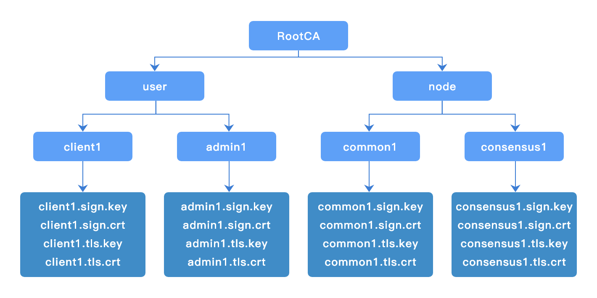

# 证书生成工具

## 概述

`chainmaker-cryptogen`是长安链基于证书配置模板文件生成`ChainMaker`节点和客户端证书的工具。

## 证书配置模板

```yml
crypto_config:
  - domain: chainmaker.org
    host_name: wx-org
    # 组织数量，如果为1，直接使用host_name，否则添加递增编号
    count: 4                				
    #pk_algo: ecc_p256
    pk_algo: sm2
    ski_hash: sha256
    specs: &specs_ref
      expire_year:  10
      sans:
        - chainmaker.org
        - localhost
        - 127.0.0.1
    location: &location_ref
      country:            CN
      locality:           Beijing
      province:           Beijing
    # CA证书配置
    ca:
      location:
        <<: *location_ref
      specs:
        <<: *specs_ref
    # 节点证书配置
    node:
      - type: consensus
        # 共识节点数量
        count: 1
        # 共识节点配置
        location:
          <<: *location_ref
        specs:
          <<: *specs_ref
          expire_year:  5
      - type: common
        # 普通节点数量
        count: 1
        # 普通节点配置
        location:
          <<: *location_ref
        specs:
          <<: *specs_ref
          expire_year:  5
    user:
      - type: admin
        # 管理员证书数量
        count: 1
        # 管理员证书配置
        location:
          <<: *location_ref
        expire_year:  5
      - type: client
        # 普通用户证书数量
        count: 1
        # 普通用户证书配置
        location:
          <<: *location_ref
        expire_year:  5
```

## 使用方法

### 支持命令

```bash
$ ./chainmaker-cryptogen -h
Usage:
  chainmaker-cryptogen [command]

Available Commands:
  extend      Extend existing network
  generate    Generate key material
  help        Help about any command
  showconfig  Show config

Flags:
  -c, --config string   specify config file path (default "../config/crypto_config_template.yml")
  -h, --help            help for chainmaker-cryptogen

Use "chainmaker-cryptogen [command] --help" for more information about a command.
```

| 命令       | 用途                                                       |
| ---------- | ---------------------------------------------------------- |
| generate   | 批量生成节点和用户证书                                     |
| extend     | 扩展节点和用户证书，即保持组织已签发证书不变，签发新的证书 |
| showconfig | 展示配置模板内容                                           |

### 生成证书

```bash
$ ./chainmaker-cryptogen generate

$ tree -L 3 crypto-config/
crypto-config/
├── wx-org1.chainmaker.org
│   ├── ca
│   │   ├── ca.crt
│   │   └── ca.key
│   ├── node
│   │   ├── common1
│   │   └── consensus1
│   └── user
│       ├── admin1
│       └── client1
├── wx-org2.chainmaker.org
│   ├── ca
│   │   ├── ca.crt
│   │   └── ca.key
│   ├── node
│   │   ├── common1
│   │   └── consensus1
│   └── user
│       ├── admin1
│       └── client1
├── wx-org3.chainmaker.org
│   ├── ca
│   │   ├── ca.crt
│   │   └── ca.key
│   ├── node
│   │   ├── common1
│   │   └── consensus1
│   └── user
│       ├── admin1
│       └── client1
└── wx-org4.chainmaker.org
    ├── ca
    │   ├── ca.crt
    │   └── ca.key
    ├── node
    │   ├── common1
    │   └── consensus1
    └── user
        ├── admin1
        └── client1
```

### 证书目录结构



```
$ tree crypto-config/wx-org1.chainmaker.org/
crypto-config/wx-org1.chainmaker.org/
├── ca
│   ├── ca.crt
│   └── ca.key
├── node
│   ├── common1
│   │   ├── common1.nodeid
│   │   ├── common1.sign.crt
│   │   ├── common1.sign.key
│   │   ├── common1.tls.crt
│   │   └── common1.tls.key
│   └── consensus1
│       ├── consensus1.nodeid
│       ├── consensus1.sign.crt
│       ├── consensus1.sign.key
│       ├── consensus1.tls.crt
│       └── consensus1.tls.key
└── user
    ├── admin1
    │   ├── admin1.sign.crt
    │   ├── admin1.sign.key
    │   ├── admin1.tls.crt
    │   └── admin1.tls.key
    └── client1
        ├── client1.sign.crt
        ├── client1.sign.key
        ├── client1.tls.crt
        └── client1.tls.key
```

### 扩展证书

例如需要增加1个共识节点，即修改配置模板中的如下配置：

```yml
    node:
      - type: consensus
        # 共识节点数量
        count: 1
```

修改为：

```yml
    node:
      - type: consensus
        # 共识节点数量
        count: 2
```

执行`extend`命令，完成共识节点证书增加1个：

```bash
$ ./chainmaker-cryptogen extend
```

