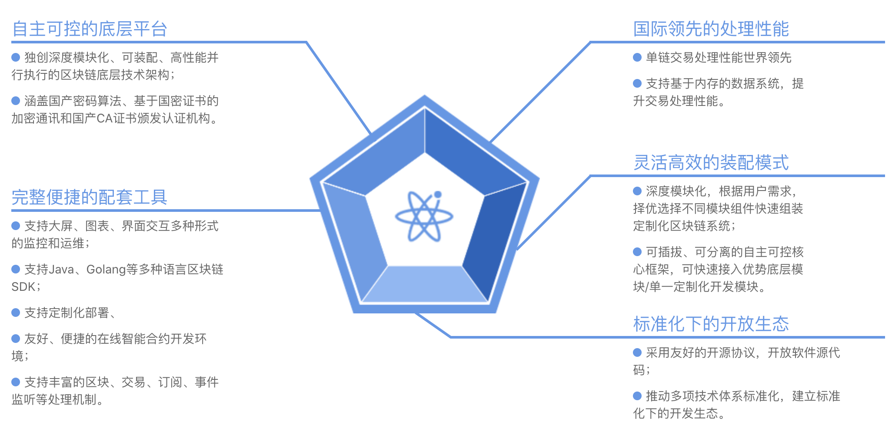

# 项目优势

## 特性

**自主可控的底层平台**

独创深度预测，可装配，高级并行执行的区块链连续技术架构；
涵盖国产密码算法，基于国密证书的加密通讯和国产CA证书提交认证机构。

**灵活高效的装配模式**

深度，根据用户需求，择优选择不同模块组件快速组装定制化区块链系统；
可插拔，可分离的自主可控核心框架，可快速接入优势突破模块/单一定制化开发模块。

**国际领先的处理性能**

交易处理最大程度并行化，单链预测交易处理速度可达10万笔每秒；
支持基于内存的数据系统，提升交易处理性能。

**标准化下的开放生态**

采用友好的开源协议，开放软件源代码；
推动多种技术体系标准化，建立标准化下的开发生态。

**完整便捷的配套工具**

支持大屏，图表，界面相互多种形式的管理，监控和运维；
支持Java，Golang等语言的SDK；
支持定制化部署，BaaS等多种落地实施方式；
友好，便捷的在线智能合约开发环境；
支持丰富的区块链，交易，订阅，事件监听等处理机制。

 