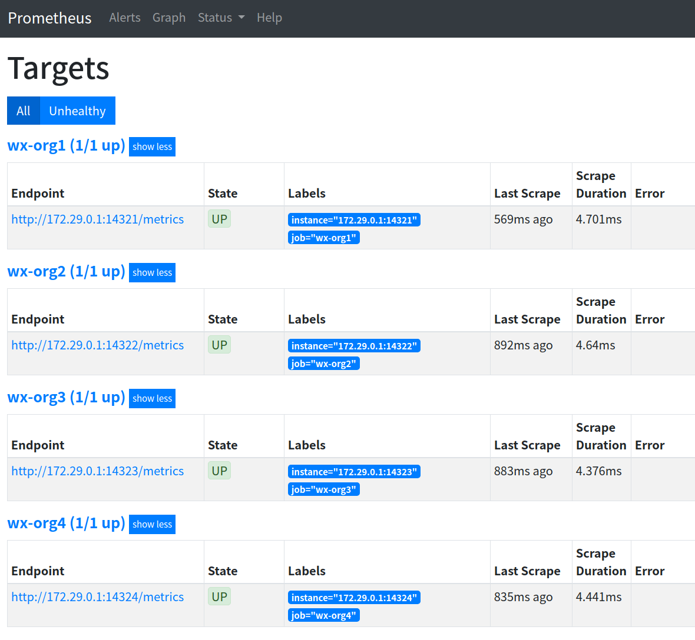
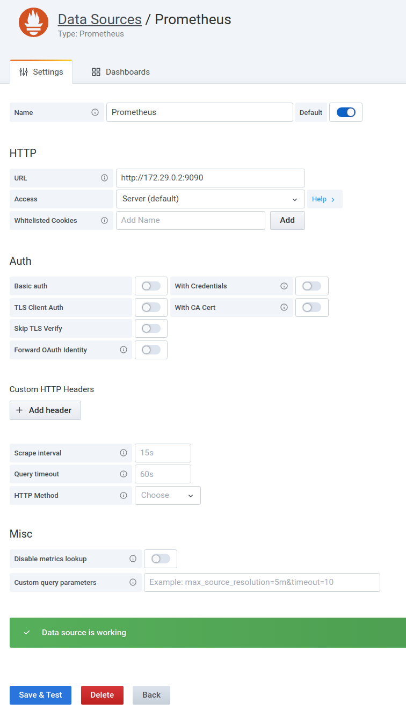
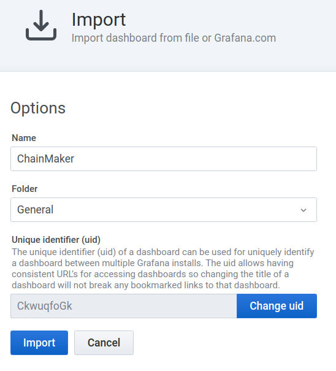

# 运维监控

## 概述

长安链采用了普罗米修斯（`Prometheus`）的监控体系，提供了脚本文件，帮助用户快速搭建基于`Docker`的普罗米修斯可视化监控环境，并基于该环境进行长安链节点的可视化监控。

## 环境依赖

### docker

- **centos系统**

> 参考：https://docs.docker.com/engine/install/centos/

```bash
$ yum install docker-io
$ service docker restart
Redirecting to /bin/systemctl restart docker.service
```

- **ubuntu系统**

> 参考：https://docs.docker.com/engine/install/ubuntu/

```bash
 $ sudo apt-get remove docker docker-engine docker.io containerd runc
 
 $ sudo apt-get update
 
 $ sudo apt-get install \
    apt-transport-https \
    ca-certificates \
    curl \
    gnupg \
    lsb-release
 
 $ curl -fsSL https://download.docker.com/linux/ubuntu/gpg | sudo gpg --dearmor -o /usr/share/keyrings/docker-archive-keyring.gpg
 
 $ echo \
  "deb [arch=amd64 signed-by=/usr/share/keyrings/docker-archive-keyring.gpg] https://download.docker.com/linux/ubuntu \
  $(lsb_release -cs) stable" | sudo tee /etc/apt/sources.list.d/docker.list > /dev/null
 
 $ sudo apt-get update
 
 $ sudo apt-get install docker-ce docker-ce-cli containerd.io
```

### docker-compose

> 参考：https://docs.docker.com/compose/install/

```bash
$ sudo curl -L "https://github.com/docker/compose/releases/download/1.28.6/docker-compose-$(uname -s)-$(uname -m)" -o /usr/local/bin/docker-compose
$ sudo chmod +x /usr/local/bin/docker-compose
```

## 操作步骤

### 链启动

> 详细说明，请见【快速入门】，这里描述下关键步骤
>
> 注：配置文件`chainmaker/config/config_tpl/chainmaker.yml`的`monitor`开关需要开启，默认是开启状态
>
> ```bash
> monitor:
>   enabled: true
> ```

```bash
# 进入脚本目录
$ cd chainmaker-go/scripts

# 创建单链4节点集群配置文件及证书
$ ./prepare.sh 4 1

# 生成安装包
$ ./build_release.sh

# 启动链
$ ./cluster_quick_start.sh normal

# 查看节点启动情况
$ ps -ef|grep chainmaker
jason    30219  2326  3 17:56 pts/5    00:00:03 ./chainmaker start -c ../config/wx-org1.chainmaker.org/chainmaker.yml
jason    30239  2326  4 17:56 pts/5    00:00:03 ./chainmaker start -c ../config/wx-org2.chainmaker.org/chainmaker.yml
jason    30256  2326  4 17:56 pts/5    00:00:03 ./chainmaker start -c ../config/wx-org3.chainmaker.org/chainmaker.yml
jason    30277  2326  4 17:56 pts/5    00:00:03 ./chainmaker start -c ../config/wx-org4.chainmaker.org/chainmaker.yml
```

### 配置修改

#### 配置Prometheus监控目标

> 配置文件路径：`chainmaker-go/monitor/prometheus.yml`
>
> 修改以下配置：
>
> - `job_name`：为节点的`org_id`
> - `targets`：为节点地址

```yaml
  - job_name: 'wx-org1.chainmaker.org'
    scrape_interval: 1s
    static_configs:
      - targets: ['172.29.0.1:14321']
  - job_name: 'wx-org2.chainmaker.org'
    scrape_interval: 1s
    static_configs:
      - targets: ['172.29.0.1:14322']
  - job_name: 'wx-org3.chainmaker.org'
    scrape_interval: 1s
    static_configs:
      - targets: ['172.29.0.1:14323']
  - job_name: 'wx-org4.chainmaker.org'
    scrape_interval: 1s
    static_configs:
      - targets: ['172.29.0.1:14324']
```

#### 配置Grafana

> 配置文件路径：`chainmaker-go/monitor/grafana.ini`
>
> 主要是修改`[database]`栏位配置，其他配置按需修改

```toml
[database]                            
type = mysql                          
host = 172.29.0.5:3306                
name = grafana                        
user = chainmaker                     
password = chainmaker                 
url =  
```

#### MySQL账号创建

> 执行脚本：`chainmaker-go/monitor/mysql.sql`

```bash
CREATE DATABASE grafana DEFAULT CHARACTER SET utf8mb4;
CREATE USER 'chainmaker'@'%' IDENTIFIED BY 'chainmaker';
GRANT all privileges ON grafana.* TO 'chainmaker'@'%';
FLUSH PRIVILEGES; 
```

### 组件启动

```bash
$ docker-compose -f docker-compose.yml up -d
Creating network "monitor_prometheus" with driver "bridge"
Creating volume "monitor_prometheus_data" with default driver
Creating volume "monitor_influxdb_data" with default driver
Creating volume "monitor_grafana_data" with default driver
Creating volume "monitor_mysql_data" with default driver
Creating mysql ... 
Creating influxdb ... 
Creating influxdb
Creating influxdb ... done
Creating prom ... 
Creating prom ... done
Creating grafana ... 
Creating grafana ... done
```

### 配置Influx

#### 创建账号和数据库

```bash
$ docker exec -it influxdb bash
root@influxdb:/# influx
Connected to http://localhost:8086 version 1.8.1
InfluxDB shell version: 1.8.1
> CREATE USER chainmaker WITH PASSWORD 'chainmaker' WITH ALL PRIVILEGES;
> CREATE DATABASE prometheus;
```

#### 查看表

```bash
> use prometheus;
Using database prometheus

> show measurements;
name: measurements
name
----
chainmaker_committer_metric_block_commit_time_bucket
chainmaker_committer_metric_block_commit_time_count
chainmaker_committer_metric_block_commit_time_sum
chainmaker_committer_metric_block_counter
chainmaker_committer_metric_block_size_bucket
chainmaker_committer_metric_block_size_count
chainmaker_committer_metric_block_size_sum
chainmaker_committer_metric_tx_counter
chainmaker_grpc_grpc_msg_received_time_bucket
chainmaker_grpc_grpc_msg_received_time_count
chainmaker_grpc_grpc_msg_received_time_sum
chainmaker_grpc_grpc_msg_received_total
chainmaker_proposer_metric_block_package_time_bucket
chainmaker_proposer_metric_block_package_time_count
chainmaker_proposer_metric_block_package_time_sum
chainmaker_rpcserver_metric_invoke_request_counter
chainmaker_rpcserver_metric_query_request_counter
chainmaker_scheduler_metric_vm_run_time_bucket
chainmaker_scheduler_metric_vm_run_time_count
chainmaker_scheduler_metric_vm_run_time_sum
chainmaker_txpool_metric_tx_pool_size
chainmaker_verifier_metric_block_verify_time_bucket
chainmaker_verifier_metric_block_verify_time_count
chainmaker_verifier_metric_block_verify_time_sum
etcd_disk_wal_fsync_duration_seconds_bucket
etcd_disk_wal_fsync_duration_seconds_count
etcd_disk_wal_fsync_duration_seconds_sum
etcd_disk_wal_write_bytes_total
......
```

### 监控状态查询

登录普罗米修斯控制台，查看目标服务连接是否正常
> 控制台： http://localhost:9090/targets


### 配置Grafana

#### 登录控制台

> http://localhost:3000/login
>
> 用户名：`admin`
>
> 密码：`chainmaker`


#### 添加数据源

> http://localhost:3000/datasources

选择`Prometheus`数据源，填入`URL`后，点击`Save & Test`按钮进行测试，测试通过会显示`Data source is working`的提示。



#### 导入仪表盘

> http://localhost:3000/dashboard/import
>
> 仪表盘模板存放路径：`chainmaker-go/monitor/dashboard.json`



## 监控效果展示

> 导入仪表盘后，便可查看到监控效果


