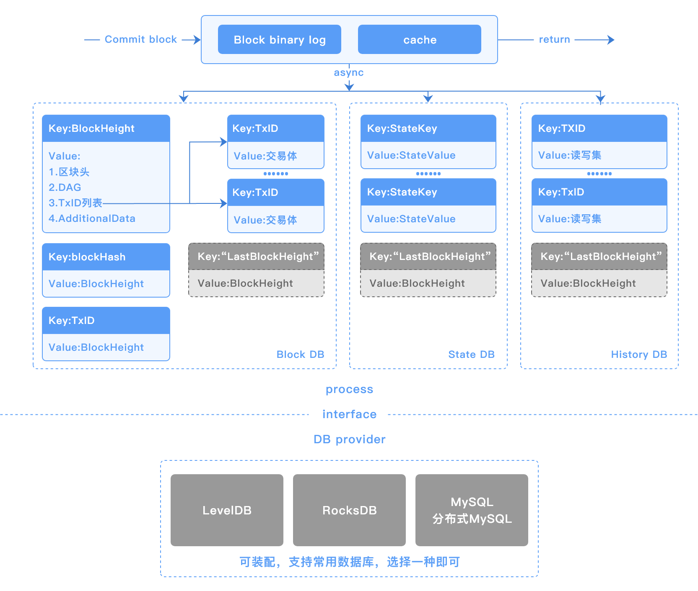

# 数据存储

##  概述

存储模块负责持久化存储链上的区块、交易、状态、历史读写集等账本数据，并对外提供上述数据的查询功能。区块链以区块为单位进行批量的数据提交，一次区块提交会涉及到多项账本数据的提交，比如：交易提交，状态数据修改等，所以存储模块需要维护账本数据的原子性。长安链支持常用的数据库来存储账本数据，如LevelDB、RocksDB、MySQL等数据库，业务可选择其中任意一种数据库来部署区块链。

账本数据主要分为3类：

1. 区块数据，记录区块元信息和交易数据：
   - 区块元数据包括：区块头、区块DAG、区块中交易的txid列表，additionalData等；
   - 交易数据，既序列化后的交易体，为了提供对单笔交易数据的查询，所以对交易数据进行了单独存储。
2. 状态数据，记录智能合约中读写的链上状态数据，既世界状态。
3. 历史读写集数据，长安链对每笔交易在执行过程中的所读写的状态数据集进行了单独保存，可用于后续追溯交易、状态数据的变迁过程。

## 存储模块运行逻辑

针对上述3类账本数据，长安链分别实现了3个DB类，分别是：Block DB、State DB、History DB。采用多个数据库之后，就需要维护数据库之间的数据一致性，避免仅有部分数据库提交后，发生程序中断而导致不同数据库间的数据不一致，因此，长安链引入了Block binary log组件来持久化存储区块的原始内容，用于重启过程中的数据恢复，类似于数据库中的预写式日志(wal)的功能。 



## 区块提交流程

1. 首先将序列化后的区块、读写集数据、以及最新的区块高度写入Block binary log，用于异常中断后的数据恢复。为了提高性能，加入一层cache，新区块提交请求在更新完Block binary log之后，再将区块数据写入cache，在更新完log和cache后，提交即可返回，由后台线程异步更新Block DB、State DB和History DB。
2. 在Block DB中记录区块元信息与交易信息，其中交易信息以TxID作为key存储，区块信息以BlockHeight作为key存储，区块元信息中只记录交易ID列表，同时索引BlockHash到BlockHeight的映射关系。Block DB中额外记录了当前最新的区块高度（LastBlockHeight）作为checkpoint，用以重启后的数据恢复。
3. 在State DB中保存state数据，key为合约名与对象主键的组合：<contractName, ObjectKey>，同时记录最新的区块高度（LastBlockHeight）作为checkpoint。
4. 在History DB中记录交易的读写集，读写集以TxID作为key，同时记录最新的区块高度（LastBlockHeight）作为checkpoint。

## 账本恢复流程

如果区块正在提交过程中，节点因异常退出，节点在下次启动时存储模块会进入恢复流程：

1. 分别从Block binary log、Block DB、State DB、History DB中获取最新的区块高度，以Block binary log中的区块高度作为基准高度，判断其他DB是否落后基准高度。
2. 如果有某个DB落后基准高度，则从Block bianry log中获取缺失的区块及读写集，依次提交到落后DB中。
3. 所有DB同步到基准高度后，存储模块启动完成，节点进入正常流程。

## 存储接口说明

```go
// BlockchainStore provides handle to store instances
type BlockchainStore interface {

	// PutBlock commits the block and the corresponding rwsets in an atomic operation
	PutBlock(block *pb.Block, txRWSets []*pb.TxRWSet) error

	// GetBlockByHash returns a block given it's hash, or returns nil if none exists.
	GetBlockByHash(blockHash []byte) (*pb.Block, error)

	// BlockExists returns true if the black hash exist, or returns false if none exists.
	BlockExists(blockHash []byte) (bool, error)

	// GetBlock returns a block given it's block height, or returns nil if none exists.
	GetBlock(height int64) (*pb.Block, error)

	// GetLastConfigBlock returns the last config block.
	GetLastConfigBlock() (*pb.Block, error)

	// GetBlockByTx returns a block which contains a tx.
	GetBlockByTx(txId string) (*pb.Block, error)

	// GetBlockWithRWSets returns a block and the corresponding rwsets given
	// it's block height, or returns nil if none exists.
	GetBlockWithRWSets(height int64) (*pb.BlockWithRWSet, error)

	// GetTx retrieves a transaction by txid, or returns nil if none exists.
	GetTx(txId string) (*pb.Transaction, error)

	// TxExists returns true if the tx exist, or returns false if none exists.
	TxExists(txId string) (bool, error)

	// GetTxConfirmedTime returns the confirmed time for given tx
	GetTxConfirmedTime(txId string) (int64, error)

	// GetLastBlock returns the last block.
	GetLastBlock() (*pb.Block, error)

	// ReadObject returns the state value for given contract name and key, or returns nil if  none exists.
	ReadObject(contractName string, key []byte) ([]byte, error)

	// SelectObject returns an iterator that contains all the key-values between given key ranges.
	// startKey is included in the results and limit is excluded.
	SelectObject(contractName string, startKey []byte, limit []byte) Iterator

	// GetTxRWSet returns an txRWSet for given txId, or returns nil if none exists.
	GetTxRWSet(txId string) (*pb.TxRWSet, error)

	// GetTxRWSetsByHeight returns all the rwsets corresponding to the block,
	// or returns nil if zhe block does not exist
	GetTxRWSetsByHeight(height int64) ([]*pb.TxRWSet, error)

	// GetDBHandle returns the database handle for given dbName
	GetDBHandle(dbName string) DBHandle

	// Close closes all the store db instances and releases any resources held by BlockchainStore
	Close() error
}
```

## 数据库

### 概述

存储模块中的Block DB、State DB、History DB等都是封装后的DB对象，其具体实现要基于特定的数据库引擎，比如LevelDB、RocksDB、MySQL等数据库引擎。为了实现可插拔的数据库引擎，长安链在数据库引擎之上封装了一层接口，并将LevelDB、RocksDB、MySQL等数据库封装成DB provider。用户可以根据业务需求选择合适的数据库引擎作为长安链的底层存储组件。

#### 支持的数据库类型

长安链目前支持3种数据库引擎可供选择，分别是LevelDB、RocksDB、MySQL。

- LevelDB，默认采用的数据库引擎，LevelDB作为一款嵌入式KV数据库，默认集成在长安链节点中，无需部署，性能也相对关系型数据要更好。
- RocksDB，作为LevelDB的增强版本，也是嵌入式KV数据库，性能比LevelDB更高，但是需要额外的编译与安装部署。
- MySQL，关系型数据库，支持schema和富查询，性能较KV数据库低，目前关系型数据库与区块链的状态数据并不能很好的结合，导致很少有区块链采用关系型数据库作为状态数据库。原因主要有两点：1.区块链需要对智能合约所读写的状态数据做严格的控制和校验，而SQL语句相对区块链来说过于灵活，难以控制；2.需要提前创建库表和索引，需要针对不同的智能合约创建不同的数据库表结构，不够灵活。目前长安链支持MySQL存储引擎，在系统数据如Block DB上支持区块元信息、交易信息的关系型语义，但状态数据库仅支持kv的方式，不支持智能合约以SQL的方式读写状态数据(world state)。

###  配置说明

节点本地配置文件chainmaker.yml中存储部分的配置说明

```yml
storage:
	provider: LevelDB	#数据库类型，支持LevelDB，RocksDB，MySQL或分布式MySQL
	store_path: ../data/ledgerData  #账本的存储路径， 包括LevelDB、RocksDB的数据目录，Block binary log的数据目录
	write_buffer_size: 4	#LevelDB、RocksDB的write_buffer_size， 单位为MB，默认为4M
	bloom_filter_bits: 10	#LevelDB、RocksDB的布隆过滤器参数，为每个key分配的额外bit空间，默认为10，如果少于或等于0，则不开启布隆过滤。
	disable_historydb: false	#是否禁用历史读写集的存储功能， 默认为false，也就是保存历史读写集。
	mysql:	#MySQL相关配置，只有provider选择MySQL时才需要配置，LevelDB和RocksDB可以忽略
		dsn: user:password@tcp(ip:port)/	#mysql的连接信息，包括用户名、密码、ip、port等，示例：root:admin@tcp(127.0.0.1:3306)/
		max_idle_conns: 10	#连接池中维持的最大的空闲连接数，默认为10
		max_open_conns: 10	#最大的可用连接数，默认为10
		conn_max_lifetime: 60	#连接维持的最长时间，单位秒，默认为60
```

### 安装说明

##### RocksDB安装部署

如果选用RocksDB作为存储数据库，需要在本地安装RocksDB的环境，详细安装过程参考文档：

[RocksDB安装部署](../tech/13、RocksDB安装部署.md)

##### MySQL数据库表

长安链支持选用MySQL作为账本存储引擎，节点启动会自动创建数据库，使用chainId作为数据库名，同时也会自动创建相应的表：

1. 区块元信息表

   ```sql
   CREATE TABLE `block_infos` (
    `chain_id` varchar(128) COLLATE utf8mb4_general_ci DEFAULT NULL COMMENT '链标识',
    `block_height` bigint(20) NOT NULL COMMENT '区块高度',
    `pre_block_hash` varbinary(128) DEFAULT NULL COMMENT '上个区块的散列值',
    `block_hash` varbinary(128) DEFAULT NULL COMMENT '本区块的散列值',
    `pre_conf_height` bigint(20) DEFAULT '0' COMMENT '上一次修改链配置的区块高度',
    `block_version` varbinary(128) DEFAULT NULL COMMENT '区块版本',
    `dag_hash` varbinary(128) DEFAULT NULL COMMENT '当前区块Dag的散列值',
    `rw_set_root` varbinary(128) DEFAULT NULL COMMENT '区块读写集的Merkle Root',
    `tx_root` varbinary(128) DEFAULT NULL COMMENT '区块交易的Merkle Root',
    `block_timestamp` bigint(20) DEFAULT '0' COMMENT '区块时间戳',
    `proposer` blob COMMENT '区块的生产者标识',
    `consensus_args` blob COMMENT '共识参数',
    `tx_count` bigint(20) DEFAULT '0' COMMENT '交易数量',
    `signature` blob COMMENT '区块生成者的签名',
    `dag` blob COMMENT '区块内交易的执行依赖顺序',
    `tx_ids` longtext COLLATE utf8mb4_general_ci COMMENT '区块中交易ID列表',
    `additional_data` longblob COMMENT '区块产生以后附加的数据',
    PRIMARY KEY (`block_height`),
    KEY `idx_hash` (`block_hash`)
   ) ENGINE=InnoDB DEFAULT CHARSET=utf8mb4 COLLATE=utf8mb4_general_ci;
   ```

2. 交易表

   ```sql
   CREATE TABLE `tx_infos` (
    `chain_id` varchar(128) COLLATE utf8mb4_general_ci DEFAULT NULL COMMENT '链标识',
    `sender` blob COMMENT '交易发送者信息',
    `tx_id` varchar(128) COLLATE utf8mb4_general_ci NOT NULL COMMENT '交易ID',
    `tx_type` int(11) DEFAULT NULL COMMENT '交易类型',
    `block_height` bigint(20) DEFAULT NULL COMMENT '交易所在区块高度',
    `offset` int(11) DEFAULT NULL COMMENT '交易在区块链中的位置',
    `timestamp` bigint(20) DEFAULT '0' COMMENT '链标识生成交易的unix时间戳',
    `expiration_time` bigint(20) DEFAULT '0' COMMENT '交易过期的unix时间戳',
    `request_payload` longblob COMMENT '交易的载荷数据',
    `request_signature` blob COMMENT '交易发送者的签名',
    `code` int(11) DEFAULT NULL COMMENT '交易执行结果的状态',
    `contract_result` longblob COMMENT '合约执行返回结果',
    `rw_set_hash` varbinary(128) DEFAULT NULL COMMENT '交易执行结果的读写集哈希',
    PRIMARY KEY (`tx_id`),
    KEY `idx_height_offset` (`block_height`,`offset`)
   ) ENGINE=InnoDB DEFAULT CHARSET=utf8mb4 COLLATE=utf8mb4_general_ci;
   ```

3. 世界状态表

   ```sql
   CREATE TABLE `state_infos` (
    `contract_name` varchar(128) COLLATE utf8mb4_general_ci NOT NULL COMMENT '合约名',
    `object_key` varbinary(128) NOT NULL DEFAULT '' COMMENT '状态数据的key',
    `object_value` longblob COMMENT '状态数据的value',
    `block_height` bigint(20) DEFAULT NULL COMMENT '该状态数据被修改时的区块高度',
    `updated_at` datetime(3) DEFAULT NULL COMMENT '该状态数据被修改时的节点本地时间',
    PRIMARY KEY (`contract_name`,`object_key`),
    KEY `idx_height` (`block_height`)
   ) ENGINE=InnoDB DEFAULT CHARSET=utf8mb4 COLLATE=utf8mb4_general_ci;
   ```

4. 历史读写集表

   ```sql
   CREATE TABLE `history_infos` (
    `tx_id` varchar(128) COLLATE utf8mb4_general_ci NOT NULL COMMENT '交易ID',
    `rw_sets` longblob COMMENT '读写集序列化后的数据', 
    `block_height` bigint(20) DEFAULT NULL COMMENT '该交易所在的区块高度',
    PRIMARY KEY (`tx_id`),
    KEY `idx_height` (`block_height`)
   ) ENGINE=InnoDB DEFAULT CHARSET=utf8mb4 COLLATE=utf8mb4_general_ci;
   ```
   
   

