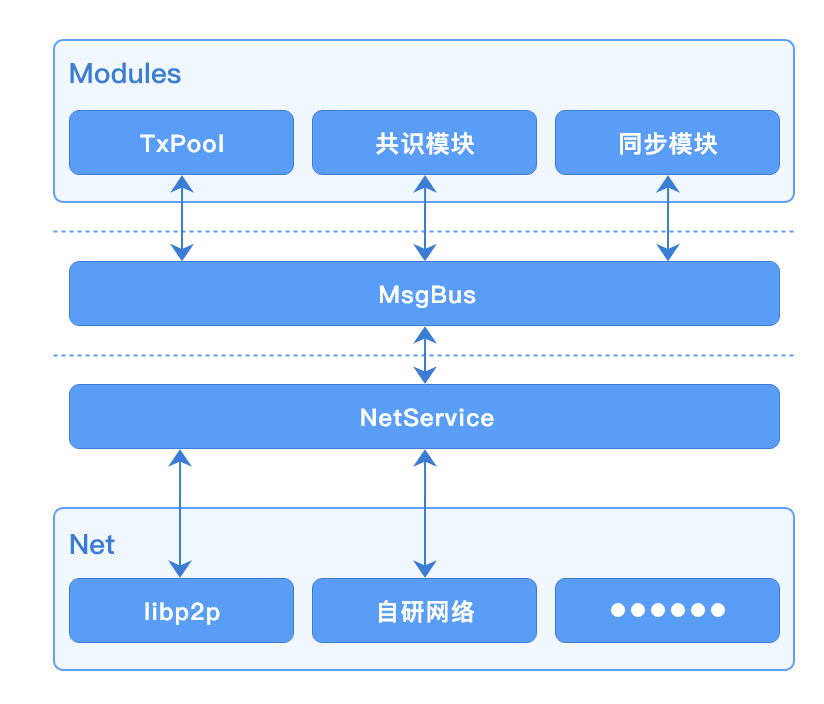

# P2P网络

##  概述

网络模块主要负责如下功能实现：

- 节点组网
- 具有安全保障的节点间数据通讯
- 节点网络身份认证
- 消息广播及订阅（pubsub）
- 扩展支持节点自动发现、自动组网
- 多链间网络消息数据隔离
- 复杂网络环境场景解决方案的支持

长安链1.0版本的网络模块是基于[libp2p](https://libp2p.io)的v0.6.4版本实现并改进的。节点的网络地址遵循libp2p地址格式协议；为了满足长安链网络消息在多链场景下的数据隔离需求，我们修改了libp2p-gossip-pubsub模块源码，加入节点白名单机制，精确控制路由表，并让节点上的每条链都独享一个独立的Pubsub服务，保证了广播数据只会在链内的节点传播的确定性；为了满足国密加密算法的支持，我们还修改了libp2p-core核心包，增加了对国密TLS证书的支持。

**基于libp2p的改进:**
- 核心包增加对国密SM算法的支持；
- libp2p-gossip-pubsub功能模块增加白名单功能，实现对Gossip路由表的控制，达到广播消息隔离效果；
- 引入StreamPool，实现stream复用提高性能、网络吞吐能力自动扩容等特性。

我们还有自研网络开发计划，在后续版本迭代中会逐渐加入我们自研的网络模块实现。

## 组网方式

长安链支持自动发现、自动连接的组网方式，默认在线的每个节点都可以作为种子节点为其他节点提供网络发现服务，每个种子节点都会记录网内节点地址信息。当有新节点连接到某个种子节点时，新节点会向该种子节点查询网内其他可连接节点的地址，拿到其他节点地址后，新节点会主动尝试与这些节点建立连接；另外，种子节点在接受了新节点链接后，会通过网络发现服务将该新节点的地址通知给其他在线的种子节点，其他节点在获得该新节点地址后，也会主动尝试与该新节点建立连接。

<br/>

长安链理论上可实现上万甚至更多节点同时在线组网。

#### 复杂网络环境场景支持

长安链可以针对复杂网络环境场景提供组网通讯解决方案，包括但不限于NAT穿透、代理节点转发等。

## 节点身份验证
- 节点身份是由组织CA签发的TLS证书确定，在节点入网时，会通过TLS握手协议校验TLS证书的合法性。
- 每个节点使用的TLS证书的必须保证唯一性，不可多节点共用一个TLS证书。
- 每个TLS证书都可对应生成一个NodeId唯一标识，该标识是节点网络地址的组成部分，是网络通讯环节重要的标识。

## 参数配置
网络模块的参数配置主要在chainmaker.yml（-c 启动参数指定的文件）配置文件中net标签下，具体参数如下：

```yaml
net:
  # 底层网络类型，必选项，目前只支持libp2p
  provider: LibP2P
  # 本地网路监听地址及端口，必选项
  listen_addr: /ip4/0.0.0.0/tcp/6666
  # 每个节点连接stream池大小上限，可选项，不配默认为100
  peer_stream_pool_size: 100
  # 允许与本节点建立链接的节点总数量，可选项，不配默认为20
  max_peer_count_allow: 10
  # 节点链接淘汰策略，可选项，1 Random, 2 FIFO, 3 LIFO。不配默认为3
  peer_elimination_strategy: 3
  # 种子节点地址列表，用于节点发现，可选项
  # 建议将所有已知共识节点网络地址都配置为种子节点
  seeds: 
    - "/ip4/127.0.0.1/tcp/6666/p2p/QmQZn3pZCcuEf34FSvucqkvVJEvfzpNjQTk17HS6CYMR35"
  # TLS认证相关配置
  tls:
    # TLS认证开关，必选项，当前必须为true
    enabled: true
    # TLS证书配置，必选项
    priv_key_file: ./crypto-config/wx-org1.chainmaker.org/node/consensus1/consensus1.tls.key
    cert_file:     ./crypto-config/wx-org1.chainmaker.org/node/consensus1/consensus1.tls.crt
  # 组网黑名单配置，可选项，不配默认不开启黑名单
  blacklist:
    # 黑名单地址，可选项，[ip]:[port]或者[ip]两者均可
    addresses:
      - "127.0.0.1:11305"
      - "192.168.1.8"
    # 黑名单节点ID，可选项
    node_ids:
      - "QmeyNRs2DwWjcHTpcVHoUSaDAAif4VQZ2wQDQAUNDP33gH"
      - "QmVSCXfPweL1GRSNt8gjcw1YQ2VcCirAtTdLKGkgGKsHqi"
```

在链初始化阶段，网络模块会将根据链配置（例如：bc1.xml）中的trust_roots配置的根证书创建TLS根证书池，在节点连接建立时，TLS握手阶段会依次使用每条链的TLS根证书池验证对方节点TLS证书，若认证通过则认为对方节点属于当前根证书池对应的链，确定链ID，并将对方节点ID加入到对应链的pubsub服务白名单中。这样就可以保证链内的广播消息不会发送给不属于该链组织的节点。

<br/>

在多链场景下，只需要保证每个链的trust_roots里都配有该节点TLS证书对应的CA或根证书即可，不需要额外的其他配置。

例如：

1.假设节点N有两个链分别是blockchain1、blockchain2；

2.假设节点N的TLS证书是由组织ID为“wx-org2.chainmaker.org”的CA证书签发；

3.假设blockchain1链的配置文件为bc1.xml，blockchain2链的配置文件为bc2.xml。

那么bc1.xml中trust_roots配置：
```yaml
trust_roots:
  - org_id: "wx-org1.chainmaker.org"
    root: "../config/wx-org1/certs/ca/wx-org1.chainmaker.org/ca.crt"
  - org_id: "wx-org2.chainmaker.org"
    root: "../config/wx-org2/certs/ca/wx-org2.chainmaker.org/ca.crt"
```

bc2.xml中trust_roots配置：
```yaml
trust_roots:
  - org_id: "wx-org2.chainmaker.org"
    root: "../config/wx-org2/certs/ca/wx-org2.chainmaker.org/ca.crt"
  - org_id: "wx-org3.chainmaker.org"
    root: "../config/wx-org3/certs/ca/wx-org3.chainmaker.org/ca.crt"
```

这样节点N就既属于blockchain1链也属于blockchain2链，但两个链间的数据是隔离的。

## 与其他模块交互

当前版本网络模块与其他模块交互都是异步的，都是通过MsgBus来进行数据互传，交互图如下：

<br>

##  接口说明
```go
package protocol

type ChainNodeInfo struct {
	NodeUid     string
	NodeAddress []string
	NodeTlsCert []byte
}

type MsgHandler func(from string, msg []byte, msgType net.NetMsg_MsgType) error

// ChainNodesInfoProvider provide base node info list of chain.
type ChainNodesInfoProvider interface {
	// GetChainNodesInfo return base node info list of chain.
	GetChainNodesInfo() ([]*ChainNodeInfo, error)
}

//  NetService
type NetService interface {
	// BroadcastMsg broadcast a msg to the net.
	BroadcastMsg(msg []byte, msgType net.NetMsg_MsgType) error
	// Subscribe register a MsgHandler for subscribe.
	Subscribe(msgType net.NetMsg_MsgType, handler MsgHandler) error
	// CancelSubscribe cancel subscribe.
	CancelSubscribe(msgType net.NetMsg_MsgType) error
	// ConsensusBroadcastMsg broadcast a msg to the consensus nodes.
	ConsensusBroadcastMsg(msg []byte, msgType net.NetMsg_MsgType) error
	// ConsensusSubscribe register a MsgHandler handle the msg from consensus nodes for subscribe.
	ConsensusSubscribe(msgType net.NetMsg_MsgType, handler MsgHandler) error
	// CancelConsensusSubscribe cancel subscribe.
	CancelConsensusSubscribe(msgType net.NetMsg_MsgType) error
	// SendMsg send msg to any nodes.
	SendMsg(msg []byte, msgType net.NetMsg_MsgType, to ...string) error
	// ReceiveMsg register a MsgHandler to handle the msg received from other node.
	ReceiveMsg(msgType net.NetMsg_MsgType, handler MsgHandler) error

	// Start the net service.
	Start() error

	// Stop the net service.
	Stop() error

	// GetNodeUidByCertId return node uid which mapped to the given cert id. If unmapped return error.
	GetNodeUidByCertId(certId string) (string, error)

	// GetChainNodesInfoProvider return a implementation of ChainNodesInfoProvider.
	GetChainNodesInfoProvider() ChainNodesInfoProvider
}
```

- `ChainNodeInfo` 是链上节点信息结构体，主要存储某个链上与本地节点建立连接的节点NodeID、网络地址、TLS证书等信息。
- `MsgHandler`    是网络消息处理器，当网络模块收到来自其他节点或订阅的消息时，会根据消息类型回调给不同的消息处理器去处理接收到的消息。
- `ChainNodesInfoProvider` 是链上节点信息Provider接口定义，主要用于给rpcServer或VM提供查询当前链已连接节点信息功能。
- `NetService` 是网络服务接口定义，主要用于为其他模块提供网络服务支持。
- `BroadcastMsg`方法，向链内广播一条消息，需要指定消息类型。
- `Subscribe`方法，注册一个用于处理指定消息类型的订阅消息处理器，与`BroadcastMsg`配合使用。
- `CancelSubscribe`方法，注销一个用于处理指定消息类型的订阅消息处理器。
- `ConsensusBroadcastMsg`方法，向链内共识节点广播一条消息，需要指定消息类型。该方法只会把消息发给共识节点，非共识节点收不到该方法广播的消息。
- `ConsensusSubscribe`方法，注册一个用于处理指定消息类型的只发给共识节点的订阅消息处理器，与`ConsensusBroadcastMsg`配合使用。
- `CancelConsensusSubscribe`方法，注销一个用于处理指定消息类型的只发给共识节点的订阅消息处理器。
- `SendMsg`方法，向指定节点直接发送网络消息。
- `ReceiveMsg`方法，注册一个用于处理其他节点直接发送过来的消息处理器。
- `Start`方法，启动网络服务。
- `Stop`方法，停止网络服务。
- `GetNodeUidByCertId`方法，根据证书ID查询使用该证书ID对应的TLS证书节点的NodeID。
- `GetChainNodesInfoProvider`方法，返回`ChainNodesInfoProvider`接口实现。

##  节点地址格式说明
长安链节点地址遵循libp2p网络地址格式协定，使用multaddr组件解析地址，例如：
```text
/ip4/127.0.0.1/tcp/6666/p2p/QmQZn3pZCcuEf34FSvucqkvVJEvfzpNjQTk17HS6CYMR35
```

或者

```text
/dns4/chainmaker.org/tcp/6666/p2p/QmQZn3pZCcuEf34FSvucqkvVJEvfzpNjQTk17HS6CYMR35
```
地址以"/"开始，并以"/"分段，大多数情况下，各段说明如下：
- 第一段：IP协议版本或DNS解析协议版本。ip4代表IPv4，ip6代表IPv6；dns4对应IPv4版本DNS服务，dns6对应IPv6版本DNS服务
- 第二段：IP地址或域名，需要与第一段对应
- 第三段：通讯网络协议，默认使用tcp
- 第四段：监听端口
- 第五段：固定协议，请勿改动，固定为"p2p"
- 第六段：节点NodeId，与TLS证书配套，根据TLS证书通过特定算法计算而来

以上只是最普通常用场景下节点地址举例，在复杂网络场景下（比如需要使用节点中继、NAT穿透等）地址格式会稍有不同。

##  网络消息数据格式说明（加密前）
加密前的消息数据是由 `8位byte表示数据长度 + 1位byte数据压缩标识 + 实际数据` 来组成。

为了方便说明，我们使用如下例子：
```text
[0 0 0 0 0 0 0 78 0 10 57 10 5 ...... 80 85 83 72]
```
假设这是一条待发送的网络消息数据，其中：
- 前8位，[0 0 0 0 0 0 0 78] 表示要发送数据的长度，在接收方接收数据时，若接收到的数据长度不足该值，则会尝试继续读取数据，直至接收全部长度的数据或接收失败。
- 第9位，[0] 或 [1] 是数据压缩标记位，若是1，接收方在接收到完整数据后，会将接收到的数据进行解压缩，得到最终的数据结果。
- 剩余位，[10 57 10 5 ...... 80 85 83 72] 为要发送的原始数据或被压缩后的原始数据，是否压缩要与第9位压缩标识相对应。压缩/解压缩使用GZip工具包完成。