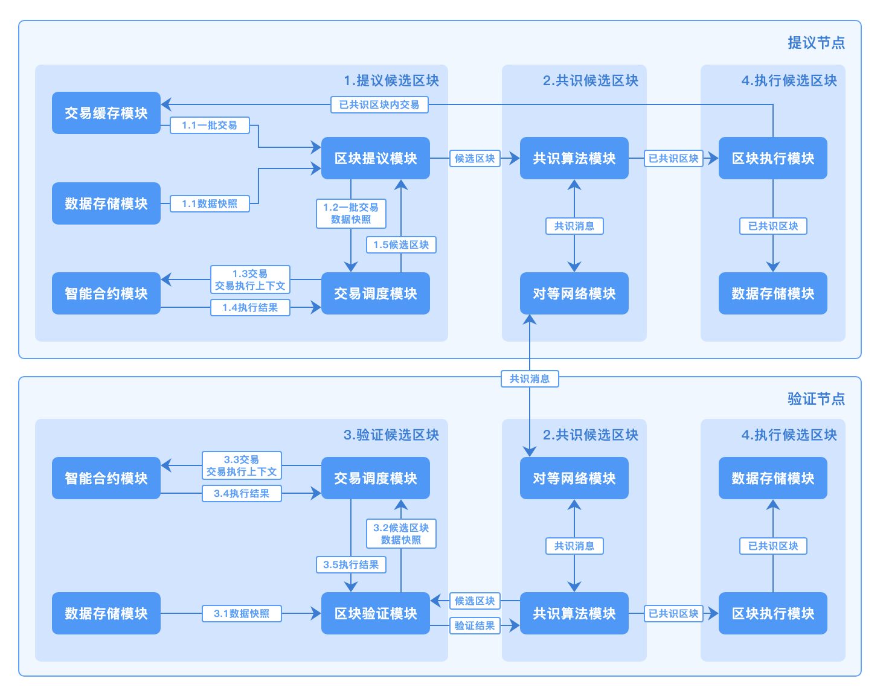

# 核心流程

长安链区块产生的核心流程如下图所示，主要包括：

1. 提议候选区块。区块提议节点从交易池选取一批交易，并行调度执行得到结果，生成DAG，并将区块和DAG广播。
2. 共识候选区块。基于链上的共识机制，对候选区块进行共识投票。
3. 验证候选区块。在共识过程中，网络中其他节点针对提议的候选区块进行正确性验证。
4. 执行候选区块。将完成共识投票的区块提交记录至账本，并从交易缓存中移除。

