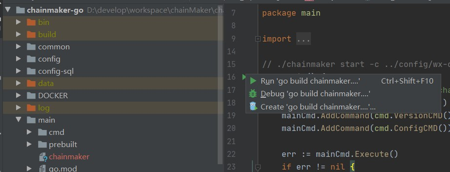
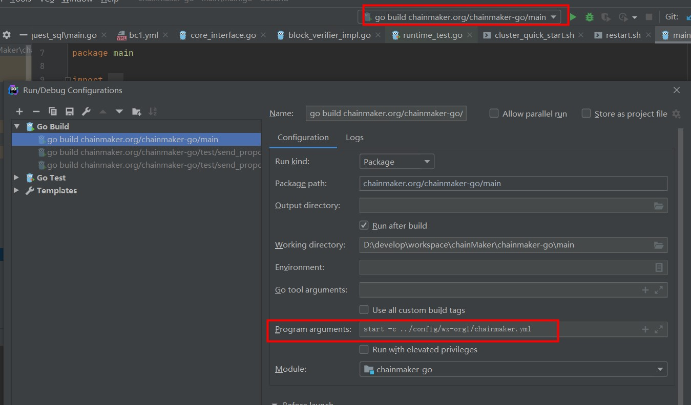
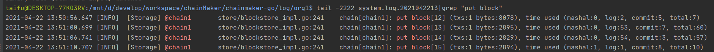
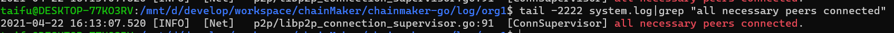
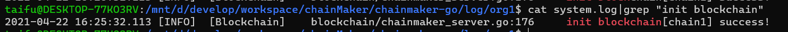

## 概述

通过本文你将可以搭建起长安链多节点集群，并使用命令行工具和SDK完成长安链功能的体验。

## 环境依赖

### 硬件依赖

| 配置 | 最低配置 | 推荐配置 |
| ---- | -------- | -------- |
| CPU  | 1.5GHz   | 2.4GHz   |
| 内存 | 4GB      | 8GB      |
| 核心 | 4核      | 8核      |
| 带宽 | 2Mb      | 10Mb     |

### 软件依赖

#### git

下载地址：[https://git-scm.com/downloads](https://git-scm.com/downloads)

安装步骤，请参看：[https://git-scm.com/book/en/v2/Getting-Started-Installing-Git](https://git-scm.com/book/en/v2/Getting-Started-Installing-Git)

#### golang

> 版本为1.15或以上


下载地址：[https://golang.org/dl/](https://golang.org/dl/)

安装步骤，请参看：[https://golang.org/doc/install](https://golang.org/doc/install)

#### docker

> 若不使用采用`docker`方式搭建集群，可以不安装

安装步骤，请参看：[https://docs.docker.com/engine/install/](https://docs.docker.com/engine/install/)

#### docker-compose

> 若不使用采用`docker`方式搭建集群，可以不安装

安装步骤，请参看：[https://docs.docker.com/compose/install/](https://docs.docker.com/compose/install/)

## 环境搭建

### 使用脚本搭建

> 适用于`Linux`、`MacOS`

#### 源码下载

从[长安链官网](https://www.chainmaker.org/)下载源码：[https://git.chainmaker.org.cn/chainmaker/chainmaker-go](https://git.chainmaker.org.cn/chainmaker/chainmaker-go)

> 当前为私有仓库，需要先进行账号注册

- 下载`chainmaker`源码到本地

```bash
$ git clone --recursive https://git.chainmaker.org.cn/chainmaker/chainmaker-go.git
```

- 下载证书生成工具源码到本地

```bash
$ git clone --recursive https://git.chainmaker.org.cn/chainmaker/chainmaker-cryptogen.git
```

#### 源码编译

- 编译证书生成工具

```bash
$ cd chainmaker-cryptogen
$ make
```

#### 证书及配置文件生成

- 将编译好的`chainmaker-cryptogen`，软连接或拷贝到`chainmaker-go/tools`目录

```bash
# 进入工具目录
$ cd chainmaker-go/tools

# 软连接chainmaker-cryptogen到tools目录下
$ ln -s ../../chainmaker-cryptogen/ .
```

- 进入`chainmaker-go/scripts`目录，执行`prepare.sh`脚本生成单链4节点集群配置，存于路径`chainmaker-go/build`中

  > `prepare.sh`脚本支持生成`solo`模式节点证书和配置，以及4/7/10/13/16节点的证书和配置

```bash
# 进入脚本目录
$ cd ../scripts

# 查看脚本帮助
$ ./prepare.sh -h
Usage:  
  prepare.sh node_cnt(1/4/7/10/13/16) chain_cnt(1-4) p2p_port_prefix(default:11300) rpc_port_prefix(default:12300)
    eg1: prepare.sh 4 1
    eg2: prepare.sh 4 1 11300 12300

# 生成单链4节点集群的证书和配置
$ ./prepare.sh 4 1
begin check params...
begin generate certs, cnt: 4
input consensus type(default 1/tbft): 
input log level(default INFO): 
begin generate node1 config...
begin generate node2 config...
begin generate node3 config...
begin generate node4 config...

# 查看生成好的节点证书和配置
$ tree -L 3 ../build/
../build/
├── config
│   ├── node1
│   │   ├── certs
│   │   ├── chainconfig
│   │   ├── chainmaker.yml
│   │   └── log.yml
│   ├── node2
│   │   ├── certs
│   │   ├── chainconfig
│   │   ├── chainmaker.yml
│   │   └── log.yml
│   ├── node3
│   │   ├── certs
│   │   ├── chainconfig
│   │   ├── chainmaker.yml
│   │   └── log.yml
│   └── node4
│       ├── certs
│       ├── chainconfig
│       ├── chainmaker.yml
│       └── log.yml
├── crypto-config
│   ├── wx-org1.chainmaker.org
│   │   ├── ca
│   │   ├── node
│   │   └── user
│   ├── wx-org2.chainmaker.org
│   │   ├── ca
│   │   ├── node
│   │   └── user
│   ├── wx-org3.chainmaker.org
│   │   ├── ca
│   │   ├── node
│   │   └── user
│   └── wx-org4.chainmaker.org
│       ├── ca
│       ├── node
│       └── user
└── crypto_config.yml
```

- 关于自动生成的端口说明

通过`prepare.sh`脚本生成的配置，默认是在单台服务器上部署，故自动生成的端口号，是从一个起始端口号开始依次递增，可以通过命令行参数修改起始端口号。

主要有2个端口，`p2p`端口（用于节点互联）和`rpc`端口（用于客户端与节点通信），`p2p`起始端口为`11301`，`rpc`起始端口为`12301`。

如果生成4个节点的配置，`p2p`端口分别为：`11301、11302、11303、11304`，`rpc`端口分别为：`12301、12302、12303、12304`

如果是在多机部署，希望生成固定的端口号，请参考：[【多机部署】](../operation/多机部署)

#### 编译及安装包制作

- 执行`build_release.sh`脚本，将编译`chainmaker-go`模块，并打包生成安装，存于路径`chainmaker-go/build/release`中

```bash
$ ./build_release.sh
$ tree ../build/release/
../build/release/
├── chainmaker-V1.0.0-wx-org1.chainmaker.org-20210406194833-x86_64.tar.gz
├── chainmaker-V1.0.0-wx-org2.chainmaker.org-20210406194833-x86_64.tar.gz
├── chainmaker-V1.0.0-wx-org3.chainmaker.org-20210406194833-x86_64.tar.gz
├── chainmaker-V1.0.0-wx-org4.chainmaker.org-20210406194833-x86_64.tar.gz
└── crypto-config-20210406194833.tar.gz
```

#### 启动节点集群

- 执行`cluster_quick_start.sh`脚本，会解压各个安装包，调用`bin`目录中的`start.sh`脚本，启动`chainmaker`节点

```bash
$ ./cluster_quick_start.sh normal
```

> 若需要关闭集群，使用脚本：
>
> ```bash
> $ ./cluster_quick_stop.sh
> ```

#### 查看节点启动使用正常

- 查看进程是否存在

```bash
$ ps -ef|grep chainmaker | grep -v grep
jason    25261  2146  4 19:55 pts/20   00:00:01 ./chainmaker start -c ../config/wx-org1.chainmaker.org/chainmaker.yml
jason    25286  2146  4 19:55 pts/20   00:00:01 ./chainmaker start -c ../config/wx-org2.chainmaker.org/chainmaker.yml
jason    25309  2146  4 19:55 pts/20   00:00:01 ./chainmaker start -c ../config/wx-org3.chainmaker.org/chainmaker.yml
jason    25335  2146  4 19:55 pts/20   00:00:01 ./chainmaker start -c ../config/wx-org4.chainmaker.org/chainmaker.yml
```

- 查看端口是否监听

```bash
$ netstat -lptn | grep 1230
tcp6       0      0 :::12301                :::*                    LISTEN      25261/./chainmaker  
tcp6       0      0 :::12302                :::*                    LISTEN      25286/./chainmaker  
tcp6       0      0 :::12303                :::*                    LISTEN      25309/./chainmaker  
tcp6       0      0 :::12304                :::*                    LISTEN      25335/./chainmaker 
```

- 检查节点是否有`ERROR`日志

```bash
$ cat ../build/release/chainmaker-V1.0.0-wx-org1.chainmaker.org/bin/panic.log
$ tail -f ../build/release/chainmaker-V1.0.0-wx-org1.chainmaker.org/log/system.log
$ tail -f ../build/release/chainmaker-V1.0.0-wx-org1.chainmaker.org/log/system.log|grep "ERROR\|put block\|all necessary"
```

### 使用Docker搭建

> 适用于`Docker`

#### 编译docker镜像

```bash
$ cd chainmaker-go
# 生成镜像名称为：chainmaker:v1.0.0_r，如需要修改版本，请修改Makefile文件
$ make docker-build
```

#### 启停solo节点

> 为了方便使用，使用的配置文件及证书已放置于目录：`chainmaker-go/scripts/docker/config/solo`
>
> 如镜像名称有调整，请修改`solo.docker-compose.yml`文件

```bash
$ cd chainmaker-go/scripts/docker/
# 启动solo节点
$ ./solo_up.sh 
# 关闭solo节点
$ ./solo_down.sh
```

#### 启停4节点集群

> 为了方便使用，使用的配置文件及证书已放置于目录：`chainmaker-go/scripts/docker/config/four-nodes`
>
> 如镜像名称有调整，请修改`four-nodes.docker-compose.yml`文件

```bash
$ cd chainmaker-go/scripts/docker/
# 启动4节点集群
$ ./four-nodes_up.sh 
# 关闭4节点集群
$ ./four-nodes_down.sh
```

## 功能验证

为了验证所搭建的链功能是否正常，可以通过`cmc`命令行工具或`sdk`的单元测试用例来进行验证。

### cmc命令行工具验证

请参看：[【命令行工具】](../dev/命令行工具.md)

### go sdk验证

#### 下载go sdk源码

```bash
$ git clone --recursive https://git.chainmaker.org.cn/chainmaker/chainmaker-sdk-go.git
```

#### 关联证书

> 将通过`prepare.sh`工具生成的`crypto-config`目录，软连接到`chainmaker-sdk-go/testdata`目录

```bash
$ cd chainmaker-sdk-go/testdata

# 这里我们使用新生成的用户证书，请先将testdata已有的crypto-config移除
$ /bin/rm -rf crypto-config
$ ln -s ../../chainmaker-go/build/crypto-config/ .
```

#### 配置修改

> 修改sdk单元测试使用的配置文件：`chainmaker-sdk-go/testdata/sdk_config.yml`

根据需要修改节点地址：

```yml
    nodes:
      - # 节点地址，格式为：IP:端口:连接数
        node_addr: "127.0.0.1:12301"
```

如果证书路径有调整，修改对应的证书路径配置：

```yml
    # 客户端用户私钥路径
    user_key_file_path: "./testdata/crypto-config/wx-org1.chainmaker.org/user/client1/client1.tls.key
    # 客户端用户证书路径
    user_crt_file_path: "./testdata/crypto-config/wx-org1.chainmaker.org/user/client1/client1.tls.crt"
    # 客户端用户交易签名私钥路径(若未设置，将使用user_key_file_path)
    user_sign_key_file_path: "./testdata/crypto-config/wx-org1.chainmaker.org/user/client1/client1.sign.key"
    # 客户端用户交易签名证书路径(若未设置，将使用user_crt_file_path)
    user_sign_crt_file_path: "./testdata/crypto-config/wx-org1.chainmaker.org/user/client1/client1.sign.crt"
```

#### 执行存证合约单测

该单测会进行存证合约的部署、调用和查询。

```bash
$ cd chainmaker-sdk-go
$ go test -v -run UserContractClaim
```

看到类似输出，说明功能验证成功：

```bash
2021-04-07 21:45:25.510	[DEBUG]	[SDK]	chainmaker-sdk-go/sdk_client.go:343	[SDK] proposalRequest resp: message:"SUCCESS" contract_result:<result:"{\"file_hash\":\"9387687162f344b79b39385c5e998f97\",\"file_name\":\"file_1617803123443\",\"time\":\"1617803123443\"}" gas_used:25145486 > 
```

#### 执行资产合约单测

也可以跑资产合约的单测，该单测会创建A、B两个账号，每个账号初始资产为100000，A给B转账100，最后查看A和B的余额，分别为`99900`和`100100`。

```bash
$ go test -v -run UserContractAsset
```

看到类似输出，说明资产合约功能验证成功：

```bash
2021-04-07 21:46:30.439	[DEBUG]	[SDK]	chainmaker-sdk-go/sdk_client.go:343	[SDK] proposalRequest resp: message:"SUCCESS" contract_result:<result:"99900" gas_used:16058023 > 

2021-04-07 21:46:30.448	[DEBUG]	[SDK]	chainmaker-sdk-go/sdk_client.go:343	[SDK] proposalRequest resp: message:"SUCCESS" contract_result:<result:"100100" gas_used:16120471 >
```


## 开发-goland启动链

### 下载安装goland

略

### 下载安装go

#### 安装go

略

#### 设置代理

打开终端执行

```sh
go env -w  GOPROXY=https://goproxy.io,direct
```


### 下载源码

```sh
git clone --recurse-submodules git@git.code.tencent.com:ChainMaker/chainmaker-go.git
```


### 启动goland

#### 导入chainmaker-go

略

#### 配置goland

Ctrl+Alt+S 或者 File->Settings...

Go-->Go Modules --> 勾上Enable Go Modules integration

Go-->GOROOT-->添加已安装的go


####  启动项目（SOLO模式）

- 修改配置文件

chainmaker-go/config/wx-org1/chainconfig/bc1.yml将 consensus.type修改为0：启用solo共识

chainmaker-go/config/wx-org1/log.yml将 log_in_console修改为true：在控制台输出日志


- 启动

找到文件 chainmaker-go/main/main.go 直接运行，然后点击停止，修改启动参数为`start -c ../config/wx-org1/chainmaker.yml`再次点击运行即可；见下图：








#### 测试

找到文件`chainmaker-go/test/send_proposal_request_solo/main.go`直接运行main即可

若遇到文件未找到等错误，请将goland 的配置： working directory修改为当前目录，或者手动修改文件目录


## 常见问题

### 视频教程

时间脚本:

• 01-04分钟：长安链简介及大纲介绍；

• 04-09分钟：环境安装演示；

• 09-26分钟：单机部署；

• 26-36分钟：智能合约开发（穿插常见问题）；

• 36-54分钟：部署合约（穿插常见问题）；

• 54---结束：常见问题及单机&多级部署对照表。

<a href="https://mp.weixin.qq.com/s/zGV320UDlGVVw1tTJcOsQQ" target="_blank" title="点击跳转至播放页面" ></a>

<!--
<iframe 
    width="100%" 
    height="450" 
    src="http://mpvideo.qpic.cn/0bf2zyaecaaalianjimylbqfbtwdihhaaqia.f10002.mp4?dis_k=2e34203a3e5cc39388748cf49c2b68ef&dis_t=1620901511&spec_id=Mzg4NzU2NjYwMA%3D%3D1620901511&vid=wxv_1862610372268965888&format_id=10002" 
    scrolling="no" 
    border="0" 
    frameborder="no" 
    framespacing="0" 
    allowfullscreen="true">
</iframe>
-->

### 编译时错误

#### missing go.sum entry

**Q：** 

如果执行 ./build_release.sh 时 或者在启动时 报错：misssing go.sum entry: to add it，分别在 chainmaker-go/main 或者 chainmaker-go/common  和 chainmaker-go/tools/cmc 下执行 go mod download ，执行完后 再重试

  问题描述如下图：


**A：**

进入对应目录执行`go mod download`

```sh
cd  chainmaker-go/main
go mod download

cd  chainmaker-go/common
go mod download

cd  chainmaker-go/tools/cmc
go mod download
```

#### go.mod no such file or directory

**Q:**

编译时报错：

> go: chainmaker.org/chainmaker-go/blockchain@v0.0.0 requires
>         chainmaker.org/chainmaker-go/common@v0.0.0: parsing ../common/go.mod: open /mnt/d/develop/workspace/go/noSubmodule/chainmaker-go/common/go.mod: no such file or directory

**A:**

一、可能是因为clone是未使用submodule模式，需初始化submodule，如下命令

```sh
git submodule init
git submodule update
```

正确的clone方式：

```sh
git clone --recursive https://git.chainmaker.org.cn/chainmaker/chainmaker-go.git
```


### 启动时错误

#### not found GLIBC_2.18

**Q:**

若出现错误`./chainmaker: /lib64/libc.so.6: version `GLIBC_2.18' not found (required by /root/git-code/chainmaker-go/module/vm/wasmer/wasmer-go/libwasmer.so)`

**A:**

在linux下可进入chainmaker-go/scripts/3rd目录安装glibc-2.18.tar.gz依赖

```sh
# 注：此操作为安装替换GCC版本，请慎重操作。一旦出错系统将不可用。
cd scripts/3rd
sh install.sh
```


#### restart.sh 权限不足

**Q:**

[root@localhost scripts]# ./cluster_quick_start.sh normal ===> Staring chainmaker cluster START ==> /home/wx/chainmaker/chainmaker-go/build/release/chainmaker-V1.0.0-wx-org1.chainmaker.org ./cluster_quick_start.sh: line 51: ./restart.sh: Permission denied

**A:**

如果启动时 出现restart.sh 权限不足问题，给restart.sh 增加执行权限

给项目源文件添加执行权限

```sh
cd chainmaker-go/script/bin
chmod +x *.sh
```

给部署文件添加执行权限

```sh
# 进入四个节点的bin目录下 执行下面命令(以第一个节点 org1 为例)
cd chainmaker-go/build/release/chainmaker-V1.0.0-wx-org1.chainmaker.org/bin
chmod +x *.sh
```


### 运行时错误

#### syscall/js.valueGet not exported

**Q:**

执行gasm合约时报错：resolve imports: syscall/js.valueGet not exported in module env

**A:** 

tinygo不支持fmt等函数

#### runtime type error

**Q:**

发送交易成功，但链打印错误信息：contract invoke failed, runtime type error, expect rust:[2], but got 4。同时根据该交易id查询到交易错误信息。

**A:**

执行交易时异步的（查询类交易除外），返回的状态为链成功接收到交易的状态。执行合约是，runtimeType选择错误，需要根据自己的合约语言选择对应的runtimeType

| 语言     | 类型                   |
| -------- | ---------------------- |
| 系统合约 | RuntimeType_NATIVE = 1 |
| rust     | RuntimeType_WASMER = 2 |
| c++      | RuntimeType_WXVM = 3   |
| tinygo   | RuntimeType_GASM = 4   |
| solidity | RuntimeType_EVM = 5    |
|          |                        |

#### 返回成功，但实际执行失败

**Q:**

使用sdk执行安装、调用合约时，SDK 返回message为ok，但链和交易显示执行失败

**A:**

交易的执行是异步的。SDK返回的成功信息指的是链成功接收到该交易。

获取查看交易实际结果的方式：

- 根据txId查询该交易，解析出结果。
- 使用SDK是选择同步发送交易，等待执行结果。


### 其他关键信息

#### 出块标记是什么

> 进入log目录，查看日志文件 筛选 `put block`即可
>
>  `cat system.log|grep "ERROR\|put block"`
>
> 其中一行解释如下：
>
> 2021-04-22 13:50:56.647 [INFO]  [Storage] @chain1       store/blockstore_impl.go:241    chain[chain1]: put block[12] (txs:1 bytes:8078), time used (mashal:0, log:2, commit:5, total:7)
>
> 时间 [日志级别] [模块] @链名称 文件名.go:行数 链chain[链名称]:put block\[区块高度\](txs:交易个数 bytes:区块大小), 使用时间毫秒(mashal:0, log:2, commit:5, total:7)




#### 组网成功标记是什么

组网成功后，即可发送交易。此时接收到的交易将进入到交易池当中，并且会广播给网络的每一个节点（共识、见证节点、轻节点），随后等待共识成功选举leader开始打包区块。

**SOLO共识**

> start blockchain[chain1] success

**其他共识**

> 进入log目录，查看日志文件 筛选 `all necessary peers connected`和`start blockchain[chain1] success`可看到如下日志
>
> `cat system.log|grep "init blockchain\|all necessary peers connected"`
>
> 2021-04-22 16:13:07.520 [INFO]  [Net]   p2p/libp2p_connection_supervisor.go:91  [ConnSupervisor] all necessary peers connected.
>
> 





<br><br>


