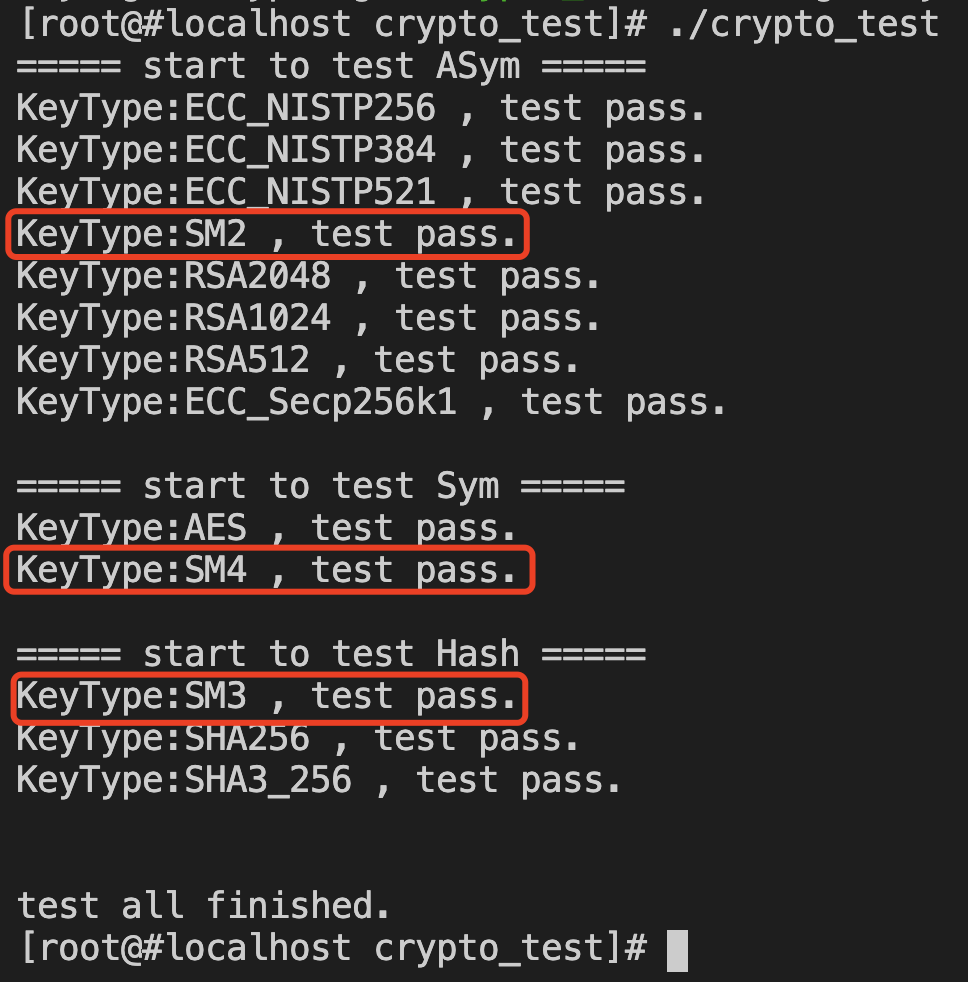

[TOC]

# 微芯区块链委托测试归档

## 21 系统部署和启动方式

1. 使用错误的配置文件启动系统，启动失败

   将配置文件(chainmaker.yml)的rpc证书配置成不存在的路径，启动失败

2. 使用正确的配置文件启动系统，启动成功

   将配置文件(chainmaker.yml)的rpc证书配置正确，启动成功

## 1 组网方式

ChainMaker支持四个或四个以上个数的共识节点进行组网，节点之间组网采用P2P协议进行。

chainconfig配置文件中共识节点配置如下：


chainmaker.yml配置文件中网络配置如下：


启动时查看组网日志如下：

cat system.log.* | grep "Host\|ConnSupervisor"


## 2 通讯机制

节点之间通讯是通过P2P网络，支持TLS。

### 2.1 节点间通信机制

使用tcpdump抓包并安装钱包合约

```sh
tcpdump -A -s0 -nn -i eno1 -w tls.pcap
./cmc client contract user create --admin-key-file-paths=../sdk/testdata/crypto-config/wx-org1.chainmaker.org/user/admin1/admin1.tls.key --admin-crt-file-paths=../sdk/testdata/crypto-config/wx-org1.chainmaker.org/user/admin1/admin1.tls.crt  --org-id=wx-org1.chainmaker.org --client-crt-file-paths=../sdk/testdata/crypto-config/wx-org1.chainmaker.org/user/client1/client1.tls.crt --client-key-file-paths=../sdk/testdata/crypto-config/wx-org1.chainmaker.org/user/client1/client1.tls.key --byte-code-path=../../test/wasm/asset-rust-0.7.2.wasm --contract-name=asset_new2_111 --runtime-type=WASMER --sdk-conf-path=../sdk/testdata/sdk_config_bc2_node7.yml --version=1.0 --sync-result=true --params="{\"issue_limit\":\"1000\",\"total_supply\":\"100000000\"}"
```

用wireshark分析：


### 2.2 客户端SDK与服务端通讯使用RPC协议，支持TLS。

使用tcpdump抓包并安装钱包合约

```sh
tcpdump -A -s0 -nn -i lo -w tls.pcap

./cmc client contract user create --admin-key-file-paths=../sdk/testdata/crypto-config/wx-org1.chainmaker.org/user/admin1/admin1.tls.key --admin-crt-file-paths=../sdk/testdata/crypto-config/wx-org1.chainmaker.org/user/admin1/admin1.tls.crt  --org-id=wx-org1.chainmaker.org --client-crt-file-paths=../sdk/testdata/crypto-config/wx-org1.chainmaker.org/user/client1/client1.tls.crt --client-key-file-paths=../sdk/testdata/crypto-config/wx-org1.chainmaker.org/user/client1/client1.tls.key --byte-code-path=../../test/wasm/asset-rust-0.7.2.wasm --contract-name=asset_new2_111 --runtime-type=WASMER --sdk-conf-path=../sdk/testdata/sdk_config_bc2_node7.yml --version=1.0 --sync-result=true --params="{\"issue_limit\":\"1000\",\"total_supply\":\"100000000\"}"
```

用wireshark分析


## 3 区块结构

在源码chainmaker-go/pb/common中定义了区块结构如下:

block.proto


transaction.proto


rwset.proto


## 4 链上数据存储方式

链上数据存储在nosql数据库中，较常用的有leveldb和rocksdb。链上数据存储的路径可以在配置文件里指定，在存储目录下会根据链id建立二级目录，同一条链的链上数据存放在同一个二级目录下。

chainmaker.yml配置文件中存储的配置如下图：


在启动后进入存储目录，查看文件如下图：


## 6 数据传输方式

### 6.1 传输加密数据，使用TLS方式

节点之间通讯是通过P2P网络，支持TLS。参考测试项2.1

客户端SDK与服务端通讯是RPC，支持TLS。参考测试项2.2

###  6.2 数据传输压缩编码方案

数据传输使用protobuf进行编码，示例原始数据编码：

编码后输出结果：


## 9 加密算法的种类

### 9.1 对称加密

AES

SM4

### 9.2 非对称加密

RSA512

RSA1024

RSA2048

SM2

ECC_Secp256k1

ECC_NISTP256

ECC_NISTP384

ECC_NISTP521

### 9.3 哈希算法：

SHA256

SHA3_256

SM3

进入目录chainmaker-go/test/crypto_test

执行

go build

./crypto_test -step=1

运行结果：



红框标识为国密算法支持

## 10 国密算法支持能力*

见加密算法种类测试结果。

## 19 智能合约的编译检测*


## 29 分布式存储功能

ChainMaker支持使用分布式MySQL来存储账本数据，账本数据分为以下几个部分：


1. Block binary log, 提交区块时首先在节点本地磁盘持久化binary log, 用于保存序列化后的区块、读写集等数据，用于异常中断后的数据恢复。
2. cache, 区块的binary日志落盘后，将区块中区块元信息、交易、state等数据更新到cache，在异步将账本数据存入db，db支持leveldb和分布式MySQL。
3. BlockDB, 用于存储区块元信息和交易数据，在分布式数据库中，需要为数据指定分片key，区块元信息以区块高度作为分片key，交易数据以txid为分片 key。
4. StateDB，用于存储区块链的世界状态，分片key为合约名+stateKey的组合。
5. HistroyDB，用于存区块中的历史读写集，以txid作为分片key。

当BlockDB, StateDB, HistoryDB中的数据都落盘后，可以定期清理节点本地的Block binary log。

分布式账本存储的架构示意图如下图，数据可以分为多个分片, 图中用set表示，每个set可以设置一主多备，账本数据按分片key均摊到多个分片上，由数据库的proxy负责定位具体的数据。


## 30 隐私保护功能*

1. 启动7节点双链

2. 查看链之间账本隔离，两条链分开存储，如图：

   

## 37 基于软件方案的私钥管理  待确定

#### 软件私钥管理：

#### 客户端：TLS和用户私钥用不同口令来读取，服务分开部署（KMS）

#### 服务端：TLS和用户私钥用不同口令来读取，服务分开部署（KMS）
