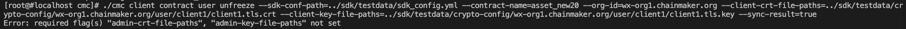

## 16 智能合约的全生命周期管理

ChainMaker的智能合约支持C++、go和Rust三种语言。运行C++和Rust的智能合约的虚拟机环境为wasmer，运行go语言的智能合约虚拟机环境为gasm。

1. 启动7节点双链，其中chain1有5节点，chain2有7节点

2. 安装钱包合约，并默认注册用户A

   ```sh
   ./cmc client contract user create --admin-key-file-paths=../sdk/testdata/crypto-config/wx-org1.chainmaker.org/user/admin1/admin1.tls.key --admin-crt-file-paths=../sdk/testdata/crypto-config/wx-org1.chainmaker.org/user/admin1/admin1.tls.crt  --org-id=wx-org1.chainmaker.org --client-crt-file-paths=../sdk/testdata/crypto-config/wx-org1.chainmaker.org/user/client1/client1.tls.crt --client-key-file-paths=../sdk/testdata/crypto-config/wx-org1.chainmaker.org/user/client1/client1.tls.key --byte-code-path=../../test/wasm/asset-rust-0.7.2.wasm --contract-name=asset_new16 --runtime-type=WASMER --sdk-conf-path=../sdk/testdata/sdk_config.yml --version=1.0 --sync-result=true --params="{\"issue_limit\":\"1000\",\"total_supply\":\"100000000\"}"
   ```

3. 注册用户B

   ```sh
   ./cmc client contract user invoke  --contract-name=asset_new16 --method=register --org-id=wx-org2.chainmaker.org --client-crt-file-paths=../sdk/testdata/crypto-config/wx-org2.chainmaker.org/user/client1/client1.tls.crt --client-key-file-paths=../sdk/testdata/crypto-config/wx-org2.chainmaker.org/user/client1/client1.tls.key --sdk-conf-path=../sdk/testdata/sdk_config.yml --sync-result=true
   ```

4. 查询用户A和B的账户地址

   ```sh
   ./cmc client contract user get  --contract-name=asset_new16 --method=query_address --sdk-conf-path=../sdk/testdata/sdk_config.yml --org-id=wx-org1.chainmaker.org --client-crt-file-paths=../sdk/testdata/crypto-config/wx-org1.chainmaker.org/user/client1/client1.tls.crt --client-key-file-paths=../sdk/testdata/crypto-config/wx-org1.chainmaker.org/user/client1/client1.tls.key
   
   ./cmc client contract user get  --contract-name=asset_new16 --method=query_address --sdk-conf-path=../sdk/testdata/sdk_config.yml --org-id=wx-org2.chainmaker.org --client-crt-file-paths=../sdk/testdata/crypto-config/wx-org2.chainmaker.org/user/client1/client1.tls.crt --client-key-file-paths=../sdk/testdata/crypto-config/wx-org2.chainmaker.org/user/client1/client1.tls.key
   ```

   

5. 给两个客户端AB注册钱包分别发1000个币

   ```sh
   ./cmc client contract user invoke  --contract-name=asset_new16 --method=issue_amount --sdk-conf-path=../sdk/testdata/sdk_config.yml --org-id=wx-org1.chainmaker.org --client-crt-file-paths=../sdk/testdata/crypto-config/wx-org1.chainmaker.org/user/client1/client1.tls.crt --client-key-file-paths=../sdk/testdata/crypto-config/wx-org1.chainmaker.org/user/client1/client1.tls.key --params="{\"amount\":\"1000\",\"to\":\"62c6a0672c28ae914e9c5100a2262762b0a5b7b13bf4b69b3beee92c51aefd0f\"}" --sync-result=true
   
   ./cmc client contract user invoke  --contract-name=asset_new16 --method=issue_amount --sdk-conf-path=../sdk/testdata/sdk_config.yml --org-id=wx-org1.chainmaker.org --client-crt-file-paths=../sdk/testdata/crypto-config/wx-org1.chainmaker.org/user/client1/client1.tls.crt --client-key-file-paths=../sdk/testdata/crypto-config/wx-org1.chainmaker.org/user/client1/client1.tls.key --params="{\"amount\":\"1000\",\"to\":\"c5d7d472124c988175beacef2b482206910c94845777eb3689af33e240c67129\"}" --sync-result=true
   ```

6. A发起一笔交易，向B转账100个币，查询转账结果应为成功

   ```sh
   ./cmc client contract user invoke  --contract-name=asset_new16 --method=transfer --sdk-conf-path=../sdk/testdata/sdk_config.yml --org-id=wx-org1.chainmaker.org --client-crt-file-paths=../sdk/testdata/crypto-config/wx-org1.chainmaker.org/user/client1/client1.tls.crt --client-key-file-paths=../sdk/testdata/crypto-config/wx-org1.chainmaker.org/user/client1/client1.tls.key --params="{\"amount\":\"100\",\"to\":\"c5d7d472124c988175beacef2b482206910c94845777eb3689af33e240c67129\"}" --sync-result=true
   ```

7. 查询用户A和B的账户余额

   ```sh
   ./cmc client contract user get  --contract-name=asset_new16 --method=balance_of --sdk-conf-path=../sdk/testdata/sdk_config.yml --org-id=wx-org1.chainmaker.org --client-crt-file-paths=../sdk/testdata/crypto-config/wx-org1.chainmaker.org/user/client1/client1.tls.crt --client-key-file-paths=../sdk/testdata/crypto-config/wx-org1.chainmaker.org/user/client1/client1.tls.key --params="{\"owner\":\"62c6a0672c28ae914e9c5100a2262762b0a5b7b13bf4b69b3beee92c51aefd0f\"}"
   
   ./cmc client contract user get  --contract-name=asset_new16 --method=balance_of --sdk-conf-path=../sdk/testdata/sdk_config.yml --org-id=wx-org2.chainmaker.org --client-crt-file-paths=../sdk/testdata/crypto-config/wx-org2.chainmaker.org/user/client1/client1.tls.crt --client-key-file-paths=../sdk/testdata/crypto-config/wx-org2.chainmaker.org/user/client1/client1.tls.key --params="{\"owner\":\"c5d7d472124c988175beacef2b482206910c94845777eb3689af33e240c67129\"}"
   ```

8. 冻结智能合约

   ```sh
   ./cmc client contract user freeze --sdk-conf-path=../sdk/testdata/sdk_config.yml --contract-name=asset_new16 --admin-key-file-paths=../sdk/testdata/crypto-config/wx-org1.chainmaker.org/user/admin1/admin1.tls.key --admin-crt-file-paths=../sdk/testdata/crypto-config/wx-org1.chainmaker.org/user/admin1/admin1.tls.crt  --org-id=wx-org1.chainmaker.org --client-crt-file-paths=../sdk/testdata/crypto-config/wx-org1.chainmaker.org/user/client1/client1.tls.crt --client-key-file-paths=../sdk/testdata/crypto-config/wx-org1.chainmaker.org/user/client1/client1.tls.key --sync-result=true
   ```

9. A发起一笔交易，向B转账100个币，查询交易结果应为失败

   ```sh
   ./cmc client contract user invoke  --contract-name=asset_new16 --method=transfer --sdk-conf-path=../sdk/testdata/sdk_config.yml --org-id=wx-org1.chainmaker.org --client-crt-file-paths=../sdk/testdata/crypto-config/wx-org1.chainmaker.org/user/client1/client1.tls.crt --client-key-file-paths=../sdk/testdata/crypto-config/wx-org1.chainmaker.org/user/client1/client1.tls.key --params="{\"amount\":\"100\",\"to\":\"c5d7d472124c988175beacef2b482206910c94845777eb3689af33e240c67129\"}" --sync-result=true
   ```

   

10. 解冻智能合约

    ```sh
    ./cmc client contract user unfreeze --sdk-conf-path=../sdk/testdata/sdk_config.yml --contract-name=asset_new16 --admin-key-file-paths=../sdk/testdata/crypto-config/wx-org1.chainmaker.org/user/admin1/admin1.tls.key --admin-crt-file-paths=../sdk/testdata/crypto-config/wx-org1.chainmaker.org/user/admin1/admin1.tls.crt  --org-id=wx-org1.chainmaker.org --client-crt-file-paths=../sdk/testdata/crypto-config/wx-org1.chainmaker.org/user/client1/client1.tls.crt --client-key-file-paths=../sdk/testdata/crypto-config/wx-org1.chainmaker.org/user/client1/client1.tls.key --sync-result=true
    ```

11. A发起一笔交易，向B转账100个币，查询转账结果应为成功

    ```sh
    ./cmc client contract user invoke --contract-name=asset_new16 --method=transfer --sdk-conf-path=../sdk/testdata/sdk_config.yml --org-id=wx-org1.chainmaker.org --client-crt-file-paths=../sdk/testdata/crypto-config/wx-org1.chainmaker.org/user/client1/client1.tls.crt --client-key-file-paths=../sdk/testdata/crypto-config/wx-org1.chainmaker.org/user/client1/client1.tls.key --params="{\"amount\":\"100\",\"to\":\"c5d7d472124c988175beacef2b482206910c94845777eb3689af33e240c67129\"}" --sync-result=true
    ```

    

12. 吊销智能合约

    ```sh
    ./cmc client contract user revoke --sdk-conf-path=../sdk/testdata/sdk_config.yml --contract-name=asset_new16 --admin-key-file-paths=../sdk/testdata/crypto-config/wx-org1.chainmaker.org/user/admin1/admin1.tls.key --admin-crt-file-paths=../sdk/testdata/crypto-config/wx-org1.chainmaker.org/user/admin1/admin1.tls.crt  --org-id=wx-org1.chainmaker.org --client-crt-file-paths=../sdk/testdata/crypto-config/wx-org1.chainmaker.org/user/client1/client1.tls.crt --client-key-file-paths=../sdk/testdata/crypto-config/wx-org1.chainmaker.org/user/client1/client1.tls.key --sync-result=true
    ```

13. A发起一笔交易，向B转账100个币，查询交易结果应为失败

    ```sh
    ./cmc client contract user invoke --contract-name=asset_new16 --method=transfer --sdk-conf-path=../sdk/testdata/sdk_config.yml --org-id=wx-org1.chainmaker.org --client-crt-file-paths=../sdk/testdata/crypto-config/wx-org1.chainmaker.org/user/client1/client1.tls.crt --client-key-file-paths=../sdk/testdata/crypto-config/wx-org1.chainmaker.org/user/client1/client1.tls.key --params="{\"amount\":\"100\",\"to\":\"c5d7d472124c988175beacef2b482206910c94845777eb3689af33e240c67129\"}" --sync-result=true
    ```

    

## 20 智能合约的治理方案


1. 启动7节点双链

2. 管理员安装钱包合约，并默认注册用户A

   ```sh
   ./cmc client contract user create --admin-key-file-paths=../sdk/testdata/crypto-config/wx-org1.chainmaker.org/user/admin1/admin1.tls.key --admin-crt-file-paths=../sdk/testdata/crypto-config/wx-org1.chainmaker.org/user/admin1/admin1.tls.crt  --org-id=wx-org1.chainmaker.org --client-crt-file-paths=../sdk/testdata/crypto-config/wx-org1.chainmaker.org/user/client1/client1.tls.crt --client-key-file-paths=../sdk/testdata/crypto-config/wx-org1.chainmaker.org/user/client1/client1.tls.key --byte-code-path=../../test/wasm/asset-rust-0.7.2.wasm --contract-name=asset_new20 --runtime-type=WASMER --sdk-conf-path=../sdk/testdata/sdk_config.yml --version=1.0 --sync-result=true --params="{\"issue_limit\":\"1000\",\"total_supply\":\"100000000\"}"
   ```

3. 注册用户B

   ```sh
   ./cmc client contract user invoke --contract-name=asset_new20 --method=register --org-id=wx-org2.chainmaker.org --client-crt-file-paths=../sdk/testdata/crypto-config/wx-org2.chainmaker.org/user/client1/client1.tls.crt --client-key-file-paths=../sdk/testdata/crypto-config/wx-org2.chainmaker.org/user/client1/client1.tls.key --sdk-conf-path=../sdk/testdata/sdk_config.yml --sync-result=true
   ```

4. 查询A和B的账户地址

   ```sh
   ./cmc client contract user get --contract-name=asset_new20 --method=query_address --sdk-conf-path=../sdk/testdata/sdk_config.yml --org-id=wx-org1.chainmaker.org --client-crt-file-paths=../sdk/testdata/crypto-config/wx-org1.chainmaker.org/user/client1/client1.tls.crt --client-key-file-paths=../sdk/testdata/crypto-config/wx-org1.chainmaker.org/user/client1/client1.tls.key
   
   ./cmc client contract user get --contract-name=asset_new20 --method=query_address --sdk-conf-path=../sdk/testdata/sdk_config.yml --org-id=wx-org2.chainmaker.org --client-crt-file-paths=../sdk/testdata/crypto-config/wx-org2.chainmaker.org/user/client1/client1.tls.crt --client-key-file-paths=../sdk/testdata/crypto-config/wx-org2.chainmaker.org/user/client1/client1.tls.key
   ```

5. 给两个客户端AB注册钱包分别发1000个币

   ```sh
   ./cmc client contract user invoke  --contract-name=asset_new20 --method=issue_amount --sdk-conf-path=../sdk/testdata/sdk_config.yml --org-id=wx-org1.chainmaker.org --client-crt-file-paths=../sdk/testdata/crypto-config/wx-org1.chainmaker.org/user/client1/client1.tls.crt --client-key-file-paths=../sdk/testdata/crypto-config/wx-org1.chainmaker.org/user/client1/client1.tls.key --params="{\"amount\":\"1000\",\"to\":\"62c6a0672c28ae914e9c5100a2262762b0a5b7b13bf4b69b3beee92c51aefd0f\"}" --sync-result=true
   
   ./cmc client contract user invoke  --contract-name=asset_new20 --method=issue_amount --sdk-conf-path=../sdk/testdata/sdk_config.yml --org-id=wx-org1.chainmaker.org --client-crt-file-paths=../sdk/testdata/crypto-config/wx-org1.chainmaker.org/user/client1/client1.tls.crt --client-key-file-paths=../sdk/testdata/crypto-config/wx-org1.chainmaker.org/user/client1/client1.tls.key --params="{\"amount\":\"1000\",\"to\":\"c5d7d472124c988175beacef2b482206910c94845777eb3689af33e240c67129\"}" --sync-result=true
   ```

6. 普通用户A发起一笔交易，向B转账100个币，查询转账结果应为成功

   ```sh
   ./cmc client contract user invoke --contract-name=asset_new20 --method=transfer --sdk-conf-path=../sdk/testdata/sdk_config.yml --org-id=wx-org1.chainmaker.org --client-crt-file-paths=../sdk/testdata/crypto-config/wx-org1.chainmaker.org/user/client1/client1.tls.crt --client-key-file-paths=../sdk/testdata/crypto-config/wx-org1.chainmaker.org/user/client1/client1.tls.key --params="{\"amount\":\"100\",\"to\":\"c5d7d472124c988175beacef2b482206910c94845777eb3689af33e240c67129\"}" --sync-result=true
   ```

7. 普通用户A尝试冻结合约，结果应为失败（权限不足）

   ```sh
   ./cmc client contract user freeze --sdk-conf-path=../sdk/testdata/sdk_config.yml --contract-name=asset_new20 --org-id=wx-org1.chainmaker.org --client-crt-file-paths=../sdk/testdata/crypto-config/wx-org1.chainmaker.org/user/client1/client1.tls.crt --client-key-file-paths=../sdk/testdata/crypto-config/wx-org1.chainmaker.org/user/client1/client1.tls.key --sync-result=true
   ```

   

8. 普通用户A发起一笔交易，向B转账100个币，查询转账结果应为成功

   ```sh
   ./cmc client contract user invoke --contract-name=asset_new20 --method=transfer --sdk-conf-path=../sdk/testdata/sdk_config.yml --org-id=wx-org1.chainmaker.org --client-crt-file-paths=../sdk/testdata/crypto-config/wx-org1.chainmaker.org/user/client1/client1.tls.crt --client-key-file-paths=../sdk/testdata/crypto-config/wx-org1.chainmaker.org/user/client1/client1.tls.key --params="{\"amount\":\"100\",\"to\":\"c5d7d472124c988175beacef2b482206910c94845777eb3689af33e240c67129\"}" --sync-result=true
   ```

9. 管理员冻结合约，结果应为成功

   ```sh
   ./cmc client contract user freeze --sdk-conf-path=../sdk/testdata/sdk_config.yml --contract-name=asset_new20 --admin-key-file-paths=../sdk/testdata/crypto-config/wx-org1.chainmaker.org/user/admin1/admin1.tls.key --admin-crt-file-paths=../sdk/testdata/crypto-config/wx-org1.chainmaker.org/user/admin1/admin1.tls.crt  --org-id=wx-org1.chainmaker.org --client-crt-file-paths=../sdk/testdata/crypto-config/wx-org1.chainmaker.org/user/client1/client1.tls.crt --client-key-file-paths=../sdk/testdata/crypto-config/wx-org1.chainmaker.org/user/client1/client1.tls.key --sync-result=true
   ```

   

10. 普通用户A尝试解冻合约，结果应为失败（权限不足）

    ```sh
    ./cmc client contract user unfreeze --sdk-conf-path=../sdk/testdata/sdk_config.yml --contract-name=asset_new20 --org-id=wx-org1.chainmaker.org --client-crt-file-paths=../sdk/testdata/crypto-config/wx-org1.chainmaker.org/user/client1/client1.tls.crt --client-key-file-paths=../sdk/testdata/crypto-config/wx-org1.chainmaker.org/user/client1/client1.tls.key --sync-result=true
    ```

    

11. 普通用户A尝试注销合约，结果应为失败（权限不足）

    ```sh
    ./cmc client contract user revoke --sdk-conf-path=../sdk/testdata/sdk_config.yml --contract-name=asset_new20 --org-id=wx-org1.chainmaker.org --client-crt-file-paths=../sdk/testdata/crypto-config/wx-org1.chainmaker.org/user/client1/client1.tls.crt --client-key-file-paths=../sdk/testdata/crypto-config/wx-org1.chainmaker.org/user/client1/client1.tls.key --sync-result=true
    ```

    

12. 管理员解冻合约，结果应为成功

    ```sh
    ./cmc client contract user unfreeze --sdk-conf-path=../sdk/testdata/sdk_config.yml --contract-name=asset_new20 --admin-key-file-paths=../sdk/testdata/crypto-config/wx-org1.chainmaker.org/user/admin1/admin1.tls.key --admin-crt-file-paths=../sdk/testdata/crypto-config/wx-org1.chainmaker.org/user/admin1/admin1.tls.crt --org-id=wx-org1.chainmaker.org --client-crt-file-paths=../sdk/testdata/crypto-config/wx-org1.chainmaker.org/user/client1/client1.tls.crt --client-key-file-paths=../sdk/testdata/crypto-config/wx-org1.chainmaker.org/user/client1/client1.tls.key --sync-result=true
    ```

    

13. 管理员升级合约，结果应为成功

    ```sh
    ./cmc client contract user upgrade --admin-key-file-paths=../sdk/testdata/crypto-config/wx-org1.chainmaker.org/user/admin1/admin1.tls.key --admin-crt-file-paths=../sdk/testdata/crypto-config/wx-org1.chainmaker.org/user/admin1/admin1.tls.crt  --org-id=wx-org1.chainmaker.org --client-crt-file-paths=../sdk/testdata/crypto-config/wx-org1.chainmaker.org/user/client1/client1.tls.crt --client-key-file-paths=../sdk/testdata/crypto-config/wx-org1.chainmaker.org/user/client1/client1.tls.key --byte-code-path=../../test/wasm/asset-rust-0.7.2_v1.1.0.wasm --contract-name=asset_new20 --runtime-type=WASMER --sdk-conf-path=../sdk/testdata/sdk_config.yml --version=1.1.0 --sync-result=true --params="{\"issue_limit\":\"1000\",\"total_supply\":\"100000000\"}"
    ```

    

14. 普通用户A发起一笔交易，向B转账100个币，查询转账结果应为成功

    ```sh
    ./cmc client contract user invoke --contract-name=asset_new20 --method=transfer_new --sdk-conf-path=../sdk/testdata/sdk_config.yml --org-id=wx-org1.chainmaker.org --client-crt-file-paths=../sdk/testdata/crypto-config/wx-org1.chainmaker.org/user/client1/client1.tls.crt --client-key-file-paths=../sdk/testdata/crypto-config/wx-org1.chainmaker.org/user/client1/client1.tls.key --params="{\"amount\":\"100\",\"to\":\"c5d7d472124c988175beacef2b482206910c94845777eb3689af33e240c67129\"}" --sync-result=true
    ```

15. 管理员用户注销合约，结果应为成功

    ```sh
    ./cmc client contract user revoke --admin-key-file-paths=../sdk/testdata/crypto-config/wx-org1.chainmaker.org/user/admin1/admin1.tls.key --admin-crt-file-paths=../sdk/testdata/crypto-config/wx-org1.chainmaker.org/user/admin1/admin1.tls.crt --org-id=wx-org1.chainmaker.org --client-crt-file-paths=../sdk/testdata/crypto-config/wx-org1.chainmaker.org/user/client1/client1.tls.crt --client-key-file-paths=../sdk/testdata/crypto-config/wx-org1.chainmaker.org/user/client1/client1.tls.key --contract-name=asset_new20 --sdk-conf-path=../sdk/testdata/sdk_config.yml --sync-result=true
    ```

    

16. 普通用户A发起一笔交易，向B转账100个币，查询转账结果应为失败

    ```sh
    ./cmc client contract user invoke --contract-name=asset_new20 --method=transfer_new --sdk-conf-path=../sdk/testdata/sdk_config.yml --org-id=wx-org1.chainmaker.org --client-crt-file-paths=../sdk/testdata/crypto-config/wx-org1.chainmaker.org/user/client1/client1.tls.crt --client-key-file-paths=../sdk/testdata/crypto-config/wx-org1.chainmaker.org/user/client1/client1.tls.key --params="{\"amount\":\"100\",\"to\":\"c5d7d472124c988175beacef2b482206910c94845777eb3689af33e240c67129\"}" --sync-result=true
    ```

    

## 32 交易修改配置功能*

1. 启动7节点双链，其中chain1有5节点，chain2有7节点

2. 查询链配置

   ```sh
   ./cmc client chainconfig query --sdk-conf-path=../sdk/testdata/sdk_config.yml --org-id=wx-org1.chainmaker.org --client-crt-file-paths=../sdk/testdata/crypto-config/wx-org1.chainmaker.org/user/client1/client1.tls.crt --client-key-file-paths=../sdk/testdata/crypto-config/wx-org1.chainmaker.org/user/client1/client1.tls.key
   ```

   

3. 更新链配置

   ```sh
   ./cmc client chainconfig block updateblockinterval --org-id=wx-org1.chainmaker.org --client-crt-file-paths=../sdk/testdata/crypto-config/wx-org1.chainmaker.org/user/client1/client1.tls.crt --client-key-file-paths=../sdk/testdata/crypto-config/wx-org1.chainmaker.org/user/client1/client1.tls.key --sdk-conf-path=../sdk/testdata/sdk_config.yml --admin-crt-file-paths=../sdk/testdata/crypto-config/wx-org1.chainmaker.org/user/admin1/admin1.tls.crt --admin-key-file-paths=../sdk/testdata/crypto-config/wx-org1.chainmaker.org/user/admin1/admin1.tls.key --block-interval 1000
   ```

   

4. 查询链配置，应为更新后的链配置

   ```sh
   ./cmc client chainconfig query --sdk-conf-path=../sdk/testdata/sdk_config.yml --org-id=wx-org1.chainmaker.org --client-crt-file-paths=../sdk/testdata/crypto-config/wx-org1.chainmaker.org/user/client1/client1.tls.crt --client-key-file-paths=../sdk/testdata/crypto-config/wx-org1.chainmaker.org/user/client1/client1.tls.key
   ```

   

## 34 账户类型及交易类型

1. 交易体信息见第3项测试披露所示

2. 使用账户模型

3. 启动7节点双链

4. 分别发送各种类型的交易，包括创建合约、调用合约、更新链配置、查询链配置、冻结合约、解冻合约、吊销合约

   创建合约，并默认注册用户A

   ```sh
   ./cmc client contract user create --admin-key-file-paths=../sdk/testdata/crypto-config/wx-org1.chainmaker.org/user/admin1/admin1.tls.key --admin-crt-file-paths=../sdk/testdata/crypto-config/wx-org1.chainmaker.org/user/admin1/admin1.tls.crt --org-id=wx-org1.chainmaker.org --client-crt-file-paths=../sdk/testdata/crypto-config/wx-org1.chainmaker.org/user/client1/client1.tls.crt --client-key-file-paths=../sdk/testdata/crypto-config/wx-org1.chainmaker.org/user/client1/client1.tls.key --byte-code-path=../../test/wasm/asset-rust-0.7.2.wasm --contract-name=asset_new34 --runtime-type=WASMER --sdk-conf-path=../sdk/testdata/sdk_config.yml --version=1.0 --sync-result=true --params="{\"issue_limit\":\"1000\",\"total_supply\":\"100000000\"}"
   ```

   调用合约，注册用户B

   ```sh
   ./cmc client contract user invoke  --contract-name=asset_new34 --method=register --org-id=wx-org2.chainmaker.org --client-crt-file-paths=../sdk/testdata/crypto-config/wx-org2.chainmaker.org/user/client1/client1.tls.crt --client-key-file-paths=../sdk/testdata/crypto-config/wx-org2.chainmaker.org/user/client1/client1.tls.key --sdk-conf-path=../sdk/testdata/sdk_config.yml --sync-result=true
   ```

   查询合约，查询用户A和B的账户地址

   ```sh
   ./cmc client contract user get  --contract-name=asset_new34 --method=query_address --sdk-conf-path=../sdk/testdata/sdk_config.yml --org-id=wx-org1.chainmaker.org --client-crt-file-paths=../sdk/testdata/crypto-config/wx-org1.chainmaker.org/user/client1/client1.tls.crt --client-key-file-paths=../sdk/testdata/crypto-config/wx-org1.chainmaker.org/user/client1/client1.tls.key
   
   ./cmc client contract user get  --contract-name=asset_new34 --method=query_address --sdk-conf-path=../sdk/testdata/sdk_config.yml --org-id=wx-org2.chainmaker.org --client-crt-file-paths=../sdk/testdata/crypto-config/wx-org2.chainmaker.org/user/client1/client1.tls.crt --client-key-file-paths=../sdk/testdata/crypto-config/wx-org2.chainmaker.org/user/client1/client1.tls.key
   ```

   升级合约

   ```sh
   ./cmc client contract user upgrade --admin-key-file-paths=../sdk/testdata/crypto-config/wx-org1.chainmaker.org/user/admin1/admin1.tls.key --admin-crt-file-paths=../sdk/testdata/crypto-config/wx-org1.chainmaker.org/user/admin1/admin1.tls.crt  --org-id=wx-org1.chainmaker.org --client-crt-file-paths=../sdk/testdata/crypto-config/wx-org1.chainmaker.org/user/client1/client1.tls.crt --client-key-file-paths=../sdk/testdata/crypto-config/wx-org1.chainmaker.org/user/client1/client1.tls.key --byte-code-path=../../test/wasm/asset-rust-0.7.2_v1.1.0.wasm --contract-name=asset_new34 --runtime-type=WASMER --sdk-conf-path=../sdk/testdata/sdk_config.yml --version=1.1.0 --sync-result=true --params="{\"issue_limit\":\"1000\",\"total_supply\":\"100000000\"}"
   ```

   更新链配置

   ```sh
   ./cmc client chainconfig block updateblockinterval --org-id=wx-org1.chainmaker.org --client-crt-file-paths=../sdk/testdata/crypto-config/wx-org1.chainmaker.org/user/client1/client1.tls.crt --client-key-file-paths=../sdk/testdata/crypto-config/wx-org1.chainmaker.org/user/client1/client1.tls.key --sdk-conf-path=../sdk/testdata/sdk_config.yml --admin-crt-file-paths=../sdk/testdata/crypto-config/wx-org1.chainmaker.org/user/admin1/admin1.tls.crt --admin-key-file-paths=../sdk/testdata/crypto-config/wx-org1.chainmaker.org/user/admin1/admin1.tls.key --block-interval 2000
   ```

   查询链配置

   ```sh
   ./cmc client chainconfig query --sdk-conf-path=../sdk/testdata/sdk_config.yml --org-id=wx-org1.chainmaker.org --client-crt-file-paths=../sdk/testdata/crypto-config/wx-org1.chainmaker.org/user/client1/client1.tls.crt --client-key-file-paths=../sdk/testdata/crypto-config/wx-org1.chainmaker.org/user/client1/client1.tls.key
   ```

   冻结合约

   ```sh
   ./cmc client contract user freeze --sdk-conf-path=../sdk/testdata/sdk_config.yml --contract-name=asset_new34 --admin-key-file-paths=../sdk/testdata/crypto-config/wx-org1.chainmaker.org/user/admin1/admin1.tls.key --admin-crt-file-paths=../sdk/testdata/crypto-config/wx-org1.chainmaker.org/user/admin1/admin1.tls.crt  --org-id=wx-org1.chainmaker.org --client-crt-file-paths=../sdk/testdata/crypto-config/wx-org1.chainmaker.org/user/client1/client1.tls.crt --client-key-file-paths=../sdk/testdata/crypto-config/wx-org1.chainmaker.org/user/client1/client1.tls.key --sync-result=true
   ```

   解冻合约

   ```sh
   ./cmc client contract user unfreeze --sdk-conf-path=../sdk/testdata/sdk_config.yml --contract-name=asset_new34 --admin-key-file-paths=../sdk/testdata/crypto-config/wx-org1.chainmaker.org/user/admin1/admin1.tls.key --admin-crt-file-paths=../sdk/testdata/crypto-config/wx-org1.chainmaker.org/user/admin1/admin1.tls.crt  --org-id=wx-org1.chainmaker.org --client-crt-file-paths=../sdk/testdata/crypto-config/wx-org1.chainmaker.org/user/client1/client1.tls.crt --client-key-file-paths=../sdk/testdata/crypto-config/wx-org1.chainmaker.org/user/client1/client1.tls.key --sync-result=true
   ```

   吊销合约

   ```sh
   ./cmc client contract user revoke --sdk-conf-path=../sdk/testdata/sdk_config.yml --contract-name=asset_new34 --admin-key-file-paths=../sdk/testdata/crypto-config/wx-org1.chainmaker.org/user/admin1/admin1.tls.key --admin-crt-file-paths=../sdk/testdata/crypto-config/wx-org1.chainmaker.org/user/admin1/admin1.tls.crt  --org-id=wx-org1.chainmaker.org --client-crt-file-paths=../sdk/testdata/crypto-config/wx-org1.chainmaker.org/user/client1/client1.tls.crt --client-key-file-paths=../sdk/testdata/crypto-config/wx-org1.chainmaker.org/user/client1/client1.tls.key --sync-result=true
   ```

   

## 35 账户用户体系结构

用户分为普通用户和管理员用户。分别使用不同的证书来对应，如下图：


## 36 账户用户权限管理

1. 普通用户具有调用合约、查询合约权限、查询链配置信息的权限

2. 管理员用户具有发布合约、升级合约、更新链配置、冻结合约、解冻合约、吊销合约权限

   示例操作：

   管理员用户：发布合约、升级合约、冻结合约、解冻合约、更新链配置参考20项测试

   普通用户：调用合约、查询合约、查询链配置信息参考20项测试

## 39 SDK支持方案

ChainMaker SDK支持go和java两种语言。

cmc是使用SDK的命令行应用工具，使用cmc命令发送交易示例参见测试项34项发布合约

## 40 链接口权限管理方案

1. 使用已注册的用户获取链信息，结果为成功

   ```sh
   ./cmc client contract system getchaininfo  --org-id=wx-org1.chainmaker.org --client-crt-file-paths=../sdk/testdata/crypto-config/wx-org1.chainmaker.org/user/client1/client1.tls.crt --client-key-file-paths=../sdk/testdata/crypto-config/wx-org1.chainmaker.org/user/client1/client1.tls.key --sdk-conf-path=../sdk/testdata/sdk_config.yml
   ```

   

2. 使用其他非注册用户获取链信，结果为失败

   ```sh
   ./cmc client contract system getchaininfo  --org-id=wx-org1.chainmaker.org --client-crt-file-paths=../sdk/testdata/crypto-config/wx-org1.chainmaker.org/user/client1/client_noauth.tls.crt --client-key-file-paths=../sdk/testdata/crypto-config/wx-org1.chainmaker.org/user/client1/client_noauth.tls.key --sdk-conf-path=../sdk/testdata/sdk_config.yml
   ```

   

3. 使用已注册的用户发布合约，结果为成功

   参考34项测试

4. 使用其他非注册用户发布合约，结果为失败

   ```sh
   ./cmc client contract user create --admin-key-file-paths=../sdk/testdata/crypto-config/wx-org1.chainmaker.org/user/admin1/admin1.tls.key --admin-crt-file-paths=../sdk/testdata/crypto-config/wx-org1.chainmaker.org/user/admin1/admin1.tls.crt  --org-id=wx-org1.chainmaker.org --client-crt-file-paths=../sdk/testdata/crypto-config/wx-org1.chainmaker.org/user/client1/client_noauth.tls.crt --client-key-file-paths=../sdk/testdata/crypto-config/wx-org1.chainmaker.org/user/client1/client_noauth.tls.key --byte-code-path=../../test/wasm/asset-rust-0.7.2.wasm --contract-name=asset_new40 --runtime-type=WASMER --sdk-conf-path=../sdk/testdata/sdk_config.yml --version=1.0 --sync-result=true --params="{\"issue_limit\":\"1000\",\"total_supply\":\"100000000\"}"
   ```

   