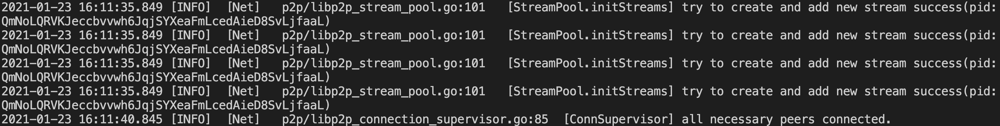
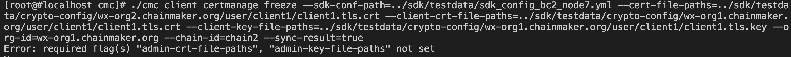
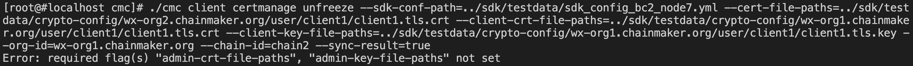
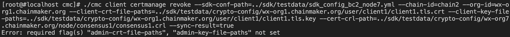
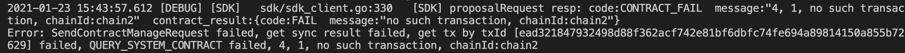

## 42 动态新增节点证书

1. 启动7节点双链，其中chain1有5节点，chain2有7节点

2. chain1加入节点8

   启动节点8，发现证书能够自动加入。

   

3. 向节点8发送发布合约请求(注意，由于新启动节点需要同步块，在执行时如果失败请等待同步块完成之后再执行)

   ```sh
   ./cmc client contract user create --admin-key-file-paths=../sdk/testdata/crypto-config/wx-org1.chainmaker.org/user/admin1/admin1.tls.key --admin-crt-file-paths=../sdk/testdata/crypto-config/wx-org1.chainmaker.org/user/admin1/admin1.tls.crt  --org-id=wx-org1.chainmaker.org --chain-id=chain1 --client-crt-file-paths=../sdk/testdata/crypto-config/wx-org1.chainmaker.org/user/client1/client1.tls.crt --client-key-file-paths=../sdk/testdata/crypto-config/wx-org1.chainmaker.org/user/client1/client1.tls.key --byte-code-path=../../test/wasm/asset-rust-0.7.2.wasm --contract-name=asset_new42 --runtime-type=WASMER --sdk-conf-path=../sdk/testdata/sdk_config_bc1_node8.yml --version=1.0 --sync-result=true --params="{\"issue_limit\":\"500000000\",\"total_supply\":\"1000000000\"}"
   
   ./cmc client contract user invoke  --contract-name=asset_new42 --method=register --org-id=wx-org2.chainmaker.org --chain-id=chain1 --client-crt-file-paths=../sdk/testdata/crypto-config/wx-org2.chainmaker.org/user/client1/client1.tls.crt --client-key-file-paths=../sdk/testdata/crypto-config/wx-org2.chainmaker.org/user/client1/client1.tls.key --sdk-conf-path=../sdk/testdata/sdk_config.yml --sync-result=true
   ```

## 45 节点证书权限管理方案

1. 启动7节点双链，其中chain1有5节点，chain2有7节点

2. 使用普通用户冻结节点证书

   ```sh
   ./cmc client certmanage freeze --sdk-conf-path=../sdk/testdata/sdk_config_bc2_node7.yml --cert-file-paths=../sdk/testdata/crypto-config/wx-org2.chainmaker.org/user/client1/client1.tls.crt --client-crt-file-paths=../sdk/testdata/crypto-config/wx-org1.chainmaker.org/user/client1/client1.tls.crt --client-key-file-paths=../sdk/testdata/crypto-config/wx-org1.chainmaker.org/user/client1/client1.tls.key --org-id=wx-org1.chainmaker.org --chain-id=chain2 --sync-result=true
   ```

   

3. 使用普通用户解冻节点证书

   ```sh
   ./cmc client certmanage unfreeze --sdk-conf-path=../sdk/testdata/sdk_config_bc2_node7.yml --cert-file-paths=../sdk/testdata/crypto-config/wx-org2.chainmaker.org/user/client1/client1.tls.crt --client-crt-file-paths=../sdk/testdata/crypto-config/wx-org1.chainmaker.org/user/client1/client1.tls.crt --client-key-file-paths=../sdk/testdata/crypto-config/wx-org1.chainmaker.org/user/client1/client1.tls.key --org-id=wx-org1.chainmaker.org --chain-id=chain2 --sync-result=true
   ```

   

4. 使用普通用户吊销节点证书

   ```sh
   ./cmc client certmanage revoke --sdk-conf-path=../sdk/testdata/sdk_config_bc2_node7.yml --chain-id=chain2 --org-id=wx-org1.chainmaker.org --client-crt-file-paths=../sdk/testdata/crypto-config/wx-org1.chainmaker.org/user/client1/client1.tls.crt --client-key-file-paths=../sdk/testdata/crypto-config/wx-org1.chainmaker.org/user/client1/client1.tls.key --cert-crl-path=../sdk/testdata/crypto-config/wx-org7.chainmaker.org/node/consensus1/consensus1.crl --sync-result=true
   ```

   

5. 节点证书的管理只有管理员才有权限新增和吊销

   管理员新增节点证书，参考第42项测试

   管理员吊销节点证书，参考第43项测试

## 43 动态吊销节点证书

1. 启动7节点双链，其中chain1有5节点，chain2有7节点

2. 向节点7发送发布合约交易，结果应为成功

   ```sh
   ./cmc client contract user create --admin-key-file-paths=../sdk/testdata/crypto-config/wx-org1.chainmaker.org/user/admin1/admin1.tls.key --admin-crt-file-paths=../sdk/testdata/crypto-config/wx-org1.chainmaker.org/user/admin1/admin1.tls.crt  --org-id=wx-org1.chainmaker.org --chain-id=chain2 --client-crt-file-paths=../sdk/testdata/crypto-config/wx-org1.chainmaker.org/user/client1/client1.tls.crt --client-key-file-paths=../sdk/testdata/crypto-config/wx-org1.chainmaker.org/user/client1/client1.tls.key --byte-code-path=../../test/wasm/asset-rust-0.7.2.wasm --contract-name=asset_new43 --runtime-type=WASMER --sdk-conf-path=../sdk/testdata/sdk_config_bc2_node7.yml --version=1.0 --sync-result=true --params="{\"issue_limit\":\"500000000\",\"total_supply\":\"1000000000\"}"
   ```

3. 生成节点7的证书crl

   ```sh
   ./cmc cert crl --crt-path=../sdk/testdata/crypto-config/wx-org7.chainmaker.org/node/consensus1/consensus1.tls.crt --ca-key-path=../sdk/testdata/crypto-config/wx-org7.chainmaker.org/ca/ca.key --ca-cert-path=../sdk/testdata/crypto-config/wx-org7.chainmaker.org/ca/ca.crt  --crl-path=../sdk/testdata/crypto-config/wx-org7.chainmaker.org/node/consensus1/consensus1.crl
   ```

4. 向节点7发送吊销节点证书请求

   ```sh
   ./cmc client certmanage revoke --cert-crl-path=../sdk/testdata/crypto-config/wx-org7.chainmaker.org/node/consensus1/consensus1.crl --sdk-conf-path=../sdk/testdata/sdk_config_bc2_node7.yml --chain-id=chain2 --org-id=wx-org1.chainmaker.org --client-crt-file-paths=../sdk/testdata/crypto-config/wx-org1.chainmaker.org/user/client1/client1.tls.crt --client-key-file-paths=../sdk/testdata/crypto-config/wx-org1.chainmaker.org/user/client1/client1.tls.key --admin-key-file-paths=../sdk/testdata/crypto-config/wx-org1.chainmaker.org/user/admin1/admin1.tls.key --admin-crt-file-paths=../sdk/testdata/crypto-config/wx-org1.chainmaker.org/user/admin1/admin1.tls.crt --sync-result=true
   ```

5. 向节点7再次发送发布合约交易，查询交易结果应为失败

   ```sh
   ./cmc client contract user create --admin-key-file-paths=../sdk/testdata/crypto-config/wx-org1.chainmaker.org/user/admin1/admin1.tls.key --admin-crt-file-paths=../sdk/testdata/crypto-config/wx-org1.chainmaker.org/user/admin1/admin1.tls.crt  --org-id=wx-org1.chainmaker.org --chain-id=chain2 --client-crt-file-paths=../sdk/testdata/crypto-config/wx-org1.chainmaker.org/user/client1/client1.tls.crt --client-key-file-paths=../sdk/testdata/crypto-config/wx-org1.chainmaker.org/user/client1/client1.tls.key --byte-code-path=../../test/wasm/asset-rust-0.7.2.wasm --contract-name=asset_new43_1 --runtime-type=WASMER --sdk-conf-path=../sdk/testdata/sdk_config_bc2_node7.yml --version=1.0 --sync-result=true --params="{\"issue_limit\":\"500000000\",\"total_supply\":\"1000000000\"}"
   ```

   

