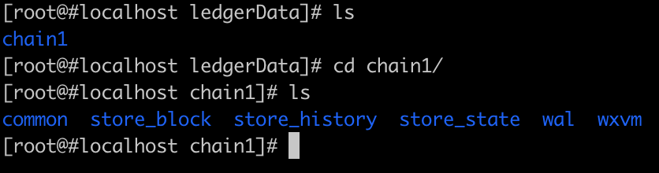

[TOC]

# 微芯区块链委托测试归档

 

## 1 组网方式

ChainMaker支持四个或四个以上个数的共识节点进行组网，节点之间组网采用P2P协议进行。

chainconfig配置文件中共识节点配置如下：

chainmaker.yml配置文件中网络配置如下：

启动时查看组网日志如下：

cat system.log.* | grep "Host\|ConnSupervisor"

## 2 通讯机制

节点之间通讯是通过P2P网络，支持TLS。

### 2.1 节点间通信机制

使用WireShark抓包：

### 2.1 客户端SDK与服务端通讯使用RPC协议，支持TLS。

使用WireShark抓包：

## 3 区块结构

在源码chainmaker-go/pb/common中定义了区块结构如下:

block.proto

transaction.proto

rwset.proto

使用SDK获取取块信息截图如下：

## 4 链上数据存储方式

### 4.1 链上数据存储

链上数据存储在nosql数据库中，较常用的有leveldb和rocksdb。链上数据存储的路径可以在配置文件里指定，在存储目录下会根据链id建立二级目录，同一条链的链上数据存放在同一个二级目录下。

chainmaker.yml配置文件中存储的配置如下图：

在启动后进入存储目录，查看文件如下图：

### 4.2 链上数据加解密方式

待补充

## 5 数据传输方式

节点之间通讯是通过P2P网络，支持TLS。

使用WireShark抓包：

客户端SDK与服务端通讯是RPC，支持TLS。

使用WireShark抓包：

 

\6.   链上数据防篡改

1)   启动4节点单链

2)   安装钱包合约，并给两个客户端AB注册钱包分别发100个币

3)   修改节点4的数据库，将B余额改为200个币

4)   B发起一笔交易，向A转账100个币

5)   查看交易结果和节点4数据库余额值

 

\7.   消息防篡改

1） 修改节点1的配置，允许节点1修改消息

2） 启动4节点单链

3） 向节点1发送交易

4） 查询交易结果

 

\8.   加密算法的种类

1） 对称加密：

AES 

SM4

2） 非对称加密：

​    RSA512

​    RSA1024

​    RSA2048

​    SM2

​    ECC_Secp256k1

​    ECC_NISTP256

​    ECC_NISTP384

​    ECC_NISTP521

3） 哈希算法：

SHA256

SHA3_256

SM3

进入目录chainmaker-go/test/entrust_test

执行

go build

./entrust_test -step=1

运行结果：

红框标识为国密算法支持

\9.   国密算法支持能力

详见加密算法种类测试结果。

\10.  无故障与无欺骗的共识

 

\11.  故障数少于理论值

\12.  故障数多于理论值

\13.  转账双花攻击防范

\14.  共识机制有效性

\15.  智能合约的全生命周期管理

\16.  智能合约的运行机制向前兼容

\17.  智能合约的在线升级

\18.  智能合约的编译检测

\19.  智能合约的治理方案

\20.  系统部署和启动方式

\21.  新增节点的稳定性

\22.  删除节点的稳定性

\23.  升级节点的稳定性

\24.  修改节点配置的稳定性

\25.  长时间稳定性

\26.  并行方案数据传输互不干扰

\27.  并行业务互不干扰

\28.  数据算法压缩功能

\29.  隐私保护功能

\30.  跨链互通功能

\31.  交易修改配置功能

\32.  节点灾备方案

\33.  账户类型及交易类型

\34.  账户用户体系结构

\35.  账户用户权限管理

\36.  基于软件方案的私钥管理

\37.  SDK支持方案

\38.  链接口权限管理方案

\39.  系统升级

\40.  动态新增节点证书

\41.  动态吊销节点证书

\42.  节点证书权限管理方案

\43.  平台行为审查

\44.  用户行为审查

\45.  支持智能合约审计