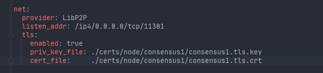
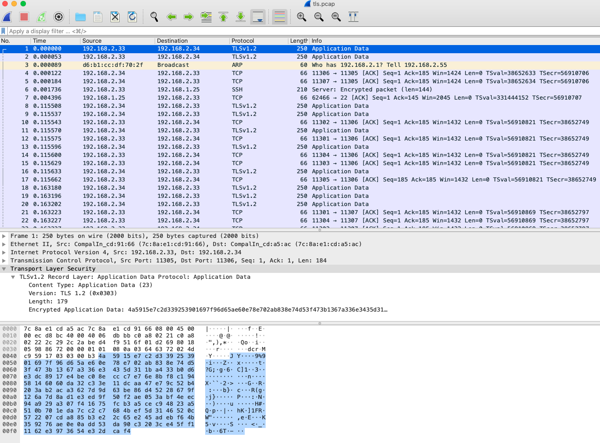
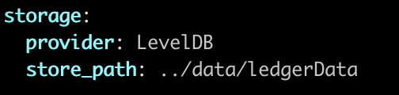

[TOC]

# 微芯区块链委托测试归档

 

## 1 组网方式

ChainMaker支持四个或四个以上个数的共识节点进行组网，节点之间组网采用P2P协议进行。

chainconfig配置文件中共识节点配置如下：

chainmaker.yml配置文件中网络配置如下：

启动时查看组网日志如下：

cat system.log.* | grep "Host\|ConnSupervisor"

## 2 通讯机制

节点之间通讯是通过P2P网络，支持TLS。

### 2.1 节点间通信机制

使用WireShark抓包：

### 2.1 客户端SDK与服务端通讯使用RPC协议，支持TLS。

使用WireShark抓包：

## 3 区块结构

在源码chainmaker-go/pb/common中定义了区块结构如下:

block.proto

transaction.proto

rwset.proto

使用SDK获取取块信息截图如下：

## 4 链上数据存储方式

链上数据存储在nosql数据库中，较常用的有leveldb和rocksdb。链上数据存储的路径可以在配置文件里指定，在存储目录下会根据链id建立二级目录，同一条链的链上数据存放在同一个二级目录下。

chainmaker.yml配置文件中存储的配置如下图：

在启动后进入存储目录，查看文件如下图：

## 6 数据传输方式

### 6.1 传输加密数据，使用TLS方式

节点之间通讯是通过P2P网络，支持TLS。

使用WireShark抓包：

客户端SDK与服务端通讯是RPC，支持TLS。

使用WireShark抓包：

###  6.2 数据传输压缩编码方案

1. 数据传输使用protobuf进行编码，编码后的数据进行截图

## 7 链上数据防篡改

1. 启动4节点单链
2. 安装钱包合约，并给两个客户端AB注册钱包分别发100个币
3. 修改节点4的数据库，将B余额改为200个币（修改后节点4后续的区块将不能达成共识）
4. B发起一笔交易，向A转账100个币
5. 查看交易结果和节点4数据库余额值

## 8 消息防篡改 待确定

1. #### 修改节点1的配置，允许节点1修改消息

2. 启动4节点单链

3. 向节点1发送交易

4. 查询交易结果

## 9 加密算法的种类

### 9.1 对称加密

AES

SM4

### 9.2 非对称加密

RSA512

RSA1024

RSA2048

SM2

ECC_Secp256k1

ECC_NISTP256

ECC_NISTP384

ECC_NISTP521

### 9.3 哈希算法：

SHA256

SHA3_256

SM3

进入目录chainmaker-go/test/entrust_test

执行

go build

./entrust_test -step=1

运行结果：

红框标识为国密算法支持

## 10 国密算法支持能力*

见加密算法种类测试结果。

## 11 无故障与无欺骗的共识

1. 启动4节点单链
2. 安装钱包合约，并给两个客户端AB注册钱包分别发100个币
3. B发起一笔交易，向A转账100个币，查询转账结果应为成功
4. A发起一笔交易，向B转账300个币，查询转账结果应为失败

### 12 故障数少于理论值

1. 启动4节点单链
2. 安装钱包合约，并给两个客户端AB注册钱包分别发100个币
3. 将节点4停掉（故障节点）
4. B发起一笔交易，向A转账100个币，查询转账结果应为成功
5. A发起一笔交易，向B转账300个币，查询转账结果应为失败

## 13 故障数多于理论值

1. 启动4节点单链
2. 安装钱包合约，并给两个客户端AB注册钱包分别发100个币
3. 将节点3和节点4停掉（故障节点）
4. B发起一笔交易，向A转账100个币，查询转账结果应为失败（无法达成共识，查询不到交易）
5. A发起一笔交易，向B转账300个币，查询转账结果应为失败（无法达成共识，查询不到交易）

## 14 转账双花攻击防范

1. 启动4节点单链
2. 安装钱包合约，并给两个客户端AB注册钱包分别发100个币
3. B同时发起两笔交易，分别向A转账100个币，查询转账结果应为一笔成功，一笔失败
4. A先后发起两笔相同交易，分别向B转账100个币，查询转账结果应为一笔成功，一笔失败

## 15 共识机制有效性* 待确定

1. 启动4节点单链

2. 安装钱包合约，并给两个客户端AB注册钱包分别发100个币

3. #### <u>待确定：将节点4作为恶意节点，调整成共识机制不响应</u> 智超确定

4. B同时发起一笔交易，向A转账100个币，查询转账结果应为成功

5. 将节点3作为恶意节点，调整成共识机制不响应

6. A发起一笔交易，向B转账100个币，查询转账结果失败（不能达成共识，发送成功后查询不到交易）

## 16 智能合约的全生命周期管理

ChainMaker的智能合约支持C++、go和Rust三种语言。运行C++和Rust的智能合约的虚拟机环境为wasmer，运行go语言的智能合约虚拟机环境为gasm。

1. 启动4节点单链
2. 安装钱包合约，并给两个客户端AB注册钱包分别发100个币
3. B发起一笔交易，向A转账100个币，查询转账结果应为成功
4. 冻结智能合约
5. A发起一笔交易，向B转账100个币，查询交易结果应为失败
6. 解冻智能合约
7. A发起一笔交易，向B转账100个币，查询转账结果应为成功
8. 吊销智能合约
9. A发起一笔交易，向B转账100个币，查询交易结果应为失败

## 17 智能合约的运行机制向前兼容

1. ChainMaker安装0.7.1版本
2. 发布智能合约
3. 安装钱包合约，并给两个客户端AB注册钱包分别发100个币
4. B发起一笔交易，向A转账100个币，查询转账结果应为成功
5. 升级0.7.1.1版本
6. A发起一笔交易，向B转账100个币，查询交易结果应为成功

## 18 智能合约的在线升级

1. 启动4节点单链
2. 安装钱包合约1.0版本，并给两个客户端AB注册钱包分别发100个币
3. 查询合约版本号，结果为1.0
4. B发起一笔交易，向A转账100个币，查询转账结果应为成功
5. 升级智能合约，合约版本号变为2.0
6. 查询合约版本号，结果为2.0
7. 新版本废除一个函数
8. 调用2.0合约，A发起一笔交易，向B转账100个币，查询转账结果应为成功
9. 调用1.0合约，A发起一笔交易，向B转账100个币，查询转账结果应为失败(调用的是废除的合约，待确定)

## 19 智能合约的编译检测*

IDE工具，截图

## 20 智能合约的治理方案（补充操作后发送交易）

1. 启动4节点单链
2. 管理员用户安装钱包合约1.0版本，并给两个客户端AB注册钱包分别发100个币
3. 普通用户B发起一笔交易，向A转账100个币，查询转账结果应为成功
4. 普通用户B尝试冻结合约，结果应为失败（权限不足）
5. 普通用户A发起一笔交易，向B转账100个币，查询转账结果应为成功
6. 管理员链下多签用户冻结合约，结果应为成功
7. 普通用户B尝试解冻合约，结果应为失败（权限不足）
8. 普通用户B尝试注销合约，结果应为失败（权限不足）
9. 管理员链下多签用户解冻合约，结果应为成功
10. 管理员链下多签用户升级合约，结果应为成功
11. 升级完成后，普通用户A发起一笔交易，向B转账100个币，查询转账结果应为成功
12. 管理员用户注销合约，结果应为成功
13. 普通用户A发起一笔交易，向B转账100个币，查询转账结果应为失败

## 21 系统部署和启动方式（前面测试）

1. 使用错误的配置文件启动系统，启动失败
2. 使用正确的配置文件启动系统，启动成功

## 22 新增节点的稳定性

1. 启动三个节点
2. 持续请求区块高度信息
3. 启动第四个节点
4. 在第四个节点发起获取区块高度的请求
5. 检查第步持续请求区块高度的请求应为成功

## 23 删除节点的稳定性

1. 启动4节点共识
2. 持续请求区块高度信息
3. 节点4停止共识
4. 检查第步所有请求均成功

## 24 升级节点的稳定性

1. 启动4节点单链
2. 持续请求区块高度信息
3. 将节点4软件升级至0.7.1.1
4. 检查第步所有请求均成功

## 25 修改节点配置的稳定性*

1. 启动4节点单链
2. 持续请求区块高度信息
3. 将节点4配置信息区块大小从1M改成2M
4. 查看修改结果为成功
5. 检查第2步所有请求均成功，高度增加1

## 27 并行方案数据传输互不干扰*

1. 启动5节点双链，其中3个节点同时加入chain1和chain2，另外两个节点只加入chain2
2. 在chain1上发布钱包合约
3. 在chain1上频繁调用合约
4. 检查chain1对应的3个节点延时，应增大
5. 检查chain2对应的节点，延时无明显变化

## 28 并行业务互不干扰*

1. 启动5节点双链，其中3个节点同时加入chain1和chain2，另外两个节点只加入chain2
2. 在chain1上和chain2上都发布钱包合约，分别给用户A和用户B账户发100个币
3. A在chain1上发起一笔交易，转账给B 100个币，检查A的账户余额为0
4. 分别查询A在chain1和chain2上的余额，分别为0和100

## 29 分布式存储功能* 待确定

#### 使用分布式存储，mysql分片

## 30 隐私保护功能*

1. #### 链之间账本隔离，两条链分开存储，披露信息

## 32 交易修改配置功能*

1. 启动4节点单链
2. 查询链配置
3. 更新链配置
4. 查询链配置，应为更新后的链配置

## 33 节点灾备方案*     待确定

1. 启动3节点单链

2. 安装钱包合约，并给两个客户端AB注册钱包分别发100个币

3. 将备用节点作为节点3的灾备节点

4. 杀掉节点3程序

   确认是否需要变更共识ip，瑞波

5. 启用节点后的灾备节点

6. 使用用户B向灾备节点发送发送交易，调用转账合约，转账100个币给A

7. 查询结果应为成功

## 34 账户类型及交易类型

1. 交易体信息见第3项测试披露所示
2. 账户模型
3. 分别发送各种类型的交易，包括创建合约（安装钱包合约，并给两个客户端AB注册钱包分别发100个币）、调用合约、更新链配置等
4. 检查结果应为成功

## 35 账户用户体系结构

用户分为普通用户和管理员用户。分别使用不同的证书来对应，如下图：

## 36 账户用户权限管理

1. 普通用户可以进行合约的调用，查看链信息等。管理员用户除了普通用户的权限外，还可以更新链配置、发布合约、升级合约、冻结、解冻、吊销功能。
2. 不同用户不同操作的权限调用

## 37 基于软件方案的私钥管理  待确定

#### 软件私钥管理：

#### 客户端：TLS和用户私钥用不同口令来读取，服务分开部署（KMS）

#### 服务端：TLS和用户私钥用不同口令来读取，服务分开部署（KMS）

## 39 SDK支持方案

ChainMaker SDK支持go和java两种语言。演示集成SDK的项目。分别完成发布合约功能。

转账合约分别发送一笔交易

## 40 链接口权限管理方案

1. 使用已注册的用户获取区块高度，结果为成功
2. 使用其他非注册用户获取区块高度，结果为失败
3. 使用已注册的用户发布合约，结果为成功
4. 使用其他非注册用户发布合约，结果为失败

## 41 系统升级* 待确定

1. #### 需要SDK有节点容灾功能</u>

2. 使用0.7.1启用4节点单链

3. 持续获取区块高度

4. 查询单节点版本号

5. 逐个升级所有节点到0.7.1.1版本

6. 查询所有节点版本号到0.7.1.1版本

7. 查看第3步请求应都为成功

## 42 动态新增节点证书

1. 启动3节点单链
2. 安装钱包合约，并给两个客户端AB注册钱包分别发100个币
3. 添加节点4证书，使节点4也成为共识节点
4. 使用用户A向节点4发送转账交易请求，向用户B转100个币，查看转账结果应为成功

## 43 动态吊销节点证书

1. 启动4节点单链

2. 向节点4发送查询区块高度请求，结果应为成功

3. 向节点1发送吊销节点1证书请求

4. 向节点1发送转账请求，查询交易结果应为失败

   吊销节点证书，需要系统合约和SDK支持。

## 45 节点证书权限管理方案  待确定

1. 启动4节点单链

2. #### CA新增节点证书，通过工具展示。使用普通用户新增（无法）待确定

3. 、吊销节点证书，结果应为失败

4. 使用管理员用户进行新增、吊销节点证书，结果应为成功

## 46 平台行为审查

#### <u>待确定</u>

1. 审查用户的权限

   zabbix，分配用户

2. 审查内容

   用户、操作、时间。

   链配置

   篡改数据，区块校验失败

   在线多签

## 47 用户行为审查

1. #### <u>待确定：提取用户操作记录</u>

2. 删除用户证书

3. 使用已删除的用户证书，发送查询区块高度的请求，结果应为失败

4. 冻结用户，无法发送交易

## 48 支持智能合约审计

合约执行日志，入参，结果日志。