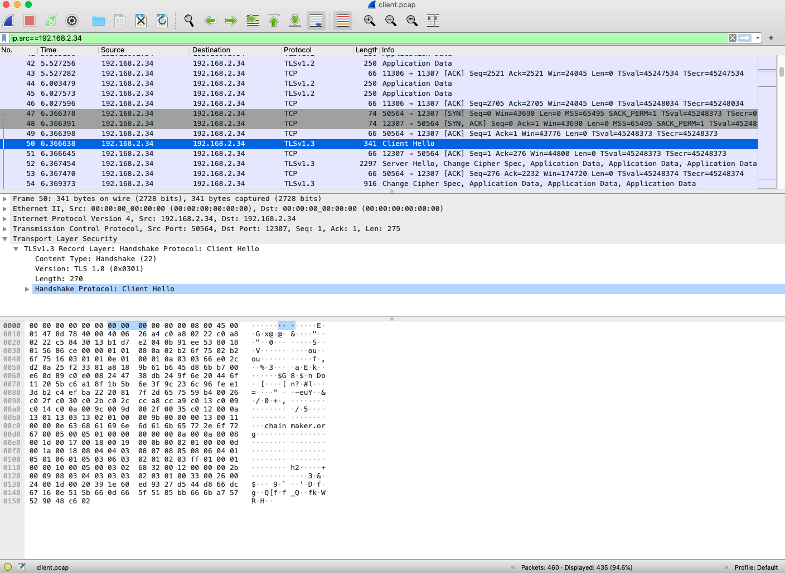
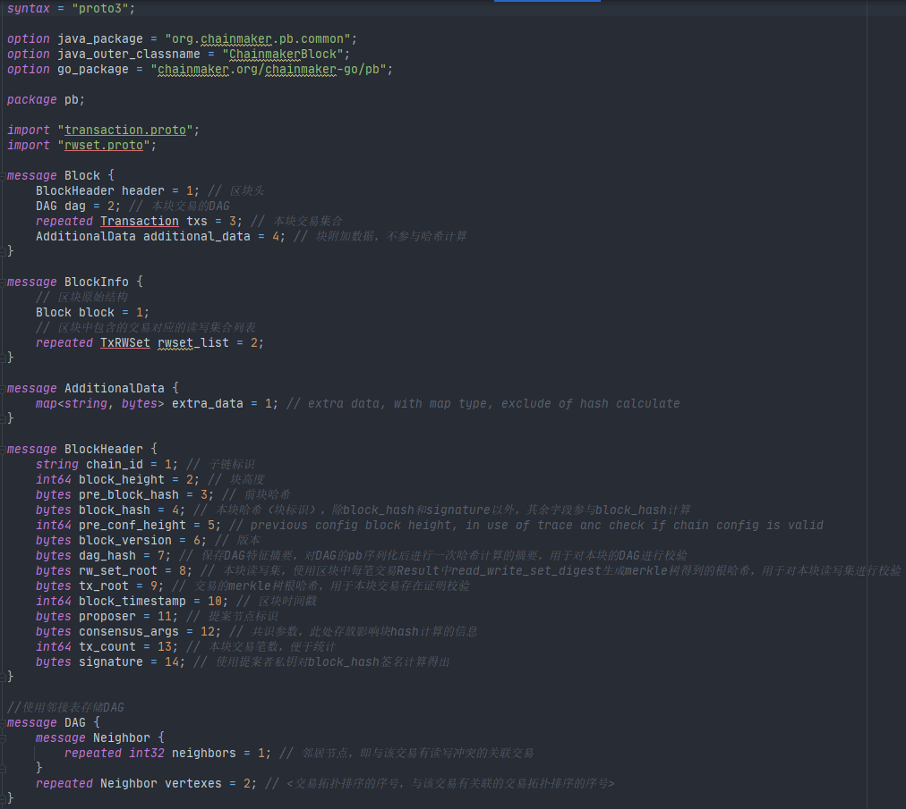
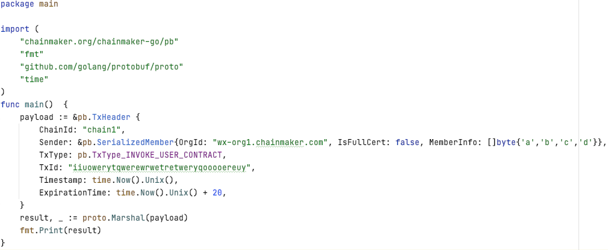
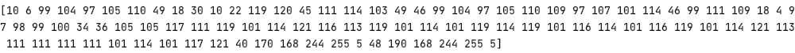
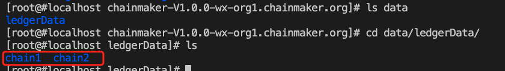

[TOC]

# 微芯区块链委托测试归档

 测试顺序：为了提升测试速度，将某些异常测试放在告后的位置，避免不断清除数据的操作，测试顺序如下：

披露性测试：1->2->3->4->5->6->9->10->

11->12->13

7->8

## 1 组网方式

ChainMaker支持四个或四个以上个数的共识节点进行组网，节点之间组网采用P2P协议进行。

chainconfig配置文件中共识节点配置如下：

chainmaker.yml配置文件中网络配置如下：

启动时查看组网日志如下：

cat system.log.* | grep "Host\|ConnSupervisor"

## 2 通讯机制

节点之间通讯是通过P2P网络，支持TLS。

### 2.1 节点间通信机制

使用WireShark抓包：

### 2.1 客户端SDK与服务端通讯使用RPC协议，支持TLS。

使用WireShark抓包：

## 3 区块结构

在源码chainmaker-go/pb/common中定义了区块结构如下:

block.proto

transaction.proto

rwset.proto

使用SDK获取取块信息截图如下：

## 4 链上数据存储方式

链上数据存储在nosql数据库中，较常用的有leveldb和rocksdb。链上数据存储的路径可以在配置文件里指定，在存储目录下会根据链id建立二级目录，同一条链的链上数据存放在同一个二级目录下。

chainmaker.yml配置文件中存储的配置如下图：

在启动后进入存储目录，查看文件如下图：

## 6 数据传输方式

### 6.1 传输加密数据，使用TLS方式

节点之间通讯是通过P2P网络，支持TLS。

使用WireShark抓包：

客户端SDK与服务端通讯是RPC，支持TLS。

使用WireShark抓包：

###  6.2 数据传输压缩编码方案

数据传输使用protobuf进行编码，示例原始数据编码：

编码后输出结果：

## 9 加密算法的种类

### 9.1 对称加密

AES

SM4

### 9.2 非对称加密

RSA512

RSA1024

RSA2048

SM2

ECC_Secp256k1

ECC_NISTP256

ECC_NISTP384

ECC_NISTP521

### 9.3 哈希算法：

SHA256

SHA3_256

SM3

进入目录chainmaker-go/test/entrust_test

执行

go build

./entrust_test -step=1

运行结果：

红框标识为国密算法支持

## 10 国密算法支持能力*

见加密算法种类测试结果。

## 19 智能合约的编译检测*

## 29 分布式存储功能* 待确定

#### 使用分布式存储，mysql分片

## 30 隐私保护功能*

1. 启动7节点双链

2. 查看链之间账本隔离，两条链分开存储，如图：

   

## 37 基于软件方案的私钥管理  待确定

#### 软件私钥管理：

#### 客户端：TLS和用户私钥用不同口令来读取，服务分开部署（KMS）

#### 服务端：TLS和用户私钥用不同口令来读取，服务分开部署（KMS）
