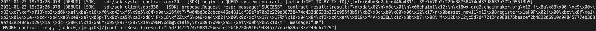

# 微芯区块链委托测试归档

## 共有操作
1. 启动7节点双链，其中chain1有5节点，chain2有7节点

2. 安装钱包合约，并默认注册钱包用户A

   ```sh
   ./cmc client contract user create --admin-key-file-paths=../sdk/testdata/crypto-config/wx-org1.chainmaker.org/user/admin1/admin1.tls.key --admin-crt-file-paths=../sdk/testdata/crypto-config/wx-org1.chainmaker.org/user/admin1/admin1.tls.crt  --org-id=wx-org1.chainmaker.org --client-crt-file-paths=../sdk/testdata/crypto-config/wx-org1.chainmaker.org/user/client1/client1.tls.crt --client-key-file-paths=../sdk/testdata/crypto-config/wx-org1.chainmaker.org/user/client1/client1.tls.key --byte-code-path=../../test/wasm/asset-rust-0.7.2.wasm --contract-name=asset_new11 --runtime-type=WASMER --sdk-conf-path=../sdk/testdata/sdk_config.yml --version=1.0 --sync-result=true --params="{\"issue_limit\":\"1000\",\"total_supply\":\"100000000\"}"
   ```
   
   
   
  

3. 注册另外一个钱包用户B

   ```sh
   ./cmc client contract user invoke  --contract-name=asset_new11 --method=register --org-id=wx-org2.chainmaker.org --client-crt-file-paths=../sdk/testdata/crypto-config/wx-org2.chainmaker.org/user/client1/client1.tls.crt --client-key-file-paths=../sdk/testdata/crypto-config/wx-org2.chainmaker.org/user/client1/client1.tls.key --sdk-conf-path=../sdk/testdata/sdk_config.yml --sync-result=true
   ```
   

   

4. 查询钱包用户A和B的地址

   ```sh
   ./cmc client contract user get  --contract-name=asset_new11 --method=query_address --sdk-conf-path=../sdk/testdata/sdk_config.yml --org-id=wx-org1.chainmaker.org --client-crt-file-paths=../sdk/testdata/crypto-config/wx-org1.chainmaker.org/user/client1/client1.tls.crt --client-key-file-paths=../sdk/testdata/crypto-config/wx-org1.chainmaker.org/user/client1/client1.tls.key
   
   ./cmc client contract user get  --contract-name=asset_new11 --method=query_address --sdk-conf-path=../sdk/testdata/sdk_config.yml --org-id=wx-org2.chainmaker.org --client-crt-file-paths=../sdk/testdata/crypto-config/wx-org2.chainmaker.org/user/client1/client1.tls.crt --client-key-file-paths=../sdk/testdata/crypto-config/wx-org2.chainmaker.org/user/client1/client1.tls.key
   ```
   
   
   
   
   
   
   

5. 分别给两个用户A和B发放1000个币

   ```sh
   ./cmc client contract user invoke  --contract-name=asset_new11 --method=issue_amount --sdk-conf-path=../sdk/testdata/sdk_config.yml --org-id=wx-org1.chainmaker.org --client-crt-file-paths=../sdk/testdata/crypto-config/wx-org1.chainmaker.org/user/client1/client1.tls.crt --client-key-file-paths=../sdk/testdata/crypto-config/wx-org1.chainmaker.org/user/client1/client1.tls.key --params="{\"amount\":\"1000\",\"to\":\"62c6a0672c28ae914e9c5100a2262762b0a5b7b13bf4b69b3beee92c51aefd0f\"}" --sync-result=true
   
   ./cmc client contract user invoke  --contract-name=asset_new11 --method=issue_amount --sdk-conf-path=../sdk/testdata/sdk_config.yml --org-id=wx-org1.chainmaker.org --client-crt-file-paths=../sdk/testdata/crypto-config/wx-org1.chainmaker.org/user/client1/client1.tls.crt --client-key-file-paths=../sdk/testdata/crypto-config/wx-org1.chainmaker.org/user/client1/client1.tls.key --params="{\"amount\":\"1000\",\"to\":\"c5d7d472124c988175beacef2b482206910c94845777eb3689af33e240c67129\"}" --sync-result=true
   ```
   
   
   
   

## 11 无故障与无欺骗的共识


1. 分别查询两个用户A和B余额

   ```sh
   ./cmc client contract user get  --contract-name=asset_new11 --method=balance_of --sdk-conf-path=../sdk/testdata/sdk_config.yml --org-id=wx-org2.chainmaker.org --client-crt-file-paths=../sdk/testdata/crypto-config/wx-org2.chainmaker.org/user/client1/client1.tls.crt --client-key-file-paths=../sdk/testdata/crypto-config/wx-org2.chainmaker.org/user/client1/client1.tls.key --params="{\"owner\":\"62c6a0672c28ae914e9c5100a2262762b0a5b7b13bf4b69b3beee92c51aefd0f\"}"
   
   ./cmc client contract user get  --contract-name=asset_new11 --method=balance_of --sdk-conf-path=../sdk/testdata/sdk_config.yml --org-id=wx-org1.chainmaker.org --client-crt-file-paths=../sdk/testdata/crypto-config/wx-org1.chainmaker.org/user/client1/client1.tls.crt --client-key-file-paths=../sdk/testdata/crypto-config/wx-org1.chainmaker.org/user/client1/client1.tls.key --params="{\"owner\":\"c5d7d472124c988175beacef2b482206910c94845777eb3689af33e240c67129\"}"
   ```
   
   
   
   
   

2. A发起一笔交易，向B转账1000个币，查询转账结果应为成功

   ```sh
   ./cmc client contract user invoke  --contract-name=asset_new11 --method=transfer --sdk-conf-path=../sdk/testdata/sdk_config.yml --org-id=wx-org1.chainmaker.org --client-crt-file-paths=../sdk/testdata/crypto-config/wx-org1.chainmaker.org/user/client1/client1.tls.crt --client-key-file-paths=../sdk/testdata/crypto-config/wx-org1.chainmaker.org/user/client1/client1.tls.key --params="{\"amount\":\"1000\",\"to\":\"c5d7d472124c988175beacef2b482206910c94845777eb3689af33e240c67129\"}" --sync-result=true
   ```
   
   
   

3. A再发起一笔交易，向B转账1000个币，查询转账结果应为失败

   ```sh
   ./cmc client contract user invoke  --contract-name=asset_new11 --method=transfer --sdk-conf-path=../sdk/testdata/sdk_config.yml --org-id=wx-org1.chainmaker.org --client-crt-file-paths=../sdk/testdata/crypto-config/wx-org1.chainmaker.org/user/client1/client1.tls.crt --client-key-file-paths=../sdk/testdata/crypto-config/wx-org1.chainmaker.org/user/client1/client1.tls.key --params="{\"amount\":\"1000\",\"to\":\"c5d7d472124c988175beacef2b482206910c94845777eb3689af33e240c67129\"}" --sync-result=true
   ```
   
   

4. 恢复余额，B向A转账1000个币

   ```sh
   ./cmc client contract user invoke  --contract-name=asset_new11 --method=transfer --sdk-conf-path=../sdk/testdata/sdk_config.yml --org-id=wx-org2.chainmaker.org --client-crt-file-paths=../sdk/testdata/crypto-config/wx-org2.chainmaker.org/user/client1/client1.tls.crt --client-key-file-paths=../sdk/testdata/crypto-config/wx-org2.chainmaker.org/user/client1/client1.tls.key --params="{\"amount\":\"1000\",\"to\":\"62c6a0672c28ae914e9c5100a2262762b0a5b7b13bf4b69b3beee92c51aefd0f\"}" --sync-result=true
   ```
    
    
   

## 12 故障数少于理论值
1. 分别查询两个用户A和B余额

   ```sh
   ./cmc client contract user get  --contract-name=asset_new11 --method=balance_of --sdk-conf-path=../sdk/testdata/sdk_config.yml --org-id=wx-org2.chainmaker.org --client-crt-file-paths=../sdk/testdata/crypto-config/wx-org2.chainmaker.org/user/client1/client1.tls.crt --client-key-file-paths=../sdk/testdata/crypto-config/wx-org2.chainmaker.org/user/client1/client1.tls.key --params="{\"owner\":\"62c6a0672c28ae914e9c5100a2262762b0a5b7b13bf4b69b3beee92c51aefd0f\"}"
   
   ./cmc client contract user get  --contract-name=asset_new11 --method=balance_of --sdk-conf-path=../sdk/testdata/sdk_config.yml --org-id=wx-org1.chainmaker.org --client-crt-file-paths=../sdk/testdata/crypto-config/wx-org1.chainmaker.org/user/client1/client1.tls.crt --client-key-file-paths=../sdk/testdata/crypto-config/wx-org1.chainmaker.org/user/client1/client1.tls.key --params="{\"owner\":\"c5d7d472124c988175beacef2b482206910c94845777eb3689af33e240c67129\"}"
   ```

2. 将节点7停掉（故障节点）

3. A发起一笔交易，向B转账1000个币，查询转账结果应为成功

   ```sh
   ./cmc client contract user invoke  --contract-name=asset_new11 --method=transfer --sdk-conf-path=../sdk/testdata/sdk_config.yml --org-id=wx-org1.chainmaker.org --client-crt-file-paths=../sdk/testdata/crypto-config/wx-org1.chainmaker.org/user/client1/client1.tls.crt --client-key-file-paths=../sdk/testdata/crypto-config/wx-org1.chainmaker.org/user/client1/client1.tls.key --params="{\"amount\":\"1000\",\"to\":\"c5d7d472124c988175beacef2b482206910c94845777eb3689af33e240c67129\"}" --sync-result=true
   ```

4. A再发起一笔交易，向B转账1000个币，查询转账结果应为失败

   ```sh
   ./cmc client contract user invoke  --contract-name=asset_new11 --method=transfer --sdk-conf-path=../sdk/testdata/sdk_config.yml --org-id=wx-org1.chainmaker.org --client-crt-file-paths=../sdk/testdata/crypto-config/wx-org1.chainmaker.org/user/client1/client1.tls.crt --client-key-file-paths=../sdk/testdata/crypto-config/wx-org1.chainmaker.org/user/client1/client1.tls.key --params="{\"amount\":\"1000\",\"to\":\"c5d7d472124c988175beacef2b482206910c94845777eb3689af33e240c67129\"}" --sync-result=true
   ```

5. 恢复余额，B向A转账1000个币

   ```sh
   ./cmc client contract user invoke  --contract-name=asset_new11 --method=transfer --sdk-conf-path=../sdk/testdata/sdk_config.yml --org-id=wx-org2.chainmaker.org --client-crt-file-paths=../sdk/testdata/crypto-config/wx-org2.chainmaker.org/user/client1/client1.tls.crt --client-key-file-paths=../sdk/testdata/crypto-config/wx-org2.chainmaker.org/user/client1/client1.tls.key --params="{\"amount\":\"1000\",\"to\":\"62c6a0672c28ae914e9c5100a2262762b0a5b7b13bf4b69b3beee92c51aefd0f\"}" --sync-result=true
   ```

6. 恢复节点7

   ```sh
   nohup ./chainmaker start -e wx-org7.chainmaker.org > panic.log &
   ```

   

## 13 故障数多于理论值，待确认，共识恢复问题
3. 分别查询两个用户A和B余额

   ```sh
   ./cmc client contract user get  --contract-name=asset_new11 --method=balance_of --sdk-conf-path=../sdk/testdata/sdk_config.yml --org-id=wx-org2.chainmaker.org --client-crt-file-paths=../sdk/testdata/crypto-config/wx-org2.chainmaker.org/user/client1/client1.tls.crt --client-key-file-paths=../sdk/testdata/crypto-config/wx-org2.chainmaker.org/user/client1/client1.tls.key --params="{\"owner\":\"62c6a0672c28ae914e9c5100a2262762b0a5b7b13bf4b69b3beee92c51aefd0f\"}"
   
   ./cmc client contract user get  --contract-name=asset_new11 --method=balance_of --sdk-conf-path=../sdk/testdata/sdk_config.yml --org-id=wx-org1.chainmaker.org --client-crt-file-paths=../sdk/testdata/crypto-config/wx-org1.chainmaker.org/user/client1/client1.tls.crt --client-key-file-paths=../sdk/testdata/crypto-config/wx-org1.chainmaker.org/user/client1/client1.tls.key --params="{\"owner\":\"c5d7d472124c988175beacef2b482206910c94845777eb3689af33e240c67129\"}"
   ```

7. 将节点5、节点6和节点7停掉（故障节点）

8. A发起一笔交易，向B转账1000个币，查询转账结果应为无法查询（无法达成共识）

   ```sh
   ./cmc client contract user invoke  --contract-name=asset_new11 --method=transfer --sdk-conf-path=../sdk/testdata/sdk_config.yml --org-id=wx-org1.chainmaker.org --client-crt-file-paths=../sdk/testdata/crypto-config/wx-org1.chainmaker.org/user/client1/client1.tls.crt --client-key-file-paths=../sdk/testdata/crypto-config/wx-org1.chainmaker.org/user/client1/client1.tls.key --params="{\"amount\":\"1000\",\"to\":\"c5d7d472124c988175beacef2b482206910c94845777eb3689af33e240c67129\"}" --sync-result=true
   ```

9. A再发起一笔交易，向B转账1000个币，查询转账结果应为无法查询（无法达成共识）

   ```sh
   ./cmc client contract user invoke  --contract-name=asset_new11 --method=transfer --sdk-conf-path=../sdk/testdata/sdk_config.yml --org-id=wx-org1.chainmaker.org --client-crt-file-paths=../sdk/testdata/crypto-config/wx-org1.chainmaker.org/user/client1/client1.tls.crt --client-key-file-paths=../sdk/testdata/crypto-config/wx-org1.chainmaker.org/user/client1/client1.tls.key --params="{\"amount\":\"1000\",\"to\":\"c5d7d472124c988175beacef2b482206910c94845777eb3689af33e240c67129\"}" --sync-result=true
   ```

10. 恢复节点5、节点6、节点7   //测试发现无法恢复

11. 查询账户余额，之前的转账可见有一笔成功，一笔失败

    ```sh
    ./cmc client contract user get  --contract-name=asset_new11 --method=balance_of --sdk-conf-path=../sdk/testdata/sdk_config.yml --org-id=wx-org2.chainmaker.org --client-crt-file-paths=../sdk/testdata/crypto-config/wx-org2.chainmaker.org/user/client1/client1.tls.crt --client-key-file-paths=../sdk/testdata/crypto-config/wx-org2.chainmaker.org/user/client1/client1.tls.key --params="{\"owner\":\"62c6a0672c28ae914e9c5100a2262762b0a5b7b13bf4b69b3beee92c51aefd0f\"}"
    
    ./cmc client contract user get  --contract-name=asset_new11 --method=balance_of --sdk-conf-path=../sdk/testdata/sdk_config.yml --org-id=wx-org1.chainmaker.org --client-crt-file-paths=../sdk/testdata/crypto-config/wx-org1.chainmaker.org/user/client1/client1.tls.crt --client-key-file-paths=../sdk/testdata/crypto-config/wx-org1.chainmaker.org/user/client1/client1.tls.key --params="{\"owner\":\"c5d7d472124c988175beacef2b482206910c94845777eb3689af33e240c67129\"}"
    ```

    

## 14 转账双花攻击防范

1. 分别查询两个用户A和B余额

   ```sh
   ./cmc client contract user get --contract-name=asset_new11 --method=balance_of --sdk-conf-path=../sdk/testdata/sdk_config.yml --org-id=wx-org2.chainmaker.org --client-crt-file-paths=../sdk/testdata/crypto-config/wx-org2.chainmaker.org/user/client1/client1.tls.crt --client-key-file-paths=../sdk/testdata/crypto-config/wx-org2.chainmaker.org/user/client1/client1.tls.key --params="{\"owner\":\"62c6a0672c28ae914e9c5100a2262762b0a5b7b13bf4b69b3beee92c51aefd0f\"}"
   
   ./cmc client contract user get --contract-name=asset_new11 --method=balance_of --sdk-conf-path=../sdk/testdata/sdk_config.yml --org-id=wx-org1.chainmaker.org --client-crt-file-paths=../sdk/testdata/crypto-config/wx-org1.chainmaker.org/user/client1/client1.tls.crt --client-key-file-paths=../sdk/testdata/crypto-config/wx-org1.chainmaker.org/user/client1/client1.tls.key --params="{\"owner\":\"c5d7d472124c988175beacef2b482206910c94845777eb3689af33e240c67129\"}"
   ```
   
   
   
   
    
   

2. A同时发起两笔交易，分别向B转账1000个币，查询转账结果应为一笔成功，一笔失败

   ```sh
   ./cmc client contract user invoke --contract-name=asset_new11 --method=transfer --sdk-conf-path=../sdk/testdata/sdk_config.yml --org-id=wx-org1.chainmaker.org --client-crt-file-paths=../sdk/testdata/crypto-config/wx-org1.chainmaker.org/user/client1/client1.tls.crt --client-key-file-paths=../sdk/testdata/crypto-config/wx-org1.chainmaker.org/user/client1/client1.tls.key --params="{\"amount\":\"1000\",\"to\":\"c5d7d472124c988175beacef2b482206910c94845777eb3689af33e240c67129\"}" --sync-result=true
   
   ./cmc client contract user invoke --contract-name=asset_new11 --method=transfer --sdk-conf-path=../sdk/testdata/sdk_config.yml --org-id=wx-org1.chainmaker.org --client-crt-file-paths=../sdk/testdata/crypto-config/wx-org1.chainmaker.org/user/client1/client1.tls.crt --client-key-file-paths=../sdk/testdata/crypto-config/wx-org1.chainmaker.org/user/client1/client1.tls.key --params="{\"amount\":\"1000\",\"to\":\"c5d7d472124c988175beacef2b482206910c94845777eb3689af33e240c67129\"}" --sync-result=true
   ```
    
    
    
    
   

3. B先后发起两笔相同交易，分别向A转账100个币，结果应为一笔成功，一笔失败

   ```sh
   ./cmc client contract user invoke-times --send-times=2 --contract-name=asset_new11 --method=transfer --sdk-conf-path=../sdk/testdata/sdk_config.yml --org-id=wx-org2.chainmaker.org --client-crt-file-paths=../sdk/testdata/crypto-config/wx-org2.chainmaker.org/user/client1/client1.tls.crt --client-key-file-paths=../sdk/testdata/crypto-config/wx-org2.chainmaker.org/user/client1/client1.tls.key --params="{\"amount\":\"100\",\"to\":\"62c6a0672c28ae914e9c5100a2262762b0a5b7b13bf4b69b3beee92c51aefd0f\"}" --sync-result=true
   ```
   
    
   