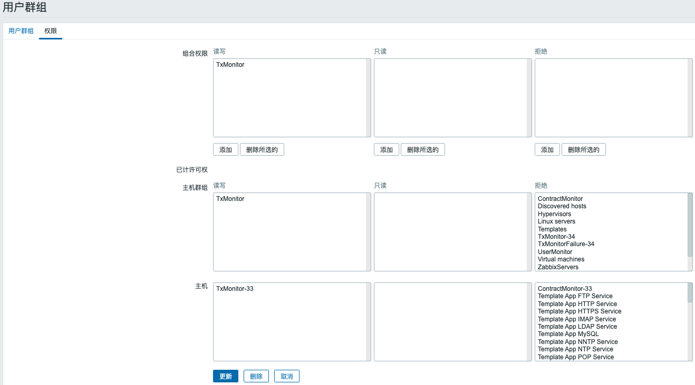

## 46 平台行为审查

1. 通过Zabbix给不同的用户分配权限





2. 创建转账合约
```shell script
./cmc client contract user create --admin-key-file-paths=../sdk/testdata/crypto-config/wx-org1.chainmaker.org/user/admin1/admin1.tls.key --admin-crt-file-paths=../sdk/testdata/crypto-config/wx-org1.chainmaker.org/user/admin1/admin1.tls.crt  --org-id=wx-org1.chainmaker.org --client-crt-file-paths=../sdk/testdata/crypto-config/wx-org1.chainmaker.org/user/client1/client1.tls.crt --client-key-file-paths=../sdk/testdata/crypto-config/wx-org1.chainmaker.org/user/client1/client1.tls.key --byte-code-path=../../test/wasm/asset-rust-0.7.2.wasm --contract-name=asset_new46 --runtime-type=WASMER --sdk-conf-path=../sdk/testdata/sdk_config.yml --version=1.0 --sync-result=true --params="{\"issue_limit\":\"1000\",\"total_supply\":\"100000000\"}"
```

日志信息：


## 47 用户行为审查

1. 特定用户发送交易

```shell script
./cmc client contract user create --admin-key-file-paths=../sdk/testdata/crypto-config/wx-org1.chainmaker.org/user/admin1/admin1.tls.key --admin-crt-file-paths=../sdk/testdata/crypto-config/wx-org1.chainmaker.org/user/admin1/admin1.tls.crt --org-id=wx-org1.chainmaker.org --chain-id=chain2 --client-crt-file-paths=../sdk/testdata/crypto-config/wx-org1.chainmaker.org/user/client1/client1.tls.crt --client-key-file-paths=../sdk/testdata/crypto-config/wx-org1.chainmaker.org/user/client1/client1.tls.key --byte-code-path=../../test/wasm/asset-rust-0.7.2.wasm --contract-name=asset_new_tt0 --runtime-type=WASMER --sdk-conf-path=../sdk/testdata/sdk_config.yml --version=1.0 --sync-result=true --enable-cert-hash=false --params="{\"issue_limit\":\"500000000\",\"total_supply\":\"1000000000\"}"
```

日志信息：


2. 冻结该用户

```shell script
./cmc client certmanage freeze --sdk-conf-path=../sdk/testdata/sdk_config.yml --cert-file-paths=../sdk/testdata/crypto-config/wx-org2.chainmaker.org/user/client1/client1.tls.crt --admin-key-file-paths=../sdk/testdata/crypto-config/wx-org1.chainmaker.org/user/admin1/admin1.tls.key --admin-crt-file-paths=../sdk/testdata/crypto-config/wx-org1.chainmaker.org/user/admin1/admin1.tls.crt --client-crt-file-paths=../sdk/testdata/crypto-config/wx-org1.chainmaker.org/user/client1/client1.tls.crt --client-key-file-paths=../sdk/testdata/crypto-config/wx-org1.chainmaker.org/user/client1/client1.tls.key --org-id=wx-org1.chainmaker.org --chain-id=chain2 --sync-result=true --enable-cert-hash=false
```


3. 使用该用户再次发送交易
```shell script
./cmc client contract user create --admin-key-file-paths=../sdk/testdata/crypto-config/wx-org1.chainmaker.org/user/admin1/admin1.tls.key --admin-crt-file-paths=../sdk/testdata/crypto-config/wx-org1.chainmaker.org/user/admin1/admin1.tls.crt --org-id=wx-org2.chainmaker.org --chain-id=chain2 --client-crt-file-paths=../sdk/testdata/crypto-config/wx-org2.chainmaker.org/user/client1/client1.tls.crt --client-key-file-paths=../sdk/testdata/crypto-config/wx-org2.chainmaker.org/user/client1/client1.tls.key --byte-code-path=../../test/wasm/asset-rust-0.7.2.wasm --contract-name=asset_new_tt --runtime-type=WASMER --sdk-conf-path=../sdk/testdata/sdk_config_bc2_node6.yml --version=1.0 --sync-result=true --enable-cert-hash=false --params="{\"issue_limit\":\"500000000\",\"total_supply\":\"1000000000\"}"
```

日志信息：


## 48 支持智能合约审计

1. 进行转账操作

```shell script
./cmc client contract user create --admin-key-file-paths=../sdk/testdata/crypto-config/wx-org1.chainmaker.org/user/admin1/admin1.tls.key --admin-crt-file-paths=../sdk/testdata/crypto-config/wx-org1.chainmaker.org/user/admin1/admin1.tls.crt --org-id=wx-org1.chainmaker.org --client-crt-file-paths=../sdk/testdata/crypto-config/wx-org1.chainmaker.org/user/client1/client1.tls.crt --client-key-file-paths=../sdk/testdata/crypto-config/wx-org1.chainmaker.org/user/client1/client1.tls.key --byte-code-path=../../test/wasm/asset-rust-0.7.2.wasm --contract-name=asset_new48 --runtime-type=WASMER --sdk-conf-path=../sdk/testdata/sdk_config.yml --version=1.0 --sync-result=true --params="{\"issue_limit\":\"1000\",\"total_supply\":\"100000000\"}"


./cmc client contract user invoke  --contract-name=asset_new48 --method=issue_amount --sdk-conf-path=../sdk/testdata/sdk_config.yml --org-id=wx-org1.chainmaker.org --client-crt-file-paths=../sdk/testdata/crypto-config/wx-org1.chainmaker.org/user/client1/client1.tls.crt --client-key-file-paths=../sdk/testdata/crypto-config/wx-org1.chainmaker.org/user/client1/client1.tls.key --params="{\"amount\":\"1000\",\"to\":\"62c6a0672c28ae914e9c5100a2262762b0a5b7b13bf4b69b3beee92c51aefd0f\"}" --sync-result=true


./cmc client contract user invoke  --contract-name=asset_new48 --method=register --org-id=wx-org2.chainmaker.org --client-crt-file-paths=../sdk/testdata/crypto-config/wx-org2.chainmaker.org/user/client1/client1.tls.crt --client-key-file-paths=../sdk/testdata/crypto-config/wx-org2.chainmaker.org/user/client1/client1.tls.key --sdk-conf-path=../sdk/testdata/sdk_config.yml --sync-result=true

./cmc client contract user invoke  --contract-name=asset_new48 --method=register --org-id=wx-org1.chainmaker.org --client-crt-file-paths=../sdk/testdata/crypto-config/wx-org1.chainmaker.org/user/client1/client1.tls.crt --client-key-file-paths=../sdk/testdata/crypto-config/wx-org1.chainmaker.org/user/client1/client1.tls.key --sdk-conf-path=../sdk/testdata/sdk_config.yml --sync-result=true


./cmc client contract user invoke  --contract-name=asset_new48 --method=issue_amount --sdk-conf-path=../sdk/testdata/sdk_config.yml --org-id=wx-org1.chainmaker.org --client-crt-file-paths=../sdk/testdata/crypto-config/wx-org1.chainmaker.org/user/client1/client1.tls.crt --client-key-file-paths=../sdk/testdata/crypto-config/wx-org1.chainmaker.org/user/client1/client1.tls.key --params="{\"amount\":\"1000\",\"to\":\"c5d7d472124c988175beacef2b482206910c94845777eb3689af33e240c67129\"}" --sync-result=true


./cmc client contract user invoke --contract-name=asset_new48 --method=transfer --sdk-conf-path=../sdk/testdata/sdk_config.yml --org-id=wx-org1.chainmaker.org --client-crt-file-paths=../sdk/testdata/crypto-config/wx-org1.chainmaker.org/user/client1/client1.tls.crt --client-key-file-paths=../sdk/testdata/crypto-config/wx-org1.chainmaker.org/user/client1/client1.tls.key --params="{\"amount\":\"1000\",\"to\":\"c5d7d472124c988175beacef2b482206910c94845777eb3689af33e240c67129\"}" --sync-result=true
```
日志信息：

