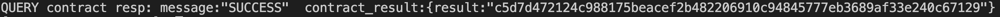
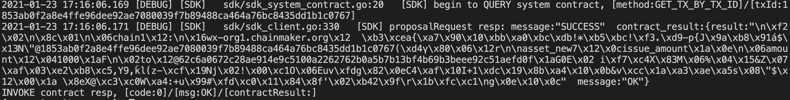
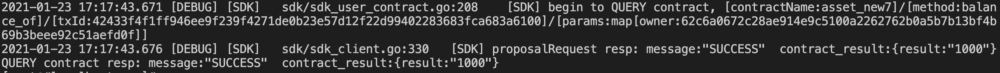
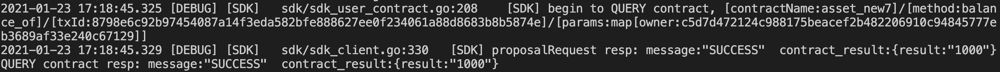
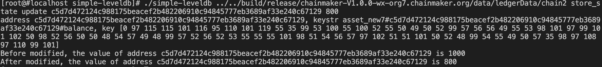
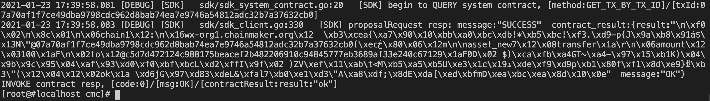
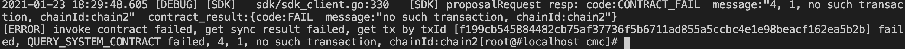
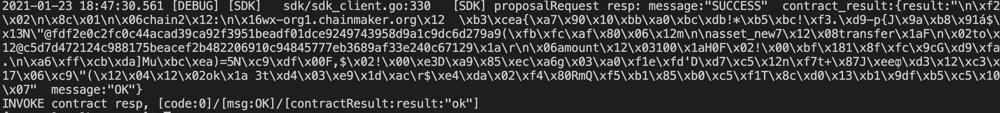

# 微芯区块链委托测试归档

## 共有操作
1. 启动7节点双链，其中chain1有5节点，chain2有7节点

2. 安装钱包合约，并默认注册钱包用户A

   ```sh
   ./cmc client contract user create --admin-key-file-paths=../sdk/testdata/crypto-config/wx-org1.chainmaker.org/user/admin1/admin1.tls.key --admin-crt-file-paths=../sdk/testdata/crypto-config/wx-org1.chainmaker.org/user/admin1/admin1.tls.crt  --org-id=wx-org1.chainmaker.org --chain-id=chain2 --client-crt-file-paths=../sdk/testdata/crypto-config/wx-org1.chainmaker.org/user/client1/client1.tls.crt --client-key-file-paths=../sdk/testdata/crypto-config/wx-org1.chainmaker.org/user/client1/client1.tls.key --byte-code-path=../../test/wasm/asset-rust-0.7.2.wasm --contract-name=asset_new7 --runtime-type=WASMER --sdk-conf-path=../sdk/testdata/sdk_config.yml --version=1.0 --sync-result=true --params="{\"issue_limit\":\"1000\",\"total_supply\":\"100000000\"}"
   ```

   

3. 注册另外一个钱包用户B

   ```sh
   ./cmc client contract user invoke  --contract-name=asset_new7 --method=register --org-id=wx-org2.chainmaker.org --chain-id=chain2 --client-crt-file-paths=../sdk/testdata/crypto-config/wx-org2.chainmaker.org/user/client1/client1.tls.crt --client-key-file-paths=../sdk/testdata/crypto-config/wx-org2.chainmaker.org/user/client1/client1.tls.key --sdk-conf-path=../sdk/testdata/sdk_config.yml --sync-result=true
   ```

   

4. 查询钱包用户A和B的地址

   ```sh
   ./cmc client contract user get  --contract-name=asset_new7 --method=query_address --sdk-conf-path=../sdk/testdata/sdk_config.yml --org-id=wx-org1.chainmaker.org --chain-id=chain2 --client-crt-file-paths=../sdk/testdata/crypto-config/wx-org1.chainmaker.org/user/client1/client1.tls.crt --client-key-file-paths=../sdk/testdata/crypto-config/wx-org1.chainmaker.org/user/client1/client1.tls.key
   
   ./cmc client contract user get  --contract-name=asset_new7 --method=query_address --sdk-conf-path=../sdk/testdata/sdk_config.yml --org-id=wx-org2.chainmaker.org --chain-id=chain2 --client-crt-file-paths=../sdk/testdata/crypto-config/wx-org2.chainmaker.org/user/client1/client1.tls.crt --client-key-file-paths=../sdk/testdata/crypto-config/wx-org2.chainmaker.org/user/client1/client1.tls.key
   ```

   

5. 分别给两个用户A和B发放1000个币

   ```sh
   ./cmc client contract user invoke  --contract-name=asset_new7 --method=issue_amount --sdk-conf-path=../sdk/testdata/sdk_config.yml --org-id=wx-org1.chainmaker.org --chain-id=chain2 --client-crt-file-paths=../sdk/testdata/crypto-config/wx-org1.chainmaker.org/user/client1/client1.tls.crt --client-key-file-paths=../sdk/testdata/crypto-config/wx-org1.chainmaker.org/user/client1/client1.tls.key --params="{\"amount\":\"1000\",\"to\":\"62c6a0672c28ae914e9c5100a2262762b0a5b7b13bf4b69b3beee92c51aefd0f\"}" --sync-result=true
   
   ./cmc client contract user invoke  --contract-name=asset_new7 --method=issue_amount --sdk-conf-path=../sdk/testdata/sdk_config.yml --org-id=wx-org1.chainmaker.org --chain-id=chain2 --client-crt-file-paths=../sdk/testdata/crypto-config/wx-org1.chainmaker.org/user/client1/client1.tls.crt --client-key-file-paths=../sdk/testdata/crypto-config/wx-org1.chainmaker.org/user/client1/client1.tls.key --params="{\"amount\":\"1000\",\"to\":\"c5d7d472124c988175beacef2b482206910c94845777eb3689af33e240c67129\"}" --sync-result=true
   ```

   

## 7 链上数据防篡改

6. 分别查询两个用户A和B余额

   ```sh
   ./cmc client contract user get  --contract-name=asset_new7 --method=balance_of --sdk-conf-path=../sdk/testdata/sdk_config.yml --org-id=wx-org1.chainmaker.org --chain-id=chain2 --client-crt-file-paths=../sdk/testdata/crypto-config/wx-org1.chainmaker.org/user/client1/client1.tls.crt --client-key-file-paths=../sdk/testdata/crypto-config/wx-org1.chainmaker.org/user/client1/client1.tls.key --params="{\"owner\":\"62c6a0672c28ae914e9c5100a2262762b0a5b7b13bf4b69b3beee92c51aefd0f\"}"
   
   ./cmc client contract user get --contract-name=asset_new7 --method=balance_of --sdk-conf-path=../sdk/testdata/sdk_config.yml --org-id=wx-org2.chainmaker.org --chain-id=chain2 --client-crt-file-paths=../sdk/testdata/crypto-config/wx-org2.chainmaker.org/user/client1/client1.tls.crt --client-key-file-paths=../sdk/testdata/crypto-config/wx-org2.chainmaker.org/user/client1/client1.tls.key --params="{\"owner\":\"c5d7d472124c988175beacef2b482206910c94845777eb3689af33e240c67129\"}"
   ```

   

   

7. 停止节点7，修改节点7的数据库，将B余额改为800个币（修改后的节点7后续的区块将不能达成共识，但不影响其他节点达成共识）

   ```sh
   cd tools/simple-leveldb
   
   go build -o simple-leveldb
   
   ./simple-leveldb ../../build/release/chainmaker-V1.0.0-wx-org7.chainmaker.org/data/ledgerData/chain2 store_state update c5d7d472124c988175beacef2b482206910c94845777eb3689af33e240c67129 800
   ```

   

8. 启动节点7，并查询用户A和B余额

   ```sh
   ./cmc client contract user get  --contract-name=asset_new7 --method=balance_of --sdk-conf-path=../sdk/testdata/sdk_config.yml --org-id=wx-org1.chainmaker.org --chain-id=chain2 --client-crt-file-paths=../sdk/testdata/crypto-config/wx-org1.chainmaker.org/user/client1/client1.tls.crt --client-key-file-paths=../sdk/testdata/crypto-config/wx-org1.chainmaker.org/user/client1/client1.tls.key --params="{\"owner\":\"62c6a0672c28ae914e9c5100a2262762b0a5b7b13bf4b69b3beee92c51aefd0f\"}"
   
   ./cmc client contract user get  --contract-name=asset_new7 --method=balance_of --sdk-conf-path=../sdk/testdata/sdk_config.yml --org-id=wx-org2.chainmaker.org --chain-id=chain2 --client-crt-file-paths=../sdk/testdata/crypto-config/wx-org2.chainmaker.org/user/client1/client1.tls.crt --client-key-file-paths=../sdk/testdata/crypto-config/wx-org2.chainmaker.org/user/client1/client1.tls.key --params="{\"owner\":\"c5d7d472124c988175beacef2b482206910c94845777eb3689af33e240c67129\"}"
   ```
   
   

9. A发起一笔交易，向B转账100个币

   ```sh
   ./cmc client contract user invoke  --contract-name=asset_new7 --method=transfer --sdk-conf-path=../sdk/testdata/sdk_config.yml --org-id=wx-org1.chainmaker.org --chain-id=chain2 --client-crt-file-paths=../sdk/testdata/crypto-config/wx-org1.chainmaker.org/user/client1/client1.tls.crt --client-key-file-paths=../sdk/testdata/crypto-config/wx-org1.chainmaker.org/user/client1/client1.tls.key --params="{\"amount\":\"100\",\"to\":\"c5d7d472124c988175beacef2b482206910c94845777eb3689af33e240c67129\"}" --sync-result=true
   ```

   

10. 查看A和B的账户余额和节点7数据库余额值

    ```sh
    ./cmc client contract user get  --contract-name=asset_new7 --method=balance_of --sdk-conf-path=../sdk/testdata/sdk_config.yml --org-id=wx-org1.chainmaker.org --chain-id=chain2 --client-crt-file-paths=../sdk/testdata/crypto-config/wx-org1.chainmaker.org/user/client1/client1.tls.crt --client-key-file-paths=../sdk/testdata/crypto-config/wx-org1.chainmaker.org/user/client1/client1.tls.key --params="{\"owner\":\"62c6a0672c28ae914e9c5100a2262762b0a5b7b13bf4b69b3beee92c51aefd0f\"}"
    
    ./cmc client contract user get  --contract-name=asset_new7 --method=balance_of --sdk-conf-path=../sdk/testdata/sdk_config.yml --org-id=wx-org2.chainmaker.org --chain-id=chain2 --client-crt-file-paths=../sdk/testdata/crypto-config/wx-org2.chainmaker.org/user/client1/client1.tls.crt --client-key-file-paths=../sdk/testdata/crypto-config/wx-org2.chainmaker.org/user/client1/client1.tls.key --params="{\"owner\":\"c5d7d472124c988175beacef2b482206910c94845777eb3689af33e240c67129\"}"
    
    ./simple-leveldb ../../build/release/chainmaker-V1.0.0-wx-org7.chainmaker.org/data/ledgerData/chain2 store_state  query c5d7d472124c988175beacef2b482206910c94845777eb3689af33e240c67129 800
    ```

## 8 消息防篡改

2. 查看A和B的账户余额

   ```sh
   ./cmc client contract user get --contract-name=asset_new7 --method=balance_of --sdk-conf-path=../sdk/testdata/sdk_config_bc2_node7.yml --org-id=wx-org1.chainmaker.org --chain-id=chain2 --client-crt-file-paths=../sdk/testdata/crypto-config/wx-org1.chainmaker.org/user/client1/client1.tls.crt --client-key-file-paths=../sdk/testdata/crypto-config/wx-org1.chainmaker.org/user/client1/client1.tls.key --params="{\"owner\":\"62c6a0672c28ae914e9c5100a2262762b0a5b7b13bf4b69b3beee92c51aefd0f\"}"
   
   ./cmc client contract user get --contract-name=asset_new7 --method=balance_of --sdk-conf-path=../sdk/testdata/sdk_config_bc2_node7.yml --org-id=wx-org2.chainmaker.org --chain-id=chain2 --client-crt-file-paths=../sdk/testdata/crypto-config/wx-org2.chainmaker.org/user/client1/client1.tls.crt --client-key-file-paths=../sdk/testdata/crypto-config/wx-org2.chainmaker.org/user/client1/client1.tls.key --params="{\"owner\":\"c5d7d472124c988175beacef2b482206910c94845777eb3689af33e240c67129\"}"
   ```

3. 修改节点7的配置，允许节点7篡改消息

   chainmaker.yml添加debug选项is_modify_tx_payload，然后重启
   
3. A发起一笔交易，向B转账100个币，查询转账结果应为失败

   ```sh
   ./cmc client contract user invoke  --contract-name=asset_new7 --method=transfer --sdk-conf-path=../sdk/testdata/sdk_config_bc2_node7.yml --org-id=wx-org1.chainmaker.org --chain-id=chain2 --client-crt-file-paths=../sdk/testdata/crypto-config/wx-org1.chainmaker.org/user/client1/client1.tls.crt --client-key-file-paths=../sdk/testdata/crypto-config/wx-org1.chainmaker.org/user/client1/client1.tls.key --params="{\"amount\":\"100\",\"to\":\"c5d7d472124c988175beacef2b482206910c94845777eb3689af33e240c67129\"}" --sync-result=true
   ```

   

## 15 共识机制有效性*

6. 分别查询两个用户A和B余额

   ```sh
   ./cmc client contract user get  --contract-name=asset_new7 --method=balance_of --sdk-conf-path=../sdk/testdata/sdk_config.yml --org-id=wx-org1.chainmaker.org --chain-id=chain2 --client-crt-file-paths=../sdk/testdata/crypto-config/wx-org1.chainmaker.org/user/client1/client1.tls.crt --client-key-file-paths=../sdk/testdata/crypto-config/wx-org1.chainmaker.org/user/client1/client1.tls.key --params="{\"owner\":\"62c6a0672c28ae914e9c5100a2262762b0a5b7b13bf4b69b3beee92c51aefd0f\"}"
   
   ./cmc client contract user get  --contract-name=asset_new7 --method=balance_of --sdk-conf-path=../sdk/testdata/sdk_config.yml --org-id=wx-org2.chainmaker.org --chain-id=chain2 --client-crt-file-paths=../sdk/testdata/crypto-config/wx-org2.chainmaker.org/user/client1/client1.tls.crt --client-key-file-paths=../sdk/testdata/crypto-config/wx-org2.chainmaker.org/user/client1/client1.tls.key --params="{\"owner\":\"c5d7d472124c988175beacef2b482206910c94845777eb3689af33e240c67129\"}"
   ```

7. 将节点7作为恶意节点，调整成共识机制不响应

   在chainmaker.yml中的debug部分添加is_prevote_lost: true，然后重启
   
8. A发起一笔交易，向B转账100个币，查询转账结果应为成功

   ```sh
   ./cmc client contract user invoke  --contract-name=asset_new7 --method=transfer --sdk-conf-path=../sdk/testdata/sdk_config.yml --org-id=wx-org1.chainmaker.org --chain-id=chain2 --client-crt-file-paths=../sdk/testdata/crypto-config/wx-org1.chainmaker.org/user/client1/client1.tls.crt --client-key-file-paths=../sdk/testdata/crypto-config/wx-org1.chainmaker.org/user/client1/client1.tls.key --params="{\"amount\":\"100\",\"to\":\"c5d7d472124c988175beacef2b482206910c94845777eb3689af33e240c67129\"}" --sync-result=true
   ```

   

9. 将节点6和节点5也作为恶意节点，调整成共识机制不响应

   在chainmaker.yml中的debug部分添加is_prevote_lost: true，然后重启

10. A发起一笔交易，向B转账100个币，查询转账结果失败（不能达成共识，发送成功后查询不到交易）

   ```sh
   ./cmc client contract user invoke  --contract-name=asset_new7 --method=transfer --sdk-conf-path=../sdk/testdata/sdk_config.yml --org-id=wx-org1.chainmaker.org --chain-id=chain2 --client-crt-file-paths=../sdk/testdata/crypto-config/wx-org1.chainmaker.org/user/client1/client1.tls.crt --client-key-file-paths=../sdk/testdata/crypto-config/wx-org1.chainmaker.org/user/client1/client1.tls.key --params="{\"amount\":\"100\",\"to\":\"c5d7d472124c988175beacef2b482206910c94845777eb3689af33e240c67129\"}" --sync-result=true
   ```

11. 

