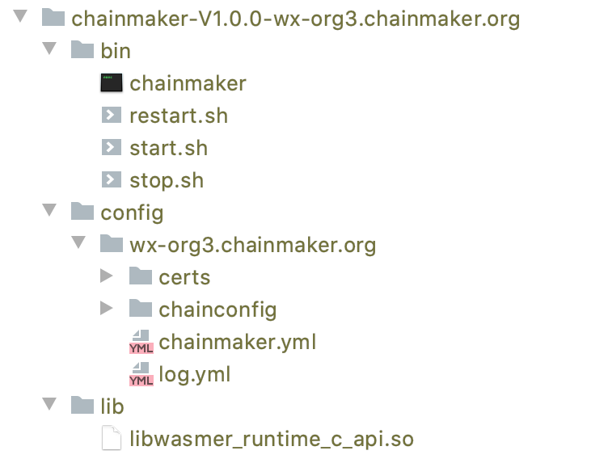

# ChainMaker开发手册

## ChainMaker介绍

当前，区块链的发展仍处于“前工业化”时代，手工作业的运作方式是此阶段的典型特征。以比特币、以太坊为代表的公有链，以Hyperledger Fabric、Quorum为代表的联盟链各具特色，各有优劣。然而对特定的商业应用，用户往往面临两难的选择，已有区块链通常难以满足特定落地场景的特殊需求，而深度定制会导致成本高企、周期冗长。例如摩根大通银行为了满足跨银行间信息交换场景中合规及性能的需求，从权限管理、共识机制、隐私保护等多方面对以太坊进行了深度定制，将其命名为Quorum并开源。作为全球资产规模最大的银行之一，摩根大通拥有足够的资源完成这一定制项目，但对一般企业而言，这种手工定制的模式是难以接受的。

此外，现阶段的区块链底层平台还拥有以下共性问题：一是无法支持不同信任程度的场景。多方合作中，既有类似比特币这种完全不互信的场景，也有类似使用单点数据库这种完全信任的场景，在完全信任与完全不互信之间，还存在多种不同的信任层次。虽然现有区块链系统大多具备一定灵活性，但仍然无法满足多种不同的信任程度。二是国内区块链底层平台生态薄弱，影响力有限。国内区块链技术企业大多利用自身技术能力和行业影响力研发与推广各自区块链底层平台，企业间的技术交流与合作较少，尚未形成创新活跃的开源生态，业界影响力与Hyperledger Fabric等国际知名项目差距较大。三是性能有待进一步提升。各个区块链底层平台在性能测试中不断取得突破，但是测试和相应优化重点主要集中在转账类交易领域，真实场景中被频繁使用的智能合约调用类交易在性能上还有很大的提升空间。

针对目前区块链底层平台标准不统一、深度定制成本高、周期长，使用者难 以快速、高效、精准地实施基于区块链技术的各类业务场景的痛点，我们推出自主创新区块链底层平台框架——区块链工厂(ChainMaker)。ChainMaker 旨在用 标准化、模块化的技术手段，将区块链的实现从现有的手工作业模式推进到自动装配生产模式，方便用户根据不同的业务需求搭建不同的区块链，从而为区块链 的技术普及和规模化应用提供基础，助力形成标准化下的开放生态。使用ChainMaker作为基础可以针对不同的应用场景进行深度定制，用户无需付出高昂的开发代价即可组装出满足需求的区块链系统，这正是ChainMaker项目开发的目的和价值。

### ChainMaker的构成


### ChainMaker的执行流程


## ChainMaker链的特性

一是抽象的区块链整体执行流程。现阶段的各种区块链实现中，整体流程差别很大。为装配出各类满足需求的区块链，ChainMaker需合理抽象出区块链整体执行流程，并基于此通用流程进行模块组合。ChainMaker后续还考虑增加整体流程的灵活性，以支持更加丰富的区块链场景。
二是将区块链深度模块化。ChainMaker不仅要求区块链模块功能的完全独立、接口定义清晰、可插拔替换，而且要求模块间通信完全虚拟化，可支持从函数调用、进程间通信（IPC）到各类网络通信协议等不同的实现模式，从而使得方便自由的模块拼装组合成为可能。
三是支持广域场景。根据业务场景特性，ChainMaker需生产出从公有链到联盟链各类基于不同信任模型的区块链，支持更加广泛的业务应用。

## 身份管理

描述证书的分类，每种类型的作用

## 共识

描述ChainMaker支持共识的分类，每类共识的形成机制

## 虚拟机

描述ChainMaker支持的虚拟机类型和集成方式

ChainMaker使用wasm标准来执行智能合约，对wasm字节码，虚拟机同时支持以解释执行的gwasm和以编译方式执行的wasmer两种执行方式。虚拟机执行智能合约的原理如下：


## 存储机制

介绍ChainMaker的存储机制，数据结构

## 配置介绍

介绍链的配置信息

## 系统合约介绍

介绍链的系统合约功能

## 合约开发

### 交易数据结构介绍

描述交易的结构和构造方式

### 开发语言

描述支持的开发语言

### 开发工具

### 开发过程示例（合约开发、部署、调用、查看）

### 合约SDK


## 客户端开发

chainmaker sdk为开发者提供了友好封装的接口，便于开发者基于chainmaker开发各种功能的应用产品。sdk一方面在用户侧为用户封装功能接口，方便用户创建各类请求和签名，另一方面通过和chainmaker节点建立连接，将用户的请求封装成节点能够识别的请求结构并通过RPC接口将请求转发给节点，并将节点的执行结果返回给调用者。

客户端在使用SDK发送请求时，可以设置是否等待执行结果，如果设置了等待方式，则在发送请求后会阻塞，直到拿到交易的执行结果。用户也可以设置不等待交易执行结果，在发送完请求后再根据交易ID通过SDK主动去查询交易，然后拿到执行结果。如果是查询类请求由于不会产生交易ID，所以是发送完请求后直接拿到响应结果。

等待方式获取结果过程如下：


查询方式获取结果过程如下：


### 数据结构

sdk定义了几个数据结构供客户使用，如下：

Node：代表节点，主要包含节点名称、节点ID、rpc地址等。

Chain：代表逻辑上的一条链，包含多个Node以及大部分对用户提供的接口。

Client：链的管理结构，包启链的创建和获取等接口。

### 接口定义


### 使用过程

客户端使用SDK的过程如下：

1. 创建Node对象
2. 创Client对象
3. 使用Client对象创建Chain对象，创建Chain时需要将Node对象作为参数传入
4. 调用Chain对象的接口进行操作

### 使用示例


## RPC接口

ChainMaker节点使用grpc为客户端提供服务接口，协议的传输使用protobuf，方便跨语言编程使用。

### RPC接口列表

```
service RpcNode {
   // SendRequest is a gerneral api, we can use it to do all things about transaction. 
   // We can set different transaction type to do different thing. So we can use it to create, upgrade, invoke and query contract.
   // And we can use it to modify configurations of chains and query parameters of chains.
   rpc SendRequest(TxRequest) returns (TxResponse) {};

   rpc Subscribe(TxRequest) returns (stream SubscribeResult) {};

   // RefreshLogLevelsConfig is used to change log levels of moudles
   rpc RefreshLogLevelsConfig(LogLevelsRequest) returns (LogLevelsResponse) {};
}
```

### RPC数据结构定义

参考ChainMaker的chainmaker-pb项目。


## 部署

ChainMaker支持多种共识协议，在部署时可以根据配置进行选择。为了方便部署和测试，ChainMaker支持solo模式。solo模式可以理解为一种单节点的共识协议，仅使用自己节点达成共识，不需要通过网络通信。ChainMaker另外还支持PBFT和RAFT等多种共识协议。

### 快速部署

ChainMaker提供了快速部署服务的工具，用于快速生成多节点的证书和配置文件，方便进行快速的部署和测试，过程如下：

#### 快速生成证书和配置文件

ChainMaker提供了快速生成证书和配置文件工具（一个组织对应单个节点），使用过程如下：

1. 下载chainmaker-go和chain maker-cryptogen代码，编译chainmaker-cryptogen

   ```
   git clone --recurse-submodules git@git.code.tencent.com:ChainMaker/chainmaker-go.git
   cd chainmaker-go/tools
   git clone --recurse-submodules git@git.code.tencent.com:ChainMaker/chainmaker-cryptogen.git
   cd chainmaker-cryptogen
   make
   ```

2. 生成证书和配置文件

   ```
   cd chainmaker-go/scripts
   ./prepare.sh 4 1 ## 参数4代表节点数量（和组织数量一致），1代表链数量
   ```

3. 查看生成的配置文件
   

说明：node1、node2、node3和node4分别是生成的四个节点的配置文件，在启动程序时可以分别放置到四个节点上去。、每个节点的配置文件包含主配置文件chainmaker.yml、日志配置文件log.yml、链配置目录chainconfig和证书目录certs。分别描述如下：

- certs: 证书目录
- certs/ca: 存放所有组织根证书的目录，每个组织有一个以组织名称命名的文件夹
- certs/node/consensusx: 全节点身份证证的证书目录
- certs/node/commonx: 其他类型节点身份认证的证书目录
- certs/user/adminx: 节点管理员身份认证证书目录
- certs/user/clientx: 节点普通用户身份认证证书目录
- chainconfig: 链配置目录
- chainconfig/bcx.yml: 具体的链配置文件
- chainmaker.yml: 节点主配置文件
- log.yml: 日志配置文件

#### 快速制作部署包

ChainMaker提供了快速制作部署包脚本，执行过程如下

```
# 制作安装包
cd chainmaker-go/script
./build_release
```

制作完成后的安装包目录如下：


#### 快速部署和启动

```
cd chainmaker-go/script
./cluster_quick_start.sh normal
```

### DIY部署

手工部署节点过程主要包括编译程序、生成证书、修改配置文件和启动服务等过程。chainmaker部署完成后的目录结构如下：



bin: 存放主程序和启动、停止和重启脚本

config：存放配置文件

lib：存放依赖库

#### 生成证书

如前面快速部署所述，ChainMaker提供的工具chainmaker-cryptogen是用来生成证书的。每个节点的证书信息证书包括组织的根证书、节点证书和用户证书。每个组织需要拥有自己的根证书，然后使用根证书分别对节点的公私钥和用户的公私钥进行签名来生成节点证书和用户证书。证书整体生成过程如下：

1. 生成组织根证书。
2. 生成节点公私钥对。
3. 使用组织根证书对节点公钥进行签名，生成节点证书。
4. 生成用户公私钥对。
5. 使用组织根证书对节点公钥进行签名，生成节点证书。

```
./chainmaker-cryptogen
Usage:
  chainmaker-cryptogen [command]

Available Commands:
  extend      Extend existing network
  generate    Generate key material
  help        Help about any command
  showconfig  Show config

Flags:
  -c, --config string   specify config file path (default "../config/crypto_config_template.yml")
  -h, --help            help for chainmaker-cryptogen

Use "chainmaker-cryptogen [command] --help" for more information about a command.

./chainmaker-cryptogen generate
```

chainmaker-cryptogen命令默认一次生成四个组织的证书，生成后的结构如下：


其中单个组织证书目录描述如下：

- ca: 存放所有组织根证书的目录，每个组织有一个以组织名称命名的文件夹
- node/consensusx: 全节点身份证证的证书目录
- node/commonx: 其他类型节点身份认证的证书目录
- user/adminx: 节点管理员身份认证证书目录
- user/clientx: 节点普通用户身份认证证书目录

#### 编辑配置文件

ChainMaker的默认配置文件需要放在config目录下面，说明如下：

- chainconfig: 链配置目录

- chainconfig/bcx.yml: 具体的链配置文件

- chainmaker.yml: 节点主配置文件

- log.yml: 日志配置文件

  chainmaker.yml配置说明：

  ```
  #chainmaker 支持的每条链的配置信息
  blockchain:
  	# 链ID
    - chainId: chain1
    	#链配置文件
      genesis: chainconfig/bc1.yml
  #  - chainId: chain2
  #    genesis: chainconfig/bc2.yml
  #  - chainId: chain3
  #    genesis: chainconfig/bc3.yml
  #  - chainId: chain4
  #    genesis: chainconfig/bc4.yml
  
  node:
    # 节点类型：full、spv
    type:           full
    # 组织ID
    org_id:         wx-org1.chainmaker.org
    # 组织的私钥文件
    priv_key_file:  ./certs/node/consensus1/consensus1.tls.key
    # 组织的公钥证书文件
    cert_file:      ./certs/node/consensus1/consensus1.tls.crt
  
  net:
    provider: LibP2P
    listen_addr: /ip4/0.0.0.0/tcp/11301
    tls:
      enabled: true
      priv_key_file: ./certs/node/consensus1/consensus1.tls.key
      cert_file:     ./certs/node/consensus1/consensus1.tls.crt
  
  txpool:
    max_txpool_size: 5120      # 普通交易池上限
    max_config_txpool_size: 10 # config交易池的上限
    full_notify_again_time: 30 # 交易池溢出后，再次通知的时间间隔(秒)
  
  rpc:
    provider: grpc
    port: 12301
    tls:
      # TLS模式:
      #   disable - 不启用TLS
      #   oneway  - 单向认证
      #   twoway  - 双向认证
      #mode: disable
      #mode: oneway
      mode:           twoway
      priv_key_file:  ./certs/node/consensus1/consensus1.tls.key
      cert_file:      ./certs/node/consensus1/consensus1.tls.crt
  
  storage:
    provider: LevelDB
    store_path: ../data/ledgerData
  
  debug:
    # 是否开启CLI功能，过度期间使用
    is_cli_open: true
    is_http_open: false
  ```

  log.yml说明如下：

  ```
  log:
    system:
      log_level_default: DEBUG      # 所有模块默认的输出级别
      log_levels:                   # 单个模块的日志输出级别，日志输出以单模块的输出配置为准，没有配置则使用所有模块默认输出级别
        core: INFO
      file_path: ../log/system.log
      max_age: 365                  # 日志最长保存时间，单位：天
      rotation_time: 1              # 日志滚动时间，单位：小时
      log_in_console: false         # 是否展示日志到终端，仅限于调试使用
      show_color: true              # 是否打印颜色日志
    brief:
      log_level: INFO
      file_path: ../log/brief.log
      max_age: 365                  # 日志最长保存时间，单位：天
      rotation_time: 1              # 日志滚动时间，单位：小时
      log_in_console: false         # 是否展示日志到终端，仅限于调试使用
      show_color: true              # 是否打印颜色日志
    event:
      log_level: INFO
      file_path: ../log/event.log
      max_age: 365                  # 日志最长保存时间，单位：天
      rotation_time: 1              # 日志滚动间隔，单位：小时
      log_in_console: false         # 是否展示日志到终端，仅限于调试使用
      show_color: true              # 是否打印颜色日志
  ```

  链配置文件bcx.yml说明

  ```
  chain_id: chain1        # 链标识
  version: v1.0.0         # 链版本
  sequence: 1             # 配置版本
  auth_type: "identity"   # 认证类型
  
  crypto:
    hash: SHA256
  
  # 交易、区块相关配置
  block:
    tx_timestamp_verify: true # 是否需要开启交易时间戳校验
    tx_timeout: 600           # 交易时间戳的过期时间(秒)
    block_tx_capacity: 100    # 区块中最大交易数
    block_size: 10            # 区块最大限制，单位MB
    block_interval: 2000      # 出块间隔，单位:ms
  
  # core模块
  core:
    tx_scheduler_timeout: 10  #  [0, 60] 交易调度器从交易池拿到交易后, 进行调度的时间
    tx_scheduler_validate_timeout: 10 # [0, 60] 交易调度器从区块中拿到交易后, 进行验证的超时时间
  
  #共识配置
  consensus:
    # 共识类型(0-POW,1-PBFT,2-TENDERMINT,3-TBFT,4-HOTSTUFF,5-RAFT,6-SOLO)
    type: 3
    # 共识节点列表，组织必须出现在trust_roots的org_id中，每个组织可配置多个共识节点，节点地址采用libp2p格式
    nodes:
      - org_id: "wx-org1.chainmaker.org"
        address:
          - "/ip4/127.0.0.1/tcp/11301/p2p/QmPormzotzqb9Sx94p1PoJFJhUpZ4U5p69LTMWXNmmmtre"
      - org_id: "wx-org2.chainmaker.org"
        address:
          - "/ip4/127.0.0.1/tcp/11302/p2p/QmVpgkeuWyMeeAn5CYGnphXPveeCRg9K664S9VKLWgAwxp"
      - org_id: "wx-org3.chainmaker.org"
        address:
          - "/ip4/127.0.0.1/tcp/11303/p2p/QmZsCV1YSqU7R4giofxZNxSG4DRDPCMQvv2ZJyCVGfTysa"
      - org_id: "wx-org4.chainmaker.org"
        address:
          - "/ip4/127.0.0.1/tcp/11304/p2p/QmVUfeP2qCDKsf39nn8b5e7b5ugKFjx1JYNTpWoRFqi4Ys"
  #    - org_id: "{org5_id}"
  #      address:
  #        - "/ip4/127.0.0.1/tcp/{org5_port}/p2p/{org5_peerid}"
  #    - org_id: "{org6_id}"
  #      address:
  #        - "/ip4/127.0.0.1/tcp/{org6_port}/p2p/{org6_peerid}"
  #    - org_id: "{org7_id}"
  #      address:
  #        - "/ip4/127.0.0.1/tcp/{org7_port}/p2p/{org7_peerid}"
    ext_config: # 扩展字段，记录难度、奖励等其他类共识算法配置
      - key: aa
        value: chain01_ext11
  
  # 信任组织和根证书
  trust_roots:
    - org_id: "wx-org1.chainmaker.org"
      root: "./certs/ca/wx-org1.chainmaker.org/ca.crt"
    - org_id: "wx-org2.chainmaker.org"
      root: "./certs/ca/wx-org2.chainmaker.org/ca.crt"
    - org_id: "wx-org3.chainmaker.org"
      root: "./certs/ca/wx-org3.chainmaker.org/ca.crt"
    - org_id: "wx-org4.chainmaker.org"
      root: "./certs/ca/wx-org4.chainmaker.org/ca.crt"
  #  - org_id: "{org5_id}"
  #    root: "./certs/ca/{org5_id}/ca.crt"
  #  - org_id: "{org6_id}"
  #    root: "./certs/ca/{org6_id}/ca.crt"
  #  - org_id: "{org7_id}"
  #    root: "./certs/ca/{org7_id}/ca.crt"
  
  # 权限配置（只能整体添加、修改、删除）
  permissions:
    - resource_name: NODE_ADDR_UPDATE
      principle:
        rule: SELF # 规则（ANY，MAJORITY...，全部大写，自动转大写）
        org_list:  # 组织名称（组织名称，区分大小写）
        role_list: # 角色名称（role，全部小写，自动转小写）
          - admin
    - resource_name: TRUST_ROOT_UPDATE
      principle:
        rule: SELF # 规则（ANY，MAJORITY...，全部大写）
        org_list:  # 组织名称（组织名称）
        role_list: # 角色名称（role，全部小写）
          - admin
    - resource_name: CONSENSUS_EXT_DELETE
      principle:
        rule: MAJORITY
        org_list:
        role_list:
          - admin
    - resource_name: BLOCK_UPDATE
      principle:
        rule: SELF
        org_list:
        role_list:
          - admin
          - client
    - resource_name: user_contract_create_method
      principle:
        rule: ANY
        org_list:
        role_list:
  ```

#### 编译程序

```
git clone --recurse-submodules git@git.code.tencent.com:ChainMaker/chainmaker-go.git
cd chainmaker-go/main
go build -o chainmaker
```

将编译好的chainmaker、启动脚本（scripts/start.sh）、停止脚本（scripts/stop.sh）、重启脚本（restart.sh）、证书文件和配置文件分别放到如前所述相应的目录下。

#### 启动节点

使用start.sh启动节点

#### 添加组织

如果单独部署的节点想要加入某个链，需要将自己组织的证书添加到节点中去

#### 添加节点


#### ChainMaker的使用场景介绍（存证）

### 合约测试示例（合约部署、测试、查看）

### 日志存储


