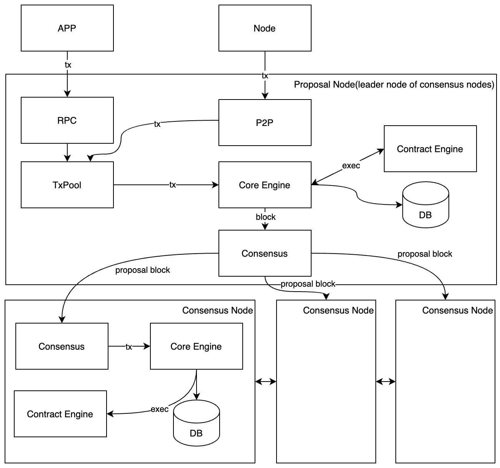
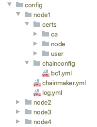
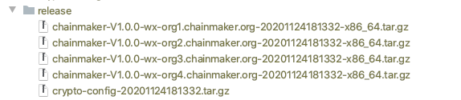

# ChainMaker开发手册

## ChainMaker介绍

当前，区块链的发展仍处于“前工业化”时代，手工作业的运作方式是此阶段的典型特征。以比特币、以太坊为代表的公有链，以Hyperledger Fabric、Quorum为代表的联盟链各具特色，各有优劣。然而对特定的商业应用，用户往往面临两难的选择，已有区块链通常难以满足特定落地场景的特殊需求，而深度定制会导致成本高企、周期冗长。例如摩根大通银行为了满足跨银行间信息交换场景中合规及性能的需求，从权限管理、共识机制、隐私保护等多方面对以太坊进行了深度定制，将其命名为Quorum并开源。作为全球资产规模最大的银行之一，摩根大通拥有足够的资源完成这一定制项目，但对一般企业而言，这种手工定制的模式是难以接受的。

此外，现阶段的区块链底层平台还拥有以下共性问题：一是无法支持不同信任程度的场景。多方合作中，既有类似比特币这种完全不互信的场景，也有类似使用单点数据库这种完全信任的场景，在完全信任与完全不互信之间，还存在多种不同的信任层次。虽然现有区块链系统大多具备一定灵活性，但仍然无法满足多种不同的信任程度。二是国内区块链底层平台生态薄弱，影响力有限。国内区块链技术企业大多利用自身技术能力和行业影响力研发与推广各自区块链底层平台，企业间的技术交流与合作较少，尚未形成创新活跃的开源生态，业界影响力与Hyperledger Fabric等国际知名项目差距较大。三是性能有待进一步提升。各个区块链底层平台在性能测试中不断取得突破，但是测试和相应优化重点主要集中在转账类交易领域，真实场景中被频繁使用的智能合约调用类交易在性能上还有很大的提升空间。

针对目前区块链底层平台标准不统一、深度定制成本高、周期长，使用者难 以快速、高效、精准地实施基于区块链技术的各类业务场景的痛点，我们推出自主创新区块链底层平台框架——区块链工厂(ChainMaker)。ChainMaker 旨在用标准化、模块化的技术手段，将区块链的实现从现有的手工作业模式推进到自动装配生产模式，方便用户根据不同的业务需求搭建不同的区块链，从而为区块链的技术普及和规模化应用提供基础，助力形成标准化下的开放生态。使用ChainMaker作为基础可以针对不同的应用场景进行深度定制，用户无需付出高昂的开发代价即可组装出满足需求的区块链系统，这正是ChainMaker项目开发的目的和价值。

### ChainMaker的构成


### ChainMaker的执行流程



## ChainMaker的特性

ChainMaker有以下特性：

- 抽象的区块链整体执行流程。现阶段的各种区块链实现中，整体流程差别很大。为装配出各类满足需求的区块链，ChainMaker需合理抽象出区块链整体执行流程，并基于此通用流程进行模块组合。ChainMaker后续还考虑增加整体流程的灵活性，以支持更加丰富的区块链场景。
- 将区块链深度模块化。ChainMaker不仅要求区块链模块功能的完全独立、接口定义清晰、可插拔替换，而且要求模块间通信完全虚拟化，可支持从函数调用、进程间通信（IPC）到各类网络通信协议等不同的实现模式，从而使得方便自由的模块拼装组合成为可能。
- 支持广域场景。根据业务场景特性，ChainMaker需生产出从公有链到联盟链各类基于不同信任模型的区块链，支持更加广泛的业务应用。

## 身份管理

描述证书的分类，每种类型的作用

## 共识

描述ChainMaker支持共识的分类，每类共识的形成机制

## 虚拟机

ChainMaker的虚拟机模块负责提供执行合约代码的环境，外部经过编译的合约代码在需要时即可通过虚拟机模块提供的接口进行执行。ChainMaker使用wasm标准来执行智能合约，对wasm字节码，虚拟机同时支持以解释执行的gasm和以编译方式执行的wasmer两种执行方式。合约的编译和执行原理如下：


虚拟机模块通过统一的VmManager对外提供接口，包括执行系统合约和用户合约。同时支持wasmer和gasm两个虚拟机。

- wasmer虚拟机对每条链提供了一个VmPoolManager，用来管理这个链上的所有合约和vmPool的映射关系，每个合约会对应一个vmPool，vmPool用于管理合约执行的多个vm实例，每次合约执行都需要一个vm的执行实例。在使用时调用VmPoolManager创建一个vmPool（创建vmPool时会将vmPool和合约代码绑定，之后再使用vmPool创建wrappedInstance时就直接包含了代码），然后使用vmPool再创建一个RuntimeInstance，再调用RuntimeInstance的invoke方法就可以了（在invoke方法里会通过vmPool获取wrappedInstance实例执行合约，从vmPool里获取的wrappedInstance实例已经包含了合约的代码，执行时将参数带进去即可）。

- gasm虚拟机则提供了一个RuntimeInstance的实现类（RuntimeImpl），可以使用RuntimeImpl的invoke方法来执行合约。
- 虚拟机模块结构如下：


## 存储机制

介绍ChainMaker的存储机制，数据结构

## 配置介绍

介绍链的配置信息

## 系统合约介绍

ChainMaker提供了一系列的系统合约供开发者调用，包链配置合约、系统查询合约和系统证书存储合约。分别介绍如下：

### 链配置合约

SYSTEM_CONTRACT_CHAIN_CONFIG

#### 查询函数

GET_CHAIN_CONFIG：查询最新的链全量配置信息。

GET_CHAIN_CONFIG_AT：返回指定区块的链配置信息

#### 更新函数

CORE_UPDATE：更新Core模块的参数，该方法需要多签，参数如下：

- tx_scheduler_timeout：uint，交易调度器从交易池拿到交易后, 进行调度的时间，其值范围为[0, 60]
- tx_scheduler_validate_timeout：uint，交易调度器从区块中拿到交易后, 进行验证的超时时间，其值范围为[0, 60]

BLOCK_UPDATE：更细block和txpool的参数，该方法需要多签，参数如下：

- tx_timestamp_verify：bool，是否需要开启交易时间戳校验
- tx_timeout：uint，交易时间戳的过期时间(秒)
- block_tx_capacity：uint，区块中最大交易数
- block_size：uint，区块最大限制，单位MB
- block_interval：uint，出块间隔，单位:ms

TRUST_ROOT_ADD：根证书添加。其参数有：

- org_id：string，机构id
- root：string，机构根证书。证书格式需符合x509

处理规则如下：

- 该方法需要所有机构admin进行多签
- org_id在原来的trust_roots中不存在
- root机构根证书需符合x509

TRUST_ROOT_UPDATE：根证书更新。其参数有：

- org_id：string，机构id
- root：string，机构根证书。证书格式需符合x509

处理规则如下：

- 该方法需要所有机构admin进行多签
- org_id在原来的trust_roots中存在
- root机构根证书需符合x509

TRUST_ROOT_DELETE：根证书删除。其参数有：

- org_id：string，机构id

处理规则如下：

- 该方法需要所有机构admin进行多签
- org_id在原来的trust_roots中存在
- 当org_id被删除后，其关联的共识节点均被删除

NODE_ORG_ADD：共识节点机构添加。其参数有：

- org_id：string，机构id
- addresses：string，节点地址列表，地址间通过逗号","隔开

处理规则如下：

- 该方法需要所有机构admin进行多签
- org_id在原共识节点中不存在
- 每个节点地址的都不可重复，和原来nodes中的地址不可重复，并且address中IP+端口不可相同，peerID不可相同

NODE_ORG_UPDATE：共识节点机构更新。其参数有：

- org_id：string，机构id
- addresses：string，节点地址列表，地址间通过逗号","隔开

处理规则如下：

- 该方法需要所有机构admin进行多签
- org_id在原共识节点中存在
- 每个节点地址的都不可重复，和原来除去org_idh后的nodes中的地址不可重复，并且address中IP+端口不可相同，peerID不可相同

NODE_ORG_DELETE：共识节点机构删除。其参数有：

- org_id：string，机构id

处理规则如下：

- 该方法需要所有机构admin进行多签
- org_id在原共识节点中存在
- 将和org_id关联的所有节点地址都会删除

NODE_ADDR_ADD：共识节点地址添加。其参数有：

- 该方法需要所有机构admin进行多签
- org_id：string，机构id
- addresses：string，节点地址列表，地址间通过逗号","隔开。不可为空

处理规则如下：

- org_id必须在原来的共识节点集合中存在
- 每个节点地址的都不可重复，和原来nodes中的地址不可重复，并且address中IP+端口不可相同，peerID不可相同
- 节点地址必须符合libp2p地址格式

NODE_ADDR_UPDATE：共识节点地址更新。其参数有：

- org_id：string，机构id
- address：string，原节点地址
- new_address：string，新节点地址

处理规则如下：

- 该方法只需被修改机构的admin签名
- org_id和address 必须在原来的nodes中存在
- new_address 必须符合libp2p路径格式，并且其IP+端口、peerId不可与其他节点重复

NODE_ADDR_DELETE：共识节点地址删除。其参数有：

- org_id：string，机构id
- address：string，节点地址

处理规则如下：

- 该方法需要所有机构admin进行多签
- org_id和address 必须在原来的nodes中存在
- 若org_id就只有一个address被删除，那么最终会出现，共识节点列表中有机构，但是没有节点地址。

CONSENSUS_EXT_ADD：共识扩展参数添加。

处理规则如下：

- 该方法需要所有机构admin进行多签
- 参数都是kv行添加
- 添加的key在原来的参数集合中不存在
- 添加新的参数时，会先将参数的key进行asc排序。然后逐个添加在原来参数数组的后面

CONSENSUS_EXT_UPDATE：共识扩展参数更新

处理规则如下：

- 该方法需要所有机构admin进行多签
- 参数都是kv行添加
- key在原来的参数集合中需存在
- 此方法只更新key对应的值，不会更改其在数组中的位置

CONSENSUS_EXT_DELETE：共识扩展参数删除。

处理规则如下：

- 该方法需要所有机构admin进行多签
- 请求时，只需要填写key值。value不关心。
- 删除的key在原来的参数集合中需存在

PERMISSION_ADD：权限添加

处理规则如下：

- 该方法需要所有机构admin进行多签
- 权限的resourceName在原权限集合中不存在
- 如果resourceName是系统方法，此操作会覆盖系统设定的权限。

PERMISSION_UPDATE：权限更新

处理规则如下：

- 该方法需要所有机构admin进行多签
- 权限的resourceName在原权限集合中存在

PERMISSION_DELETE：权限删除

处理规则如下：

- 该方法需要所有机构admin进行多签
- 权限的resourceName在原权限集合中不存在
- 如果resourceName是系统方法，此操作会重新启用系统默认权限。

### 系统查询合约

SYSTEM_CONTRACT_QUERY

#### 函数

GET_TX_BY_TX_ID：根据交易ID查询交易，参数：交易ID

GET_BLOCK_BY_HEIGHT：根据高度查询区块，参数：区块高度

GET_CHAIN_INFO：查询链信息

GET_LAST_CONFIG_BLOCK：获取最后一个配置块

GET_BLOCK_BY_HASH：根据HASH值查找区块，参数：区块HASH值

GET_NODE_CHAIN_LIST：查询节点加入的链列表

### 系统证书存储合约

#### 函数

CERT_ADD：添加证书

CERTS_DELETE：删除证书，参数：证书哈希列表

CERTS_QUERY：查询证书，参数：证书哈希列表

## 合约开发

ChainMaker支持用户合约的发布、调用和升级（推荐使用客户端开发中介绍的SDK完成），对组织中的成员这些过程都是免费的，为了避免合约的误操作带来的对链的消耗，ChainMaker使用gas对合约进行限制。当前单个合约最大能消耗的gas是10000000，对一般正常的合约足够使用了。ChainMaker支持的两个虚拟机gasm和wasmer对指令集消耗的gas不太一样，gasm对应消耗的gas参考文档gasm-gas.md，wasmer对应消耗的gas参考文档wasmer-gas.md。


ChainMaker为了避免合约的误操作，除了对单个合约执行的gas限制外，还有对跨合约调用作了限制，最大允许的跨合约调用深度为5，还有就是对单个块交易的执行总时间限制，最长不能超过10s。

### 交易数据结构介绍

描述交易的结构和构造方式

### 开发语言

描述支持的开发语言

### 开发工具

### 开发过程示例（合约开发、部署、调用、查看）

### 合约SDK


## 客户端开发

chainmaker sdk为开发者提供了友好封装的接口，便于开发者基于chainmaker开发各种功能的应用产品。sdk一方面在用户侧为用户封装功能接口，方便用户创建各类请求和签名，另一方面通过和chainmaker节点建立连接，将用户的请求封装成节点能够识别的请求结构并通过RPC接口将请求转发给节点，并将节点的执行结果返回给调用者。

客户端在使用SDK发送请求时，可以设置是否等待执行结果，如果设置了等待方式，则在发送请求后会阻塞，直到拿到交易的执行结果。用户也可以设置不等待交易执行结果，在发送完请求后再根据交易ID通过SDK主动去查询交易，然后拿到执行结果。如果是查询类请求由于不会产生交易ID，所以是发送完请求后直接拿到响应结果。

等待方式获取结果过程如下：


查询方式获取结果过程如下：


### Java SDK

#### 基本概念定义

Java SDK定义了ChainClient、ChainNode、ChainManager和ResponseInfo几个类，分别介绍如下：

ChainClient：客户端开发最重要也是使用最多的类，代表逻辑上的一条链，所有客户端对链的操作接口都来自ChainClient。

ChainNode：表示链的一个节点信息，它定义了节点的各种属性，如节点连接的RPC地址，连接所用的密钥信息等，一个ChainClient对象需要包含一个或多个ChainNode，这样才能对过节点实现各种功能。

ChainManager：负责管理所有创建过的链，是一个使用单例模式的链管理类，避免用户同一条链创建多个ChainClient。用户可以使用ChainManager来检查某条链是否已经创建，或者直接创建某条链，如果这条链已经创建，ChainManager会直接返回之前已经创建过的

ResponseInfo：对于创建合约、更新合约、调用合约和查询合约几个接口返回响应内容，其中包括交易ID，用于当用户请求超时后，后续主动查询交易结果。

ChainClient对象给用户使用。数据结构定义如下：

```java
public class ChainClient {
    // chainId is the identity of the chain
    private final String chainId;
    // the nodes of the chain
    private final List<ChainNode> chainNodes;
    // rpc client used to send rpc command
    private RpcServiceClient rpcServiceClient;

    // the organization id of the user
    private final String orgId;
    // user's private key used to sign transaction
    private final PrivateKey privateKey;
    // user's certificate
    private final Certificate certificate;
    // the bytes of user's certificate
    private final byte[] certBytes;
}

public class ChainNode {
    // node grpc address
    private String grpcUrl;
    // rpc client private key bytes
    private byte[] clientKeyBytes;
    // rpc client certificate bytes
    private byte[] clientCertBytes;
    // the organization's ca cert bytes
    private byte[] tlsCertBytes;
    // the hostname in client certificate
    private String hostname;
    // TLS or PLAINTEXT
    private String negotiationType;
    // OPENSSL or JDK
    private String sslProvider;
}

public class ChainManager {
    // chains' map
    private final Map<String, ChainClient> chains = new HashMap<>();
    // for singleton mode
    private static final ChainManager chainManager = new ChainManager();
}

public class ResponseInfo {
		// response of request
    private ChainmakerResult.TxResponse txResponse;
    // txId of the request
    private String txId;
    // 同步获取交易执行的结果
    private ChainmakerTransaction.TransactionInfo syncResultTxInfo;
}
```

#### 接口定义

以下描述了所有用户能够对链进行操作的接口，全部来自ChainClient类

```java
    // 1 用户合约接口
    // 1.1 生成用于创建合约的待签名payload
    // **参数说明**
    //   - contractName: 合约名
    //   - version: 版本号
    //   - runtimeType: 合约运行环境
    //   - params: 合约初始化参数
    //   - byteCodes: 合约字节数组
    // **返回值说明**
    // 返回payload字节数组
    // ```java
    public byte[] createPayloadOfContractCreation(String contractName, String version,
                                                  Contract.RuntimeType runtimeType, Map<String, String> params,
                                                  byte[] byteCodes) {
    }
    // ```

    // ### 1.2 生成用于管理（创建或升级）合约的签名后的payload
    // **参数说明**
    //   - payload: 签名前的payload
    // **返回值说明**
    // 返回带签名的payload字节数组
    // ```java
    public byte[] signPayloadOfContractMgmt(byte[] payload) throws InvalidProtocolBufferException {
    }
    // ```
    
    // ### 1.3 将多个带签名后的payload合并成一个带多个签名的payload，所有签名都放在一个payload后面
    // **参数说明**
    //   - payloads: 多个带签名的payload
    // **返回值说明**
    // 返回带多个签名的payload字节数组
    // ```java
    public byte[] mergeSignedPayloadsOfContractMgmt(byte[][] payloads) throws InvalidProtocolBufferException {
    }
    // ```
    
    // ### 1.4 创建合约
    // **参数说明**
    //   - payloadWithEndorsementsBytes: 带签名的合约内容
    //   - rpcCallTimeout: 调用rcp接口超时时间, 单位：毫秒
    //   - syncResultTimeout: 同步获取执行结果超时时间，小于等于0代表不等待执行结果，
    //   直接返回（返回信息里包含交易ID），单位：毫秒
    // ```java
    public ResponseInfo createContract(byte[] payloadWithEndorsementsBytes, long rpcCallTimeout,
                                       long syncResultTimeout) throws InvalidProtocolBufferException {
    }
    // ```

    // ### 1.5 创建升级合约待签名的payload
    // **参数说明**
    //   - contractName: 合约名
    //   - version: 版本号
    //   - runtimeType: 合约运行环境
    //   - params: 合约初始化参数
    //   - byteCodes: 合约字节数组
    // ```java
    public byte[] createPayloadOfContractUpgrade(String contractName, String version,
                                                 Contract.RuntimeType runtimeType, Map<String, String> params,
                                                 byte[] byteCodes) {
    }
    // ```
    
    // ### 1.6 升级合约
    // **参数说明**
    //   - payloadWithEndorsementsBytes: 带签名的合约内容
    //   - rpcCallTimeout: 调用rcp接口超时时间, 单位：毫秒
    //   - syncResultTimeout: 同步获取执行结果超时时间，小于等于0代表不等待执行结果，
    //   直接返回（返回信息里包含交易ID），单位：毫秒
    // ```java
    public ResponseInfo upgradeContract(byte[] payloadWithEndorsementsBytes, long rpcCallTimeout,
                                        long syncResultTimeout) throws InvalidProtocolBufferException {
    }
    // ```

    // ### 1.7 执行合约接口
    // **参数说明**
    //   - contractName: 合约名
    //   - method: 方法名
    //   - params: 执行参数
    //   - rpcCallTimeout: 调用rcp接口超时时间, 单位：毫秒
    //   - syncResultTimeout: 同步获取执行结果超时时间，小于等于0代表不等待执行结果，
    //   直接返回（返回信息里包含交易ID），单位：毫秒
    // ```java
    public ResponseInfo invokeContract(String contractName, String method,
                                       Map<String, String> params, long rpcCallTimeout,
                                       long syncResultTimeout) throws InvalidProtocolBufferException {
    }
    // ```

    // ### 1.8 查询合约接口
    // **参数说明**
    //   - contractName: 合约名
    //   - method: 方法名
    //   - params: 执行参数
    //   - timeout: 执行超时时间
    // ```java
    public ResponseInfo queryContract(String contractName, String method,
                                      Map<String, String> params, long timeout) {
    }
    // ```

    // ## 2 系统合约接口
    // ### 2.1 根据交易Id查询交易
    // **参数说明**
    //   - txId: 交易ID
    // ```java
    public ChainmakerTransaction.TransactionInfo getTxByTxId(String txId, long timeout)
            throws InvalidProtocolBufferException {
    }
    // ```

    // ### 2.2 根据区块高度查询区块
    // **参数说明**
    //   - blockHeight: 区块高度
    //   - withRWSet: 是否返回读写集
    // ```java
    public ChainmakerBlock.BlockInfo getBlockByHeight(long blockHeight, boolean withRWSet, long timeout)
            throws InvalidProtocolBufferException {
    }
    // ```

    // ### 2.3 根据区块哈希查询区块
    // **参数说明**
    //   - blockHash: 区块高度
    //   - withRWSet: 是否返回读写集
    // ```java
    public ChainmakerBlock.BlockInfo getBlockByHash(String blockHash, boolean withRWSet, long timeout)
            throws InvalidProtocolBufferException  {
    }
    // ```

    // ### 2.4 根据交易Id查询区块
    // **参数说明**
    //   - txId: 交易Id
    //   - withRWSet: 是否返回读写集
    // ```java
    public ChainmakerBlock.BlockInfo getBlockByTxId(String txId, boolean withRWSet, long timeout)
            throws InvalidProtocolBufferException {
    }
    // ```

    // ### 2.5 查询上一个配置块
    // **参数说明**
    //   - withRWSet: 是否返回读写集
    // ```java
    public ChainmakerBlock.BlockInfo getLastConfigBlock(boolean withRWSet, long timeout)
            throws InvalidProtocolBufferException {
    }
    // ```

    // ### 2.6 查询节点已部署的所有合约信息
    //    - 包括：合约名、合约版本、运行环境、交易ID
    // ```java
    public Contract.ContractInfo getContractInfo(long timeout)
            throws InvalidProtocolBufferException {
    }
    // ```

    // ### 2.7 查询节点加入的链信息
    //    - 返回ChainId清单
    // ```java
    public Discovery.ChainList getNodeChainList(long timeout)
            throws InvalidProtocolBufferException {
    }
    // ```

    // ### 2.8 查询链信息
    //   - 包括：当前链最新高度，链节点信息
    // ```java
    public Discovery.ChainInfo getChainInfo(long timeout)
            throws InvalidProtocolBufferException {
    }
    // ```

    // ## 3 链配置接口
    // ### 3.1 查询最新链配置
    // ```java
    public ChainmakerConfig.ChainConfig getChainConfig(long timeout)
            throws InvalidProtocolBufferException {
    }
    // ```

    // ### 3.2 根据指定区块高度查询最近链配置
    //   - 如果当前区块就是配置块，直接返回当前区块的链配置
    // ```java
    public ChainmakerConfig.ChainConfig getChainConfigByBlockHeight(int blockHeight, long timeout)
            throws InvalidProtocolBufferException {
    }
    // ```

    // ### 3.3 查询最新链配置序号Sequence
    //   - 用于链配置更新
    // ```java
    public long getChainConfigSequence(long timeout)
            throws TimeoutException, InvalidProtocolBufferException {
    }
    // ```

    // ### 3.4 更新Core模块待签名payload生成
    // **参数说明**
    //   - txSchedulerTimeout: 交易调度器从交易池拿到交易后, 进行调度的时间，其值范围为[0, 60]，若无需修改，请置为-1
    //   - txSchedulerValidateTimeout: 交易调度器从区块中拿到交易后, 进行验证的超时时间，其值范围为[0, 60]，
    //     若无需修改，请置为-1
    // ```java
    public byte[] createPayloadOfChainConfigCoreUpdate(int txSchedulerTimeout, int txSchedulerValidateTimeout,
    																									 long timeout)
            throws TimeoutException, InvalidProtocolBufferException {
    }
    // ```

    // ### 3.5 更新Core模块待签名payload生成
    // **参数说明**
    //   - txTimestampVerify: 是否需要开启交易时间戳校验
    //   - (以下参数，若无需修改，请置为-1)
    //   - txTimeout: 交易时间戳的过期时间(秒)，其值范围为[600, +∞)
    //   - blockTxCapacity: 区块中最大交易数，其值范围为(0, +∞]
    //   - blockSize: 区块最大限制，单位MB，其值范围为(0, +∞]
    //   - blockInterval: 出块间隔，单位:ms，其值范围为[10, +∞]
    // ```java
    public byte[] createPayloadOfChainConfigBlockUpdate(boolean txTimestampVerify, int txTimeout, 
    																										int blockTxCapacity, int blockSize, int blockInterval,
                                                        long timeout)
            throws TimeoutException, InvalidProtocolBufferException {
    }
    // ```

    // ### 3.6 添加信任组织根证书待签名payload生成
    // **参数说明**
    //   - trustRootOrgId: 组织Id
    //   - trustRootCrt: 根证书
    // ```java
    public byte[] createPayloadOfChainConfigTrustRootAdd(String trustRootOrgId, String trustRootCrt, 
    																										 long timeout)
            throws TimeoutException, InvalidProtocolBufferException {
    }
    // ```

    // ### 3.7 更新信任组织根证书待签名payload生成
    // **参数说明**
    //   - trustRootOrgId: 组织Id
    //   - trustRootCrt: 根证书
    // ```java
    public byte[] createPayloadOfChainConfigTrustRootUpdate(String trustRootOrgId, String trustRootCrt, 
    																												long timeout)
            throws TimeoutException, InvalidProtocolBufferException {
    }
    // ```

    // ### 3.8 删除信任组织根证书待签名payload生成
    // **参数说明**
    //   - trustRootOrgId: 组织Id
    // ```java
    public byte[] createPayloadOfChainConfigTrustRootDelete(String trustRootOrgId, long timeout)
            throws TimeoutException, InvalidProtocolBufferException {
    }
    // ```

    // ### 3.9 添加权限配置待签名payload生成
    // **参数说明**
    //   - permissionResourceName: 权限名
    //   - principle: 权限规则
    // ```java
    public byte[] createPayloadOfChainConfigPermissionAdd(String permissionResourceName,
                                                          PrincipleOuterClass.Principle principal, long timeout)
            throws TimeoutException, InvalidProtocolBufferException {
    }
    // ```

    // ### 3.10 更新权限配置待签名payload生成
    // **参数说明**
    //   - permissionResourceName: 权限名
    //   - principle: 权限规则
    // ```java
    public byte[] createPayloadOfChainConfigPermissionUpdate(String permissionResourceName,
                                                             PrincipleOuterClass.Principle principal, 
                                                             long timeout)
            throws TimeoutException, InvalidProtocolBufferException {
    }
    // ```

    // ### 3.11 删除权限配置待签名payload生成
    // **参数说明**
    //   - permissionResourceName: 权限名
    // ```java
    public byte[] createPayloadOfChainConfigPermissionDelete(String permissionResourceName, long timeout)
            throws TimeoutException, InvalidProtocolBufferException {
    }
    // ```

    // ### 3.12 添加共识节点地址待签名payload生成
    // **参数说明**
    //   - nodeOrgId: 节点组织Id
    //   - nodeAddresses: 节点地址
    // ```java
    public byte[] createPayloadOfChainConfigConsensusNodeAddrAdd(String nodeOrgId, String[] nodeAddresses, 
    																														 long timeout)
            throws TimeoutException, InvalidProtocolBufferException {
    }
    // ```

    // ### 3.13 更新共识节点地址待签名payload生成
    // **参数说明**
    //   - nodeOrgId: 节点组织Id
    //   - nodeOldAddress: 节点原地址
    //   - nodeNewAddress: 节点新地址
    // ```java
    public byte[] createPayloadOfChainConfigConsensusNodeAddrUpdate(String nodeOrgId, String nodeOldAddress,
                                                                    String nodeNewAddress, long timeout)
            throws TimeoutException, InvalidProtocolBufferException {
    }
    // ```

    // ### 3.14 删除共识节点地址待签名payload生成
    // **参数说明**
    //   - nodeOrgId: 节点组织Id
    //   - nodeAddress: 节点地址
    // ```java
    public byte[] createPayloadOfChainConfigConsensusNodeAddrDelete(String nodeOrgId, String nodeAddress, 
    																																long timeout)
            throws TimeoutException, InvalidProtocolBufferException {
    }
    // ```

    // ### 3.15 添加共识节点待签名payload生成
    // **参数说明**
    //   - nodeOrgId: 节点组织Id
    //   - nodeAddresses: 节点地址
    // ```java
    public byte[] createPayloadOfChainConfigConsensusNodeOrgAdd(String nodeOrgId, String[] nodeAddresses, 
    																														long timeout)
            throws TimeoutException, InvalidProtocolBufferException {
    }
    // ```

    // ### 3.16 更新共识节点待签名payload生成
    // **参数说明**
    //   - nodeOrgId: 节点组织Id
    //   - nodeAddresses: 节点地址
    // ```java
    public byte[] createPayloadOfChainConfigConsensusNodeOrgUpdate(String nodeOrgId, String[] nodeAddresses, 
    																															 long timeout)
            throws TimeoutException, InvalidProtocolBufferException {
    }
    // ```

    // ## 3 链配置接口
    // ### 3.17 删除共识节点待签名payload生成
    // **参数说明**
    //   - nodeOrgId: 节点组织Id
    // ```java
    public byte[] createChainConfigConsensusNodeOrgDeletePayload(String nodeOrgId, long timeout)
            throws TimeoutException, InvalidProtocolBufferException {
    }
    // ```

    // ## 3 链配置接口
    // ### 3.18 添加共识扩展字段待签名payload生成
    // **参数说明**
    //   - params: Map<String, String>
    // ```java
    public byte[] createPayloadOfChainConfigConsensusExtAdd(Map<String, String> params, long timeout)
            throws TimeoutException, InvalidProtocolBufferException {
    }
    // ```

    // ## 3 链配置接口
    // ### 3.19 添加共识扩展字段待签名payload生成
    // **参数说明**
    //   - params: Map<String, String>
    // ```java
    public byte[] createPayloadOfChainConfigConsensusExtUpdatePayload(Map<String, String> params, long timeout)
            throws TimeoutException, InvalidProtocolBufferException {
    }
    // ```

    // ## 3 链配置接口
    // ### 3.20 添加共识扩展字段待签名payload生成
    // **参数说明**
    //   - keys: 待删除字段
    // ```java
    public byte[] createPayloadOfChainConfigConsensusExtDelete(String[] keys, long timeout)
            throws TimeoutException, InvalidProtocolBufferException {
    }
    // ```

    // ## 3 链配置接口
    // ### 3.21 链配置更新获取Payload签名
    // ```java
    public byte[] signPayloadOfChainConfig(byte[] payloadBytes) throws InvalidProtocolBufferException {
    }
    // ```

    // ## 3 链配置接口
    // ### 3.22 链配置更新Payload签名收集&合并
    // ```java
    public byte[] mergeSignedPayloadsOfChainConfig(byte[][] payloads) throws InvalidProtocolBufferException {
    }
    // ```

    // ## 3 链配置接口
    // ### 3.23 发送链配置更新请求
    // ```java
    public ResponseInfo updateChainConfig(byte[] payloadWithEndorsementsBytes, long timeout) {
    }
    // ```


    // ## 4 证书管理接口
    // ### 4.1 用户证书添加
    // **参数说明**
    //   - 在pb.TxResponse.ContractResult.Result字段中返回成功添加的certHash
    // ```java
    public ResponseInfo addCert(long timeout) {
    }
    // ```

    // ### 4.2 用户证书删除
    // **参数说明**
    //   - certHashes: 证书Hash列表
    // ```java
    public ResponseInfo deleteCert(String[] certHashes, long timeout) {
    }
    // ```

    // ### 4.3 用户证书查询
    // **参数说明**
    //   - certHashes: 证书Hash列表
    // 返回值说明：
    //   - *pb.CertInfos: 包含证书Hash和证书内容的列表
    // ```java
    public ChainmakerResult.CertInfos queryCert(String[] certHashes, long timeout)
            throws InvalidProtocolBufferException {
    }
    // ```

    // ## 5 消息订阅接口
    // ### 5.1 区块订阅
    // **参数说明**
    //   - startBlock: 订阅起始区块高度，若为-1，表示订阅实时最新区块
    //   - endBlock: 订阅结束区块高度，若为-1，表示订阅实时最新区块
    //   - withRwSet: 是否返回读写集
    // ```java
    public void subscribeBlock(long startBlock, long endBlock, boolean withRwSet,
                                StreamObserver<ChainmakerResult.SubscribeResult> blockStreamObserver) {
    }
    // ```

    // ### 5.2 交易订阅
    // **参数说明**
    //   - startBlock: 订阅起始区块高度，若为-1，表示订阅实时最新区块
    //   - endBlock: 订阅结束区块高度，若为-1，表示订阅实时最新区块
    //   - txType: 订阅交易类型,若为pb.TxType(-1)，表示订阅所有交易类型
    //   - txIds: 订阅txId列表，若为空，表示订阅所有txId
    // ```java
    public void subscribeTx(long startBlock, long endBlock, Request.TxType txType, String[] txIds,
                            StreamObserver<ChainmakerResult.SubscribeResult> txStreamObserver) {
    }
    // ```

    // ## 6 管理类接口
    // ### 6.1 SDK停止接口：关闭连接池连接，释放资源
    // ```java
    public void stop() {
    }
    // ```
```

#### 使用过程

客户端使用SDK的过程如下：

1. 创建ChainNode对象
2. 获取ChainManager单例对象
3. 使用ChainManager获取或创建链对象，创建ChainClient时需要将ChainNode对象作为参数传入
4. 调用ChainClient对象的接口进行操作

#### 使用示例

1. 初始化，创建ChainClient

   ```java
   public void init() {
       try {
           ChainNode chainNode = ChainNode.builder().clientKeyBytes(FileUtils.getResourceFileBytes(GRPC_TLS_KEY_PATH))
                   .clientCertBytes(FileUtils.getResourceFileBytes(GRPC_TLS_CERT_PATH))
                   .tlsCertBytes(FileUtils.getResourceFileBytes(GRPC_CERT_PATH))
                   .hostname(TLS_HOST_NAME).grpcUrl(NODE_GRPC_URL)
                   .sslProvider("openSSL").negotiationType("TLS").build();
           chainManager = ChainManager.getInstance();
           chainClient = chainManager.getChainClient(CHAIN_ID);
           if (chainClient == null) {
               chainClient = chainManager.createChainClient(CHAIN_ID, ORG_ID, FileUtils.getResourceFileBytes(USER_KEY_PATH),
                       FileUtils.getResourceFileBytes(USER_CERT_PATH), chainNode);
           }
       } catch (Exception e) {
           System.out.printf("test init exception", e);
       }
   }
   ```

2. 创建合约

   ```java
   public void testCreateContract() throws IOException, InterruptedException, ExecutionException, TimeoutException {
       byte[] byteCode = FileUtils.getResourceFileBytes(CONTRACT_FILE_PATH);
   
       // 1. create payload
       byte[] payload = chainClient.createPayloadOfContractCreation(CONTRACT_NAME,
               "1", Contract.RuntimeType.WASMER_RUST, null, byteCode);
   
       // 2. create payloads with endorsement
       byte[] payloadWithEndorsement1 = chainClient.signPayloadOfContractMgmt(payload);
   
       // 3. merge endorsements using payloadsWithEndorsement
       byte[][] payloadsWithEndorsement = new byte[1][];
       payloadsWithEndorsement[0] = payloadWithEndorsement1;
       byte[] payloadWithEndorsement = chainClient.mergeSignedPayloadsOfContractMgmt(payloadsWithEndorsement);
   
       // 4. create contract
       ResponseInfo responseInfo = chainClient.createContract(payloadWithEndorsement, 5000, 5000);
   }
   ```

3. 调用合约

   ```java
   public void testInvokeContract() throws Exception {
   
       Map<String, String> params = new HashMap<>();
       params.put("time", System.currentTimeMillis()+"");
       params.put("file_hash", UUID.randomUUID().toString());
       params.put("file_name", UUID.randomUUID().toString()+System.currentTimeMillis());
       ResponseInfo responseInfo = chainClient.invokeContract(QUERY_CONTRACT_NAME, QUERY_CONTRACT_METHOD, params, 5000, 5000);
   }
   ```

### Go SDK

#### 基本概念定义

#### 接口定义

```go
type SDKInterface interface {
   // ## 1 用户合约接口
   // ### 1.1 创建合约待签名payload生成
   // **参数说明**
   //   - contractName: 合约名
   //   - version: 版本号
   //   - byteCodePath: 合约路径
   //   - runtime: 合约运行环境
   //   - kvs: 合约初始化参数
   // ```go
   CreateContractCreatePayload(contractName, version, byteCodePath string, runtime pb.RuntimeType, kvs []*pb.KeyValuePair) ([]byte, error)
   // ```

   // ### 1.2 升级合约待签名payload生成
   // **参数说明**
   //   - contractName: 合约名
   //   - version: 版本号
   //   - byteCodePath: 合约路径
   //   - runtime: 合约运行环境
   //   - kvs: 合约升级参数
   // ```go
   CreateContractUpgradePayload(contractName, version, byteCodePath string, runtime pb.RuntimeType, kvs []*pb.KeyValuePair) ([]byte, error)
   // ```

   // ### 1.3 合约管理获取Payload签名
   // ```go
   SignContractManagePayload(payloadBytes []byte) ([]byte, error)
   // ```

   // ### 1.4 合约管理Payload签名收集&合并
   // ```go
   MergeContractManageSignedPayload(signedPayloadBytes [][]byte) ([]byte, error)
   // ```

   // ### 1.5 发送创建合约请求
   // **参数说明**
   //   - multiSignedPayload: 多签结果
   //   - timeout: 超时时间，单位：s，若传入-1，将使用默认超时时间：10s
   //   - withSyncResult: 是否同步获取交易执行结果
   //            当为true时，若成功调用，pb.TxResponse.ContractResult.Result为pb.TransactionInfo
   //            当为false时，若成功调用，pb.TxResponse.ContractResult.Result为txId
   // ```go
   SendContractCreateRequest(mergeSignedPayloadBytes []byte, timeout int64, withSyncResult bool) (*pb.TxResponse, error)
   // ```

   // ### 1.6 发送升级合约请求
   // **参数说明**
   //   - multiSignedPayload: 多签结果
   //   - timeout: 超时时间，单位：s，若传入-1，将使用默认超时时间：10s
   //   - withSyncResult: 是否同步获取交易执行结果
   //            当为true时，若成功调用，pb.TxResponse.ContractResult.Result为pb.TransactionInfo
   //            当为false时，若成功调用，pb.TxResponse.ContractResult.Result为txId
   // ```go
   SendContractUpgradeRequest(mergeSignedPayloadBytes []byte, timeout int64, withSyncResult bool) (*pb.TxResponse, error)
   // ```

   // ### 1.7 合约调用
   // **参数说明**
   //   - contractName: 合约名称
   //   - method: 合约方法
   //   - txId: 交易ID
   //           格式要求：长度为64bit，字符在a-z0-9
   //           可为空，若为空字符串，将自动生成txId
   //   - params: 合约参数
   //   - timeout: 超时时间，单位：s，若传入-1，将使用默认超时时间：10s
   //   - withSyncResult: 是否同步获取交易执行结果
   //            当为true时，若成功调用，pb.TxResponse.ContractResult.Result为pb.TransactionInfo
   //            当为false时，若成功调用，pb.TxResponse.ContractResult.Result为txId
   // ```go
   InvokeContract(contractName, method, txId string, params map[string]string, timeout int64, withSyncResult bool) (*pb.TxResponse, error)
   // ```

   // ### 1.8 合约查询接口调用
   // **参数说明**
   //   - contractName: 合约名称
   //   - method: 合约方法
   //   - params: 合约参数
   //   - timeout: 超时时间，单位：s，若传入-1，将使用默认超时时间：10s
   // ```go
   QueryContract(contractName, method string, params map[string]string, timeout int64) (*pb.TxResponse, error)
   // ```

   // ## 2 系统合约接口
   // ### 2.1 根据交易Id查询交易
   // **参数说明**
   //   - txId: 交易ID
   // ```go
   GetTxByTxId(txId string) (*pb.TransactionInfo, error)
   // ```

   // ### 2.2 根据区块高度查询区块
   // **参数说明**
   //   - blockHeight: 指定区块高度，若为-1，将返回最新区块
   //   - withRWSet: 是否返回读写集
   // ```go
   GetBlockByHeight(blockHeight int64, withRWSet bool) (*pb.BlockInfo, error)
   // ```

   // ### 2.3 根据区块哈希查询区块
   // **参数说明**
   //   - blockHash: 指定区块Hash
   //   - withRWSet: 是否返回读写集
   // ```go
   GetBlockByHash(blockHash string, withRWSet bool) (*pb.BlockInfo, error)
   // ```

   // ### 2.4 根据交易Id查询区块
   // **参数说明**
   //   - txId: 交易ID
   //   - withRWSet: 是否返回读写集
   // ```go
   GetBlockByTxId(txId string, withRWSet bool) (*pb.BlockInfo, error)
   // ```

   // ### 2.5 查询最新的配置块
   // **参数说明**
   //   - withRWSet: 是否返回读写集
   // ```go
   GetLastConfigBlock(withRWSet bool) (*pb.BlockInfo, error)
   // ```

   // ### 2.6 查询节点已部署的所有合约信息
   //    - 包括：合约名、合约版本、运行环境、交易ID
   // ```go
   GetContractInfo() (*pb.ContractInfo, error)
   // ```

   // ### 2.7 查询节点加入的链信息
   //    - 返回ChainId清单
   // ```go
   GetNodeChainList() (*pb.ChainList, error)
   // ```

   // ### 2.8 查询链信息
   //   - 包括：当前链最新高度，链节点信息
   // ```go
   GetChainInfo() (*pb.ChainInfo, error)
   // ```

   // ## 3 链配置接口
   // ### 3.1 查询最新链配置
   // ```go
   GetChainConfig() (*pb.ChainConfig, error)
   // ```

   // ### 3.2 根据指定区块高度查询最近链配置
   //   - 如果当前区块就是配置块，直接返回当前区块的链配置
   // ```go
   GetChainConfigByBlockHeight(blockHeight int) (*pb.ChainConfig, error)
   // ```

   // ### 3.3 查询最新链配置序号Sequence
   //   - 用于链配置更新
   // ```go
   GetChainConfigSequence() (int, error)
   // ```

   // ### 3.4 链配置更新获取Payload签名
   // ```go
   SignChainConfigPayload(payloadBytes []byte) ([]byte, error)
   // ```

   // ### 3.5 链配置更新Payload签名收集&合并
   // ```go
   MergeChainConfigSignedPayload(signedPayloadBytes [][]byte) ([]byte, error)
   // ```

   // ### 3.6 发送链配置更新请求
   // ```go
   SendChainConfigUpdateRequest(mergeSignedPayloadBytes []byte) (*pb.TxResponse, error)
   // ```

   // > 以下CreateChainConfigXXXXXXPayload方法，用于生成链配置待签名payload，在进行多签收集后(需机构Admin权限账号签名)，用于链配置的更新

   // ### 3.7 更新Core模块待签名payload生成
   // **参数说明**
   //   - txSchedulerTimeout: 交易调度器从交易池拿到交易后, 进行调度的时间，其值范围为[0, 60]，若无需修改，请置为-1
   //   - txSchedulerValidateTimeout: 交易调度器从区块中拿到交易后, 进行验证的超时时间，其值范围为[0, 60]，若无需修改，请置为-1
   // ```go
   CreateChainConfigCoreUpdatePayload(txSchedulerTimeout, txSchedulerValidateTimeout int) ([]byte, error)
   // ```

   // ### 3.8 更新Core模块待签名payload生成
   // **参数说明**
   //   - txTimestampVerify: 是否需要开启交易时间戳校验
   //   - (以下参数，若无需修改，请置为-1)
   //   - txTimeout: 交易时间戳的过期时间(秒)，其值范围为[600, +∞)
   //   - blockTxCapacity: 区块中最大交易数，其值范围为(0, +∞]
   //   - blockSize: 区块最大限制，单位MB，其值范围为(0, +∞]
   //   - blockInterval: 出块间隔，单位:ms，其值范围为[10, +∞]
   // ```go
   CreateChainConfigBlockUpdatePayload(txTimestampVerify bool, txTimeout, blockTxCapacity, blockSize, blockInterval int) ([]byte, error)
   // ```

   // ### 3.9 添加信任组织根证书待签名payload生成
   // **参数说明**
   //   - trustRootOrgId: 组织Id
   //   - trustRootCrt: 根证书
   // ```go
   CreateChainConfigTrustRootAddPayload(trustRootOrgId, trustRootCrt string) ([]byte, error)
   // ```

   // ### 3.10 更新信任组织根证书待签名payload生成
   // **参数说明**
   //   - trustRootOrgId: 组织Id
   //   - trustRootCrt: 根证书
   // ```go
   CreateChainConfigTrustRootUpdatePayload(trustRootOrgId, trustRootCrt string) ([]byte, error)
   // ```

   // ### 3.11 删除信任组织根证书待签名payload生成
   // **参数说明**
   //   - trustRootOrgId: 组织Id
   // ```go
   CreateChainConfigTrustRootDeletePayload(trustRootOrgId string) ([]byte, error)
   // ```

   // ### 3.12 添加权限配置待签名payload生成
   // **参数说明**
   //   - permissionResourceName: 权限名
   //   - principle: 权限规则
   // ```go
   CreateChainConfigPermissionAddPayload(permissionResourceName string, principle *pb.Principle) ([]byte, error)
   // ```

   // ### 3.13 更新权限配置待签名payload生成
   // **参数说明**
   //   - permissionResourceName: 权限名
   //   - principle: 权限规则
   // ```go
   CreateChainConfigPermissionUpdatePayload(permissionResourceName string, principle *pb.Principle) ([]byte, error)
   // ```

   // ### 3.14 删除权限配置待签名payload生成
   // **参数说明**
   //   - permissionResourceName: 权限名
   // ```go
   CreateChainConfigPermissionDeletePayload(permissionResourceName string) ([]byte, error)
   // ```

   // ### 3.15 添加共识节点地址待签名payload生成
   // **参数说明**
   //   - nodeOrgId: 节点组织Id
   //   - nodeAddresses: 节点地址
   // ```go
   CreateChainConfigConsensusNodeAddrAddPayload(nodeOrgId string, nodeAddresses []string) ([]byte, error)
   // ```

   // ### 3.16 更新共识节点地址待签名payload生成
   // **参数说明**
   //   - nodeOrgId: 节点组织Id
   //   - nodeOldAddress: 节点原地址
   //   - nodeNewAddress: 节点新地址
   // ```go
   CreateChainConfigConsensusNodeAddrUpdatePayload(nodeOrgId, nodeOldAddress, nodeNewAddress string) ([]byte, error)
   // ```

   // ### 3.17 删除共识节点地址待签名payload生成
   // **参数说明**
   //   - nodeOrgId: 节点组织Id
   //   - nodeAddress: 节点地址
   // ```go
   CreateChainConfigConsensusNodeAddrDeletePayload(nodeOrgId, nodeAddress string) ([]byte, error)
   // ```

   // ### 3.18 添加共识节点待签名payload生成
   // **参数说明**
   //   - nodeOrgId: 节点组织Id
   //   - nodeAddresses: 节点地址
   // ```go
   CreateChainConfigConsensusNodeOrgAddPayload(nodeOrgId string, nodeAddresses []string) ([]byte, error)
   // ```

   // ### 3.19 更新共识节点待签名payload生成
   // **参数说明**
   //   - nodeOrgId: 节点组织Id
   //   - nodeAddresses: 节点地址
   // ```go
   CreateChainConfigConsensusNodeOrgUpdatePayload(nodeOrgId string, nodeAddresses []string) ([]byte, error)
   // ```

   // ### 3.20 删除共识节点待签名payload生成
   // **参数说明**
   //   - nodeOrgId: 节点组织Id
   // ```go
   CreateChainConfigConsensusNodeOrgDeletePayload(nodeOrgId string) ([]byte, error)
   // ```

   // ### 3.21 添加共识扩展字段待签名payload生成
   // **参数说明**
   //   - kvs: 字段key、value对
   // ```go
   CreateChainConfigConsensusExtAddPayload(kvs []*pb.KeyValuePair) ([]byte, error)
   // ```

   // ### 3.22 添加共识扩展字段待签名payload生成
   // **参数说明**
   //   - kvs: 字段key、value对
   // ```go
   CreateChainConfigConsensusExtUpdatePayload(kvs []*pb.KeyValuePair) ([]byte, error)
   // ```

   // ### 3.23 添加共识扩展字段待签名payload生成
   // **参数说明**
   //   - keys: 待删除字段
   // ```go
   CreateChainConfigConsensusExtDeletePayload(keys []string) ([]byte, error)
   // ```

   // ## 4 证书管理接口
   // ### 4.1 用户证书添加
   // **参数说明**
   //   - 在pb.TxResponse.ContractResult.Result字段中返回成功添加的certHash
   // ```go
   AddCert() (*pb.TxResponse, error)
   // ```

   // ### 4.2 用户证书删除
   // **参数说明**
   //   - certHashes: 证书Hash列表
   // ```go
   DeleteCert(certHashes []string) (*pb.TxResponse, error)
   // ```

   // ### 4.3 用户证书查询
   // **参数说明**
   //   - certHashes: 证书Hash列表
   // 返回值说明：
   //   - *pb.CertInfos: 包含证书Hash和证书内容的列表
   // ```go
   QueryCert(certHashes []string) (*pb.CertInfos, error)
   // ```

   // ## 5 消息订阅接口
   // ### 5.1 区块订阅
   // **参数说明**
   //   - startBlock: 订阅起始区块高度，若为-1，表示订阅实时最新区块
   //   - endBlock: 订阅结束区块高度，若为-1，表示订阅实时最新区块
   //   - withRwSet: 是否返回读写集
   // ```go
   SubscribeBlock(ctx context.Context, startBlock, endBlock int64, withRwSet bool) (<-chan interface{}, error)
   // ```

   // ### 5.2 交易订阅
   // **参数说明**
   //   - startBlock: 订阅起始区块高度，若为-1，表示订阅实时最新区块
   //   - endBlock: 订阅结束区块高度，若为-1，表示订阅实时最新区块
   //   - txType: 订阅交易类型,若为pb.TxType(-1)，表示订阅所有交易类型
   //   - txIds: 订阅txId列表，若为空，表示订阅所有txId
   // ```go
   SubscribeTx(ctx context.Context, startBlock, endBlock int64, txType pb.TxType, txIds []string) (<-chan interface{}, error)
   // ```

   // ### 5.3 多合一订阅
   // **参数说明**
   //   - txType: 订阅交易类型，目前已支持：区块消息订阅(pb.TxType_SUBSCRIBE_BLOCK_INFO)、交易消息订阅(pb.TxType_SUBSCRIBE_TX_INFO)
   //   - payloadBytes: 消息订阅参数payload
   // ```go
   Subscribe(ctx context.Context, txType pb.TxType, payloadBytes []byte) (<-chan interface{}, error)
   // ```

   // ## 6 管理类接口
   // ### 6.1 SDK停止接口：关闭连接池连接，释放资源
   // ```go
   Stop() error
   // ```
}
```

#### 使用流程

#### 使用示例

## RPC接口

ChainMaker节点使用grpc为客户端提供服务接口，协议的传输使用protobuf，方便跨语言编程使用。

### RPC接口列表

```protobuf
service RpcNode {
   // SendRequest is a gerneral api, we can use it to do all things about transaction. 
   // We can set different transaction type to do different thing. So we can use it to create, upgrade, invoke and query contract.
   // And we can use it to modify configurations of chains and query parameters of chains.
   rpc SendRequest(TxRequest) returns (TxResponse) {};

   rpc Subscribe(TxRequest) returns (stream SubscribeResult) {};

   // RefreshLogLevelsConfig is used to change log levels of moudles
   rpc RefreshLogLevelsConfig(LogLevelsRequest) returns (LogLevelsResponse) {};
}
```

### RPC数据结构定义

参考ChainMaker的chainmaker-pb项目。


## 部署

ChainMaker支持多种共识协议，在部署时可以根据配置进行选择。为了方便部署和测试，ChainMaker支持solo模式。solo模式可以理解为一种单节点的共识协议，仅使用自己节点达成共识，不需要通过网络通信。ChainMaker另外还支持PBFT和RAFT等多种共识协议。

### 快速部署

ChainMaker提供了快速部署服务的工具，用于快速生成多节点的证书和配置文件，方便进行快速的部署和测试，过程如下：

#### 快速生成证书和配置文件

ChainMaker提供了快速生成证书和配置文件工具（一个组织对应单个节点），使用过程如下：

1. 下载chainmaker-go和chain maker-cryptogen代码，编译chainmaker-cryptogen

   ```sh
   git clone --recurse-submodules git@git.code.tencent.com:ChainMaker/chainmaker-go.git
   cd chainmaker-go/tools
   git clone --recurse-submodules git@git.code.tencent.com:ChainMaker/chainmaker-cryptogen.git
   cd chainmaker-cryptogen
   make
   ```

2. 生成证书和配置文件

   ```shell
   cd chainmaker-go/scripts
   ./prepare.sh 4 1 ## 参数4代表节点数量（和组织数量一致），1代表链数量
   ```

3. 查看生成的配置文件
   

说明：node1、node2、node3和node4分别是生成的四个节点的配置文件，在启动程序时可以分别放置到四个节点上去。、每个节点的配置文件包含主配置文件chainmaker.yml、日志配置文件log.yml、链配置目录chainconfig和证书目录certs。分别描述如下：

- certs: 证书目录
- certs/ca: 存放所有组织根证书的目录，每个组织有一个以组织名称命名的文件夹
- certs/node/consensusx: 全节点身份证证的证书目录
- certs/node/commonx: 其他类型节点身份认证的证书目录
- certs/user/adminx: 节点管理员身份认证证书目录
- certs/user/clientx: 节点普通用户身份认证证书目录
- chainconfig: 链配置目录
- chainconfig/bcx.yml: 具体的链配置文件
- chainmaker.yml: 节点主配置文件
- log.yml: 日志配置文件

#### 快速制作部署包

ChainMaker提供了快速制作部署包脚本，执行过程如下

```shell
# 制作安装包
cd chainmaker-go/script
./build_release
```

制作完成后的安装包目录如下：


#### 快速部署和启动

```
cd chainmaker-go/script
./cluster_quick_start.sh normal
```

### DIY部署

手工部署节点过程主要包括编译程序、生成证书、修改配置文件和启动服务等过程。chainmaker部署完成后的目录结构如下：


bin: 存放主程序和启动、停止和重启脚本

config：存放配置文件

lib：存放依赖库

#### 生成证书

如前面快速部署所述，ChainMaker提供的工具chainmaker-cryptogen是用来生成证书的。每个节点的证书信息证书包括组织的根证书、节点证书和用户证书。每个组织需要拥有自己的根证书，然后使用根证书分别对节点的公私钥和用户的公私钥进行签名来生成节点证书和用户证书。证书整体生成过程如下：

1. 生成组织根证书。
2. 生成节点公私钥对。
3. 使用组织根证书对节点公钥进行签名，生成节点证书。
4. 生成用户公私钥对。
5. 使用组织根证书对节点公钥进行签名，生成节点证书。

```shell
./chainmaker-cryptogen
Usage:
  chainmaker-cryptogen [command]

Available Commands:
  extend      Extend existing network
  generate    Generate key material
  help        Help about any command
  showconfig  Show config

Flags:
  -c, --config string   specify config file path (default "../config/crypto_config_template.yml")
  -h, --help            help for chainmaker-cryptogen

Use "chainmaker-cryptogen [command] --help" for more information about a command.

./chainmaker-cryptogen generate
```

chainmaker-cryptogen命令默认一次生成四个组织的证书，生成后的结构如下：


其中单个组织证书目录描述如下：

- ca: 存放所有组织根证书的目录，每个组织有一个以组织名称命名的文件夹
- node/consensusx: 全节点身份证证的证书目录
- node/commonx: 其他类型节点身份认证的证书目录
- user/adminx: 节点管理员身份认证证书目录
- user/clientx: 节点普通用户身份认证证书目录

#### 编辑配置文件

ChainMaker的默认配置文件需要放在config目录下面，说明如下：

- chainconfig: 链配置目录

- chainconfig/bcx.yml: 具体的链配置文件

- chainmaker.yml: 节点主配置文件

- log.yml: 日志配置文件

  chainmaker.yml配置说明：

  ```yaml
  #chainmaker 支持的每条链的配置信息
  blockchain:
  	# 链ID
    - chainId: chain1
    	#链配置文件
      genesis: chainconfig/bc1.yml
  #  - chainId: chain2
  #    genesis: chainconfig/bc2.yml
  #  - chainId: chain3
  #    genesis: chainconfig/bc3.yml
  #  - chainId: chain4
  #    genesis: chainconfig/bc4.yml
  
  node:
    # 节点类型：full、spv
    type:           full
    # 组织ID
    org_id:         wx-org1.chainmaker.org
    # 组织的私钥文件
    priv_key_file:  ./certs/node/consensus1/consensus1.tls.key
    # 组织的公钥证书文件
    cert_file:      ./certs/node/consensus1/consensus1.tls.crt
  
  net:
    provider: LibP2P
    listen_addr: /ip4/0.0.0.0/tcp/11301
    tls:
      enabled: true
      priv_key_file: ./certs/node/consensus1/consensus1.tls.key
      cert_file:     ./certs/node/consensus1/consensus1.tls.crt
  
  txpool:
    max_txpool_size: 5120      # 普通交易池上限
    max_config_txpool_size: 10 # config交易池的上限
    full_notify_again_time: 30 # 交易池溢出后，再次通知的时间间隔(秒)
  
  rpc:
    provider: grpc
    port: 12301
    tls:
      # TLS模式:
      #   disable - 不启用TLS
      #   oneway  - 单向认证
      #   twoway  - 双向认证
      #mode: disable
      #mode: oneway
      mode:           twoway
      priv_key_file:  ./certs/node/consensus1/consensus1.tls.key
      cert_file:      ./certs/node/consensus1/consensus1.tls.crt
  
  storage:
    provider: LevelDB
    store_path: ../data/ledgerData
  
  debug:
    # 是否开启CLI功能，过度期间使用
    is_cli_open: true
    is_http_open: false
  ```

  log.yml说明如下：

  ```yaml
  log:
    system:
      log_level_default: DEBUG      # 所有模块默认的输出级别
      log_levels:                   # 单个模块的日志输出级别，日志输出以单模块的输出配置为准，没有配置则使用所有模块默认输出级别
        core: INFO
      file_path: ../log/system.log
      max_age: 365                  # 日志最长保存时间，单位：天
      rotation_time: 1              # 日志滚动时间，单位：小时
      log_in_console: false         # 是否展示日志到终端，仅限于调试使用
      show_color: true              # 是否打印颜色日志
    brief:
      log_level: INFO
      file_path: ../log/brief.log
      max_age: 365                  # 日志最长保存时间，单位：天
      rotation_time: 1              # 日志滚动时间，单位：小时
      log_in_console: false         # 是否展示日志到终端，仅限于调试使用
      show_color: true              # 是否打印颜色日志
    event:
      log_level: INFO
      file_path: ../log/event.log
      max_age: 365                  # 日志最长保存时间，单位：天
      rotation_time: 1              # 日志滚动间隔，单位：小时
      log_in_console: false         # 是否展示日志到终端，仅限于调试使用
      show_color: true              # 是否打印颜色日志
  ```

  链配置文件bcx.yml说明

  ```yaml
  chain_id: chain1        # 链标识
  version: v1.0.0         # 链版本
  sequence: 1             # 配置版本
  auth_type: "identity"   # 认证类型
  
  crypto:
    hash: SHA256
  
  # 交易、区块相关配置
  block:
    tx_timestamp_verify: true # 是否需要开启交易时间戳校验
    tx_timeout: 600           # 交易时间戳的过期时间(秒)
    block_tx_capacity: 100    # 区块中最大交易数
    block_size: 10            # 区块最大限制，单位MB
    block_interval: 2000      # 出块间隔，单位:ms
  
  # core模块
  core:
    tx_scheduler_timeout: 10  #  [0, 60] 交易调度器从交易池拿到交易后, 进行调度的时间
    tx_scheduler_validate_timeout: 10 # [0, 60] 交易调度器从区块中拿到交易后, 进行验证的超时时间
  
  #共识配置
  consensus:
    # 共识类型(0-POW,1-PBFT,2-TENDERMINT,3-TBFT,4-HOTSTUFF,5-RAFT,6-SOLO)
    type: 3
    # 共识节点列表，组织必须出现在trust_roots的org_id中，每个组织可配置多个共识节点，节点地址采用libp2p格式
    nodes:
      - org_id: "wx-org1.chainmaker.org"
        address:
          - "/ip4/127.0.0.1/tcp/11301/p2p/QmPormzotzqb9Sx94p1PoJFJhUpZ4U5p69LTMWXNmmmtre"
      - org_id: "wx-org2.chainmaker.org"
        address:
          - "/ip4/127.0.0.1/tcp/11302/p2p/QmVpgkeuWyMeeAn5CYGnphXPveeCRg9K664S9VKLWgAwxp"
      - org_id: "wx-org3.chainmaker.org"
        address:
          - "/ip4/127.0.0.1/tcp/11303/p2p/QmZsCV1YSqU7R4giofxZNxSG4DRDPCMQvv2ZJyCVGfTysa"
      - org_id: "wx-org4.chainmaker.org"
        address:
          - "/ip4/127.0.0.1/tcp/11304/p2p/QmVUfeP2qCDKsf39nn8b5e7b5ugKFjx1JYNTpWoRFqi4Ys"
  #    - org_id: "{org5_id}"
  #      address:
  #        - "/ip4/127.0.0.1/tcp/{org5_port}/p2p/{org5_peerid}"
  #    - org_id: "{org6_id}"
  #      address:
  #        - "/ip4/127.0.0.1/tcp/{org6_port}/p2p/{org6_peerid}"
  #    - org_id: "{org7_id}"
  #      address:
  #        - "/ip4/127.0.0.1/tcp/{org7_port}/p2p/{org7_peerid}"
    ext_config: # 扩展字段，记录难度、奖励等其他类共识算法配置
      - key: aa
        value: chain01_ext11
  
  # 信任组织和根证书
  trust_roots:
    - org_id: "wx-org1.chainmaker.org"
      root: "./certs/ca/wx-org1.chainmaker.org/ca.crt"
    - org_id: "wx-org2.chainmaker.org"
      root: "./certs/ca/wx-org2.chainmaker.org/ca.crt"
    - org_id: "wx-org3.chainmaker.org"
      root: "./certs/ca/wx-org3.chainmaker.org/ca.crt"
    - org_id: "wx-org4.chainmaker.org"
      root: "./certs/ca/wx-org4.chainmaker.org/ca.crt"
  #  - org_id: "{org5_id}"
  #    root: "./certs/ca/{org5_id}/ca.crt"
  #  - org_id: "{org6_id}"
  #    root: "./certs/ca/{org6_id}/ca.crt"
  #  - org_id: "{org7_id}"
  #    root: "./certs/ca/{org7_id}/ca.crt"
  
  # 权限配置（只能整体添加、修改、删除）
  permissions:
    - resource_name: NODE_ADDR_UPDATE
      principle:
        rule: SELF # 规则（ANY，MAJORITY...，全部大写，自动转大写）
        org_list:  # 组织名称（组织名称，区分大小写）
        role_list: # 角色名称（role，全部小写，自动转小写）
          - admin
    - resource_name: TRUST_ROOT_UPDATE
      principle:
        rule: SELF # 规则（ANY，MAJORITY...，全部大写）
        org_list:  # 组织名称（组织名称）
        role_list: # 角色名称（role，全部小写）
          - admin
    - resource_name: CONSENSUS_EXT_DELETE
      principle:
        rule: MAJORITY
        org_list:
        role_list:
          - admin
    - resource_name: BLOCK_UPDATE
      principle:
        rule: SELF
        org_list:
        role_list:
          - admin
          - client
    - resource_name: user_contract_create_method
      principle:
        rule: ANY
        org_list:
        role_list:
  ```

#### 编译程序

```shell
git clone --recurse-submodules git@git.code.tencent.com:ChainMaker/chainmaker-go.git
cd chainmaker-go/main
go build -o chainmaker
```

将编译好的chainmaker、启动脚本（scripts/start.sh）、停止脚本（scripts/stop.sh）、重启脚本（restart.sh）、证书文件和配置文件分别放到如前所述相应的目录下。

#### 启动节点

使用start.sh启动节点

#### 添加组织

如果单独部署的节点想要加入某个链，需要将自己组织的证书添加到节点中去

#### 添加节点


#### ChainMaker的使用场景介绍（存证）

### 合约测试示例（合约部署、测试、查看）

### 日志存储


