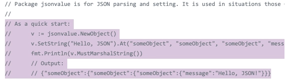
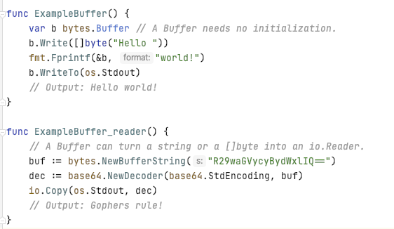
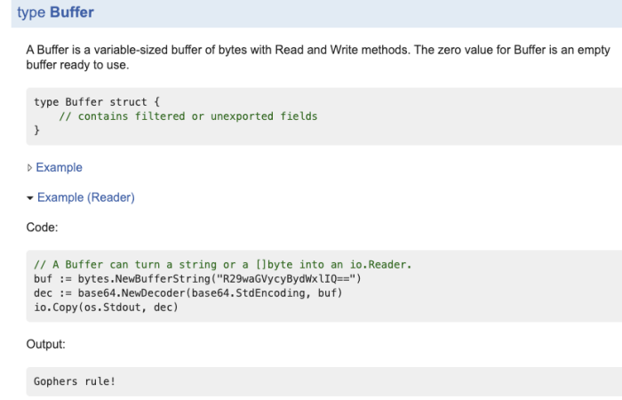

[TOC]

# ChainMaker 注释规范

## 1 需要注释的内容

所有导出的变量、类型、函数都需要加注释，其他的看具体情况，自行决定，所有注释都使用英文

## 2 包注释规则

- 注释必连续，如果有段落，段落之间的空行也需要注释，否则会被godoc忽略

- 包注释以Package packagename开头，应尽量简短，如果比较长，放在包的doc.go文件中

## 3 代码注释规则

- type, const, function, var注释以名称开头，紧临代码来写，函数注释描述函数的功能、参数和返回值，调用注意事项等

- 特殊开头的关键字：

BUG(who) ：描述函数未解决的bug

TODO: 描述待处理事项，godoc命令生成时需要指定--note关键字

Deprecated：已废弃，只为了保持兼容，写明代替方式

- 段落用空行注释表示

- 预格式化（缩进）可以被识别为代码块，

示例：

展示效果

## 4 Example文件规则

- Example文件和代码放在同一个文件夹下，文件名以example_开头，以_test结尾，如example_xxx_test.go，example的包名也是以example_开头，以_test结尾，如package example_xxx_test.

- Example函数名以Example开头，格式是Example[function name]_[tag]，如果没有函数名，Example会被展示在OverView，如果有function name，会被展示在函数说明里。

- Example 输出用关键字写在函数结必处

示例：

展示效果：

参考：

https://blog.golang.org/godoc 