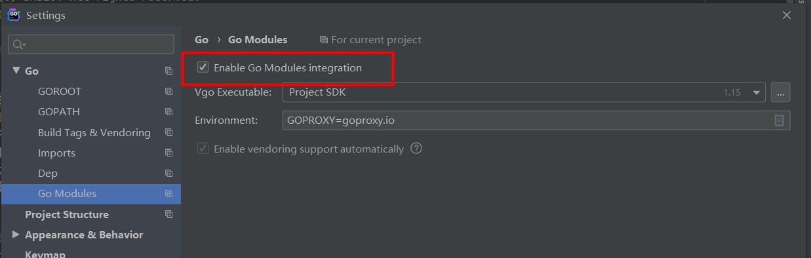

# 长安链 · ChainMaker Deploy Manual

## 1 依赖环境

本节描述部署时，需要的主机环境、依赖库、工具等，当前支持在MacOS、Linux本地部署。

| 依赖库、工具                                  | OS    | 安装方式                                                     |
| --------------------------------------------- | ----- | ------------------------------------------------------------ |
| golang                                        | MacOS | [安装方式](https://golang.org/doc/install#install)           |
| golang                                        | Linux | [安装方式](https://golang.org/doc/install#download)          |
| wasmer运行时库 **libwasmer.dylib**            | MacOS | 库在`chainmaker-go/main`目录下，将该库路径添加至系统PATH环境变量下 |
| wasmer运行时库 **libwasmer_runtime_c_api.so** | Linux | 库在`chainmaker-go/main`目录下，将该库路径添加至系统PATH环境变量下 |


## 2 部署方式

下面将描述本地部署单节点、四节点方式，其中单节点启用**SOLO**共识机制，四节点使用**TBFT**共识机制；项目`scripts`目录下提供了一键配置部署环境的脚本，支持在MacOS、Linux平台上，快速搭建不同的节点环境。

## 3 快速部署（SOLO模式）

### 3.1 物料下载

```sh
git clone --recurse-submodules git@git.code.tencent.com:ChainMaker/chainmaker-go.git
```

### 3.2 编译

```sh
cd chainmaker-go
make pb-dep
make
```

### 3.3 配置设置

#### 3.3.1 解压缩编译好的压缩包

```sh
cd chainmaker-go/release
#解压编译的压缩包
tar zvxf chainmaker-V1.0.0.xxx-xxx.tar.gz(其中xxx是根据时间和平台不同而变化)
```

#### 3.3.2 修改链配置文件，将共识改为solo模式

打开路径为chainmaker/config/wx-org1/chainconfig/bc1.yml的配置文件，修改配置项consensus: type值为0（solo模式）

### 3.4 启动

```sh
cd chainmaker/bin
./chainmaker -c ../config/wx-org1/chainmaker.yml start
```

> 注：若出现错误`./chainmaker: /lib64/libc.so.6: version `GLIBC_2.18' not found (required by /root/git-code/chainmaker-go/module/vm/wasmer/wasmer-go/libwasmer.so)`
> 在linux下可进入chainmaker/scripts/3rd目录安装glibc-2.18.tar.gz依赖


### 3.5 交易验证

使用cmc工具创建一个合约进行测试，命令如下：

```sh
cd chainmaker-go/tools/cmc
go mod download
go build
cp -r ../sdk/testdata ./ 
./cmc client contract user create --admin-key-file-paths=./testdata/crypto-config/wx-org1.chainmaker.org/user/admin1/admin1.tls.key --admin-crt-file-paths=./testdata/crypto-config/wx-org1.chainmaker.org/user/admin1/admin1.tls.crt  --org-id=wx-org1.chainmaker.org --chain-id=chain1 --client-crt-file-paths=./testdata/crypto-config/wx-org1.chainmaker.org/user/client1/client1.tls.crt --client-key-file-paths=./testdata/crypto-config/wx-org1.chainmaker.org/user/client1/client1.tls.key --byte-code-path=../../test/wasm/rust-asset-management-1.0.0.wasm --contract-name=asset_new001 --runtime-type=WASMER --sdk-conf-path=./testdata/sdk_config.yml --version=1.0 --sync-result=true --params="{\"issue_limit\":\"500000000\",\"total_supply\":\"1000000000\"}"
```
使用cmc工具查询刚创建的合约的total_supply值

```sh
./cmc client contract user get \
    --sdk-conf-path ./testdata/sdk_config.yml \
    --contract-name asset_new001 --method total_supply
```

返回如下日志表示验证成功：

> QUERY contract resp: message:"SUCCESS" contract_result:<result:"1000000000" gas_used:12844566 >


## 4 快速部署（4节点TBFT共识）

### 4.1 物料下载

#### 4.1.1 安装tmux

Mac: 

```bash
brew install tmux
```

Centos: 

```bash
yum install tmux
```

#### 4.1.2 下载源码

```sh
git clone --recurse-submodules git@git.code.tencent.com:ChainMaker/chainmaker-go.git
cd chainmaker-go/tools
git clone --recurse-submodules git@git.code.tencent.com:ChainMaker/chainmaker-cryptogen.git
```

### 4.2 制作部署包

#### 4.2.1 编译chainmaker-cryptogen

```sh
cd chainmaker-go/tools/chainmaker-cryptogen
make
```

#### 4.2.2 生成证书

```sh
cd chainmaker-go/scripts
./prepare.sh 4 1 ## 参数4代表节点数量（和组织数量一致），1代表链数量
```

#### 4.2.3 制作部署包

```sh
# 制作安装包
cd chainmaker-go/scripts
./build_release.sh
```

### 4.3 启动

```sh
cd chainmaker-go/scripts
./cluster_quick_start.sh
```

### 4.4 交易验证

使用cmc工具创建一个合约进行测试，命令如下：

```sh
cd chainmaker-go/tools/cmc
go mod download
go build
tar zvxf ../../build/release/crypto-config-xxx.tar.gz(xxx代表最新时间)
cp -r ../sdk/testdata ./ 
rm -rf testdata/crypto-config
mv ./crypto-config testdata/
./cmc client contract user create --admin-key-file-paths=./testdata/crypto-config/wx-org1.chainmaker.org/user/admin1/admin1.tls.key --admin-crt-file-paths=./testdata/crypto-config/wx-org1.chainmaker.org/user/admin1/admin1.tls.crt  --org-id=wx-org1.chainmaker.org --chain-id=chain1 --client-crt-file-paths=./testdata/crypto-config/wx-org1.chainmaker.org/user/client1/client1.tls.crt --client-key-file-paths=./testdata/crypto-config/wx-org1.chainmaker.org/user/client1/client1.tls.key --byte-code-path=../../test/wasm/rust-asset-management-1.0.0.wasm --contract-name=asset_new001 --runtime-type=WASMER --sdk-conf-path=./testdata/sdk_config.yml --version=1.0 --sync-result=true --params="{\"issue_limit\":\"500000000\",\"total_supply\":\"1000000000\"}"
```

使用cmc工具查询刚创建的合约的total_supply值

```sh
./cmc client contract user get \
    --sdk-conf-path ./testdata/sdk_config.yml \
    --contract-name asset_new001 --method total_supply
```

返回如下日志表示验证成功：

> QUERY contract resp: message:"SUCCESS" contract_result:<result:"1000000000" gas_used:12844566 >


## 5 goland启动

### 5.1 下载安装goland

略

### 5.2 下载安装go

#### 5.2.1 安装go

略

#### 5.2.2 设置代理

打开终端执行

```sh
go env -w  GOPROXY=https://goproxy.io,direct
```


### 5.3 下载源码

```sh
git clone --recurse-submodules git@git.code.tencent.com:ChainMaker/chainmaker-go.git
```


## 5.4 启动goland

#### 5.4.1 导入chainmaker-go

略

#### 5.4.2 配置goland

Ctrl+Alt+S 或者 File->Settings...

Go-->Go Modules --> 勾上Enable Go Modules integration

Go-->GOROOT-->添加已安装的go




#### 5.4.3 启动项目（SOLO模式）

- 修改配置文件

chainmaker-go/config/wx-org1/chainconfig/bc1.yml将 consensus.type修改为0：启用solo共识

chainmaker-go/config/wx-org1/log.yml将 log_in_console修改为true：在控制台输入日志

- 启动

找到文件 chainmaker-go/main/main.go 直接运行，然后点击停止，修改启动参数为`start -c ../config/wx-org1/chainmaker.yml`再次点击运行即可。

在控制台输入日志：


#### 5.4.4 测试

找到文件`chainmaker-go/test/send_proposal_request_solo/main.go`直接运行main即可