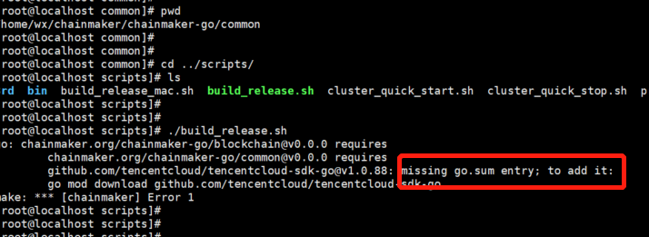

[toc]


### 1、编译错误

>  如果执行 ./build_release.sh 时 或者在启动时 报错：misssing go.sum entry: to add it，分别在 chainmaker-go/main 或者 chainmaker-go/common  和 chainmaker-go/tools/cmc 下执行 go mod download ，执行完后 再重试

  问题描述如下图：




解决方法：

```sh
cd  chainmaker-go/main

go mod download

cd  chainmaker-go/common

go mod download

cd  chainmaker-go/tools/cmc

go mod download
```


### 2、restart.sh 权限不足

>  如果启动时 出现restart.sh 权限不足问题，给restart.sh 增加执行权限

问题描述如下：

[root@localhost scripts]# ./cluster_quick_start.sh normal ===> Staring chainmaker cluster START ==> /home/wx/chainmaker/chainmaker-go/build/release/chainmaker-V1.0.0-wx-org1.chainmaker.org ./cluster_quick_start.sh: line 51: ./restart.sh: Permission denied

解决方法：

进入四个节点的bin目录下 执行下面命令(以第一个节点 org1 为例)

```sh
cd chainmaker-go/scripts/bin
chmod +x *.sh

cd chainmaker-go/build/release/chainmaker-V1.0.0-wx-org1.chainmaker.org/bin
chmod +x restart.sh
```


### 3、启动失败

#### 1、not found GLIBC_2.18

若出现错误`./chainmaker: /lib64/libc.so.6: version `GLIBC_2.18' not found (required by /root/git-code/chainmaker-go/module/vm/wasmer/wasmer-go/libwasmer.so)`

在linux下可进入chainmaker-go/scripts/3rd目录安装glibc-2.18.tar.gz依赖

```sh
# 注：此操作为安装替换GCC版本，请慎重操作。一旦出错系统将不可用。
cd scripts/3rd
sh install.sh
```


### 4、运行时错误

#### 1、syscall/js not fount

原因：tinygo vm不支持fmt等函数


