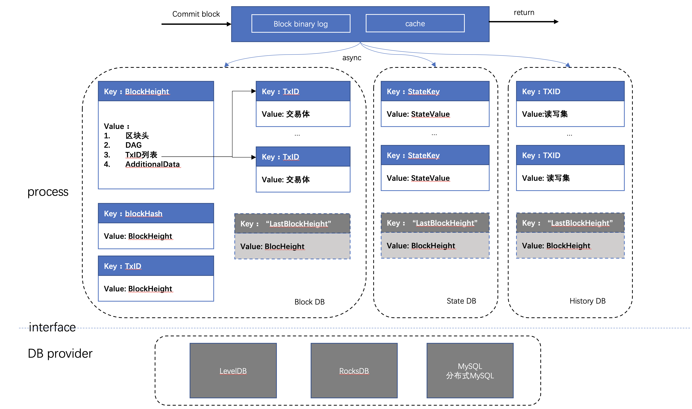

# 长安链 · ChainMaker User Manual


## 长安链简介

### 什么是长安链

长安链·ChainMaker区块链底层平台是新一代区块链开源底层软件平台，包含区块链核心框架、丰富的组件库和工具集，致力于为用户高效、精准地解决差异化区块链实现需求，构建高性能、高可信、高安全的新型数字基础设施。

### 长安链主要特性

**自主可控的底层平台**

- 独创深度模块化、可装配、高性能并行执行的区块链底层技术架构；
- 涵盖国产密码算法、基于国密证书的加密通讯和国产CA证书颁发认证机构。

**灵活高效的装配模式**

- 深度模块化，根据用户需求，择优选择不同模块组件快速组装定制化区块链系统；
- 可插拔、可分离的自主可控核心框架，可快速接入优势底层模块/单一定制化开发模块。

**国际领先的处理性能**

- 交易处理最大程度并行化，单链峰值交易处理速度可达12万笔每秒；
- 支持基于内存的数据系统，提升交易处理性能。

**标准化下的开放生态**

- 采用友好的开源协议，开放软件源代码；
- 推动多项技术体系标准化，建立标准化下的开发生态。

**完整便捷的配套工具**

- 支持大屏、图表、界面交互多种形式的管理、监控和运维；
- 支持Java、Golang、nodeJS等多种语言区块链SDK；
- 支持定制化部署、BaaS等多种落地实施方式；
- 友好、便捷的在线智能合约开发环境；
- 支持丰富的区块、交易、订阅、事件监听等处理机制。

### 使用长安链可以做什么

【简短描述，参照1.27发布内容】

**政务服务**

基于长安链·ChainMaker搭建政务数据共享平台，赋能政务数据跨区域、跨部门可信共享交换，实现业务高效协同。目前已落地海淀政务“一网通办”、海淀目录链、企业电子身份认证等场景。

**食品追溯**

基于长安链·ChainMaker建设食品追溯监管体系，及时掌握食品流转信息，增强全流程透明度，提升安全风险评估与预警能力。目前已落地“北京冷链”、北京冬奥食品追溯等场景。

**金融服务**

基于长安链·ChainMaker提供面向中小金融机构、中小企业的供应链金融服务，通过区块链线上确权，实现低成本互信，降低小微企业融资成本。目前已落地“北京市确权融资中心”、建行供应链金融平台等场景。

**供应链管理**

基于长安链·ChainMaker构建融合区块链与人工智能技术的“可信供应商”供应链协作平台，增加供应商资质审核的真实性和便利性，提升供应链管理能力。目前已落地沃尔玛供应商管理等场景。

## 整体架构@殷舒

### 逻辑架构

【参考天乐的整体架构，包括：共识节点、spv节点、sdk等】

### 核心流程

【参照已有流程图】


## 核心特性@殷舒

### 并行交易执行


### 模块化可插拔


## 模块说明@永芯

### 智能合约@振远

【合约的分类和执行流程】

【合约引擎介绍，WASM、GASM、WXVM】

【系统合约，包含哪些】

【可支持合约开发语言】

【合约SDK】

【合约模块接口说明】

【pb数据模型】


### 共识算法@智超、殷舒

【共识算法说明：SOLO、TBFT】

每个共识算法的【主要流程、与开源版本或论文版本的不同、<u>投票签名和验签机制、共识节点间通信方式、是否有共识状态WAL存储、模块接口说明、pb数据模型</u>】


### P2P网络@瑞波

#### **组网方式**
- chainmaker的P2P网络是基于libp2p实现并改进的，节点的网络地址遵循libp2p地址格式协议。
- 通过种子节点设置可实现节点自动发现、自动连接功能，在线的每个节点默认都可作为其他节点的种子节点提供网络发现服务，从而实现了chainmaker的自动组网机制。
- chainmaker使用了改进后的libp2p-gossip-pubsub实现的消息广播/订阅功能。能够保证广播消息能最终到达在线的全部节点。多链场景下，节点上的每条链都独享一个独立的GossipPubSub服务，并通过对每个Gossip路由表的精确控制，可实现多链间广播数据隔离，保证了广播数据只在链内节点传播的确定性。也正是如此，才允许chainmaker的所有链共用一个底层P2P网络。
- chainmaker理论上可实现上万甚至更多节点同时在线组网。
- chainmaker可以提供NAT穿透、代理转发等在复杂网络环境下的场景解决方案支持。

#### **节点身份管理方式**
- 节点身份是由组织CA签发的TLS证书确定，在节点入网时，会校验TLS证书的合法性
- 每个节点都需保证TLS证书的唯一性，不可多节点共用一个TLS证书
- 每个TLS证书都可对应生成一个NodeId唯一标识，该标识是节点网络地址的组成部分，是网络通讯环节重要的标识

#### **基于libp2p的改进**
- 核心包增加对国密SM算法的支持
- libp2p-gossip-pubsub功能模块增加白名单功能，实现对Gossip路由表的控制，达到广播隔离效果。
- 引入StreamPool，实现stream复用提高性能、网络吞吐能力自动扩容等特性。

#### **模块接口**
```go

// NetType is the type of net.
type NetType int

const (
	// Libp2p is a type of p2p net.
	Libp2p NetType = iota
	// GRpc is a type of rpc net.
	GRpc

	// DefaultChainId is default chain id.
	DefaultChainId = "default_chain"
)

// ReceiveMsgHandler handle the msg received from other node.
type ReceiveMsgHandler func(from string, netMsg *pb.NetMsg) error

// SubMsgHandler handle the msg published by other node.
type SubMsgHandler func(publisher string, netMsg *pb.NetMsg) error

type ChainNodeInfo struct {
	NodeUid     string
	NodeAddress []string
	NodeTlsCert []byte
}

// Net is local net interface.
type Net interface {
	// NodeUid is the unique id of the node.
	NodeUid() string

	// InitPubsub will init new LibP2pPubsub instance with given chainId and maxMessageSize.
	InitPubsub(chainId string, maxMessageSize int) error

	// BroadcastWithChainId  will broadcast a msg to a PubSubTopic with the pubsub service which id is given chainId.
	BroadcastWithChainId(chainId string, topic string, netMsg *pb.NetMsg) error

	// SubscribeWithChainId register a SubMsgHandler to a PubSubTopic with the pubsub service which id is given chainId.
	SubscribeWithChainId(chainId string, topic string, handler SubMsgHandler) error

	// CancelSubscribeWithChainId cancel subscribe a PubSubTopic with the pubsub service which id is given chainId.
	CancelSubscribeWithChainId(chainId string, topic string) error

	// SendMsg send msg to the node which id is given string.
	// 		msgFlag: is a flag used to distinguish msg type.
	SendMsg(chainId string, node string, msgFlag string, netMsg *pb.NetMsg) error

	// ReceiveMsgHandle register a ReceiveMsgHandler to the net.
	// 		msgFlag: is a flag used to distinguish msg type.
	ReceiveMsgHandle(chainId string, msgFlag string, handler ReceiveMsgHandler) error

	// CancelReceiveMsgHandle unregister a ReceiveMsgHandler.
	// 		msgFlag: is a flag used to distinguish msg type.
	CancelReceiveMsgHandle(chainId string, msgFlag string) error

	// AddSeed add a seed node addr.
	AddSeed(seed string) error

	// RefreshSeeds refresh the seed node addr list.
	RefreshSeeds(seeds []string) error

	// AddTrustRoot add a tls root cert to the cert pool of chain.
	AddTrustRoot(chainId string, rootCertByte []byte) error

	// RefreshTrustRoots refresh the cert pool of chain.
	RefreshTrustRoots(chainId string, rootsCertsBytes [][]byte) error

	// IsRunning return true when the net instance is running.
	IsRunning() bool

	// Start the local net.
	Start() error

	// Stop the local net.
	Stop() error

	// ChainNodesInfo return base node info list of chain which id is the given chainId.
	ChainNodesInfo(chainId string) ([]*ChainNodeInfo, error)

	// GetNodeUidByCertId return node uid which mapped to the given cert id. If unmapped return error.
	GetNodeUidByCertId(certId string) (string, error)

	// AddOrg add a Organization for revoked validator.
	AddOrg(chainId string, org Organization)

	// CheckRevokeTlsCerts check whether any tls certs revoked.
	CheckRevokeTlsCerts(org Organization, certManageSystemContractPayload []byte) error
}


type MsgHandler func(from string, msg []byte, msgType pb.NetMsg_MsgType) error

// ChainNodesInfoProvider provide base node info list of chain.
type ChainNodesInfoProvider interface {
	// ChainNodesInfo return base node info list of chain.
	ChainNodesInfo() ([]*ChainNodeInfo, error)
}

//  NetService
type NetService interface {
	// ChainId return the chainId of the net service.
	ChainId() string

	// BroadcastMsg broadcast a msg to the net.
	BroadcastMsg(msg []byte, msgType pb.NetMsg_MsgType) error

	// Subscribe register a MsgHandler for subscribe.
	Subscribe(msgType pb.NetMsg_MsgType, handler MsgHandler) error

	// CancelSubscribe cancel subscribe.
	CancelSubscribe(msgType pb.NetMsg_MsgType) error

	// ConsensusBroadcastMsg broadcast a msg to the consensus nodes.
	ConsensusBroadcastMsg(msg []byte, msgType pb.NetMsg_MsgType) error

	// ConsensusSubscribe register a MsgHandler handle the msg from consensus nodes for subscribe.
	ConsensusSubscribe(msgType pb.NetMsg_MsgType, handler MsgHandler) error

	// CancelConsensusSubscribe cancel subscribe.
	CancelConsensusSubscribe(msgType pb.NetMsg_MsgType) error

	// SendMsg send msg to any nodes.
	SendMsg(msg []byte, msgType pb.NetMsg_MsgType, to ...string) error

	// ReceiveMsg register a MsgHandler to handle the msg received from other node.
	ReceiveMsg(msgType pb.NetMsg_MsgType, handler MsgHandler) error

	// Start the net service.
	Start() error

	// Stop the net service.
	Stop() error

	// GetNodeUidByCertId return node uid which mapped to the given cert id. If unmapped return error.
	GetNodeUidByCertId(certId string) (string, error)

	// GetChainNodesInfoProvider return a implementation of ChainNodesInfoProvider.
	GetChainNodesInfoProvider() ChainNodesInfoProvider
}
```
#### **使用配置**
#### chainmaker.yml
```yaml
net:
  # 底层网络类型
  provider: LibP2P
  # 本地网路监听地址及端口
  listen_addr: /ip4/0.0.0.0/tcp/6666
  # 每个节点连接stream池大小上限，不配默认为100
  peer_stream_pool_size: 100
  # 允许与本节点建立链接的节点总数量，不配默认为20
  max_peer_count_allow: 10
  # 节点链接淘汰策略，1 Random, 2 FIFO, 3 LIFO。不配默认为3
  peer_elimination_strategy: 3
  # 种子节点地址列表，用于节点发现，可选项
  seeds: 
    - "/ip4/127.0.0.1/tcp/6666/p2p/QmQZn3pZCcuEf34FSvucqkvVJEvfzpNjQTk17HS6CYMR35"
  # TLS认证相关配置
  tls:
    # TLS认证开关
    enabled: true
    # TLS证书
    priv_key_file: ./crypto-config/wx-org1.chainmaker.org/node/consensus1/consensus1.tls.key
    cert_file:     ./crypto-config/wx-org1.chainmaker.org/node/consensus1/consensus1.tls.crt
  # 组网黑名单配置，可选项
  blacklist:
    # 黑名单地址，可选项，[ip]:[port]或者[ip]两者均可
    addresses:
      - "127.0.0.1:11305"
      - "192.168.1.8"
    # 黑名单节点ID，可选项
    node_ids:
      - "QmeyNRs2DwWjcHTpcVHoUSaDAAif4VQZ2wQDQAUNDP33gH"
      - "QmVSCXfPweL1GRSNt8gjcw1YQ2VcCirAtTdLKGkgGKsHqi"
```

在链初始化阶段，net_service在初始化时会读取链配置chainconfig下的共识节点列表和trust_root。当前阶段，网络会将共识节点作为种子节点seeds的一员，并会通过ConnSupervisor维护与其之间的链接；网络还会维护一份共识节点ID列表，便于向共识节点定向广播；trust_root作为TLS认证可信根证书池，同时会根据不同链的根证书池来确定对方节点隶属于哪条链。

#### **节点地址格式说明**
chainmaker节点地址遵循libp2p网络地址格式协定，例如：
```text
/ip4/127.0.0.1/tcp/6666/p2p/QmQZn3pZCcuEf34FSvucqkvVJEvfzpNjQTk17HS6CYMR35
```

地址以"/"开始，并以"/"分段，大多数情况下，各段说明如下：
- 第一段：IP协议版本，ip4代表IPv4,ip6代表IPv6
- 第二段：IP地址，需要与第一段对应
- 第三段：通讯网络协议，默认使用tcp
- 第四段：监听端口
- 第五段：固定协议，请勿改动，固定为"p2p"
- 第六段：节点NodeId，与TLS证书配套，根据TLS证书通过特定算法计算而来

以上只是最普通常用场景下节点地址举例，在复杂网络场景下（比如需要使用节点中继、NAT穿透等）地址格式会稍有不同。


### RPC服务@Jason

#### 功能说明

`RPCServer`采用`gRPC`实现的远程过程调用系统，采用`HTTP/2` 传输协议，使用`Protobuf` 作为接口描述语言，实现模块间的高效交互。

功能上支持处理节点请求、基于流模式的消息订阅，通信上支持`TLS`单向和双向认证、流控机制等。

#### 配置说明

```yml
rpc:
  provider: grpc
  port: 12301
  # 检查链配置TrustRoots证书变化时间间隔，单位：s，最小值为10s
  check_chain_conf_trust_roots_change_interval: 60
  ratelimit:
    # 每秒补充令牌数，取值：-1-不受限；0-默认值（10000）
    token_per_second: -1
    # 令牌桶大小，取值：-1-不受限；0-默认值（10000）
    token_bucket_size: -1
  subscriber:
    # 历史消息订阅流控，实时消息订阅不会进行流控
    ratelimit:
      # 每秒补充令牌数，取值：-1-不受限；0-默认值（1000）
      token_per_second: 100
      # 令牌桶大小，取值：-1-不受限；0-默认值（1000）
      token_bucket_size: 100
  tls:
    # TLS模式:
    #   disable - 不启用TLS
    #   oneway  - 单向认证
    #   twoway  - 双向认证
    mode:           twoway
    priv_key_file:  ./certs/node/consensus1/consensus1.tls.key
    cert_file:      ./certs/node/consensus1/consensus1.tls.crt
```

#### 接口定义

```protobuf
service RpcNode {
	// 交易消息请求处理
	rpc SendRequest(TxRequest) returns (TxResponse) {};

	// 消息订阅请求处理
	rpc Subscribe(TxRequest) returns (stream SubscribeResult) {};

	// 更新日志级别
	rpc RefreshLogLevelsConfig(LogLevelsRequest) returns (LogLevelsResponse) {};

	// 获取ChainMaker版本
	rpc GetChainMakerVersion(ChainMakerVersionRequest) returns(ChainMakerVersionResponse) {};

	// 检查链配置并动态加载新链
	rpc CheckNewBlockChainConfig(CheckNewBlockChainConfigRequest) returns (CheckNewBlockChainConfigResponse) {};

	// 更新Debug状态（开发调试）
	rpc UpdateDebugConfig(DebugConfigRequest) returns (DebugConfigResponse) {};
}
```

#### 关键数据结构

- **TxRequest**


- **TxResponse**


#### 关键逻辑

- **消息订阅（事件通知）**


（1）订阅者发起消息订阅请求，当前支持订阅区块消息和交易消息

（2）如果只是订阅历史数据，直接从账本存储（`Store`）中获取后返回给订阅者

（3）如果需要订阅实时数据，则会有`Subscriber`发起订阅事件，将`chan`注册到订阅者列表中，当`Core`模块有新区块产生，会发送事件通知，通过`chan`通知到`Subscriber`，通过`RPCServer`返回给订阅者

（4）如果需要同时订阅历史和实时数据，则会分别从账本存储（`Store`）以及消息订阅发布者获取，而后返回给订阅者

（5）若订阅消息发送完，`RPCServer`会主动关闭订阅通道，避免资源浪费

### 存储模块

存储模块负责存储区块链上的区块、交易、账本数据和历史读写集数据，在提交区块时，这些数据就会被存储模块进行存储。存储模块的整体架构如下图：



#### 账本存储的处理流程

##### 区块提交存储流程

1.	首先序列化后的区块数据、读写集列表、以及最新区块高度写入Block binary log(wal)，用于异常中断后的恢复。同时为了提高性能，加入cache层，新区块提交请求在更新完Block binary log之后，再将区块数据（包括区块、交易、状态数据、读写集）写入cache。更新完log和cache后即可返回，由后台线程异步更新Block DB、State DB和History DB。
2.	在Block DB中记录区块信息与交易信息，其中交易信息以TxID作为key存储，区块信息以BlockHeight作为key存储，区块信息中只记录交易ID列表，同时索引BlockHash到BlockHeight的映射关系，同时Block DB中记录最新的区块高度（LastBlockHeight）作为checkpoint，以批量事务的方式提交，保证批处理的原子性。
3.	在State DB中记录交易修改的state数据，key为合约名与对象主键的组合：<contractName, ObjectKey>，同时记录最新的区块高度（LastBlockHeight）作为checkpoint，以批量事务的方式提交，保证批处理的原子性。
4.	在History DB中记录交易的读写集，读写集以TxID作为key，同时记录最新的区块高度（LastBlockHeight）作为checkpoint，以批量事务的方式提交，保证批处理的原子性。

##### 账本恢复流程

如果在提交区块过程中，单个数据库存储发生异常，将会导致数据库之间的数据不一致，程序遇到这种情况后会主动退出。然后系统在重启时会进入恢复流程：

1.	分别从Block binary log、Block DB、State DB、History DB中获取最新的区块高度，以Block binary log中的区块高度作为基准高度，判断其他DB是否落后基准高度。
2.	如果存在DB落后基准高度，则从Block bianry log中获取缺失的区块及读写集，依次提交到落后DB中。
3.	所有DB同步到基准高度后，存储模块启动完成，BlockChain模块继续调度其他模块完成启动。

##### 账本查询流程

查询请求首先查询cache中的kv数据，如果cache命中则返回，cache不存在再从DB中查询。对于删除操作，cache中提供标记删除，以表明最新的key已经被删除。对于范围查询，多条数据可能同时存在cache和db中，需要进行数据合并。

#### 账本数据库类型

账本数据库支持多个不同的数据库，以匹配不同的业务需求

- LevelDB
- RocksDB
- MySQL/分布式MySQL

#### 存储模块接口

```go
// 
type BlockchainStore interface {

	//提交区块，批量提交区块数据到账本，保存区块信息、交易信息、读写集、索引，更新状态数据等信息
	//并对外保证多项数据修改的原子性
	PutBlock(block *pb.Block, txRWSets []*pb.TxRWSet) error

	//按区块hash查询区块，
	//如果数据库内部错误，error返回错误信息；
	//如果区块不存在，Block返回nil，error返回nil
	GetBlockByHash(blockHash []byte) (*pb.Block, error)

	//判断区块是否存在
	//如果数据库内部错误，error返回错误信息；
	//如果区块不存在，返回false
	BlockExist(blockHash []byte) (bool, error)

  //按区块高度查询区块
	//如果数据库内部错误，error返回错误信息；
	//如果区块不存在，Block返回nil，error返回nil
	GetBlock(height int64) (*pb.Block, error)

	//获取最新的配置区块
	GetLastConfigBlock() (*pb.Block, error)

	//更据txid查询区块
	GetBlockByTx(txId string) (*pb.Block, error)

	//查询带读写集的区块，
	//如果数据库内部错误，error返回错误信息；
	//如果区块不存在，返回nil，error返回nil
	GetBlockWithRWSets(height int64) (*pb.BlockWithRWSet, error)

	//按交易id查询交易
	//如果数据库内部错误，error返回错误信息；
	//如果交易不存在，Transaction返回nil，error返回nil
	GetTx(txId string) (*pb.Transaction, error)

	//判断交易是否存在，按交易id
	//如果数据库内部错误，error返回错误信息；
	//如果交易不存在，返回false
	TxExists(txId string) (bool, error)

	//查询最新的区块
	//如果数据库内部错误，error返回错误信息；
	//如果区块不存在，Block返回nil，error返回nil
	GetLastBlock() (*pb.Block, error)

	//查询状态数据库，按合约名与key
	//如果数据库内部错误，error返回错误信息；
	//如果数据不存在，Object返回nil，error返回nil
	ReadObject(contractName string, key []byte) ([]byte, error)

  //获取状态数据库的迭代器，按合约名与key区间查询，包括startKey, 不包括limit
	SelectObject(contractName string, startKey []byte, limit []byte) Iterator

	//查询交易读写集
	GetTxRWSet(txId string) (*pb.TxRWSet, error)

	//按区块高度查询区块的读写集列表
	GetTxRWSetsByHeight(height int64) ([]*pb.TxRWSet, error)

	//获取DB的操作句柄，为其他模块提供DB操作接口
	GetDBHandle(dbName string) DBHandle

	//关闭存储相关的数据库，释放数据资源
	Close() error
}
```

#### 配置说明

节点本地配置关于存储部分的配置说明：

```yaml
storage:
	provider: LevelDB	#数据库类型，支持LevelDB，RocksDB，MySQL/分布式MySQL
	store_path: ../data/ledgerData  #账本的存储路径， 包括LevelDB、RocksDB的数据目录，Block binary log的数据目录
	write_buffer_size: 4	#LevelDB、RocksDB的write_buffer_size， 单位为MB，默认为4M
	bloom_filter_bits: 10	#LevelDB、RocksDB的布隆过滤器参数，为每个key分配的额外bit空间，默认为10，如果少于或等于0，则不开启布隆过滤。
	disable_historydb: false	#是否禁用历史读写集的存储功能， 默认为false，也就是保存历史读写集。
	mysql:	#MySQL相关配置，只有provider选择MySQL时才需要配置
		dsn: user:password?@tcp(ip:port)/	#mysql的连接信息，包括用户名、密码、ip、port等，示例：root:admin?@tcp(127.0.0.1:3306)
		max_idle_conns: 10	#连接池中维持的最大的空闲连接数，默认为10
		max_open_conns: 10	#最大的可用连接数，默认为10
		conn_max_lifetime: 60	#连接维持的最长时间，单位秒，默认为60
```

#### RocksDB部署

#### 1. Rocksdb使用

因为rocksdb本身是使用C++写的，而目前使用gorocksdb需要依赖rocksdb的库文件，因此直接编译会报错，针对该问题，目前采用了条件编译的方式。

##### 1.1 未安装Rocksdb的环境下编译启动

针对未安装Rocksdb的环境，可直接通过go build正常编译，但是要求必须使用levelDB，若配置为rocksDB会出现空指针错误。

##### 1.2 使用RocksDB编译启动

若要使用RocksDB则必须先本地安装RocksDB环境，安装方式包括两部分：
 + 1.RocksDB安装：https://github.com/facebook/rocksdb/blob/master/INSTALL.md
 + 2.gorocksdb安装：https://github.com/tecbot/gorocksdb

使用rocksdb需要通过-tag方式启动，build方式：

```shell script
go build -tags=rocksdb 
```

若通过go run直接启动则使用下面的方式：

```shell script
go run -tags=rocksdb main.go {params}
```

#### 2. Linux下Rocksdb环境安装

##### 2.1 安装依赖

安装gcc、zlib、snappy、lz4等依赖工具

```shell
yum -y install lrzsz git gcc gcc-c++ lz4-devel
```

```shell
yum -y install snappy snappy-devel zlib zlib-devel bzip2 bzip2-devel lz4 lz4-devel zstd
```

##### 2.2 安装cmake

gflags-2.2.2对cmake版本有要求，所以需要指定版本的cmake

```shell
curl -O   https://cmake.org/files/v3.6/cmake-3.6.0-Linux-x86_64.tar.gz
mv cmake-3.6.0-Linux-x86_64.tar.gz /opt/
cd /opt/
tar -xvzf cmake-3.6.0-Linux-x86_64.tar.gz
yum remove cmake

cat >>/etc/profile <<EOF

export PATH=\$PATH:/opt/cmake-3.6.0-Linux-x86_64/bin

EOF
source /etc/profile
```

##### 2.3 安装gflags

```shell
wget -O gflags-2.2.2.tar.gz https://github.com/gflags/gflags/archive/v2.2.2.tar.gz
tar -xvzf gflags-2.2.2.tar.gz
cd gflags-2.2.2/
mkdir build
cd build/
cmake -DBUILD_SHARED_LIBS=ON -DBUILD_STATIC_LIBS=ON -DINSTALL_HEADERS=ON -DINSTALL_SHARED_LIBS=ON -DINSTALL_STATIC_LIBS=ON ..
make
make install

cat >>/etc/profile <<EOF

export LD_LIBRARY_PATH=\$LD_LIBRARY_PATH:/usr/local/lib
EOF
source /etc/profile
```

##### 2.4 下载并安装rocksdb

```shell
wget -O rocksdb-5.18.3.tar.gz https://github.com/facebook/rocksdb/archive/v5.18.3.tar.gz
tar -xzvf rocksdb-5.18.3.tar.gz

cd rocksdb-5.18.3
mkdir build
cd build

cmake -DCMAKE_INSTALL_PREFIX=/usr/local/rocksdb ..

make
make install

cat >>/etc/profile <<EOF

export CPLUS_INCLUDE_PATH=\$CPLUS_INCLUDE_PATH:/usr/local/rocksdb/include/
export LD_LIBRARY_PATH=\$LD_LIBRARY_PATH:/usr/local/rocksdb/lib64/
export LIBRARY_PATH=\$LIBRARY_PATH:/usr/local/rocksdb/lib64/

EOF

source /etc/profile

```

##### 2.5 使用测试

``` shell
[root@VM-219-157-centos /opt/rocksdb-5.18.3/build]# cd tools/
[root@VM-219-157-centos /opt/rocksdb-5.18.3/build/tools]# ll
total 2608
drwxr-xr-x 12 root root    4096 Dec 25 10:38 CMakeFiles
-rw-r--r--  1 root root     269 Dec 25 10:38 CTestTestfile.cmake
-rw-r--r--  1 root root   18973 Dec 25 10:38 Makefile
-rw-r--r--  1 root root     988 Dec 25 10:38 cmake_install.cmake
-rwxr-xr-x  1 root root  232649 Dec 25 10:55 db_repl_stress
-rwxr-xr-x  1 root root  233443 Dec 25 10:55 db_sanity_test
-rwxr-xr-x  1 root root 1338230 Dec 25 10:55 db_stress
-rwxr-xr-x  1 root root   48060 Dec 25 10:55 ldb
-rwxr-xr-x  1 root root  207347 Dec 25 10:55 rocksdb_dump
-rwxr-xr-x  1 root root  207358 Dec 25 10:55 rocksdb_undump
-rwxr-xr-x  1 root root    8571 Dec 25 10:55 sst_dump
-rwxr-xr-x  1 root root  350147 Dec 25 10:55 write_stress
[root@VM-219-157-centos /opt/rocksdb-5.18.3/build/tools]#
[root@VM-219-157-centos /opt/rocksdb-5.18.3/build/tools]#
[root@VM-219-157-centos /opt/rocksdb-5.18.3/build/tools]#
[root@VM-219-157-centos /opt/rocksdb-5.18.3/build/tools]# ./ldb -help
ldb - RocksDB Tool

commands MUST specify --db=<full_path_to_db_directory> when necessary

The following optional parameters control if keys/values are input/output as hex or as plain strings:
  --key_hex : Keys are input/output as hex
  --value_hex : Values are input/output as hex
  --hex : Both keys and values are input/output as hex

The following optional parameters control the database internals:
  --column_family=<string> : name of the column family to operate on. default: default column family
  --ttl with 'put','get','scan','dump','query','batchput' : DB supports ttl and value is internally timestamp-suffixed
  --try_load_options : Try to load option file from DB.
  --ignore_unknown_options : Ignore unknown options when loading option file.
  --bloom_bits=<int,e.g.:14>
  --fix_prefix_len=<int,e.g.:14>
  --compression_type=<no|snappy|zlib|bzip2|lz4|lz4hc|xpress|zstd>
  --compression_max_dict_bytes=<int,e.g.:16384>
  --block_size=<block_size_in_bytes>
  --auto_compaction=<true|false>
  --db_write_buffer_size=<int,e.g.:16777216>
  --write_buffer_size=<int,e.g.:4194304>
  --file_size=<int,e.g.:2097152>


Data Access Commands:
  put <key> <value>  [--ttl]
  get <key> [--ttl]
  batchput <key> <value> [<key> <value>] [..] [--ttl]
  scan [--from] [--to]  [--ttl] [--timestamp] [--max_keys=<N>q]  [--start_time=<N>:- is inclusive] [--end_time=<N>:- is exclusive] [--no_value]
  delete <key>
  deleterange <begin key> <end key>
  query [--ttl]
    Starts a REPL shell.  Type help for list of available commands.
  approxsize [--from] [--to]
  checkconsistency


Admin Commands:
  dump_wal --walfile=<write_ahead_log_file_path> [--header]  [--print_value]  [--write_committed=true|false]
  compact [--from] [--to]
  reduce_levels --new_levels=<New number of levels> [--print_old_levels]
  change_compaction_style --old_compaction_style=<Old compaction style: 0 for level compaction, 1 for universal compaction> --new_compaction_style=<New compaction style: 0 for level compaction, 1 for universal compaction>
  dump [--from] [--to]  [--ttl] [--max_keys=<N>] [--timestamp] [--count_only] [--count_delim=<char>] [--stats] [--bucket=<N>] [--start_time=<N>:- is inclusive] [--end_time=<N>:- is exclusive] [--path=<path_to_a_file>]
  load [--create_if_missing] [--disable_wal] [--bulk_load] [--compact]
  manifest_dump [--verbose] [--json] [--path=<path_to_manifest_file>]
  list_column_families full_path_to_db_directory
  dump_live_files
  idump [--from] [--to]  [--input_key_hex] [--max_keys=<N>] [--count_only] [--count_delim=<char>] [--stats]
  repair
  backup [--backup_env_uri]  [--backup_dir]  [--num_threads]  [--stderr_log_level=<int (InfoLogLevel)>]
  restore [--backup_env_uri]  [--backup_dir]  [--num_threads]  [--stderr_log_level=<int (InfoLogLevel)>]
  checkpoint [--checkpoint_dir]
  write_extern_sst <output_sst_path>
  ingest_extern_sst <input_sst_path> [--move_files]  [--snapshot_consistency]  [--allow_global_seqno]  [--allow_blocking_flush]  [--ingest_behind]  [--write_global_seqno]

[root@VM-219-157-centos /opt/rocksdb-5.18.3/build/tools]#
[root@VM-219-157-centos /opt/rocksdb-5.18.3/build/tools]#
[root@VM-219-157-centos /opt/rocksdb-5.18.3/build/tools]#
[root@VM-219-157-centos /opt/rocksdb-5.18.3/build/tools]#
[root@VM-219-157-centos /opt/rocksdb-5.18.3/build/tools]#
[root@VM-219-157-centos /opt/rocksdb-5.18.3/build/tools]#
[root@VM-219-157-centos /opt/rocksdb-5.18.3/build/tools]# pwd
/opt/rocksdb-5.18.3/build/tools
[root@VM-219-157-centos /opt/rocksdb-5.18.3/build/tools]# ll /tmp/
total 32
srwxrwxrwx 1 root root    0 Dec 18 23:04 agent_cmd.sock
drwxr-xr-x 2 root root 4096 Dec 25 10:14 commandnotfound
-rw-r--r-- 1 root root   53 Dec 17 10:44 cpuidle_support.log
-rw-r--r-- 1 root root 2513 Dec 17 10:43 cvm_init.log
-rw-r--r-- 1 root root  297 Dec 17 10:44 net_affinity.log
-rw-r--r-- 1 root root   26 Dec 17 10:44 nv_gpu_conf.log
-rw-r--r-- 1 root root  155 Dec 17 10:44 setRps.log
drwx------ 3 root root 4096 Dec 17 10:44 systemd-private-e9868203df724169bf07a791d55819cd-ntpd.service-mA2nuw
-rw-r--r-- 1 root root 2017 Dec 17 10:44 virtio_blk_affinity.log
[root@VM-219-157-centos /opt/rocksdb-5.18.3/build/tools]# ./ldb --db=/tmp/test_db --create_if_missing put a1 b1
OK

[root@VM-219-157-centos /opt/rocksdb-5.18.3/build/tools]# ./ldb --db=/tmp/test_db scan
a1 : b1

[root@VM-219-157-centos /opt/rocksdb-5.18.3/build/tools]# ./ldb --db=/tmp/test_db get a1
b1

[root@VM-219-157-centos /opt/rocksdb-5.18.3/build/tools]# ./ldb --db=/tmp/test_db get a2
Failed: NotFound:
[root@VM-219-157-centos /opt/rocksdb-5.18.3/build/tools]# cd /tmp/test_db/
[root@VM-219-157-centos /tmp/test_db]# ll
total 920
-rw-r--r-- 1 root root    26 Dec 25 11:13 000003.log
-rw-r--r-- 1 root root    16 Dec 25 11:13 CURRENT
-rw-r--r-- 1 root root    37 Dec 25 11:13 IDENTITY
-rw-r--r-- 1 root root     0 Dec 25 11:13 LOCK
-rw-r--r-- 1 root root 16246 Dec 25 11:14 LOG
-rw-r--r-- 1 root root 19272 Dec 25 11:13 LOG.old.1608866049557780
-rw-r--r-- 1 root root 15784 Dec 25 11:14 LOG.old.1608866049562808
-rw-r--r-- 1 root root 16246 Dec 25 11:14 LOG.old.1608866058035881
-rw-r--r-- 1 root root 15788 Dec 25 11:14 LOG.old.1608866058041253
-rw-r--r-- 1 root root 16250 Dec 25 11:14 LOG.old.1608866062086538
-rw-r--r-- 1 root root 15784 Dec 25 11:14 LOG.old.1608866062091559
-rw-r--r-- 1 root root    13 Dec 25 11:13 MANIFEST-000001
-rw-r--r-- 1 root root  4744 Dec 25 11:13 OPTIONS-000005
[root@VM-219-157-centos /tmp/test_db]# cat 000003.log
����a1b1[root@VM-219-157-centos /tmp/test_db]#

```


##### 2.6 安装zstd

zstd是facebook为适配rocksdb开发的zstandard数据压缩工具，如果不安装该软件，会导致gorocksdb安装失败。

安装步骤如下：

```shell
cd /usr/local
git clone https://github.com/facebook/zstd.git
cd zstd
make
make install
```

##### 2.7 安装gorocksdb

通过4.1-4.6安装步骤后，rocksdb会被安装在 usr/local/rocksdb 这个目录下，我们使用go版本的rocksdb需要依赖于该路径。

目前使用的gorocksdb为：github.com/tecbot/gorocksdb

安装上述的安装路径，使用下面的命令即可：

```shell
CGO_CFLAGS="-I/usr/local/rocksdb/include" \
CGO_LDFLAGS="-L/usr/local/rocksdb -lrocksdb -lstdc++ -lm -lz -lbz2 -lsnappy -llz4 -lzstd" \
  go get github.com/tecbot/gorocksdb

```

如果安装目录有变化，则修改对应的/usr/local/rocksdb对应的路径

#### MySQL存储

长安链支持MySQL作为账本存储引擎，同时也支持分布式的MySQL集群，如果使用MySQL作为存储引擎，长安链启动会自动创建数据库和表，使用chainId作为数据库名，同时创建相应的表：

1. 区块元信息表

   ```sql
   CREATE TABLE `block_infos` (
     `chain_id` varchar(128) COLLATE utf8mb4_general_ci DEFAULT NULL,
     `block_height` bigint(20) NOT NULL,
     `pre_block_hash` varbinary(128) DEFAULT NULL,
     `block_hash` varbinary(128) DEFAULT NULL,
     `pre_conf_height` bigint(20) DEFAULT '0',
     `block_version` varbinary(128) DEFAULT NULL,
     `dag_hash` varbinary(128) DEFAULT NULL,
     `rw_set_root` varbinary(128) DEFAULT NULL,
     `tx_root` varbinary(128) DEFAULT NULL,
     `block_timestamp` bigint(20) DEFAULT '0',
     `proposer` blob,
     `consensus_args` blob,
     `tx_count` bigint(20) DEFAULT '0',
     `signature` blob,
     `dag` blob,
     `tx_ids` longtext COLLATE utf8mb4_general_ci,
     `additional_data` longblob,
     PRIMARY KEY (`block_height`),
     KEY `idx_hash` (`block_hash`)
   ) ENGINE=InnoDB DEFAULT CHARSET=utf8mb4 COLLATE=utf8mb4_general_ci;
   ```

   

2. 交易表

   ```sql
   CREATE TABLE `tx_infos` (
     `chain_id` varchar(128) COLLATE utf8mb4_general_ci DEFAULT NULL,
     `sender` blob,
     `tx_id` varchar(128) COLLATE utf8mb4_general_ci NOT NULL,
     `tx_type` int(11) DEFAULT NULL,
     `block_height` bigint(20) DEFAULT NULL,
     `offset` int(11) DEFAULT NULL,
     `timestamp` bigint(20) DEFAULT '0',
     `expiration_time` bigint(20) DEFAULT '0',
     `request_payload` longblob,
     `request_signature` blob,
     `code` int(11) DEFAULT NULL,
     `contract_result` longblob,
     `rw_set_hash` varbinary(128) DEFAULT NULL,
     PRIMARY KEY (`tx_id`),
     KEY `idx_height_offset` (`block_height`,`offset`)
   ) ENGINE=InnoDB DEFAULT CHARSET=utf8mb4 COLLATE=utf8mb4_general_ci;
   ```

   

3. 世界状态表

   ```sql
   CREATE TABLE `state_infos` (
     `contract_name` varchar(128) COLLATE utf8mb4_general_ci NOT NULL,
     `object_key` varbinary(128) NOT NULL DEFAULT '',
     `object_value` longblob,
     `block_height` bigint(20) DEFAULT NULL,
     `updated_at` datetime(3) DEFAULT NULL,
     PRIMARY KEY (`contract_name`,`object_key`),
     KEY `idx_height` (`block_height`)
   ) ENGINE=InnoDB DEFAULT CHARSET=utf8mb4 COLLATE=utf8mb4_general_ci;
   ```

   

4. 历史读写集表

   ```sql
   CREATE TABLE `history_infos` (
     `tx_id` varchar(128) COLLATE utf8mb4_general_ci NOT NULL,
     `rw_sets` longblob,
     `block_height` bigint(20) DEFAULT NULL,
     PRIMARY KEY (`tx_id`),
     KEY `idx_height` (`block_height`)
   ) ENGINE=InnoDB DEFAULT CHARSET=utf8mb4 COLLATE=utf8mb4_general_ci;
   ```

   

### 身份管理@张韬

是否发布中文

我们对证书的使用，角色划分

Serialize() ([]byte, error)，返回[]byte的结构说明

依赖模块使用的接口需要详细说明

### 权限管理@张韬

是否发布中文

### 配置模块@瑞波

#### **本地配置**
本地配置项都包含在chainmaker.yml中，具体配置如下：

```yaml
# 链配置
blockchain:
  - chainId: chain1 # 链ID
    genesis: chainconfig/bc1.yml # 链配置文件
#  - chainId: chain2
#    genesis: chainconfig/bc2.yml
#  - chainId: chain3
#    genesis: chainconfig/bc3.yml
#  - chainId: chain4
#    genesis: chainconfig/bc4.yml

# 节点配置
node:
  type:              full # 节点类型：full、spv
  org_id:            wx-org1.chainmaker.org # 所属组织ID
  priv_key_file:     ./certs/node/consensus1/consensus1.sign.key # 签名私钥
  cert_file:         ./certs/node/consensus1/consensus1.sign.crt # 签名证书
  signer_cache_size: 1000
  cert_cache_size:   1000

# 网络配置
net:
  provider: LibP2P # 网络类型，目前只支持libp2p
  listen_addr: /ip4/0.0.0.0/tcp/11301 # 网络本地监听地址，包含IP和端口号，IP若为0.0.0.0则本地所有IP都会绑定监听
  peer_stream_pool_size: 100  # 每个节点连接stream池大小上限，不配默认为100
  max_peer_count_allow: 10 # 允许与本节点建立链接的节点总数量，不配默认为20
  peer_elimination_strategy: 3 # 节点链接淘汰策略，1 Random, 2 FIFO, 3 LIFO。不配默认为3
  seeds:  # 种子节点地址列表，用于节点发现，可选项。链配置中所有共识节点地址都会作为种子节点。
    - "/ip4/127.0.0.1/tcp/6666/p2p/QmQZn3pZCcuEf34FSvucqkvVJEvfzpNjQTk17HS6CYMR35"
  tls: # TLS认证配置
    enabled: true # TLS认证开关，现阶段必须设置为true
    priv_key_file: ./certs/node/consensus1/consensus1.tls.key # TLS私钥
    cert_file:     ./certs/node/consensus1/consensus1.tls.crt # TLS证书

# 交易池配置
txpool:
  max_txpool_size: 5120 # 普通交易池上限
  max_config_txpool_size: 10 # config交易池的上限
  full_notify_again_time: 30 # 交易池溢出后，再次通知打包的时间间隔(秒)

# RPC服务配置
rpc:
  provider: grpc # 服务类型，目前只支持gRPC
  port: 12301 # 服务监听端口
  tls:
    # TLS模式:
    #   disable - 不启用TLS
    #   oneway  - 单向认证
    #   twoway  - 双向认证
    #mode: disable
    #mode: oneway
    mode:           twoway 
    priv_key_file:  ./certs/node/consensus1/consensus1.tls.key # TLS私钥
    cert_file:      ./certs/node/consensus1/consensus1.tls.crt # TLS证书

# 检测相关配置
monitor:
  enabled: false # 检测开关
  port: 14321 # 检测服务监听端口

# pprof功能配置
pprof:
  enabled: false # 开关
  port: 24321 # 性能分析监听端口

# 存储配置
storage:
  provider: leveldb # 数据库类型
  store_path: ../data/ledgerData # 数据库所在路径

# debug 相关配置
debug:
  is_cli_open: true # 是否开启CLI功能
  is_http_open: false # 是否开启http
  ...
```

#### **链配置**
链配置是作为链启动时创建创世区块的依据，所以要求每条链每个节点的链配置文件都必须保持一致。
具体链配置项如下：
```yaml
chain_id: chain1        # 链标识，链ID
version: v1.0.0         # 链版本
sequence: 1             # 配置版本
auth_type: "identity"   # 认证类型，供身份管理模块验证使用

crypto:
  hash: SHA256 # 加密算法

# 交易、区块相关配置
block:
  tx_timestamp_verify: true # 是否需要开启交易时间戳校验
  tx_timeout: 600  # 交易时间戳的过期时间(秒)
  block_tx_capacity: 100  # 区块中最大交易数
  block_size: 10  # 区块最大限制，单位MB
  block_interval: 2000 # 出块间隔，单位:ms

# core模块
core:
  tx_scheduler_timeout: 10 #  [0, 60] 交易调度器从交易池拿到交易后, 进行调度的时间
  tx_scheduler_validate_timeout: 10 # [0, 60] 交易调度器从区块中拿到交易后, 进行验证的超时时间

#共识配置
consensus:
  # 共识类型(0-POW,1-PBFT,2-TENDERMINT,3-TBFT,4-HOTSTUFF,5-RAFT,6-SOLO,7-MBFT)
  type: 3
  # 共识节点列表，组织必须出现在trust_roots的org_id中，每个组织可配置多个共识节点，节点地址采用libp2p格式
  nodes:
    - org_id: "wx-org1.chainmaker.org" # 组织ID，该值与下方trust_roots对应，需要保证在trust_roots中配有该组织的根证书
      address: # 该组织认证下的共识节点地址
        - "/ip4/127.0.0.1/tcp/11301/p2p/QmcQHCuAXaFkbcsPUj7e37hXXfZ9DdN7bozseo5oX4qiC4"
    - org_id: "wx-org2.chainmaker.org"
      address:
        - "/ip4/127.0.0.1/tcp/11302/p2p/QmeyNRs2DwWjcHTpcVHoUSaDAAif4VQZ2wQDQAUNDP33gH"
    - org_id: "wx-org3.chainmaker.org"
      address:
        - "/ip4/127.0.0.1/tcp/11303/p2p/QmXf6mnQDBR9aHauRmViKzSuZgpumkn7x6rNxw1oqqRr45"
    - org_id: "wx-org4.chainmaker.org"
      address:
        - "/ip4/127.0.0.1/tcp/11304/p2p/QmRRWXJpAVdhFsFtd9ah5F4LDQWFFBDVKpECAF8hssqj6H"
  ext_config: # 扩展字段，记录难度、奖励等其他类共识算法配置
    - key: ""
      value: ""

# 信任组织和根证书
trust_roots:
  - org_id: "wx-org1.chainmaker.org" # 信任组织ID
    root: "./certs/ca/wx-org1.chainmaker.org/ca.crt" # 信任组织根证书
  - org_id: "wx-org2.chainmaker.org"
    root: "./certs/ca/wx-org2.chainmaker.org/ca.crt"
  - org_id: "wx-org3.chainmaker.org"
    root: "./certs/ca/wx-org3.chainmaker.org/ca.crt"
  - org_id: "wx-org4.chainmaker.org"
    root: "./certs/ca/wx-org4.chainmaker.org/ca.crt"

# 权限配置
permissions:
  - resource_name: NODE_ADDR_UPDATE
    principle:
      rule: SELF # 规则（ANY，MAJORITY...，全部大写，自动转大写）
      org_list: # 组织名称（组织名称，区分大小写）
      role_list: # 角色名称（role，全部小写，自动转小写）
        - admin
  - resource_name: TRUST_ROOT_UPDATE
    principle:
      rule: SELF # 规则（ANY，MAJORITY...，全部大写）
      org_list: # 组织名称（组织名称）
      role_list: # 角色名称（role，全部小写）
        - admin
  - resource_name: CONSENSUS_EXT_DELETE
    principle:
      rule: MAJORITY
      org_list:
      role_list:
        - admin
  - resource_name: BLOCK_UPDATE
    principle:
      rule: ANY
      org_list:
      role_list:
        - admin
        - client
  - resource_name: INIT_CONTRACT
    principle:
      rule: ANY
      org_list:
      role_list:
  - resource_name: UPGRADE_CONTRACT
    principle:
      rule: ANY
      org_list:
      role_list:
  - resource_name: FREEZE_CONTRACT
    principle:
      rule: ANY
      org_list:
      role_list:
  - resource_name: UNFREEZE_CONTRACT
    principle:
      rule: ANY
      org_list:
      role_list:
  - resource_name: REVOKE_CONTRACT
    principle:
      rule: ANY
      org_list:
      role_list:
```

当节点上的某个链是第一次启动时，会读取链配置文件中相关项和值，并创建一个新的GenesisBlock作为创世块写入节点链数据库。所以需要保证链上的所有节点的创世块相同，才能保证共识生效，这就要求当前链的所有节点上配置的链配置文件内容是相同一致的，即使链配置已在中途被调用链配置相关合约改动过，新节点启动时链配置文件也必须使用最早的版本。
#### **配置变更**

链配置变更需要通过系统配置合约来完成，具体请参考《运维手册》。


### 同步模块@永芯

同步模块负责提供节点之间快速进行区块同步的服务，当新节点/远离链最新状体的节点，加入网络时，节点会通过模块与其他节点进行状态交互，迅速同步区块数据至链的最新状态.

#### 组件描述

组件描述分为两部分：交互模块的组件、本模块的组件.

##### 交互模块的组件

使用其它模块的组件，进行网络消息通信、区块验证、新区块上链等服务.

* **protocol.NetService**：发送或接收网络请求，提供与其它节点进行网络信息交互的服务.
* **msgbus.MessageBus**：发送或接收消息给内部的其他模块，提供节点内部模块数据交互的服务.
* **protocol.BlockchainStore**：提供DB查询服务，获取链上信息，如获取指定高度的区块数据.
* **protocol.LedgerCache**：获取当前节点的缓存的最新链上状态
* **protocol.BlockVerifier**：对获取到的区块提供验证服务
* **protocol.BlockCommitter**：通过验证的区块会被添加至链上

##### 本模块的组件

* **BlockSyncServer**：sync模块对外提供服务的整体结构，依赖了外部模块组件和内部组件
* **Routine**：工具类，提供内部服务的托管功能，使用单独的goroutine运行注册的服务；本身含有一个优先级任务队列，调用者可以向该队列中添加任务，使用托管的服务依次执行优先级队列中的任务，并将执行结果返回给上层调用方
* **scheduler**：请求区块服务，内部维护本节点链接的所有节点状态（对等节点的最新高度），当前已知高度区块的状态，以及正在请求的区块状态等；上层调用方收到节点状态时，更新内部维护的区块状态；同时，上层调用方定时触发区块请求任务，服务接收到请求后，依据内部维护的状态，选择一个待同步的区块和请求节点，向请求节点发送区块请求消息；并将收到的区块信息发送给**processor**服务
* **processor**：处理区块服务，内部维护接收到的区块信息，下一个待上链的区块高度；上层调用方定时触发区块处理任务，服务依据自身内部状态，处理待上链的区块，如果该区块不存在，则跳过此次任务处理，直到接收到该区块；并将区块的处理结果返回给**scheduler**服务

#### 网络消息

节点之间的网络消息分为两组：节点状态的请求与应答，区块信息的请求与应答 

```go
type SyncBlockMsg_MsgType int32

const (
   SyncBlockMsg_NODE_STATUS_REQ  SyncBlockMsg_MsgType = 0
   SyncBlockMsg_NODE_STATUS_RESP SyncBlockMsg_MsgType = 1
   SyncBlockMsg_BLOCK_SYNC_REQ   SyncBlockMsg_MsgType = 2
   SyncBlockMsg_BLOCK_SYNC_RESP  SyncBlockMsg_MsgType = 3
)
```

**protobuf的数据结构**

同步模块的网络消息，最外层结构如下，`Type`为上述四种消息类型，`Payload`为消息的载荷数据。

```go
type SyncBlockMsg struct {
	Type    SyncBlockMsg_MsgType 
	Payload []byte               
}
```


* 节点状态的请求消息，它的载和数据为空

* 节点状态的应答消息，它的载荷数据为下列结构用protobuf序列化后的字节码

  ```go
  type BlockHeightBCM struct {
  	BlockHeight int64 
  }
  ```

* 区块请求消息，它的载荷数据为下列结构用protobuf序列化后的字节码

  ```go
  type BlockSyncReq struct {
  	BlockHeight int64 
  	BatchSize   int64 
  	ReturnRwset bool  
  }
  ```

  * **BlockHeight**：区块请求的起始高度
  * **BatchSize**：依次请求几个区块；如起始高度为10，`BatchSize`为2，则表示请求 10，11两个区块
  * **ReturnRwset**：是否返回区块的读写集数据；True，返回区块的读写集数据
  
* 区块应答消息，它的载荷数据为下列结构用protobuf序列化后的字节码

  ```go
  type BlockBatch struct {
  	Batchs []*Block 
  }
  
  type BlockInfoBatch struct {
  	Batchs []*BlockInfo 
  }
  type BlockInfo struct {
  	Block *Block 
  	RwsetList []*TxRWSet 
  }
  ```

  * **BlockBatch**：当仅请求区块数据时，返回的应答为该结构
  * **BlockInfoBatch**：当请求区块以及它的读写集数据时，返回的应答为该结构

#### 配置

同步模块有如下几个配置：

```go
type syncConfig struct {
	BroadcastTime             uint32  `mapstructure:"broadcast_time"`
	BlockPoolSize             uint32  `mapstructure:"block_pool_size"`
	WaitTimeOfBlockRequestMsg uint32  `mapstructure:"wait_time_requested"`
	BatchSizeFromOneNode      uint32  `mapstructure:"batch_Size_from_one_node"`
	ProcessBlockTick          float64 `mapstructure:"process_block_tick"`
	NodeStatusTick            float64 `mapstructure:"node_status_tick"`
	LivenessTick              float64 `mapstructure:"liveness_tick"`
	SchedulerTick             float64 `mapstructure:"scheduler_tick"`
}
```


* **BlockPoolSize**：scheduler服务内部任务队列的大小
* **WaitTimeOfBlockRequestMsg**：区块请求的超时时间，当请求超时后，该请求的任务会被放回队列，待下一次重新执行
* **BatchSizeFromOneNode**：单次发送区块数据请求时，从一个节点连续获取的区块个数，即上述protobuf中描述的`BatchSize`
* **ProcessBlockTick**：处理接收的区块数据的定时器间隔时长，单位：秒
* **NodeStatusTick**：获取所有链接节点的状态信息定时器间隔时长，单位：秒
* **LivenessTick**：检测区块请求应答是否超时的定时器时长，单位：秒
* **SchedulerTick**：发送区块请求的定时器时长，单位：秒


#### 同步流程及状态流转

同步模块内部对特定数据有如下的状态跟踪.

* scheduler服务内部对节点的状态跟踪：`map[string]int64`
  * key为节点的nodeId，value为节点的最新区块高度
* scheduler服务内部对区块的状态跟踪: `map[int64]blockState`
  * Key 为区块高度，value为区块状态，分别为：`newBlock`, `pendingBlock`, `receivedBlock`
    * `newBlock`: 初次从一个节点状态中了解到某个高度的区块存在
    * `pendingBlock`：向某个节点请求该区块的数据
    * `receivedBlock`：从某个节点接收到该区块的数据


 

### ~~SPV模块~~

【暂缓】

### 交易池@永芯

交易池模块用来存储节点从网络中接收到交易，来自网络的交易从接收方式上分为两种：用户/上层APP通过RPC，向节点添加交易；接收其他节点通过P2P广播自身已收到的交易。当交易池内存储的交易达到容量限制时，会通知core模块，尝试生成新的出块，如果节点为出块节点，且满足出块时机，此时会生成新的区块。

#### 交易的种类

交易池中存储的交易分为两种类型：配置类型的交易，普通类型的交易

* 配置类型的交易：修改链配置；如果区块内含有链配置交易，则该区块被限制为总共有且仅有一笔交易
* 普通类型的交易：如创建合约、调用合约等

#### 接口描述

```go
type TxPool interface {
	Start() error
	Stop() error
	AddTx(tx *pb.Transaction, source TxSource) error
	AddTrustedTx(txs []*pb.Transaction) error
	GetTxByTxId(txId string) (*pb.Transaction, error)
	TxExists(tx *pb.Transaction) bool
	RetryAndRemove(retryTxs, removeTxs []*pb.Transaction)
	FetchTxBatch() []*pb.Transaction
	AddTxsToPendingCache(txs []*pb.Transaction)
}
```


* **Start**：启动交易池服务

* **Stop**：关闭交易池服务

* **AddTx**：添加交易至交易池，source为交易的来源，有三种类型：RPC、P2P、INTERNAL，不同来源的交易，对应不同的检查

  * RPC：来自RPC的交易不验证基础的交易信息（如交易ID、时间戳是否符合规范）、不验证交易者的证书；因为RPC模块已做此类校验；成功添加至交易池的交易会广播给其它连接的节点
  * P2P：进行所有的校验
  * INTERNAL：如果节点在同一高度接收到多个验证有效的区块，当其中某个区块上链后，其余的相同高度区块内的交易会被重新添加进交易池。此时会使用DB对添加进交易池的交易做存在性检查，将未上链的交易添加进交易池
  
* **AddTrustedTx**：添加可信任的交易至交易池；交易来源设置为 INTERNAL

* **GetTxByTxId**：查询交易池内的交易
*	如果交易在普通队列中，返回交易数据，且error为nil
  *	如果交易在pending队列中，表示该交易已经入块，返回error为`Err.ErrTxHadOnTheChain`
  *	如果交易不在交易池，则error为nil，交易数据为nil
  
* **TxExists**：判断交易是否存在与交易池，存在返回true，反之为false

* **RetryAndRemove**：将参数一的交易重新添加入交易池，将参数二的交易从交易池中删除；该接口主要由`core`模块进行调用，当节点在同一高度接收到多个不同区块时，将待上链区块的交易，从交易池中删除；将其它不上链区块的交易，重新添加进交易池；

  * 注意：该接口的内部实现为：先添加参数一的交易，后删除参数二的交易；以便即使参数一与参数二有部分重合交易时，最后也会从交易池中删除。

*	**FetchTxBatch**：从交易池获取一批交易，获取数量最大为配置的单个区块可容纳的交易数，由core模块调用，使用获取的交易打包生成新的区块

* **AddTxsToPendingCache**：将交易添加进交易池的pending队列中；当节点收到一个新区块时，验证通过后，将该区块内的交易添加进交易池的pending队列

#### 组件描述

组件描述分为两部分：交互模块的组件、本模块的组件.

##### 交互模块的组件

* **msgbus.MessageBus**：发送或接收消息给内部的其他模块，提供节点内部模块数据交互的服务.
* **protocol.NetService**：发送或接收网络请求，提供与其它节点进行网络信息交互的服务.
* **protocol.BlockchainStore**：提供DB查询服务，获取链上信息，如查询指定交易
* **protocol.Organization**：验证交易内的证书信息是否有效
* **protocol.AccessControl**：验证交易内的证书是否有访问特定资源的权限

##### 本模块的组件

* **txList**：用该结构缓存交易池内的交易；由于交易有两种类型，所以，交易池内存在两个`txList`，缓存不同类型的交易

  * **LinkedHashMap.LinkedHashMap**：`txList`内包含三个`LinkedHashMap`，分别存储不同优先级、不同状态的交易
    * **queue**：存储普通优先级的交易
    * **priorityQueue**：存储高优先级的交易
    * **pendingCache**：存储已打包进区块，但未上链的交易；当节点通过core模块调用交易池的`FetchTxBatch`接口获取待打包交易时，交易池内部会先从优先级高的队列中获取交易，再从优先级低的队列中获取交易，然后将这些从优先级队列中删除，添加到`pendingCache`队列中

#### 配置

```go
type txPoolConfig struct {
	MaxTxPoolSize       uint32 `mapstructure:"max_txpool_size"`
	MaxConfigTxPoolSize uint32 `mapstructure:"max_config_txpool_size"`
	FullNotifyAgainTime uint32 `mapstructure:"full_notify_again_time"`
	IsMetrics           bool   `mapstructure:"is_metrics"`
}
```


* **MaxTxPoolSize**：交易池可以缓存的普通交易的数量
* **MaxConfigTxPoolSize**：交易池可以缓存配置交易的数量
* **FullNotifyAgainTime**：当交易池容量满时，通知上层模块打包区块的时间间隔 
* **IsMetrics**：是否开启交易池数据监测功能

#### 流程图


### 加密算法@张韬

【算法的支持、配置规则、接口说明】

### 核心引擎@殷舒

【处理逻辑说明】

### 日志@瑞波

#### **如何使用**
- 若无需区分链标识，可使用全局变量定义logger
```go
var log = logger.GetLogger(logger.MODULE_NET)
logger.Info("log message")
...
```
- 若需要区分链标识，则不可使用全局变量定义logger，建议放入结构体中
```go
type Foo struct {
    log *logger.CMLogger
    ...
}

foo := &Foo{
    log: logger.GetLoggerByChain(logger.MODULE_NET, chainId)
}

func (f *Foo) a() {
    f.log.Info("log message")
}
...
```

#### **logger配置**
logger.yml
```yaml
log:
  system:
    log_level_default: INFO       # 默认日志级别
    log_levels:                   # 模块日志级别自定义
      core: INFO                  #   模块标识: 级别
      net: INFO
    file_path: ../log/system.log  # 日志文件指定
    max_age: 365                  # 日志最长保存时间，单位：天
    rotation_time: 1              # 日志滚动时间，单位：小时
    log_in_console: true          # 是否展示日志到终端，仅限于调试使用
    show_color: true              # 是否打印颜色日志
  brief:
    log_level_default: INFO
    file_path: ../log/brief.log
    max_age: 365                  # 日志最长保存时间，单位：天
    rotation_time: 1              # 日志滚动时间，单位：小时
    log_in_console: false         # 是否展示日志到终端，仅限于调试使用
    show_color: true              # 是否打印颜色日志
  event:
    log_level_default: INFO
    file_path: ../log/event.log
    max_age: 365                  # 日志最长保存时间，单位：天
    rotation_time: 1              # 日志滚动间隔，单位：小时
    log_in_console: false         # 是否展示日志到终端，仅限于调试使用
    show_color: true              # 是否打印颜色日志

```

## 数据模型@永芯

### 区块

#### 整体结构

```go
type Block struct {
	Header         *BlockHeader    
	Dag            *DAG            
	Txs            []*Transaction  
	AdditionalData *AdditionalData 
}

type AdditionalData struct {
	ExtraData map[string][]byte 
}

type DAG struct {
	Vertexes []*DAG_Neighbor
}
type DAG_Neighbor struct {
	Neighbors []int32 
}
```

* Header：区块头
* Dag：块内交易的执行顺序，由Proposer生成
* Txs：块内交易
* AdditionalData：存储当前区块的投票信息，不参与区块的散列值计算

#### 区块头

```go
type BlockHeader struct {
	ChainId        string 
	BlockHeight    int64  
	PreBlockHash   []byte 
	BlockHash      []byte 
	PreConfHeight  int64 
  BlockVersion   []byte 
	DagHash        []byte 
	RwSetRoot      []byte 
	TxRoot         []byte 
	BlockTimestamp int64 
	Proposer       []byte
	ConsensusArgs  []byte
	TxCount        int64 
	Signature      []byte
}
```

* ChainId：链标识
* BlockHeight：区块高度
* PreBlockHash：上个区块的散列值
* PreConfHeight：上一次修改链配置的区块高度
* BlockVersion：区块版本
* DagHash：当前区块Dag的散列值
* RwSetRoot：区块读写集的Merkle Root
* TxRoot：区块交易的Merkle Root
* BlockTimestamp：区块的时间戳
* Proposer：区块的生成者标识
* ConsensusArgs：共识参数
* TxCount：交易数量
* Signature：区块生成者的签名


### 交易结构

```go
type Transaction struct {
	Header *TxHeader 
	RequestPayload []byte 
	RequestSignature []byte 
	Result *Result 
}
```

* Header：交易头
* RequestPayload：交易的载荷数据
* RequestSignature：交易发送者的签名
* Result：交易结果，由Proposer生成区块时进行计算、赋值

#### 交易头

```go
type TxHeader struct {
	ChainId string 
	Sender *SerializedMember 
	TxType TxType 
	TxId string 
	Timestamp int64 
	ExpirationTime int64 
}

type SerializedMember struct {
	OrgId      string 
	MemberInfo []byte 
	IsFullCert bool   
}
```

* ChainId：链标识
* Sender：交易发送者信息
* TxType：交易类型，有8种
* TxId：交易ID，用做该交易的唯一性标识
* Timestamp：生成交易的unix时间戳，当proposer从交易池获取交易时，用来检测该交易是否超时未上链；如果超时，该交易将从交易池删除
* ExpirationTime：交易的到期的unix时间，单位秒，不为0时，交易必须在该时间戳之前被打包上链


#### 交易结果

```go
type Result struct {
   Code TxStatusCode
   ContractResult *ContractResult 
   RwSetHash []byte 
}

type ContractResult struct {
	Code ContractResultCode 
	Result []byte 
	Message string
	GasUsed int64 
}

type TxStatusCode int32
type ContractResultCode int32
```

* Code：交易执行结果的状态
* ContractResult：合约执行结果
  * Code：合约执行结果的状态
  * Result：合约执行结果
  * Message：合约执行后的消息
  * GasUsed：合约执行消耗的Gas数量
* RwSetHash：交易执行结果的读写集哈希

### 交易请求结构

```go
type TxRequest struct {
   Header *TxHeader 
   Payload []byte 
   Signature []byte
}
```

* Header：交易头，详解见上述描述
* Payload：交易载荷数据
* Signature：用户签名

### 交易响应结构

```go
type TxResponse struct {
   Code TxStatusCode 
   Message string 
   ContractResult *ContractResult 
}
```

* Code：交易执行结果的状态
* Message：交易执行后，合约输出的消息
* ContractResult：合约执行结果


## 周边工具

### 命令行工具CMC@天乐

cmc是一个命令行工具集，主要包括chainmaker节点管理（使用sdk和chainmaker之间通过rpc交互实现）、各类证书生成等功能，可以通过help来查看命令的用法。更多使用示例参考：《长安链 ChainMaker_Deploy_Manual》和《长安链 ChainMaker_Maintenance_Manual》

### SDK@天乐、Jason

请参考：《chainmaker-go-sdk 》《chainmaker-java-sdk》

### cryptogen@Jason


### 在线IDE@振远


### ~~链调试环境~~


