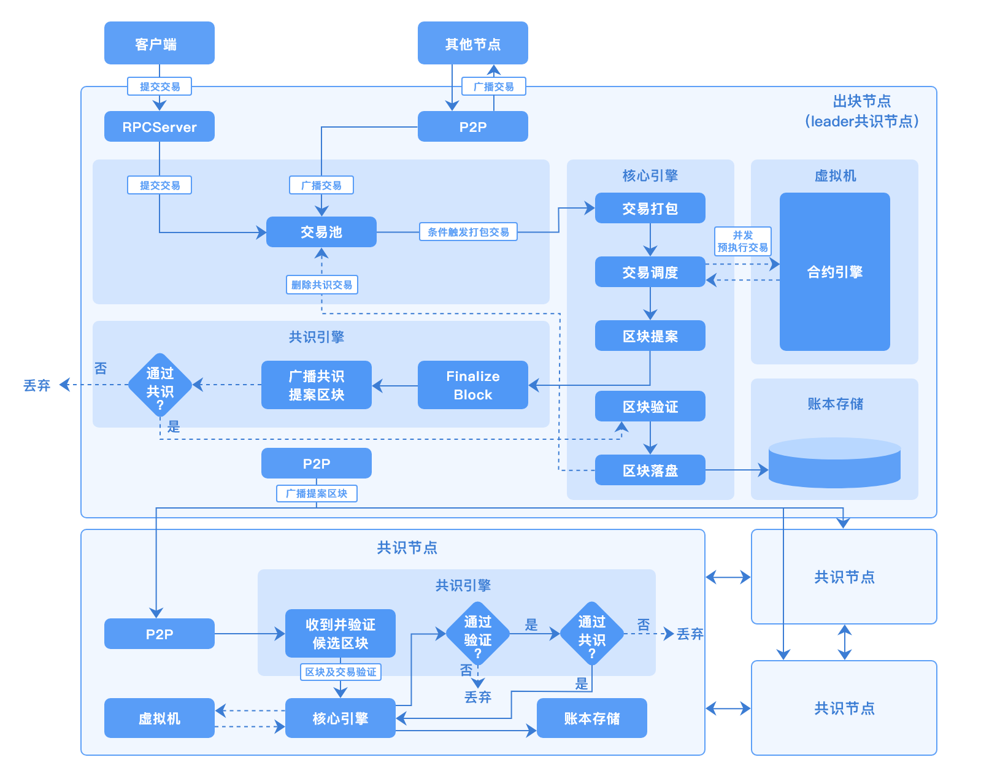
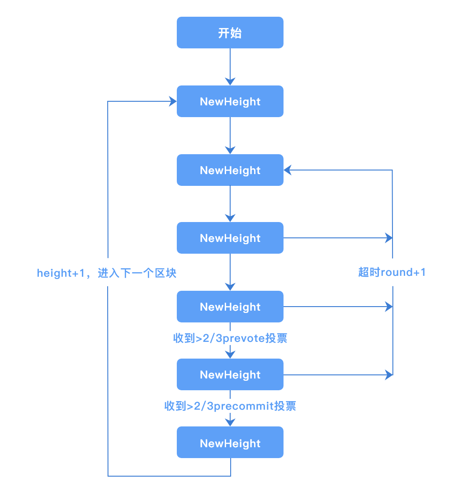
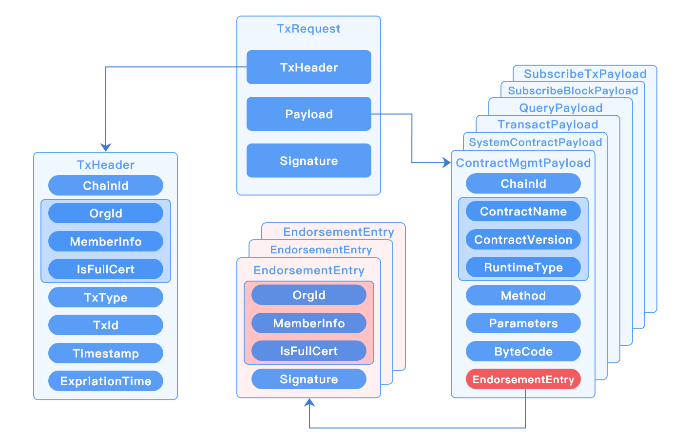
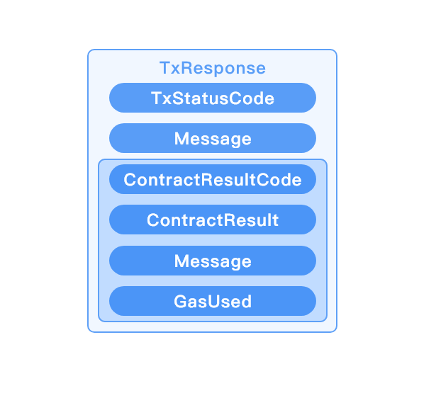

# 长安链 · ChainMaker User Manual


## 长安链简介

### 什么是长安链

长安链·ChainMaker区块链底层平台是新一代区块链开源底层软件平台，包含区块链核心框架、丰富的组件库和工具集，致力于为用户高效、精准地解决差异化区块链实现需求，构建高性能、高可信、高安全的新型数字基础设施。

### 长安链主要特性

**自主可控的底层平台**

- 独创深度模块化、可装配、高性能并行执行的区块链底层技术架构；
- 涵盖国产密码算法、基于国密证书的加密通讯和国产CA证书颁发认证机构。

**灵活高效的装配模式**

- 深度模块化，根据用户需求，择优选择不同模块组件快速组装定制化区块链系统；
- 可插拔、可分离的自主可控核心框架，可快速接入优势底层模块/单一定制化开发模块。

**国际领先的处理性能**

- 交易处理最大程度并行化，单链峰值交易处理速度可达10万笔每秒；
- 支持基于内存的数据系统，提升交易处理性能。

**标准化下的开放生态**

- 采用友好的开源协议，开放软件源代码；
- 推动多项技术体系标准化，建立标准化下的开发生态。

**完整便捷的配套工具**

- 支持大屏、图表、界面交互多种形式的管理、监控和运维；
- 支持Java、Golang、JavaScript块链SDK；
- 支持定制化部署、BaaS等多种落地实施方式；
- 友好、便捷的在线智能合约开发环境；
- 支持丰富的区块、交易、订阅、事件监听等处理机制。

### 使用长安链可以做什么

**政务服务**

基于长安链搭建政务数据共享平台，赋能政务数据跨区域、跨部门可信共享交换，实现业务高效协同。目前已落地海淀政务“一网通办”、海淀目录链、企业电子身份认证等场景。

**食品追溯**

基于长安链建设食品追溯监管体系，及时掌握食品流转信息，增强全流程透明度，提升安全风险评估与预警能力。目前已落地“北京冷链”、北京冬奥食品追溯等场景。

**金融服务**

基于长安链提供面向中小金融机构、中小企业的供应链金融服务，通过区块链线上确权，实现低成本互信，降低小微企业融资成本。目前已落地“北京市确权融资中心”、建行供应链金融平台等场景。

**供应链管理**

基于长安链构建融合区块链与人工智能技术的“可信供应商”供应链协作平台，增加供应商资质审核的真实性和便利性，提升供应链管理能力。目前已落地沃尔玛供应商管理等场景。

## 整体架构

### 逻辑架构


长安链的应用生态中主要包含以下元素：

- Consensus Node：共识节点，参与共识投票、交易执行、区块验证和记账的节点。
- Sync Node：同步节点，或称为见证节点，节点会同步、验证区块，执行交易，并记录完整账本数据，不参与共识投票。
- Light Node：轻节点，从共识节点同步数据，校验数据合法性，过滤同属组织的交易并存储；不具备接收交易请求和广播交易的功能。
- SDK：即客户端SDK，帮助用户通过RPC和链进行沟通，完成合约创建、调用、链管理等功能。
- Tools：长安链提供一系列工具集方便用户命令行方式对链部署和管理操作。比如证书生成、链配置、快速部署等。
- 长安链 Management Platform：区块链管理平台，包括链管理、区块信息检索、可视化监控等功能。
- 长安链 IDE：智能合约在线开发环境，长安链所有合约支持语言均可在该IDE上开发、编译、调试。

通常构建一条链，根据共识算法的要求部署足够的共识节点即可。根据具体业务需要选择是否增加更多的共识节点或同步节点。  


### 核心流程



区块处理流程为：

1. 提案区块。提案节点从交易池选取一批交易，并行调度执行得到结果，生成DAG，并将区块和DAG广播。
2. 验证区块。接收提案区块，基于DAG对交易并行执行，并验证结果是否一致。
3. 共识投票。基于对应的共识机制，对提案区块进行共识投票。
4. 提交区块。完成共识投票的区块，提交记录至账本。


## 核心特性

### 抽象统一的执行流程

现阶段的各种区块链实现中，整体流程差别很大。为装配出各类满足需求的区块链，长安链需合理抽象出区块链整体执行流程，并基于此通用流程进行模块组合。长安链后续还考虑增加整体流程的灵活性，以支持更加丰富的区块链场景。

### 深度模块化

长安链不仅要求区块链模块功能的完全独立、接口定义清晰、可插拔替换，而且要求模块间通信完全虚拟化，可支持从函数调用、进程间通信（IPC）到各类网络通信协议等不同的实现模式，从而使得方便自由的模块拼装组合成为可能。

### 支持广域场景

根据业务场景特性，长安链可以生产出从公有链到联盟链各类基于不同信任模型的区块链，支持更加广泛的业务应用。


## 模块说明

### 智能合约

#### 合约的分类和执行流程

长安链可以运行基于WASM和EVM的智能合约，同时内部也内置了多个系统合约。智能合约支持了面向用户的在区块链上可编程的能力，而系统合约为长安链区块链的管理与配置提供了必要条件。

当交易在合约模块执行时，先依据合约的名称，来决定是交给智能合约还是系统合约来执行。为系统合约保留的名称包括：

```
"SYSTEM_CONTRACT_CHAIN_CONFIG"
"SYSTEM_CONTRACT_QUERY"
"SYSTEM_CONTRACT_CERT_MANAGE"
"SYSTEM_CONTRACT_GOVERNMENT"
"SYSTEM_CONTRACT_MULT_SIGN"
```

如果合约名称不在上述列表中，再依据交易类型，来执行智能合约。对调用智能合约而言，有效的交易类型包括：

```
MANAGE_USER_CONTRACT
INVOKE_USER_CONTRACT
QUERY_USER_CONTRACT
QUERY_SYSTEM_CONTRACT
UPDATE_CHAIN_CONFIG
INVOKE_SYSTEM_CONTRACT
```

在把智能合约交给智能合约引擎执行前，还会经过一系列的参数校验。这些校验包括字节码、版本、合约调用方法名称、合约调用参数、合约引擎类型。

启动智能合约执行引擎时，将解析字节码、版本、合约调用方法名称、合约调用参数，并且序列化为智能合约执行引擎所需要的数据，并且拷贝数据到智能合约引擎中。智能合约执行引擎在执行过程中，就会依据上述信息执行，并且返回合约执行结果。最终把合约执行结果交给存储模块

#### 合约引擎介绍

长安链目前支持四类智能合约执行引擎：

- WASMER：支持使用Rust语言生成的智能合约wasm字节码，运行时采用aot技术执行
- GASM：支持使用Go语言编写合约，使用TinyGo编译器生成的智能合约wasm字节码，运行时采用解释技术执行
- WXVM：支持使用C++语言生成的智能合约wasm字节码，运行时采用本地化编译技术执行
- EVM：支持使用Solidity语言编写合约，使用solc编译器生成的智能合约字节码，运行时采用解释技术执行

#### 系统合约

目前系统合约包含：

- SYSTEM_CONTRACT_CHAIN_CONFIG：增删改链配置
- SYSTEM_CONTRACT_QUERY：查询链上配置
- SYSTEM_CONTRACT_CERT_MANAGE：证书管理
- SYSTEM_CONTRACT_GOVERNMENT：链上治理
- SYSTEM_CONTRACT_MULT_SIGN：链上多重签名

#### 合约SDK

长安链为不同的语言编写智能合约与链上交互提供了多种智能合约编写SDK。SDK主要提供的接口功能包括：

- 读取在区块链数据库上的数据
- 往区块链数据库上写入数据
- 获取当前交易ID、区块高度
- 获取创建合约者的身份信息（公钥、组织、角色）
- 获取调用合约者（即交易发送者）的身份信息（公钥、组织、角色）

#### 合约模块接口说明

合约模块对外的接口为：

```
//VmManager manage vm runtime
type VmManager interface {
   // GetOrganization get organization or membership
   GetOrganization() Organization
   // GetAccessControl get accessControl manages policies and principles
   GetAccessControl() AccessControl
   // GetChainNodesInfoProvider get ChainNodesInfoProvider provide base node info list of chain.
   GetChainNodesInfoProvider() ChainNodesInfoProvider
   // RunContract run native or user contract according ContractName in contractId, and call the specified function
   RunContract(contractId *pb.ContractId, method string, byteCode []byte, parameters map[string]string,
      txContext TxSimContext, gasUsed uint64, refTxType pb.TxType) (*pb.ContractResult, pb.TxStatusCode)
}
```

其主要的方法是RunContract，调用该方法时需要提供合约ID信息、调用方法、合约字节码、调用参数、合约执行上下文环境（主要为合约提供访问数据库的接口）、已消耗的资源量和合约操作交易类型（创建、升级、冻结、解冻、废止）

#### PB数据模型

合约ID：

```
// the unique identifier of a smart contract
message ContractId {
    // smart contract name, set by contract creator, can have multiple versions
    string contract_name = 1;
    // smart contract version, set by contract creator, name + version should be unique
    string contract_version = 2;
    // smart contract runtime type, set by contract creator
    RuntimeType runtime_type = 3;
}
```

智能合约引擎类型（暂时还不支持 DOCKER_GO和 DOCKER_JAVA）

```
// smart contract runtime, contains vm type and language type
enum RuntimeType {
    INVALID = 0;
    // native implement in chainmaker-go
    NATIVE = 1;
    // vm-wasmer, language-c++
    WASMER = 2;
    // vm-wxvm, language-cpp
    WXVM = 3;
    // wasm interpreter in go
    GASM = 4;
    // vm-evm
    EVM = 5;
    // vm-docker, language-golang
    DOCKER_GO = 6;
    // vm-docker, language-java
    DOCKER_JAVA = 7;
}
```

合约操作交易类型

```
// transaction type definition
enum TxType {
    // call a pre created user contract, included in block
    INVOKE_USER_CONTRACT = 0;
    // query a pre created user contract, not included in block
    QUERY_USER_CONTRACT = 1;
    // create, upgrade, freeze, unfreeze, revoke a user contract, included in block
    MANAGE_USER_CONTRACT = 2;
    // query chain information
    QUERY_SYSTEM_CONTRACT = 3;
    // update chain config, included in block
    UPDATE_CHAIN_CONFIG = 4;
    // system contract for multi signature
    INVOKE_SYSTEM_CONTRACT = 7;
}
```

合约操作管理数据结构

```
// contract management type transaction payload
// TxType: CREATE_USER_CONTRACT & UPGRADE_USER_CONTRACT & FREEZE_USER_CONTRACT
message ContractMgmtPayload {
    // endorsement signature with chain_id, redundant with TxHeader
    string chain_id = 1;
    // smart contract name, set by contract creator, can have multiple versions
    ContractId contract_id = 2;
    // invoke method in bytes format
    string method = 3;
    // invoke parameters in bytes format
    repeated KeyValuePair parameters = 4; // 合约参数
    // 合约编译后的字节码
    bytes byte_code = 5;
    // payload signature, config_update|contract_mgmt type needed, multi-sign
    repeated EndorsementEntry endorsement = 6;
}
```

系统合约操作数据结构

```
// config update type transaction payload
// TxType: UPDATE_CHAIN_CONFIG
message SystemContractPayload {
    // endorsement signature with chain_id, redundant with TxHeader
    string chain_id = 1;
    // smart contract name
    string contract_name = 2;
    // update method
    string method = 3;
    // update parameters in k-v format
    repeated KeyValuePair parameters = 4;
    // config sequence, starts from 0 (genesis config)
    uint64 sequence = 5;
    // multi-sign, signature of [SystemContractPayload] with endorsement = nil
    repeated EndorsementEntry endorsement = 6;
}
```

查询合约操作数据结构

```
// query type transaction payload
// TxType: QUERY_USER_CONTRACT & QUERY_SYSTEM_CONTRACT
message QueryPayload {
    // smart contract name
    string contract_name = 1;
    // query method
    string method = 2;
    // query parameters in k-v format
    repeated KeyValuePair parameters = 3;
}
```

调用合约操作数据结构

```
// transact type transaction payload
// TxType: INVOKE_USER_CONTRACT
message TransactPayload {
    // smart contract name
    string contract_name = 1;
    // invoke method
    string method = 2;
    // invoke parameters in k-v format
    repeated KeyValuePair parameters = 3;
}
```

### 共识算法

#### TBFT

##### 算法简述
TBFT 是一种拜占庭容错的共识算法，可以在拜占庭节点数小于总数1/3的情况下，保证系统的安全运行。
TBFT 的每轮共识可以分为5个步骤：
1. NewRound: 共识投票的准备阶段，会初始化共识相关状态
2. Proposal: 提案阶段，leader节点会打包区块，并广播给follwer节点
3. Prevote: 预投票阶段，follower节点在收到proposal并验证proposal合法后，广播自己的prevote投票到其他节点
4. Precommit: 预提交阶段，节点收到 >2/3 针对proposal的prevote投票后，广播自己的precommit投票到其他节点
5. Commit: 提交阶段，节点收到 >2/3 针对proposal的precommit投票后，提交proposal中的区块到账本

其中共识投票是指其中的Proposal，Prevote，Precommit三个阶段。

阶段图示如下：


流程图如下：


##### 与PBFT的区别
TBFT基于Tendermint算法，与PBFT的最大区别在于：PBFT有一个固定的leader节点打包交易，当leader节点故障的时候会
使用view-change子协议更换leader；而在TBFT中，leader是轮换的，每提交n个块（可以配置）leader会轮换成下一个节点。
因此，TBFT比PBFT有更好的公平性。

##### 与msgbus交互流程

```
Core                     Msgbus                    TBFT
  │                        │                        │
  │                        │                        │
  │      ProposaState      │      ProposaState      │
  │◄───────────────────────│◄───────────────────────┤
  │                        │                        │
  │                        │                        │
  │        Proposal        │        Proposal        │
  ├───────────────────────►├───────────────────────►│
  │                        │                        │
  │                        │                        │
  │        Verify          │        Verify          │
  │◄───────────────────────│◄───────────────────────┤
  │                        │                        │
  │                        │                        │
  │      VerifyResult      │      VerifyResult      │
  ├───────────────────────►├───────────────────────►│
  │                        │                        │
  │                        │                        │
  │         Commit         │         Commit         │
  │◄───────────────────────│◄───────────────────────┤
  │                        │                        │
  │                        │                        │
  │         BlockInfo      │         BlockInfo      │
  ├───────────────────────►├───────────────────────►│
  │                        │                        │
```

ProposaState: TBFT发送给核心引擎本节点在当前高度是否是leader节点，核心引擎判断是否需要打包区块 <br>
Proposal: 核心引擎打包区块并发送给TBFT <br>
Verify: 当本节点收到主节点发来的区块后，向核心引擎验证区块读写集等信息 <br>
VerifyResult: 核心引擎返回给TBFT Verify的结果，当区块合法时，本节点将会投票给区块 <br>
Commit: TBFT完成共识后，向核心引擎发送提交区块的信号，核心引擎提交区块到账本 <br>
BlockInfo: 核心引擎告知TBFT已提交区块的高度等信息，TBFT进入下一个高度 <br>

##### 接口说明
```go
type ConsensusEngine interface {      
  // Init starts the consensus engine.
  Start() error                       
                                      
  // Stop stops the consensus engine. 
  Stop() error                        
}    
```

TBFT 实现了长安链的`ConsensusEngine`接口。
`Start` 方法用来初始化TBFT内部状态及启动TBFT实例。
`Stop` 方法用来停止TBFT实例。

##### 数据结构
```protobuf
// TBFTMsgType defines different type message in tbft
enum TBFTMsgType {
  propose   = 0;
  prevote   = 1;
  precommit = 2;
  state     = 3;
}

message TBFTMsg {
  TBFTMsgType type = 1;
  bytes msg        = 2;
}

// Proposal defined a consesensus proposal which can 
// be gossiped to other node and can be serilized 
// for persistent store.
message Proposal {
  string voter                 = 1;
  int64 height                 = 2;
  int32 round                  = 3;
  int32 pol_round              = 4;
  Block block                  = 5;
  EndorsementEntry endorsement = 6;
}

// VoteType represents the type of vote
enum VoteType {
  VotePrevote   = 0;
  VotePrecommit = 1;
}

// Vote represents a tbft vote
message Vote {
  VoteType type = 1;
  string voter  = 2;
  int64 height  = 3;
  int32 round   = 4;
  bytes hash    = 5;
  EndorsementEntry endorsement = 6;
}

// Step represents the step in a round 
enum Step {
  NewHeight     = 0;
  NewRound      = 1;
  Propose       = 2;
  Prevote       = 3;
  PrevoteWait   = 4;
  Precommit     = 5;
  PrecommitWait = 6;
  Commit        = 7;
}
```

##### 配置参数
TBFT 可以通过在配置块中的`ext_config`字段配置相关参数：
1. "TBFT_propose_timeout": 提案的超时时间，如10s, 1m
2. "TBFT_propose_delta_timeout": 每轮提案超时增加的时间，如10s, 1m
3. "TBFT_blocks_per_proposer": 每个节点连续出块数，如 3


#### SOLO

- 什么是SOLO共识算法

SOLO是单节点无共识投票过程的“共识算法”。

- SOLO共识算法的用途

1. 快速部署单节点运行，降低试用门槛；
2. 供开发人员进行除网络和共识模块的全流程测试；

- 如何使用SOLO共识算法

部署一个长安链节点，将链配置（参见配置模块，链配置章节）的共识算法进行如下修改，清除数据启动即可：

```yml
#共识配置
consensus:
  # 共识类型(0-SOLO,1-TBFT,2-MBFT,3-HOTSTUFF,4-RAFT,10-POW)
  type: 1
```

### P2P网络

#### **组网方式**
- 长安链的P2P网络是基于libp2p实现并改进的，节点的网络地址遵循libp2p地址格式协议。
- 通过种子节点设置可实现节点自动发现、自动连接功能，在线的每个节点默认都可作为其他节点的种子节点提供网络发现服务，从而实现了长安链的自动组网机制。
- 长安链使用了改进后的libp2p-gossip-pubsub实现的消息广播/订阅功能。能够保证广播消息能最终到达在线的全部节点。多链场景下，节点上的每条链都独享一个独立的GossipPubSub服务，并通过对每个Gossip路由表的精确控制，可实现多链间广播数据隔离，保证了广播数据只在链内节点传播的确定性。也正是如此，才允许长安链的所有链共用一个底层P2P网络。
- 长安链理论上可实现上万甚至更多节点同时在线组网。
- 长安链可以提供NAT穿透、代理转发等在复杂网络环境下的场景解决方案支持。

#### **节点身份管理方式**
- 节点身份是由组织CA签发的TLS证书确定，在节点入网时，会校验TLS证书的合法性
- 每个节点都需保证TLS证书的唯一性，不可多节点共用一个TLS证书
- 每个TLS证书都可对应生成一个NodeId唯一标识，该标识是节点网络地址的组成部分，是网络通讯环节重要的标识

#### **基于libp2p的改进**
- 核心包增加对国密SM算法的支持
- libp2p-gossip-pubsub功能模块增加白名单功能，实现对Gossip路由表的控制，达到广播隔离效果。
- 引入StreamPool，实现stream复用提高性能、网络吞吐能力自动扩容等特性。

#### **模块接口**
```go

// NetType is the type of net.
type NetType int

const (
	// Libp2p is a type of p2p net.
	Libp2p NetType = iota
	// GRpc is a type of rpc net.
	GRpc

	// DefaultChainId is default chain id.
	DefaultChainId = "default_chain"
)

// ReceiveMsgHandler handle the msg received from other node.
type ReceiveMsgHandler func(from string, netMsg *pb.NetMsg) error

// SubMsgHandler handle the msg published by other node.
type SubMsgHandler func(publisher string, netMsg *pb.NetMsg) error

type ChainNodeInfo struct {
	NodeUid     string
	NodeAddress []string
	NodeTlsCert []byte
}

// Net is local net interface.
type Net interface {
	// NodeUid is the unique id of the node.
	NodeUid() string

	// InitPubsub will init new LibP2pPubsub instance with given chainId and maxMessageSize.
	InitPubsub(chainId string, maxMessageSize int) error

	// BroadcastWithChainId  will broadcast a msg to a PubSubTopic with the pubsub service which id is given chainId.
	BroadcastWithChainId(chainId string, topic string, netMsg *pb.NetMsg) error

	// SubscribeWithChainId register a SubMsgHandler to a PubSubTopic with the pubsub service which id is given chainId.
	SubscribeWithChainId(chainId string, topic string, handler SubMsgHandler) error

	// CancelSubscribeWithChainId cancel subscribe a PubSubTopic with the pubsub service which id is given chainId.
	CancelSubscribeWithChainId(chainId string, topic string) error

	// SendMsg send msg to the node which id is given string.
	// 		msgFlag: is a flag used to distinguish msg type.
	SendMsg(chainId string, node string, msgFlag string, netMsg *pb.NetMsg) error

	// ReceiveMsgHandle register a ReceiveMsgHandler to the net.
	// 		msgFlag: is a flag used to distinguish msg type.
	ReceiveMsgHandle(chainId string, msgFlag string, handler ReceiveMsgHandler) error

	// CancelReceiveMsgHandle unregister a ReceiveMsgHandler.
	// 		msgFlag: is a flag used to distinguish msg type.
	CancelReceiveMsgHandle(chainId string, msgFlag string) error

	// AddSeed add a seed node addr.
	AddSeed(seed string) error

	// RefreshSeeds refresh the seed node addr list.
	RefreshSeeds(seeds []string) error

	// AddTrustRoot add a tls root cert to the cert pool of chain.
	AddTrustRoot(chainId string, rootCertByte []byte) error

	// RefreshTrustRoots refresh the cert pool of chain.
	RefreshTrustRoots(chainId string, rootsCertsBytes [][]byte) error

	// IsRunning return true when the net instance is running.
	IsRunning() bool

	// Start the local net.
	Start() error

	// Stop the local net.
	Stop() error

	// ChainNodesInfo return base node info list of chain which id is the given chainId.
	ChainNodesInfo(chainId string) ([]*ChainNodeInfo, error)

	// GetNodeUidByCertId return node uid which mapped to the given cert id. If unmapped return error.
	GetNodeUidByCertId(certId string) (string, error)

	// AddOrg add a Organization for revoked validator.
	AddOrg(chainId string, org Organization)

	// CheckRevokeTlsCerts check whether any tls certs revoked.
	CheckRevokeTlsCerts(org Organization, certManageSystemContractPayload []byte) error
}


type MsgHandler func(from string, msg []byte, msgType pb.NetMsg_MsgType) error

// ChainNodesInfoProvider provide base node info list of chain.
type ChainNodesInfoProvider interface {
	// ChainNodesInfo return base node info list of chain.
	ChainNodesInfo() ([]*ChainNodeInfo, error)
}

//  NetService
type NetService interface {
	// ChainId return the chainId of the net service.
	ChainId() string

	// BroadcastMsg broadcast a msg to the net.
	BroadcastMsg(msg []byte, msgType pb.NetMsg_MsgType) error

	// Subscribe register a MsgHandler for subscribe.
	Subscribe(msgType pb.NetMsg_MsgType, handler MsgHandler) error

	// CancelSubscribe cancel subscribe.
	CancelSubscribe(msgType pb.NetMsg_MsgType) error

	// ConsensusBroadcastMsg broadcast a msg to the consensus nodes.
	ConsensusBroadcastMsg(msg []byte, msgType pb.NetMsg_MsgType) error

	// ConsensusSubscribe register a MsgHandler handle the msg from consensus nodes for subscribe.
	ConsensusSubscribe(msgType pb.NetMsg_MsgType, handler MsgHandler) error

	// CancelConsensusSubscribe cancel subscribe.
	CancelConsensusSubscribe(msgType pb.NetMsg_MsgType) error

	// SendMsg send msg to any nodes.
	SendMsg(msg []byte, msgType pb.NetMsg_MsgType, to ...string) error

	// ReceiveMsg register a MsgHandler to handle the msg received from other node.
	ReceiveMsg(msgType pb.NetMsg_MsgType, handler MsgHandler) error

	// Start the net service.
	Start() error

	// Stop the net service.
	Stop() error

	// GetNodeUidByCertId return node uid which mapped to the given cert id. If unmapped return error.
	GetNodeUidByCertId(certId string) (string, error)

	// GetChainNodesInfoProvider return a implementation of ChainNodesInfoProvider.
	GetChainNodesInfoProvider() ChainNodesInfoProvider
}
```
#### **使用配置**
- chainmaker.yml

```yaml
net:
  # 底层网络类型
  provider: LibP2P
  # 本地网路监听地址及端口
  listen_addr: /ip4/0.0.0.0/tcp/6666
  # 每个节点连接stream池大小上限，不配默认为100
  peer_stream_pool_size: 100
  # 允许与本节点建立链接的节点总数量，不配默认为20
  max_peer_count_allow: 10
  # 节点链接淘汰策略，1 Random, 2 FIFO, 3 LIFO。不配默认为3
  peer_elimination_strategy: 3
  # 种子节点地址列表，用于节点发现，可选项
  seeds: 
    - "/ip4/127.0.0.1/tcp/6666/p2p/QmQZn3pZCcuEf34FSvucqkvVJEvfzpNjQTk17HS6CYMR35"
  # TLS认证相关配置
  tls:
    # TLS认证开关
    enabled: true
    # TLS证书
    priv_key_file: ./crypto-config/wx-org1.chainmaker.org/node/consensus1/consensus1.tls.key
    cert_file:     ./crypto-config/wx-org1.chainmaker.org/node/consensus1/consensus1.tls.crt
  # 组网黑名单配置，可选项
  blacklist:
    # 黑名单地址，可选项，[ip]:[port]或者[ip]两者均可
    addresses:
      - "127.0.0.1:11305"
      - "192.168.1.8"
    # 黑名单节点ID，可选项
    node_ids:
      - "QmeyNRs2DwWjcHTpcVHoUSaDAAif4VQZ2wQDQAUNDP33gH"
      - "QmVSCXfPweL1GRSNt8gjcw1YQ2VcCirAtTdLKGkgGKsHqi"
```

在链初始化阶段，net_service在初始化时会读取链配置chainconfig下的共识节点列表和trust_root。当前阶段，网络会将共识节点作为种子节点seeds的一员，并会通过ConnSupervisor维护与其之间的链接；网络还会维护一份共识节点ID列表，便于向共识节点定向广播；trust_root作为TLS认证可信根证书池，同时会根据不同链的根证书池来确定对方节点隶属于哪条链。

#### **节点地址格式说明**
长安链节点地址遵循libp2p网络地址格式协定，使用multaddr组件解析地址，例如：
```text
/ip4/127.0.0.1/tcp/6666/p2p/QmQZn3pZCcuEf34FSvucqkvVJEvfzpNjQTk17HS6CYMR35
```

或者

```text
/dns4/chainmaker.org/tcp/6666/p2p/QmQZn3pZCcuEf34FSvucqkvVJEvfzpNjQTk17HS6CYMR35
```
地址以"/"开始，并以"/"分段，大多数情况下，各段说明如下：
- 第一段：IP协议版本或DNS解析协议版本。ip4代表IPv4，ip6代表IPv6；dns4对应IPv4版本DNS服务，dns6对应IPv6版本DNS服务
- 第二段：IP地址或域名，需要与第一段对应
- 第三段：通讯网络协议，默认使用tcp
- 第四段：监听端口
- 第五段：固定协议，请勿改动，固定为"p2p"
- 第六段：节点NodeId，与TLS证书配套，根据TLS证书通过特定算法计算而来

以上只是最普通常用场景下节点地址举例，在复杂网络场景下（比如需要使用节点中继、NAT穿透等）地址格式会稍有不同。

#### **网络消息数据格式说明（加密前）**
加密前的消息数据是由 `8位byte表示数据长度 + 1位byte数据压缩标识 + 实际数据` 来组成。

为了方便说明，我们使用如下例子：
```text
[0 0 0 0 0 0 0 78 0 10 57 10 5 ...... 80 85 83 72]
```
假设这是一条待发送的网络消息数据，其中：
- 前8位，[0 0 0 0 0 0 0 78] 表示要发送数据的长度，在接收方接收数据时，若接收到的数据长度不足该值，则会尝试继续读取数据，直至接收全部长度的数据或接收失败。
- 第9位，[0] 或 [1] 是数据压缩标记位，若是1，接收方在接收到完整数据后，会将接收到的数据进行解压缩，得到最终的数据结果。
- 剩余位，[10 57 10 5 ...... 80 85 83 72] 为要发送的原始数据或被压缩后的原始数据，是否压缩要与第9位压缩标识相对应。压缩/解压缩使用GZip工具包完成。

### RPC服务

#### 功能说明

`RPCServer`采用`gRPC`实现的远程过程调用系统，采用`HTTP/2` 传输协议，使用`Protobuf` 作为接口描述语言，实现模块间的高效交互。

功能上支持处理节点请求、基于流模式的消息订阅，通信上支持`TLS`单向和双向认证、流控机制等。

#### 配置说明

```yml
rpc:
  provider: grpc
  port: 12301
  # 检查链配置TrustRoots证书变化时间间隔，单位：s，最小值为10s
  check_chain_conf_trust_roots_change_interval: 60
  ratelimit:
    # 每秒补充令牌数，取值：-1-不受限；0-默认值（10000）
    token_per_second: -1
    # 令牌桶大小，取值：-1-不受限；0-默认值（10000）
    token_bucket_size: -1
  subscriber:
    # 历史消息订阅流控，实时消息订阅不会进行流控
    ratelimit:
      # 每秒补充令牌数，取值：-1-不受限；0-默认值（1000）
      token_per_second: 100
      # 令牌桶大小，取值：-1-不受限；0-默认值（1000）
      token_bucket_size: 100
  tls:
    # TLS模式:
    #   disable - 不启用TLS
    #   oneway  - 单向认证
    #   twoway  - 双向认证
    mode:           twoway
    priv_key_file:  ./certs/node/consensus1/consensus1.tls.key
    cert_file:      ./certs/node/consensus1/consensus1.tls.crt
```

#### 接口定义

```protobuf
service RpcNode {
	// 交易消息请求处理
	rpc SendRequest(TxRequest) returns (TxResponse) {};

	// 消息订阅请求处理
	rpc Subscribe(TxRequest) returns (stream SubscribeResult) {};

	// 更新日志级别
	rpc RefreshLogLevelsConfig(LogLevelsRequest) returns (LogLevelsResponse) {};

	// 获取长安链版本
	rpc GetChainMakerVersion(ChainMakerVersionRequest) returns(ChainMakerVersionResponse) {};

	// 检查链配置并动态加载新链
	rpc CheckNewBlockChainConfig(CheckNewBlockChainConfigRequest) returns (CheckNewBlockChainConfigResponse) {};

	// 更新Debug状态（开发调试）
	rpc UpdateDebugConfig(DebugConfigRequest) returns (DebugConfigResponse) {};
}
```

#### 关键数据结构

- **TxRequest**



- **TxResponse**



#### 关键逻辑

- **消息订阅（事件通知）**


（1）订阅者发起消息订阅请求，当前支持订阅区块消息和交易消息

（2）如果只是订阅历史数据，直接从账本存储（`Store`）中获取后返回给订阅者

（3）如果需要订阅实时数据，则会有`Subscriber`发起订阅事件，将`chan`注册到订阅者列表中，当`Core`模块有新区块产生，会发送事件通知，通过`chan`通知到`Subscriber`，通过`RPCServer`返回给订阅者

（4）如果需要同时订阅历史和实时数据，则会分别从账本存储（`Store`）以及消息订阅发布者获取，而后返回给订阅者

（5）若订阅消息发送完，`RPCServer`会主动关闭订阅通道，避免资源浪费

### 存储模块

存储模块负责存储区块链上的区块、交易、账本数据和历史读写集数据，在提交区块时，这些数据就会被存储模块进行存储。存储模块的整体架构如下图：


#### 账本存储的处理流程

##### 区块提交存储流程

1.	首先序列化后的区块数据、读写集列表、以及最新区块高度写入Block binary log(wal)，用于异常中断后的恢复。同时为了提高性能，加入cache层，新区块提交请求在更新完Block binary log之后，再将区块数据（包括区块、交易、状态数据、读写集）写入cache。更新完log和cache后即可返回，由后台线程异步更新Block DB、State DB和History DB。
2.	在Block DB中记录区块信息与交易信息，其中交易信息以TxID作为key存储，区块信息以BlockHeight作为key存储，区块信息中只记录交易ID列表，同时索引BlockHash到BlockHeight的映射关系，同时Block DB中记录最新的区块高度（LastBlockHeight）作为checkpoint，以批量事务的方式提交，保证批处理的原子性。
3.	在State DB中记录交易修改的state数据，key为合约名与对象主键的组合：<contractName, ObjectKey>，同时记录最新的区块高度（LastBlockHeight）作为checkpoint，以批量事务的方式提交，保证批处理的原子性。
4.	在History DB中记录交易的读写集，读写集以TxID作为key，同时记录最新的区块高度（LastBlockHeight）作为checkpoint，以批量事务的方式提交，保证批处理的原子性。

##### 账本恢复流程

如果在提交区块过程中，单个数据库存储发生异常，将会导致数据库之间的数据不一致，程序遇到这种情况后会主动退出。然后系统在重启时会进入恢复流程：

1.	分别从Block binary log、Block DB、State DB、History DB中获取最新的区块高度，以Block binary log中的区块高度作为基准高度，判断其他DB是否落后基准高度。
2.	如果存在DB落后基准高度，则从Block bianry log中获取缺失的区块及读写集，依次提交到落后DB中。
3.	所有DB同步到基准高度后，存储模块启动完成，BlockChain模块继续调度其他模块完成启动。

##### 账本查询流程

查询请求首先查询cache中的kv数据，如果cache命中则返回，cache不存在再从DB中查询。对于删除操作，cache中提供标记删除，以表明最新的key已经被删除。对于范围查询，多条数据可能同时存在cache和db中，需要进行数据合并。

#### 账本数据库类型

账本数据库支持多个不同的数据库，以匹配不同的业务需求

- LevelDB
- RocksDB
- MySQL/分布式MySQL

#### 存储模块接口

```go
// BlockchainStore provides handle to store instances
type BlockchainStore interface {

	// PutBlock commits the block and the corresponding rwsets in an atomic operation
	PutBlock(block *pb.Block, txRWSets []*pb.TxRWSet) error

	// GetBlockByHash returns a block given it's hash, or returns nil if none exists.
	GetBlockByHash(blockHash []byte) (*pb.Block, error)

	// BlockExists returns true if the black hash exist, or returns false if none exists.
	BlockExists(blockHash []byte) (bool, error)

	// GetBlock returns a block given it's block height, or returns nil if none exists.
	GetBlock(height int64) (*pb.Block, error)

	// GetLastConfigBlock returns the last config block.
	GetLastConfigBlock() (*pb.Block, error)

	// GetBlockByTx returns a block which contains a tx.
	GetBlockByTx(txId string) (*pb.Block, error)

	// GetBlockWithRWSets returns a block and the corresponding rwsets given
	// it's block height, or returns nil if none exists.
	GetBlockWithRWSets(height int64) (*pb.BlockWithRWSet, error)

	// GetTx retrieves a transaction by txid, or returns nil if none exists.
	GetTx(txId string) (*pb.Transaction, error)

	// TxExists returns true if the tx exist, or returns false if none exists.
	TxExists(txId string) (bool, error)

	// GetTxConfirmedTime returns the confirmed time for given tx
	GetTxConfirmedTime(txId string) (int64, error)

	// GetLastBlock returns the last block.
	GetLastBlock() (*pb.Block, error)

	// ReadObject returns the state value for given contract name and key, or returns nil if none exists.
	ReadObject(contractName string, key []byte) ([]byte, error)

	// SelectObject returns an iterator that contains all the key-values between given key ranges.
	// startKey is included in the results and limit is excluded.
	SelectObject(contractName string, startKey []byte, limit []byte) Iterator

	// GetTxRWSet returns an txRWSet for given txId, or returns nil if none exists.
	GetTxRWSet(txId string) (*pb.TxRWSet, error)

	// GetTxRWSetsByHeight returns all the rwsets corresponding to the block,
	// or returns nil if zhe block does not exist
	GetTxRWSetsByHeight(height int64) ([]*pb.TxRWSet, error)

	// GetDBHandle returns the database handle for given dbName
	GetDBHandle(dbName string) DBHandle

	// Close closes all the store db instances and releases any resources held by BlockchainStore
	Close() error
}
```

#### 配置说明

节点本地配置关于存储部分的配置说明：

```yaml
storage:
	provider: LevelDB	#数据库类型，支持LevelDB，RocksDB，MySQL/分布式MySQL
	store_path: ../data/ledgerData  #账本的存储路径， 包括LevelDB、RocksDB的数据目录，Block binary log的数据目录
	write_buffer_size: 4	#LevelDB、RocksDB的write_buffer_size， 单位为MB，默认为4M
	bloom_filter_bits: 10	#LevelDB、RocksDB的布隆过滤器参数，为每个key分配的额外bit空间，默认为10，如果少于或等于0，则不开启布隆过滤。
	disable_historydb: false	#是否禁用历史读写集的存储功能， 默认为false，也就是保存历史读写集。
	mysql:	#MySQL相关配置，只有provider选择MySQL时才需要配置
		dsn: user:password?@tcp(ip:port)/	#mysql的连接信息，包括用户名、密码、ip、port等，示例：root:admin?@tcp(127.0.0.1:3306)
		max_idle_conns: 10	#连接池中维持的最大的空闲连接数，默认为10
		max_open_conns: 10	#最大的可用连接数，默认为10
		conn_max_lifetime: 60	#连接维持的最长时间，单位秒，默认为60
```

#### RocksDB部署

##### Rocksdb使用

因为rocksdb本身是使用C++写的，而目前使用gorocksdb需要依赖rocksdb的库文件，因此直接编译会报错，针对该问题，目前采用了条件编译的方式。

##### 1.1 未安装Rocksdb的环境下编译启动

针对未安装Rocksdb的环境，可直接通过go build正常编译，但是要求必须使用levelDB，若配置为rocksDB会出现空指针错误。

##### 1.2 使用RocksDB编译启动

若要使用RocksDB则必须先本地安装RocksDB环境，安装方式包括两部分：
 + 1.RocksDB安装：https://github.com/facebook/rocksdb/blob/master/INSTALL.md
 + 2.gorocksdb安装：https://github.com/tecbot/gorocksdb

使用rocksdb需要通过-tag方式启动，build方式：

```shell script
go build -tags=rocksdb 
```

若通过go run直接启动则使用下面的方式：

```shell script
go run -tags=rocksdb main.go {params}
```

##### 2. Linux下Rocksdb环境安装

##### 2.1 安装依赖

安装gcc、zlib、snappy、lz4等依赖工具

```shell
yum -y install lrzsz git gcc gcc-c++ lz4-devel
```

```shell
yum -y install snappy snappy-devel zlib zlib-devel bzip2 bzip2-devel lz4 lz4-devel zstd
```

##### 2.2 安装cmake

gflags-2.2.2对cmake版本有要求，所以需要指定版本的cmake

```shell
curl -O   https://cmake.org/files/v3.6/cmake-3.6.0-Linux-x86_64.tar.gz
mv cmake-3.6.0-Linux-x86_64.tar.gz /opt/
cd /opt/
tar -xvzf cmake-3.6.0-Linux-x86_64.tar.gz
yum remove cmake

cat >>/etc/profile <<EOF

export PATH=\$PATH:/opt/cmake-3.6.0-Linux-x86_64/bin

EOF
source /etc/profile
```

##### 2.3 安装gflags

```shell
wget -O gflags-2.2.2.tar.gz https://github.com/gflags/gflags/archive/v2.2.2.tar.gz
tar -xvzf gflags-2.2.2.tar.gz
cd gflags-2.2.2/
mkdir build
cd build/
cmake -DBUILD_SHARED_LIBS=ON -DBUILD_STATIC_LIBS=ON -DINSTALL_HEADERS=ON -DINSTALL_SHARED_LIBS=ON -DINSTALL_STATIC_LIBS=ON ..
make
make install

cat >>/etc/profile <<EOF

export LD_LIBRARY_PATH=\$LD_LIBRARY_PATH:/usr/local/lib
EOF
source /etc/profile
```

##### 2.4 下载并安装rocksdb

```shell
wget -O rocksdb-5.18.3.tar.gz https://github.com/facebook/rocksdb/archive/v5.18.3.tar.gz
tar -xzvf rocksdb-5.18.3.tar.gz

cd rocksdb-5.18.3
mkdir build
cd build

cmake -DCMAKE_INSTALL_PREFIX=/usr/local/rocksdb ..

make
make install

cat >>/etc/profile <<EOF

export CPLUS_INCLUDE_PATH=\$CPLUS_INCLUDE_PATH:/usr/local/rocksdb/include/
export LD_LIBRARY_PATH=\$LD_LIBRARY_PATH:/usr/local/rocksdb/lib64/
export LIBRARY_PATH=\$LIBRARY_PATH:/usr/local/rocksdb/lib64/

EOF

source /etc/profile

```

##### 2.5 使用测试

``` shell
[root@VM-219-157-centos /opt/rocksdb-5.18.3/build]# cd tools/
[root@VM-219-157-centos /opt/rocksdb-5.18.3/build/tools]# ll
total 2608
drwxr-xr-x 12 root root    4096 Dec 25 10:38 CMakeFiles
-rw-r--r--  1 root root     269 Dec 25 10:38 CTestTestfile.cmake
-rw-r--r--  1 root root   18973 Dec 25 10:38 Makefile
-rw-r--r--  1 root root     988 Dec 25 10:38 cmake_install.cmake
-rwxr-xr-x  1 root root  232649 Dec 25 10:55 db_repl_stress
-rwxr-xr-x  1 root root  233443 Dec 25 10:55 db_sanity_test
-rwxr-xr-x  1 root root 1338230 Dec 25 10:55 db_stress
-rwxr-xr-x  1 root root   48060 Dec 25 10:55 ldb
-rwxr-xr-x  1 root root  207347 Dec 25 10:55 rocksdb_dump
-rwxr-xr-x  1 root root  207358 Dec 25 10:55 rocksdb_undump
-rwxr-xr-x  1 root root    8571 Dec 25 10:55 sst_dump
-rwxr-xr-x  1 root root  350147 Dec 25 10:55 write_stress
[root@VM-219-157-centos /opt/rocksdb-5.18.3/build/tools]#
[root@VM-219-157-centos /opt/rocksdb-5.18.3/build/tools]#
[root@VM-219-157-centos /opt/rocksdb-5.18.3/build/tools]#
[root@VM-219-157-centos /opt/rocksdb-5.18.3/build/tools]# ./ldb -help
ldb - RocksDB Tool

commands MUST specify --db=<full_path_to_db_directory> when necessary

The following optional parameters control if keys/values are input/output as hex or as plain strings:
  --key_hex : Keys are input/output as hex
  --value_hex : Values are input/output as hex
  --hex : Both keys and values are input/output as hex

The following optional parameters control the database internals:
  --column_family=<string> : name of the column family to operate on. default: default column family
  --ttl with 'put','get','scan','dump','query','batchput' : DB supports ttl and value is internally timestamp-suffixed
  --try_load_options : Try to load option file from DB.
  --ignore_unknown_options : Ignore unknown options when loading option file.
  --bloom_bits=<int,e.g.:14>
  --fix_prefix_len=<int,e.g.:14>
  --compression_type=<no|snappy|zlib|bzip2|lz4|lz4hc|xpress|zstd>
  --compression_max_dict_bytes=<int,e.g.:16384>
  --block_size=<block_size_in_bytes>
  --auto_compaction=<true|false>
  --db_write_buffer_size=<int,e.g.:16777216>
  --write_buffer_size=<int,e.g.:4194304>
  --file_size=<int,e.g.:2097152>


Data Access Commands:
  put <key> <value>  [--ttl]
  get <key> [--ttl]
  batchput <key> <value> [<key> <value>] [..] [--ttl]
  scan [--from] [--to]  [--ttl] [--timestamp] [--max_keys=<N>q]  [--start_time=<N>:- is inclusive] [--end_time=<N>:- is exclusive] [--no_value]
  delete <key>
  deleterange <begin key> <end key>
  query [--ttl]
    Starts a REPL shell.  Type help for list of available commands.
  approxsize [--from] [--to]
  checkconsistency


Admin Commands:
  dump_wal --walfile=<write_ahead_log_file_path> [--header]  [--print_value]  [--write_committed=true|false]
  compact [--from] [--to]
  reduce_levels --new_levels=<New number of levels> [--print_old_levels]
  change_compaction_style --old_compaction_style=<Old compaction style: 0 for level compaction, 1 for universal compaction> --new_compaction_style=<New compaction style: 0 for level compaction, 1 for universal compaction>
  dump [--from] [--to]  [--ttl] [--max_keys=<N>] [--timestamp] [--count_only] [--count_delim=<char>] [--stats] [--bucket=<N>] [--start_time=<N>:- is inclusive] [--end_time=<N>:- is exclusive] [--path=<path_to_a_file>]
  load [--create_if_missing] [--disable_wal] [--bulk_load] [--compact]
  manifest_dump [--verbose] [--json] [--path=<path_to_manifest_file>]
  list_column_families full_path_to_db_directory
  dump_live_files
  idump [--from] [--to]  [--input_key_hex] [--max_keys=<N>] [--count_only] [--count_delim=<char>] [--stats]
  repair
  backup [--backup_env_uri]  [--backup_dir]  [--num_threads]  [--stderr_log_level=<int (InfoLogLevel)>]
  restore [--backup_env_uri]  [--backup_dir]  [--num_threads]  [--stderr_log_level=<int (InfoLogLevel)>]
  checkpoint [--checkpoint_dir]
  write_extern_sst <output_sst_path>
  ingest_extern_sst <input_sst_path> [--move_files]  [--snapshot_consistency]  [--allow_global_seqno]  [--allow_blocking_flush]  [--ingest_behind]  [--write_global_seqno]

[root@VM-219-157-centos /opt/rocksdb-5.18.3/build/tools]#
[root@VM-219-157-centos /opt/rocksdb-5.18.3/build/tools]#
[root@VM-219-157-centos /opt/rocksdb-5.18.3/build/tools]#
[root@VM-219-157-centos /opt/rocksdb-5.18.3/build/tools]#
[root@VM-219-157-centos /opt/rocksdb-5.18.3/build/tools]#
[root@VM-219-157-centos /opt/rocksdb-5.18.3/build/tools]#
[root@VM-219-157-centos /opt/rocksdb-5.18.3/build/tools]# pwd
/opt/rocksdb-5.18.3/build/tools
[root@VM-219-157-centos /opt/rocksdb-5.18.3/build/tools]# ll /tmp/
total 32
srwxrwxrwx 1 root root    0 Dec 18 23:04 agent_cmd.sock
drwxr-xr-x 2 root root 4096 Dec 25 10:14 commandnotfound
-rw-r--r-- 1 root root   53 Dec 17 10:44 cpuidle_support.log
-rw-r--r-- 1 root root 2513 Dec 17 10:43 cvm_init.log
-rw-r--r-- 1 root root  297 Dec 17 10:44 net_affinity.log
-rw-r--r-- 1 root root   26 Dec 17 10:44 nv_gpu_conf.log
-rw-r--r-- 1 root root  155 Dec 17 10:44 setRps.log
drwx------ 3 root root 4096 Dec 17 10:44 systemd-private-e9868203df724169bf07a791d55819cd-ntpd.service-mA2nuw
-rw-r--r-- 1 root root 2017 Dec 17 10:44 virtio_blk_affinity.log
[root@VM-219-157-centos /opt/rocksdb-5.18.3/build/tools]# ./ldb --db=/tmp/test_db --create_if_missing put a1 b1
OK

[root@VM-219-157-centos /opt/rocksdb-5.18.3/build/tools]# ./ldb --db=/tmp/test_db scan
a1 : b1

[root@VM-219-157-centos /opt/rocksdb-5.18.3/build/tools]# ./ldb --db=/tmp/test_db get a1
b1

[root@VM-219-157-centos /opt/rocksdb-5.18.3/build/tools]# ./ldb --db=/tmp/test_db get a2
Failed: NotFound:
[root@VM-219-157-centos /opt/rocksdb-5.18.3/build/tools]# cd /tmp/test_db/
[root@VM-219-157-centos /tmp/test_db]# ll
total 920
-rw-r--r-- 1 root root    26 Dec 25 11:13 000003.log
-rw-r--r-- 1 root root    16 Dec 25 11:13 CURRENT
-rw-r--r-- 1 root root    37 Dec 25 11:13 IDENTITY
-rw-r--r-- 1 root root     0 Dec 25 11:13 LOCK
-rw-r--r-- 1 root root 16246 Dec 25 11:14 LOG
-rw-r--r-- 1 root root 19272 Dec 25 11:13 LOG.old.1608866049557780
-rw-r--r-- 1 root root 15784 Dec 25 11:14 LOG.old.1608866049562808
-rw-r--r-- 1 root root 16246 Dec 25 11:14 LOG.old.1608866058035881
-rw-r--r-- 1 root root 15788 Dec 25 11:14 LOG.old.1608866058041253
-rw-r--r-- 1 root root 16250 Dec 25 11:14 LOG.old.1608866062086538
-rw-r--r-- 1 root root 15784 Dec 25 11:14 LOG.old.1608866062091559
-rw-r--r-- 1 root root    13 Dec 25 11:13 MANIFEST-000001
-rw-r--r-- 1 root root  4744 Dec 25 11:13 OPTIONS-000005

```


##### 2.6 安装zstd

zstd是facebook为适配rocksdb开发的zstandard数据压缩工具，如果不安装该软件，会导致gorocksdb安装失败。

安装步骤如下：

```shell
cd /usr/local
git clone https://github.com/facebook/zstd.git
cd zstd
make
make install
```

##### 2.7 安装gorocksdb

通过4.1-4.6安装步骤后，rocksdb会被安装在 usr/local/rocksdb 这个目录下，我们使用go版本的rocksdb需要依赖于该路径。

目前使用的gorocksdb为：github.com/tecbot/gorocksdb

安装上述的安装路径，使用下面的命令即可：

```shell
CGO_CFLAGS="-I/usr/local/rocksdb/include" \
CGO_LDFLAGS="-L/usr/local/rocksdb -lrocksdb -lstdc++ -lm -lz -lbz2 -lsnappy -llz4 -lzstd" \
  go get github.com/tecbot/gorocksdb

```

如果安装目录有变化，则修改对应的/usr/local/rocksdb对应的路径

#### MySQL存储

长安链支持MySQL作为账本存储引擎，同时也支持分布式的MySQL集群，如果使用MySQL作为存储引擎，长安链启动会自动创建数据库和表，使用chainId作为数据库名，同时创建相应的表：

1. 区块元信息表

   ```sql
   CREATE TABLE `block_infos` (
     `chain_id` varchar(128) COLLATE utf8mb4_general_ci DEFAULT NULL,
     `block_height` bigint(20) NOT NULL,
     `pre_block_hash` varbinary(128) DEFAULT NULL,
     `block_hash` varbinary(128) DEFAULT NULL,
     `pre_conf_height` bigint(20) DEFAULT '0',
     `block_version` varbinary(128) DEFAULT NULL,
     `dag_hash` varbinary(128) DEFAULT NULL,
     `rw_set_root` varbinary(128) DEFAULT NULL,
     `tx_root` varbinary(128) DEFAULT NULL,
     `block_timestamp` bigint(20) DEFAULT '0',
     `proposer` blob,
     `consensus_args` blob,
     `tx_count` bigint(20) DEFAULT '0',
     `signature` blob,
     `dag` blob,
     `tx_ids` longtext COLLATE utf8mb4_general_ci,
     `additional_data` longblob,
     PRIMARY KEY (`block_height`),
     KEY `idx_hash` (`block_hash`)
   ) ENGINE=InnoDB DEFAULT CHARSET=utf8mb4 COLLATE=utf8mb4_general_ci;
   ```

   

2. 交易表

   ```sql
   CREATE TABLE `tx_infos` (
     `chain_id` varchar(128) COLLATE utf8mb4_general_ci DEFAULT NULL,
     `sender` blob,
     `tx_id` varchar(128) COLLATE utf8mb4_general_ci NOT NULL,
     `tx_type` int(11) DEFAULT NULL,
     `block_height` bigint(20) DEFAULT NULL,
     `offset` int(11) DEFAULT NULL,
     `timestamp` bigint(20) DEFAULT '0',
     `expiration_time` bigint(20) DEFAULT '0',
     `request_payload` longblob,
     `request_signature` blob,
     `code` int(11) DEFAULT NULL,
     `contract_result` longblob,
     `rw_set_hash` varbinary(128) DEFAULT NULL,
     PRIMARY KEY (`tx_id`),
     KEY `idx_height_offset` (`block_height`,`offset`)
   ) ENGINE=InnoDB DEFAULT CHARSET=utf8mb4 COLLATE=utf8mb4_general_ci;
   ```

   

3. 世界状态表

   ```sql
   CREATE TABLE `state_infos` (
     `contract_name` varchar(128) COLLATE utf8mb4_general_ci NOT NULL,
     `object_key` varbinary(128) NOT NULL DEFAULT '',
     `object_value` longblob,
     `block_height` bigint(20) DEFAULT NULL,
     `updated_at` datetime(3) DEFAULT NULL,
     PRIMARY KEY (`contract_name`,`object_key`),
     KEY `idx_height` (`block_height`)
   ) ENGINE=InnoDB DEFAULT CHARSET=utf8mb4 COLLATE=utf8mb4_general_ci;
   ```

   

4. 历史读写集表

   ```sql
   CREATE TABLE `history_infos` (
     `tx_id` varchar(128) COLLATE utf8mb4_general_ci NOT NULL,
     `rw_sets` longblob,
     `block_height` bigint(20) DEFAULT NULL,
     PRIMARY KEY (`tx_id`),
     KEY `idx_height` (`block_height`)
   ) ENGINE=InnoDB DEFAULT CHARSET=utf8mb4 COLLATE=utf8mb4_general_ci;
   ```

   

### 身份、权限管理

#### 简介

身份、权限管理分为两个部分：身份管理（Identity Management）和权限管理（Access Control）。

Identity Management (idmgmt) 用于管理区块链的组织成员身份，是一个基于 PKI 体系的管理模块。

- 私钥部分：模块管理本地节点或成员的私钥，本地节点或成员与链上其他节点交互时用这个私钥对消息签名。

- 公钥部分：该模块从链配置中读取链上所有组织的公共信息，包括公钥、证书等，用于在交互式验证对端的合法性。

Access Control (权限管理) 模块实现了链上资源与权限规则的匹配，并在链的参与者使用链上资源时验证其权限是否符合目标资源的权限规则。

- 权限管理：解析默认配置、链配置中的权限配置，并维护一个资源-权限规则列表。

- 鉴权：与 IDMgmt (身份管理模块) 一起，为链上成员与资源的权限规则提供验证能力。


#### 组织成员身份管理

身份管理模块由两部分组成：组织和成员。组织模块管理全链公共验证信息和本组织的公共信息。成员模块管理本地节点或本地成员的私钥相关信息。

##### 成员及其签名能力

成员接口和代表一个成员的签名接口如下：
```go
type Member interface {
	// GetMemberId returns the identity of this member
	GetMemberId() string

	// GetOrgId returns the organization id which this member belongs to
	GetOrgId() string

	// GetRole returns roles of this member
	GetRole() []Role

	// GetSKI returns SKI for certificate mode or Public key PEM for pk mode
	GetSKI() []byte

	// GetCertificate returns certificate object.
	// If in public key mode, return a certificate which contains public key object in PublicKey field.
	GetCertificate() (*x509.Certificate, error)

	// Verify verifies a signature over some message using this member
	Verify(hashType string, msg []byte, sig []byte) error

	// Serialize converts member to bytes
	Serialize(isFullCert bool) ([]byte, error)

	// GetSerializedMember returns SerializedMember
	GetSerializedMember(isFullCert bool) (*pb.SerializedMember, error)
}

type SigningMember interface {
	// Extends Identity
	Member

	// Sign the message
	Sign(hashType string, msg []byte) ([]byte, error)
}
```
Sign() 使用成员的私钥对入参数据生成一个签名。

Verify() 验证一个入参签名、数据是否是由这个成员签发的。

Serialize() 和 GetSerializeMember() 接口用于序列化成员。其中，GetSerializeMember() 接口将 Member 结构转化为 protobuf 中定义的可序列化结构，其中包含成员的关键信息：证书、组织、证书是否压缩。Serialize() 接口则是跳过转化为 protobuf 类的这一步，直接讲 Member 的关键信息以字符串形式表示。这两个接口根据需要，在包装请求报文时使用。私钥为不可序列化的部分，以防止错误地将私钥序列化后在网络中传输。原则上私钥不会离开本地。

#### Access Control 模块组件
Policy：链上成员所持有的身份。
Principle：一个链上资源的权限规则。
AccessControl：结构定义了权限管理对外的接口。

```go
type AccessControlProvider interface {
	MemberDeserializer

	// GetHashAlg return hash algorithm the access control provider uses
	GetHashAlg() string

	// ValidateResourcePolicy checks whether the given resource policy is valid
	ValidateResourcePolicy(resourcePolicy *pb.ResourcePolicy) bool

	// LookUpResourceNameByTxType returns resource name corresponding to the tx type
	LookUpResourceNameByTxType(txType pb.TxType) (string, error)

	// CreatePrincipal creates a principal for one time authentication
	CreatePrincipal(resourceName string, endorsements []*pb.EndorsementEntry, message []byte) (Principal, error)

	// CreatePrincipalForTargetOrg creates a principal for "SELF" type policy,
	// which needs to convert SELF to a sepecific organization id in one authentication
	CreatePrincipalForTargetOrg(resourceName string, endorsements []*pb.EndorsementEntry, message []byte, targetOrgId string) (Principal, error)

	// GetValidEndorsements filters all endorsement entries and returns all valid ones
	GetValidEndorsements(principal Principal) ([]*pb.EndorsementEntry, error)

	// VerifyPrincipal verifies if the policy for the resource is met
	VerifyPrincipal(principal Principal) (bool, error)

	// ValidateCRL validates whether the CRL is issued by a trusted CA
	ValidateCRL(crl []byte) ([]*pkix.CertificateList, error)

	// IsCertRevoked verify whether cert chain is revoked by a trusted CA.
	IsCertRevoked(certChain []*x509.Certificate) bool

	// GetLocalOrgId returns local organization id
	GetLocalOrgId() string

	// GetLocalSigningMember returns local SigningMember
	GetLocalSigningMember() SigningMember

	// NewMemberFromCertPem creates a member from cert pem
	NewMemberFromCertPem(orgId, certPEM string) (Member, error)

	// NewMemberFromProto creates a member from SerializedMember
	NewMemberFromProto(serializedMember *pb.SerializedMember) (Member, error)

	// NewSigningMemberFromCertFile creates a signing member from private key and cert files
	NewSigningMemberFromCertFile(orgId, prvKeyFile, password, certFile string) (SigningMember, error)

	// NewSigningMember creates a signing member from existing member
	NewSigningMember(member Member, privateKeyPem, password string) (SigningMember, error)
}
```
权限管理模块的核心接口是 CreatePrincipal(), CreatePrincipalForTargetOrg(), 和 VerifyPrincipal()。前两个接口用于根据请求者身份和所请求的资源构建一个被验证的身份-权限对，后一个接口用于验证这个身份-权限对中的身份是否满足权限要求，包括验证请求者的证书链、签名、身份权限信息。

在其他接口中，CheckPrincipleValidity() 用于判断读自配置中的权限配置是否合理，主要用在链用户发起修改权限配置的请求时。

#### 权限规则
权限规则的结构如下：
```go
message Policy {
    string          rule         = 1; // 规则（ANY，MAJORITY...，全部大写）
    repeated string org_list     = 2; // 组织名称（组织名称）
    repeated string role_list    = 3; // 角色名称（role，全部小写）
}

type policy struct {
	rule     protocol.Rule
	orgList  []string
	roleList []protocol.Role
}

func NewPrinciple(rule protocol.RuleKeyword, orgList []string, roleList []protocol.Role) protocol.Principle
```
1. orgList 用于存储一个组织名列表，如果一个签名者不属于列表中的任何一个组织，那么他的签名在当前规则中会被鉴定为不合法。
2. roleList 用于储存一个身份名列表，如果一个签名者不具备列表中的任何一个身份，那么他的签名在当前规则中会被鉴定为不合法。
3. "rule" 是权限类型，有以下几种类型：
	1. "MAJORITY". 要求半数以上组织共同参与，每个组织至少一个管理员身份 (admin) 的成员提供签名。
		a. 只有 “admin" 身份被认为合法。默认 roleList 中只有 "admin"。
		b. 可以自定义 orgList。
		c. 这个类型是修改大部分链配置的默认权限类型。
		d. 来自同一个组织的多个 "admin" 身份签名只会被统计一次。
	2. "SELF". 签名者必须与目标资源所属同一个组织：
	
		a. 这个规则只能用于与组织有所属关系的资源。该规则下，自定义 orgList 将不会生效。
		b. 只接受 "admin" 身份的签名者签名，自定义 roleList 将不会生效。
		c. 一个符合组织、身份要求的签名就足够满足本规则。
		d. 目前，只有组织根证书、组织共识节点两项配置可以且应该使用此规则。
	3. "ANY". 签名者属于 orgList 中的任意一个组织，且签名者拥有 roleList 中的任意一个身份，则签名被视为有效：
	
		a. orgList 可以随意配置组织名称，留空则代表链上所有组织都满足要求。
		b. roleList可以随意配置任意身份集合，留空则代表所有身份都满足要求。
		c. 这类规则目前主要用于宽泛的读写权限控制。
	4. "ALL". 要求 orgList 列表中所有组织参与，每个组织至少提供一个符合 roleList 要求身份的签名:
	
		a. orgList 可以随意配置组织名称，留空则代表链上所有组织都满足要求。
		b. roleList可以随意配置任意身份集合，留空则代表所有身份都满足要求。
		c. 来自同一个组织的合法签名只会被统计一次。
	5. 一个以字符串形式表达的整数 (eg. "3") 作为阈值：
	
		a. orgList 可以随意配置组织名称，留空则代表链上所有组织都满足要求。
		b. roleList可以随意配置任意身份集合，留空则代表所有身份都满足要求。
		c. 这是个用户自定义的规则，这个证书可以为1到组织总数间的任意一个数，包括1和组织总数。
		d. 这条规则与 "ALL" 规则相似，但不要求 orgList 中的所有组织参与，而只要求大于或等于阈值数量的 orgList 中的不同组织参与即可。
	6. 一个以字符串形式表达的分数 (eg. "1/3") 作为比例：
	
		a. orgList 可以随意配置组织名称，留空则代表链上所有组织都满足要求。
		b. roleList可以随意配置任意身份集合，留空则代表所有身份都满足要求。
		c. 这是个用户自定义的规则，可以配置 [0, 1] 间的任意分数。
		d. 这条规则与 "ALL" 规则相似，但不要求 orgList 中的所有组织参与，而只要求大于或等于比例 orgList 中的不同组织参与即可。
	7. "FORBIDDEN"：这个类型的资源被禁用了。


#### 身份、权利策略对
身份、权利策略对的结构：
```go
type Principal interface {
	// GetResourceName returns resource name of the verification
	GetResourceName() string

	// GetEndorsement returns all endorsements (signatures) of the verification
	GetEndorsement() []*pb.EndorsementEntry

	// GetMessage returns signing data of the verification
	GetMessage() []byte

	// GetTargetOrgId returns target organization id of the verification if the verification is for a specific organization
	GetTargetOrgId() string
}

type principal struct {
	resourceName string
	endorsement  []*pb.EndorsementEntry
	message      []byte

	targetOrg string
}

func (ac *accessControl) CreatePrincipalForTargetOrg(resourceName string, endorsements []*pb.EndorsementEntry, message []byte, targetOrgId string) (protocol.Principal, error)
func (ac *accessControl) CreatePrincipal(resourceName string, endorsements []*pb.EndorsementEntry, message []byte) (protocol.Principal, error)
```
1. resourceName 字段是被调用资源的ID。当前资源包括配置项的增、删、查、改，链上数据查询、写入等。
2. endorsements 字段存有一个 (签名者，签名) 对的列表。
3. message 字段是请求的消息体。
4. targetOrgId 是可选字段。这个字段仅在 resourceId 字段所指示的资源是属于某个特定组织时被使用到。可以参看 "SELF" 规则的说明。

#### 接口使用说明

##### 验证权限
首先，构建身份策略 (Policy) 用于判断某一组签名者是否满足目标资源的权限规则：
```go
principle, err := ac.CreatePrincipal(Target_Resource_ID, Endorsement_List, Request_Message)
```
若资源属于特定组织，则用以下方式：
```go
principle, err := ac.CreatePrincipalForTargetOrg(Target_Resource_ID, Endorsement_List, Request_Message, Target_Organization)
```
最后调用以下接口来验证身份策略与权限规则是否匹配：
```go
ok, err := ac.VerifyPrincipal(principle)
```

##### 新增资源
首选，为新资源添加一个ID。(可参考系统合约 CREATE_USER_CONTRACT 创建用户合约接口，他的资源ID是 TxType_CREATE_USER_CONTRACT)。

然后，把新资源ID添加到默认权限配置列表中，为他赋予一个默认外层权限。
```go
var txTypeToResourceNameMap = map[pb.TxType]protocol.ResourceId{
	pb.TxType_QUERY_USER_CONTRACT:   protocol.RESOURCE_CATEGORY_READ_DATA,
	pb.TxType_QUERY_SYSTEM_CONTRACT: protocol.RESOURCE_CATEGORY_READ_DATA,
	pb.TxType_INVOKE_USER_CONTRACT:  protocol.RESOURCE_CATEGORY_WRITE_DATA,
	pb.TxType_UPDATE_CHAIN_CONFIG:   protocol.RESOURCE_CATEGORY_WRITE_DATA,
	pb.TxType_CREATE_USER_CONTRACT:  protocol.RESOURCE_CATEGORY_WRITE_DATA,
	pb.TxType_UPGRADE_USER_CONTRACT: protocol.RESOURCE_CATEGORY_WRITE_DATA,
	pb.TxType_SUBSCRIBE_BLOCK_INFO:  protocol.RESOURCE_CATEGORY_READ_DATA,
	pb.TxType_SUBSCRIBE_TX_INFO:     protocol.RESOURCE_CATEGORY_READ_DATA,
	pb.TxType_SYSTEM_CONTRACT:       protocol.RESOURCE_CATEGORY_WRITE_DATA,
}
```
这个 map 被定义在 chainmaker-go/module/access/access_control.go 中. 为新资源ID配置一个下表中的默认权限。
```go
const (
	RESOURCE_UNKNOWN ResourceId = "UNKNOWN"

	RESOURCE_CATEGORY_READ_DATA  ResourceId = "READ"
	RESOURCE_CATEGORY_WRITE_DATA ResourceId = "WRITE"

	RESOURCE_CATEGORY_P2P            ResourceId = "P2P"
	RESOURCE_CATEGORY_CONSENSUS_NODE ResourceId = "CONSENSUS"
	RESOURCE_CATEGORY_ADMIN          ResourceId = "ADMIN"

	RESOURCE_CATEGORY_UPDATE_CONFIG      ResourceId = "CONFIG"
	RESOURCE_CATEGORY_UPDATE_SELF_CONFIG ResourceId = "SELF_CONFIG"

	// fine-grained source id for different access policies
	RESOURCE_TX_QUERY     ResourceId = "query"
	RESOURCE_TX_TRANSACT  ResourceId = "transaction"
	RESOURCE_CATEGORY_ALL ResourceId = "ALL_TEST"
)
```
如果需要配置自定义权限，可以在链配置中设置 (可参考 bc1.yml 文件的 permissions 部分)。

##### 注意
当新增一个系统合约接口时，必须要为该合约接口配置一个默认的权限，或者在链配置里为他添加一个配置项，否则将无法调用这个合约接口。添加链配置可以用 UPDATE_CHAIN_CONFIG 合约来实现。


### 配置模块

#### **本地配置**
本地配置项都包含在chainmaker.yml中，具体配置如下：

```yaml
# 链配置
blockchain:
  - chainId: chain1 # 链ID
    genesis: chainconfig/bc1.yml # 链配置文件
#  - chainId: chain2
#    genesis: chainconfig/bc2.yml
#  - chainId: chain3
#    genesis: chainconfig/bc3.yml
#  - chainId: chain4
#    genesis: chainconfig/bc4.yml

# 节点配置
node:
  type:              full # 节点类型：full、spv
  org_id:            wx-org1.chainmaker.org # 所属组织ID
  priv_key_file:     ./certs/node/consensus1/consensus1.sign.key # 签名私钥
  cert_file:         ./certs/node/consensus1/consensus1.sign.crt # 签名证书
  signer_cache_size: 1000
  cert_cache_size:   1000

# 网络配置
net:
  provider: LibP2P # 网络类型，目前只支持libp2p
  listen_addr: /ip4/0.0.0.0/tcp/11301 # 网络本地监听地址，包含IP和端口号，IP若为0.0.0.0则本地所有IP都会绑定监听
  peer_stream_pool_size: 100  # 每个节点连接stream池大小上限，不配默认为100
  max_peer_count_allow: 10 # 允许与本节点建立链接的节点总数量，不配默认为20
  peer_elimination_strategy: 3 # 节点链接淘汰策略，1 Random, 2 FIFO, 3 LIFO。不配默认为3
  seeds:  # 种子节点地址列表，用于节点发现，可选项。链配置中所有共识节点地址都会作为种子节点。
    - "/ip4/127.0.0.1/tcp/6666/p2p/QmQZn3pZCcuEf34FSvucqkvVJEvfzpNjQTk17HS6CYMR35"
  tls: # TLS认证配置
    enabled: true # TLS认证开关，现阶段必须设置为true
    priv_key_file: ./certs/node/consensus1/consensus1.tls.key # TLS私钥
    cert_file:     ./certs/node/consensus1/consensus1.tls.crt # TLS证书

# 交易池配置
txpool:
  max_txpool_size: 5120 # 普通交易池上限
  max_config_txpool_size: 10 # config交易池的上限
  full_notify_again_time: 30 # 交易池溢出后，再次通知打包的时间间隔(秒)

# RPC服务配置
rpc:
  provider: grpc # 服务类型，目前只支持gRPC
  port: 12301 # 服务监听端口
  tls:
    # TLS模式:
    #   disable - 不启用TLS
    #   oneway  - 单向认证
    #   twoway  - 双向认证
    #mode: disable
    #mode: oneway
    mode:           twoway 
    priv_key_file:  ./certs/node/consensus1/consensus1.tls.key # TLS私钥
    cert_file:      ./certs/node/consensus1/consensus1.tls.crt # TLS证书

# 检测相关配置
monitor:
  enabled: false # 检测开关
  port: 14321 # 检测服务监听端口

# pprof功能配置
pprof:
  enabled: false # 开关
  port: 24321 # 性能分析监听端口

# 存储配置
storage:
  provider: leveldb # 数据库类型
  store_path: ../data/ledgerData # 数据库所在路径

# debug 相关配置
debug:
  is_cli_open: true # 是否开启CLI功能
  is_http_open: false # 是否开启http
  ...
```

#### **链配置**
链配置是作为链启动时创建创世区块的依据，所以要求每条链每个节点的链配置文件都必须保持一致。
具体链配置项如下：
```yaml
chain_id: chain1        # 链标识，链ID
version: v1.0.0         # 链版本
sequence: 1             # 配置版本
auth_type: "identity"   # 认证类型，供身份管理模块验证使用

crypto:
  hash: SHA256 # 加密算法

# 交易、区块相关配置
block:
  tx_timestamp_verify: true # 是否需要开启交易时间戳校验
  tx_timeout: 600  # 交易时间戳的过期时间(秒)
  block_tx_capacity: 100  # 区块中最大交易数
  block_size: 10  # 区块最大限制，单位MB
  block_interval: 2000 # 出块间隔，单位:ms

# core模块
core:
  tx_scheduler_timeout: 10 #  [0, 60] 交易调度器从交易池拿到交易后, 进行调度的时间
  tx_scheduler_validate_timeout: 10 # [0, 60] 交易调度器从区块中拿到交易后, 进行验证的超时时间

#共识配置
consensus:
  # 共识类型(0-POW,1-PBFT,2-TENDERMINT,3-TBFT,4-HOTSTUFF,5-RAFT,6-SOLO,7-MBFT)
  type: 3
  # 共识节点列表，组织必须出现在trust_roots的org_id中，每个组织可配置多个共识节点，节点地址采用libp2p格式
  nodes:
    - org_id: "wx-org1.chainmaker.org" # 组织ID，该值与下方trust_roots对应，需要保证在trust_roots中配有该组织的根证书
      address: # 该组织认证下的共识节点地址
        - "/ip4/127.0.0.1/tcp/11301/p2p/QmcQHCuAXaFkbcsPUj7e37hXXfZ9DdN7bozseo5oX4qiC4"
    - org_id: "wx-org2.chainmaker.org"
      address:
        - "/ip4/127.0.0.1/tcp/11302/p2p/QmeyNRs2DwWjcHTpcVHoUSaDAAif4VQZ2wQDQAUNDP33gH"
    - org_id: "wx-org3.chainmaker.org"
      address:
        - "/ip4/127.0.0.1/tcp/11303/p2p/QmXf6mnQDBR9aHauRmViKzSuZgpumkn7x6rNxw1oqqRr45"
    - org_id: "wx-org4.chainmaker.org"
      address:
        - "/ip4/127.0.0.1/tcp/11304/p2p/QmRRWXJpAVdhFsFtd9ah5F4LDQWFFBDVKpECAF8hssqj6H"
  ext_config: # 扩展字段，记录难度、奖励等其他类共识算法配置
    - key: ""
      value: ""

# 信任组织和根证书
trust_roots:
  - org_id: "wx-org1.chainmaker.org" # 信任组织ID
    root: "./certs/ca/wx-org1.chainmaker.org/ca.crt" # 信任组织根证书
  - org_id: "wx-org2.chainmaker.org"
    root: "./certs/ca/wx-org2.chainmaker.org/ca.crt"
  - org_id: "wx-org3.chainmaker.org"
    root: "./certs/ca/wx-org3.chainmaker.org/ca.crt"
  - org_id: "wx-org4.chainmaker.org"
    root: "./certs/ca/wx-org4.chainmaker.org/ca.crt"

# 权限配置
permissions:
  - resource_name: NODE_ADDR_UPDATE
    principle:
      rule: SELF # 规则（ANY，MAJORITY...，全部大写，自动转大写）
      org_list: # 组织名称（组织名称，区分大小写）
      role_list: # 角色名称（role，全部小写，自动转小写）
        - admin
  - resource_name: TRUST_ROOT_UPDATE
    principle:
      rule: SELF # 规则（ANY，MAJORITY...，全部大写）
      org_list: # 组织名称（组织名称）
      role_list: # 角色名称（role，全部小写）
        - admin
  - resource_name: CONSENSUS_EXT_DELETE
    principle:
      rule: MAJORITY
      org_list:
      role_list:
        - admin
  - resource_name: BLOCK_UPDATE
    principle:
      rule: ANY
      org_list:
      role_list:
        - admin
        - client
  - resource_name: INIT_CONTRACT
    principle:
      rule: ANY
      org_list:
      role_list:
  - resource_name: UPGRADE_CONTRACT
    principle:
      rule: ANY
      org_list:
      role_list:
  - resource_name: FREEZE_CONTRACT
    principle:
      rule: ANY
      org_list:
      role_list:
  - resource_name: UNFREEZE_CONTRACT
    principle:
      rule: ANY
      org_list:
      role_list:
  - resource_name: REVOKE_CONTRACT
    principle:
      rule: ANY
      org_list:
      role_list:
```

当节点上的某个链是第一次启动时，会读取链配置文件中相关项和值，并创建一个新的GenesisBlock作为创世块写入节点链数据库。所以需要保证链上的所有节点的创世块相同，才能保证共识生效，这就要求当前链的所有节点上配置的链配置文件内容是相同一致的，即使链配置已在中途被调用链配置相关合约改动过，新节点启动时链配置文件也必须使用最早的版本。
#### **配置变更**

链配置变更需要通过系统配置合约来完成，具体请参考《运维手册》。


### 同步模块

同步模块负责提供节点之间快速进行区块同步的服务，当新节点/远离链最新状体的节点，加入网络时，节点会通过模块与其他节点进行状态交互，迅速同步区块数据至链的最新状态.

#### 组件描述

组件描述分为两部分：交互模块的组件、本模块的组件.

##### 交互模块的组件

使用其它模块的组件，进行网络消息通信、区块验证、新区块上链等服务.

* **protocol.NetService**：发送或接收网络请求，提供与其它节点进行网络信息交互的服务.
* **msgbus.MessageBus**：发送或接收消息给内部的其他模块，提供节点内部模块数据交互的服务.
* **protocol.BlockchainStore**：提供DB查询服务，获取链上信息，如获取指定高度的区块数据.
* **protocol.LedgerCache**：获取当前节点的缓存的最新链上状态
* **protocol.BlockVerifier**：对获取到的区块提供验证服务
* **protocol.BlockCommitter**：通过验证的区块会被添加至链上

##### 本模块的组件

* **BlockSyncServer**：sync模块对外提供服务的整体结构，依赖了外部模块组件和内部组件
* **Routine**：工具类，提供内部服务的托管功能，使用单独的goroutine运行注册的服务；本身含有一个优先级任务队列，调用者可以向该队列中添加任务，使用托管的服务依次执行优先级队列中的任务，并将执行结果返回给上层调用方
* **scheduler**：请求区块服务，内部维护本节点链接的所有节点状态（对等节点的最新高度），当前已知高度区块的状态，以及正在请求的区块状态等；上层调用方收到节点状态时，更新内部维护的区块状态；同时，上层调用方定时触发区块请求任务，服务接收到请求后，依据内部维护的状态，选择一个待同步的区块和请求节点，向请求节点发送区块请求消息；并将收到的区块信息发送给**processor**服务
* **processor**：处理区块服务，内部维护接收到的区块信息，下一个待上链的区块高度；上层调用方定时触发区块处理任务，服务依据自身内部状态，处理待上链的区块，如果该区块不存在，则跳过此次任务处理，直到接收到该区块；并将区块的处理结果返回给**scheduler**服务

#### 网络消息

节点之间的网络消息分为两组：节点状态的请求与应答，区块信息的请求与应答 

```go
type SyncBlockMsg_MsgType int32

const (
   SyncBlockMsg_NODE_STATUS_REQ  SyncBlockMsg_MsgType = 0
   SyncBlockMsg_NODE_STATUS_RESP SyncBlockMsg_MsgType = 1
   SyncBlockMsg_BLOCK_SYNC_REQ   SyncBlockMsg_MsgType = 2
   SyncBlockMsg_BLOCK_SYNC_RESP  SyncBlockMsg_MsgType = 3
)
```

**protobuf的数据结构**

同步模块的网络消息，最外层结构如下，`Type`为上述四种消息类型，`Payload`为消息的载荷数据。

```go
type SyncBlockMsg struct {
	Type    SyncBlockMsg_MsgType 
	Payload []byte               
}
```


* 节点状态的请求消息，它的载和数据为空

* 节点状态的应答消息，它的载荷数据为下列结构用protobuf序列化后的字节码

  ```go
  type BlockHeightBCM struct {
  	BlockHeight int64 
  }
  ```

* 区块请求消息，它的载荷数据为下列结构用protobuf序列化后的字节码

  ```go
  type BlockSyncReq struct {
  	BlockHeight int64 
  	BatchSize   int64 
  	ReturnRwset bool  
  }
  ```

  * **BlockHeight**：区块请求的起始高度
  * **BatchSize**：依次请求几个区块；如起始高度为10，`BatchSize`为2，则表示请求 10，11两个区块
  * **ReturnRwset**：是否返回区块的读写集数据；True，返回区块的读写集数据
  
* 区块应答消息，它的载荷数据为下列结构用protobuf序列化后的字节码

  ```go
  type BlockBatch struct {
  	Batchs []*Block 
  }
  
  type BlockInfoBatch struct {
  	Batchs []*BlockInfo 
  }
  type BlockInfo struct {
  	Block *Block 
  	RwsetList []*TxRWSet 
  }
  ```

  * **BlockBatch**：当仅请求区块数据时，返回的应答为该结构
  * **BlockInfoBatch**：当请求区块以及它的读写集数据时，返回的应答为该结构

#### 配置

同步模块有如下几个配置：

```go
type syncConfig struct {
	BroadcastTime             uint32  `mapstructure:"broadcast_time"`
	BlockPoolSize             uint32  `mapstructure:"block_pool_size"`
	WaitTimeOfBlockRequestMsg uint32  `mapstructure:"wait_time_requested"`
	BatchSizeFromOneNode      uint32  `mapstructure:"batch_Size_from_one_node"`
	ProcessBlockTick          float64 `mapstructure:"process_block_tick"`
	NodeStatusTick            float64 `mapstructure:"node_status_tick"`
	LivenessTick              float64 `mapstructure:"liveness_tick"`
	SchedulerTick             float64 `mapstructure:"scheduler_tick"`
}
```


* **BlockPoolSize**：scheduler服务内部任务队列的大小
* **WaitTimeOfBlockRequestMsg**：区块请求的超时时间，当请求超时后，该请求的任务会被放回队列，待下一次重新执行
* **BatchSizeFromOneNode**：单次发送区块数据请求时，从一个节点连续获取的区块个数，即上述protobuf中描述的`BatchSize`
* **ProcessBlockTick**：处理接收的区块数据的定时器间隔时长，单位：秒
* **NodeStatusTick**：获取所有链接节点的状态信息定时器间隔时长，单位：秒
* **LivenessTick**：检测区块请求应答是否超时的定时器时长，单位：秒
* **SchedulerTick**：发送区块请求的定时器时长，单位：秒

#### 同步流程及状态流转

同步模块内部对特定数据有如下的状态跟踪.

* scheduler服务内部对节点的状态跟踪：`map[string]int64`
  * key为节点的nodeId，value为节点的最新区块高度
* scheduler服务内部对区块的状态跟踪: `map[int64]blockState`
  * Key 为区块高度，value为区块状态，分别为：`newBlock`, `pendingBlock`, `receivedBlock`
    * `newBlock`: 初次从一个节点状态中了解到某个高度的区块存在
    * `pendingBlock`：向某个节点请求该区块的数据
    * `receivedBlock`：从某个节点接收到该区块的数据


 

### 轻节点模块

#### 简要描述
- 处理RPC请求，接收交易，验证本地账本是否存在，不存在通过P2P网络发送给全节点
- 从共识节点同步数据，校验数据合法性，过滤同属组织的交易并存储
- 复用全节点的Net，VM，RPCServer，Store等模块，不启动Core，Sync，TxPool，Consensus模块
- 在Blockchain模块中启动

#### 主要逻辑

##### 处理RPC请求
1. 接收交易请求，查询交易是否在账本中，防止双花，如果在直接返回
2. 判断交易请求类型，如果是查询类交易，复用全节点查询逻辑走native合约查询
3. 如果是写操作交易，走P2P网络广播出去

##### 同步逻辑
通过P2P连接到网络，监听全节点同步模块发送的消息，起四个协程处理数据，请求和响应数据存储在小顶堆里，通过高度排序
1. loop：处理全节点同步模块发送的消息
    1. onReceiveHeartbeat：处理某个节点发送来的高度消息，更新管理节点的高度，判断账本高度和心跳高度的大小，决定好要请求的高度范围，将高度范围拆分成更小范围的一个个请求，发送出去，并放入请求小顶堆
    2. onReceiveSyncResp: 处理请求节点后响应的区块列表信息，校验高度是否在目前请求的高度范围，符合放入响应的小顶堆
2. respProcessLoop: 处理响应小顶堆里的消息
    1. 如果请求小顶堆的Top的高度 = 响应小顶堆的Top的高度，则两个堆的Top是对应的，验证数据合法存储成功后，都Pop掉
    2. 如果请求小顶堆的Top的高度 > 响应小顶堆的Top的高度，说明响应小顶堆的Top数据是旧的，或者过时的，将其Pop清除掉
3. refreshReqCache: 处理请求小顶堆里的消息，如果账本的高度>=小顶堆里Top高度，则清除小顶堆的数据直到不满足为止
4. resyncLoop: 检查请求小顶堆里的请求是否有超时的，有超时则进行重发


#### 配置说明
chainmaker.yml
节点类型修改成spv，证书做替换成common里的
```yml
node:
  # 节点类型：full、spv
  type: spv
  priv_key_file: ./crypto-config/wx-org1.chainmaker.org/node/common1/common1.tls.key
  cert_file:     ./crypto-config/wx-org1.chainmaker.org/node/common1/common1.tls.crt
  org_id: wx-org1
spv:
  refresh_reqcache_mils: 10000    # 每10秒查一次账本，清除小于账本高度的请求堆
  message_cahche_size: 12800      # 处理网络消息channel个数
  resync_check_interval_mils: 10  # 每笔请求同步多少个区块
  sync_timeout_mils: 1000         # 一次（多笔请求）最多同步多少个区块
  reqsync_blocknum: 10000         # 定时处理请求堆
  max_reqsync_blocknum: 10000     # 发出同步请求超时时间
  peer_active_time: 0             # 判断节点未发送心跳超时时间，剔除节点，0则不判断
```

如果配置文件没有配置，则取代码中的默认配置
```go
func NewConfig() *Config {
	return &Config{
		RefreshReqCacheMills:     10000,     // 每10秒查一次账本，清除小于账本高度的请求堆
		MessageCacheSize:         12800,     // 处理网络消息channel个数

		MaxBlockNumPerSync:       10,		 // 每笔请求同步多少个区块
		MaxReqSyncBlockNum:       1000,      // 一次（多笔请求）最多同步多少个区块

		ReSyncCheckIntervalMills: 10000,     // 定时处理请求堆
		SyncTimeoutMills:         10000,     // 发出同步请求超时时间
		PeerActiveTime:           0,         // 判断节点未发送心跳超时时间，剔除节点，0则不判断
	}
}
```

### 交易池

交易池模块用来存储节点从网络中接收到交易，来自网络的交易从接收方式上分为两种：用户/上层APP通过RPC，向节点添加交易；接收其他节点通过P2P广播自身已收到的交易。当交易池内存储的交易达到容量限制时，会通知core模块，尝试生成新的出块，如果节点为出块节点，且满足出块时机，此时会生成新的区块。

#### 交易的种类

交易池中存储的交易分为两种类型：配置类型的交易，普通类型的交易

* 配置类型的交易：修改链配置；如果区块内含有链配置交易，则该区块被限制为总共有且仅有一笔交易
* 普通类型的交易：如创建合约、调用合约等

#### 接口描述

```go
type TxPool interface {
	Start() error
	Stop() error
	AddTx(tx *pb.Transaction, source TxSource) error
  TxExists(tx *pb.Transaction) bool
	GetTxByTxId(txId string) (tx *pb.Transaction, inBlockHeight int64)
  GetTxsByTxIds(txIds []string) (txsRet map[string]*pb.Transaction, txsHeightRet map[string]int64)
	RetryAndRemove(retryTxs, removeTxs []*pb.Transaction)
	FetchTxBatch(blockHeight int64) []*pb.Transaction
	AddTxsToPendingCache(txs []*pb.Transaction, blockHeight int64)
}
```


* **Start**：启动交易池服务

* **Stop**：关闭交易池服务

* **AddTx**：添加交易至交易池，source为交易的来源，有三种类型：RPC、P2P、INTERNAL，不同来源的交易，对应不同的检查

  * RPC：来自RPC的交易不验证基础的交易信息（如交易ID、时间戳是否符合规范）、不验证交易者的证书；因为RPC模块已做此类校验；成功添加至交易池的交易会广播给其它连接的节点
  * P2P：进行所有的校验
  * INTERNAL：如果节点在同一高度接收到多个验证有效的区块，当其中某个区块上链后，其余的相同高度区块内的交易会被重新添加进交易池，防止这些交易被抛弃。此时会使用DB对添加进交易池的交易做存在性检查，将未上链的交易添加进交易池
  
* **GetTxByTxId**：依据交易ID在交易池查询该交易，如果交易存在，返回交易数据，以及交易在交易池中记录的高度
  *	交易在交易池中高度分为三种
    * 交易池中不存在该交易，返回的高度为-1
    * 交易存在于交易池的普通队列（即：待打包区块队列），返回的高度为0
    * 交易存在于交易池的pending队列（即：已打包但未上链的交易），返回的高度为交易所在的区块高度

* **GetTxsByTxIds**：依据交易ID在交易池查询交易的批量接口；

  * 返回值txsRet，存储交易的内容信息，key 为txId，value为交易内容；交易不存在时，value为nil
  * 返回值txsHeightRet，存储交易所在的区块高度，key 为txId，value为高度信息

* **TxExists**：判断交易是否存在与交易池，存在返回true，反之为false

* **RetryAndRemove**：将参数一的交易重新添加至交易池的普通队列，且这些交易如果存在于pending 队列，则从pending队列中删除，将参数二的交易从交易池中删除；该接口主要由`core`模块进行调用，当节点在同一高度接收到多个不同区块时，将待上链区块的交易，从交易池中删除；将其它不上链区块的交易，重新添加进交易池；

  * 注意：该接口的内部实现为：先添加参数一的交易，后删除参数二的交易；以便即使参数一与参数二有部分重合交易时，最后也会从交易池中删除。

* **FetchTxBatch**：从交易池获取一批交易，获取数量最大为单个区块可容纳的交易数，参数为要打包的区块高度；由core模块调用，使用获取的交易打包生成新的区块

  * 获取交易时，会将这批交易从交易池的普通队列移动到pending队列

* **AddTxsToPendingCache**：将交易添加进交易池的pending队列中，且这批交易如果存在于交易池的普通队列中，则从普通队列中删除；参数二为这批交易所在的区块高度；

  * 当节点收到一个新区块时，验证通过后，将该区块内的交易添加进交易池的pending队列

  

#### 组件描述

组件描述分为两部分：交互模块的组件、本模块的组件。

##### 交互模块的组件

* **msgbus.MessageBus**：发送或接收消息给内部的其他模块，提供节点内部模块数据交互的服务.
* **protocol.NetService**：发送或接收网络请求，提供与其它节点进行网络信息交互的服务.
* **protocol.BlockchainStore**：提供DB查询服务，获取链上信息，如查询指定交易
* **protocol.Organization**：验证交易内的证书信息是否有效
* **protocol.AccessControl**：验证交易内的证书是否有访问特定资源的权限

##### 本模块的组件

* **txList**：用该结构缓存交易池内的交易；由于交易有两种类型，所以，交易池内存在两个`txList`，缓存不同类型的交易
* **common.LinkedHashMap**：`txList`内包含两个`LinkedHashMap`，分别存储不同状态的交易
    * **queue**：存储待打包区块的交易
    * **pendingCache**：存储已打包进区块，但未上链的交易

#### 配置

```go
type txPoolConfig struct {
	MaxTxPoolSize       uint32 `mapstructure:"max_txpool_size"`
	MaxConfigTxPoolSize uint32 `mapstructure:"max_config_txpool_size"`
	FullNotifyAgainTime uint32 `mapstructure:"full_notify_again_time"`
	IsMetrics           bool   `mapstructure:"is_metrics"`
}
```


* **MaxTxPoolSize**：交易池可以缓存的普通交易的数量
* **MaxConfigTxPoolSize**：交易池可以缓存配置交易的数量
* **FullNotifyAgainTime**：当交易池容量满时，通知上层模块打包区块的时间间隔 
* **IsMetrics**：是否开启交易池数据监测功能

#### 流程图


### 加密算法

#### 简介

crypto 模块提供了一些密码学算法 (包括加密、签名、哈希等) 能力及其相关的协议的接口。

#### 密码学算法

##### 非对称密码学算法接口

定义了如下的非对称体系公私钥接口：
```go
// Signing options
type SignOpts struct {
	Hash HashType
	UID  string
}

// === 秘钥接口 ===
type Key interface {
	// 获取秘钥字节数组
	Bytes() ([]byte, error)

	// 获取秘钥类型
	Type() KeyType

	// 获取编码后秘钥(PEM格式)
	String() (string, error)
}

// === 非对称秘钥签名+验签接口 ===
// 私钥签名接口
type PrivateKey interface {
	Key

	// 私钥签名
	Sign(data []byte) ([]byte, error)

	SignWithOpts(data []byte, opts *SignOpts) ([]byte, error)

	// 返回公钥
	PublicKey() PublicKey

	// 转换为crypto包中的 PrivateKey 接口类
	ToStandardKey() crypto.PrivateKey
}

// 公钥验签接口
type PublicKey interface {
	Key

	// 公钥验签
	Verify(data []byte, sig []byte) (bool, error)

	VerifyWithOpts(data []byte, sig []byte, opts *SignOpts) (bool, error)

	// 转换为crypto包中的 PublicKey 接口类
	ToStandardKey() crypto.PublicKey
}

```
SignOpts 结构用于为一个签名、验签操作提供灵活的流程变化。其中，Hash 字段可以设置哈希算法，例如 SHA256、SM3 等。UID 字段是 SM2-SM3 签名套件专用字段，用于设置国密局规定的 user ID。

Key 接口定义了密码学公私钥通用的序列化接口，和一个返回密钥算法的 Type() 接口。

PrivateKey 接口用于签名私钥，通常使用的是 SighWithOpts() 接口，其中入参 data 是数据原文，opts是一个 SignOpts 类型的结构，用于指定哈希算法，在 SM2-SM3 签名套件中也用于指定 user ID。在 长安链中应用时，这个哈希算法可能读取自证书中指定的算法套件，也可能来自配置文件设置。

##### 公私钥的序列化

在应用中，公钥、私钥通常会以字符串形式保存在配置文件中或用于传输。前面提到的 Key 接口中的 String() 为公钥提供了序列化为 PEM 格式字符串的能力。

要把字符串形式的公私钥反序列化为对象，可以调用 crypto/asym 包中的 PublicKeyFromPEM() 或 PrivateKeyFromPEM() 接口。长安链 支持的算法都可以用这两个通用接口反序列化公私钥。

#### 证书

长安链 使用的节点、客户端证书需要满足一下要求：
1. O 字段需要指明节点或客户端所属的组织的名称。
2. OU 字段需要指明节点或客户端的身份，默认身份有四种：admin、client、consensus、common，分别代表管理员、普通用户、共识节点、普通节点。


### 核心引擎

#### 简要描述

core模块（核心引擎）负责区块的打包、验证和落块的处理。其中：

- 区块打包需要与共识模块和TxPool模块交互，基于当前最新区块以及打包的前置条件（当前）触发操作。

- 交易调度，负责将待打包区块的交易调用智能合约执行，如果发现交易存在读写集冲突，按照规则重新调度，并返回交易执行结果和交易执行排序（DAG）；同时，该模块支持按照给定的DAG执行智能合约，得到交易执行结果，用于有效性校验。

- 区块的验证，在该节点收到共识或同步模块接收的区块后，对该区块的合法性进行校验。校验的详细内容参见流程说明部分。

- 区块的落块，在共识或同步模块确认区块合法并完成投票处理（共识需要）后，将区块和区块中读写集记录到账本数据库中。在落块成功后，将最新区块信息更新至账本缓存（ledger模块），并通知新区块事件至共识、同步和消息订阅模块。

#### 接口说明

- BlockProposer（区块提案）

```go
// Block proposer, generate new block when node is consensus proposer.
type BlockProposer interface {
	// Start proposer.
	Start() error
	// Stop proposer
	Stop() error
	// Receive propose signal from txpool module.
	OnReceiveTxPoolSignal(proposeSignal *pb.TxPoolSignal)
	// Receive signal indicates if node is proposer from consensus module.
	OnReceiveProposeStatusChange(proposeStatus bool)
}
```


- TxScheduler（交易调度）

```go
// TxScheduler schedules a transaction batch and returns a block (maybe not complete) with DAG
// TxScheduler also can run VM with a given DAG, and return results.
// It can only be called by BlockProposer
// Should have multiple implementations and adaptive mode
type TxScheduler interface {
	// schedule a transaction batch into a block with DAG
	// Return result(and read write set) of each transaction, no matter it is executed OK, or fail, or timeout.
	// For cross-contracts invoke, result(and read write set) include all contract relative.
	Schedule(block *pb.Block, txBatch []*pb.Transaction, snapshot Snapshot) (map[string]*pb.TxRWSet, error)
	// Run VM with a given DAG, and return results.
	SimulateWithDag(block *pb.Block, snapshot Snapshot) (map[string]*pb.TxRWSet, map[string]*pb.Result, error)
	// To halt scheduler and release VM resources.
	Halt()
}
```


- TxSimContext（交易执行上下文）

```go
// The simulated execution context of the transaction, providing a cache for the transaction to read and write
type TxSimContext interface {
	// Get key from cache
	Get(namespace string, key []byte) ([]byte, error)
	// Put key into cache
	Put(namespace string, key []byte, value []byte) error
	// Delete key from cache
	Del(namespace string, key []byte) error
	// TODO Query a series of keys from the database, not yet implemented
	Select(namespace string, startKey []byte, limit []byte) (Iterator, error)
	// Get related transaction
	GetTx() *pb.Transaction
	// Get related transaction
	GetBlockHeight() int64
	// Get the tx result
	GetTxResult() *pb.Result
	// Set the tx result
	SetTxResult(*pb.Result)
	// Get the read and write set completed by the current transaction
	GetTxRWSet() *pb.TxRWSet
	// Get the creator of the contract
	GetCreator(namespace string) *pb.SerializedMember
	// Get the invoker of the transaction
	GetSender() *pb.SerializedMember
	// Get related blockchain store
	GetBlockchainStore() BlockchainStore
	// Get organization service
	GetOrganization() (Organization, error)
	// Get access control service
	GetAccessControl() (AccessControl, error)
	//获取状态数据库的的创建\升级合约对应的交易Id列表
	GetContractTxIds() ([]string, error)
	// Get organization service
	GetNet() (Net, error)
	// The execution sequence of the transaction, used to construct the dag,
	// indicating the number of completed transactions during transaction scheduling
	GetTxExecSeq() int
	SetTxExecSeq(int)
}
```


- BlockVerifier（区块验证）

```go
// Block verifier, verify if a block is valid
type BlockVerifier interface {
	// Verify if a block is valid
	VerifyBlock(block *pb.Block, mode VerifyMode) error
}
```


- BlockCommitter（区块提交）

```go
// Block committer, put block and read write set into ledger(DB).
type BlockCommitter interface {
	// Put block into ledger(DB) after block verify. Invoke by consensus or sync module.
	AddBlock(blk *pb.Block) error
}
```


#### 流程说明

- BlockProposer（区块提案）

1. 确定是否是提案节点（通过OnReceiveProposeStatusChange方法获得共识模块的通知，变更核心引擎的proposer状态）
2. 触发打包事件
   1. 先基于重入锁进行并发控制，只有一个线程进行打包任务执行
   2. 触发机制包括：proposer的超时或TxPool模块池大小超过阈值
   3. 判断是否可以打包，如果通过，进入第3步
      1. 再次确认本节点是proposer
      2. 判断本阶段未处在正在打包区块或提案区块未落块状态
3. 区块打包
   1. 判断本节点在此区块高度是否已提案过区块，如果已提案，则不重复打包新区块，将已提案区块重复进行共识投票；
   2. 从交易池获取一批交易；
   3. 判断该批次交易是否有重复，包括：账本已存在或批次内部有重复交易，去重判断后，如果待出块交易集为空，则停止打包；
   4. 通过TxScheduler调度智能合约执行交易，获得各交易的执行结果（包括读写集）；
   5. 基于智能合约执行结果，打包区块，包括：区块交易笔数、区块TxRoot、区块DAG哈希、区块读写集哈希；
   6. 如果前一区块是配置块，则修改PreConfHeight为前一区块高度，关联配置区块；
   7. 打包完成，缓存当前proposed block，并通知共识模块。

上述打包操作可终止，触发条件为，proposer模块接到共识模块通知，已更换为非proposer身份。终止时，会调用TxScheduler的Halt方法，停止虚拟机的调度执行。


- TxScheduler（交易调度）

1. 预执行（Schedule）

   1. 根据各交易请求，调度对应的VM执行合约，并收集结果；如果存在读写集冲突，则重新调度（并行执行）；
   2. 超时或合约调度结束，则跳出并行执行逻辑；
   3. 构建DAG；
   4. 基于TxId生成读写集map，并返回该map；

2. 根据DAG执行（SimulateWithDAG）
   1. 基于DAG的顺序，并发调用VM执行合约；
   2. 超时或合约调度结束，则跳出并行执行逻辑；；
   3. 基于TxId生成读写集map，并返回读写集map和交易结果（本次执行的交易结果，单独运算，与原区块的结果进行对比验证）。


- BlockVerifier（区块验证）

1. 区块头基本信息非空校验
2. 并行冲突检测，不允许并发对相同哈希的区块进校验，允许并发对不同区块校验
3. 是否已校验过该高度该哈希的区块，如果校验过，直接返回通过；
4. 区块校验
   1. 区块高度，是否为当前账本区块高度+1
   2. 本区块前序哈希校验
   3. 区块打包的交易数量是否和区块头里的交易数量一致
   4. 区块完整性
      1. 区块签名，哈希根据区块头重新计算并校验签名
      2. proposer身份
      3. proposer权限
   5. 交易完整性，merkle根校验，区块Txs的顺序计算得到的merkle根，与块头的merkle根比对是否一致
   6. DAG完整性，DAG哈希校验，序列化区块DAG结构并计算哈希，比对与块头的DAG哈希比对是否一致
   7. 读写集完整性，按照DAG模拟执行的结果读写集结果计算哈希，与区块头的读写集哈希比对是否一致
   8. 如果是同步模块验证区块，则需要对共识投票签名进行验证，判断投票签名正确性和投票者身份及权限
5. 交易校验
   1. 交易防重
      1. 交易是否已落块，如果账本中存在该交易，则不通过（可并行）
      2. 本区块中是否有重复交易*
   2. 交易完整性，如果交易存在与TxPool中，则取出来校验交易哈希完整性是否正确，并跳过下述校验，否则进行下述校验（可并行）：
      1. 交易签名
      2. 交易提交者身份
      3. 交易提交者权限

- BlockCommitter（区块提交）

1. 从缓存中获取proposed block，如果不存在，则说明该区块未通过严格校验，不能落块；
2. 对待落块区块进行简单校验，包括：块高度、前块哈希、本区块哈希（缓存的proposed block是通过区块哈希提取的，因此本步骤待落块区块哈希校验通过，说明与缓存区块一致）；
3. 调用存储模块接口，保存区块和读写集数据，如果失败，则panic；
4. 清除缓存数据、交易池数据、snapshot数据；
5. 如果是配置区块，通知链配置（chainconf）模块；
6. 通过msgBus将最新区块同步给共识、同步和消息订阅模块。


#### 配置说明

```yaml
# 交易、区块相关配置
block:
  tx_timestamp_verify: true # 是否需要开启交易时间戳校验
  tx_timeout: 600  # 交易时间戳的过期时间(秒)
  block_tx_capacity: 100  # 区块中最大交易数
  block_size: 10  # 区块最大限制，单位MB
  block_interval: 2000 # 出块间隔，单位:ms

# core模块
core:
  tx_scheduler_timeout: 10 #  [0, 60] 交易调度器从交易池拿到交易后, 进行调度的时间
  tx_scheduler_validate_timeout: 10 # [0, 60] 交易调度器从区块中拿到交易后, 进行验证的超时时间
```


### 日志

#### **如何使用**
- 若无需区分链标识，可使用全局变量定义logger
```go
var log = logger.GetLogger(logger.MODULE_NET)
logger.Info("log message")
...
```
- 若需要区分链标识，则不可使用全局变量定义logger，建议放入结构体中
```go
type Foo struct {
    log *logger.CMLogger
    ...
}

foo := &Foo{
    log: logger.GetLoggerByChain(logger.MODULE_NET, chainId)
}

func (f *Foo) a() {
    f.log.Info("log message")
}
...
```

#### **logger配置**
logger.yml
```yaml
log:
  system:
    log_level_default: INFO       # 默认日志级别
    log_levels:                   # 模块日志级别自定义
      core: INFO                  #   模块标识: 级别
      net: INFO
    file_path: ../log/system.log  # 日志文件指定
    max_age: 365                  # 日志最长保存时间，单位：天
    rotation_time: 1              # 日志滚动时间，单位：小时
    log_in_console: true          # 是否展示日志到终端，仅限于调试使用
    show_color: true              # 是否打印颜色日志
  brief:
    log_level_default: INFO
    file_path: ../log/brief.log
    max_age: 365                  # 日志最长保存时间，单位：天
    rotation_time: 1              # 日志滚动时间，单位：小时
    log_in_console: false         # 是否展示日志到终端，仅限于调试使用
    show_color: true              # 是否打印颜色日志
  event:
    log_level_default: INFO
    file_path: ../log/event.log
    max_age: 365                  # 日志最长保存时间，单位：天
    rotation_time: 1              # 日志滚动间隔，单位：小时
    log_in_console: false         # 是否展示日志到终端，仅限于调试使用
    show_color: true              # 是否打印颜色日志

```

## 数据模型

### 结构示意图


### 区块

#### 整体结构

```go
type Block struct {
	Header         *BlockHeader    
	Dag            *DAG            
	Txs            []*Transaction  
	AdditionalData *AdditionalData 
}

type AdditionalData struct {
	ExtraData map[string][]byte 
}

type DAG struct {
	Vertexes []*DAG_Neighbor
}
type DAG_Neighbor struct {
	Neighbors []int32 
}
```

* Header：区块头
* Dag：块内交易的执行顺序，由Proposer生成
* Txs：块内交易
* AdditionalData：存储当前区块的投票信息，不参与区块的散列值计算

#### 区块头

```go
type BlockHeader struct {
	ChainId        string 
	BlockHeight    int64  
	PreBlockHash   []byte 
	BlockHash      []byte 
	PreConfHeight  int64 
    BlockVersion   []byte 
	DagHash        []byte 
	RwSetRoot      []byte 
	TxRoot         []byte 
	BlockTimestamp int64 
	Proposer       []byte
	ConsensusArgs  []byte
	TxCount        int64 
	Signature      []byte
}
```

* ChainId：链标识
* BlockHeight：区块高度
* PreBlockHash：上个区块的散列值
* PreConfHeight：上一次修改链配置的区块高度
* BlockVersion：区块版本
* DagHash：当前区块Dag的散列值
* RwSetRoot：区块读写集的Merkle Root
* TxRoot：区块交易的Merkle Root
* BlockTimestamp：区块的时间戳
* Proposer：区块的生成者标识
* ConsensusArgs：共识参数
* TxCount：交易数量
* Signature：区块生成者的签名


### 交易结构

```go
type Transaction struct {
	Header *TxHeader 
	RequestPayload []byte 
	RequestSignature []byte 
	Result *Result 
}
```

* Header：交易头
* RequestPayload：交易的载荷数据
* RequestSignature：交易发送者的签名
* Result：交易结果，由Proposer生成区块时进行计算、赋值

#### 交易头

```go
type TxHeader struct {
	ChainId string 
	Sender *SerializedMember 
	TxType TxType 
	TxId string 
	Timestamp int64 
	ExpirationTime int64 
}

type SerializedMember struct {
	OrgId      string 
	MemberInfo []byte 
	IsFullCert bool   
}
```

* ChainId：链标识
* Sender：交易发送者信息
* TxType：交易类型，有8种
* TxId：交易ID，用做该交易的唯一性标识
* Timestamp：生成交易的unix时间戳，当proposer从交易池获取交易时，用来检测该交易是否超时未上链；如果超时，该交易将从交易池删除
* ExpirationTime：交易的到期的unix时间，单位秒，不为0时，交易必须在该时间戳之前被打包上链


#### 交易结果

```go
type Result struct {
   Code TxStatusCode
   ContractResult *ContractResult 
   RwSetHash []byte 
}

type ContractResult struct {
	Code ContractResultCode 
	Result []byte 
	Message string
	GasUsed int64 
}

type TxStatusCode int32
type ContractResultCode int32
```

* Code：交易执行结果的状态
* ContractResult：合约执行结果
  * Code：合约执行结果的状态
  * Result：合约执行结果
  * Message：合约执行后的消息
  * GasUsed：合约执行消耗的Gas数量
* RwSetHash：交易执行结果的读写集哈希

### 交易请求结构

```go
type TxRequest struct {
   Header *TxHeader 
   Payload []byte 
   Signature []byte
}
```

* Header：交易头，详解见上述描述
* Payload：交易载荷数据
* Signature：用户签名

### 交易响应结构

```go
type TxResponse struct {
   Code TxStatusCode 
   Message string 
   ContractResult *ContractResult 
}
```

* Code：交易执行结果的状态
* Message：交易执行后，合约输出的消息
* ContractResult：合约执行结果


## 周边工具

### 命令行工具CMC@天乐

cmc是一个命令行工具集，主要包括长安链节点管理（使用sdk和长安链之间通过rpc交互实现）、各类证书生成等功能，可以通过help来查看命令的用法。更多使用示例参考：《长安链 ChainMaker_Deploy_Manual》和《长安链 ChainMaker_Maintenance_Manual》

### SDK@天乐、Jason

请参考：《chainmaker-go-sdk 》《chainmaker-java-sdk》

### cryptogen@Jason

#### 工具说明

`chainmaker-cryptogen`是基于配置文件生成`ChainMaker`节点和客户端证书的工具，方便在没有`CA`的情况下，进行开发和测试。

#### 工具配置

```yml
crypto_config:
  - domain: chainmaker.org
    host_name: wx-org
    count: 4                # 如果为1，直接使用host_name，否则添加递增编号
    #pk_algo: ecc_p256
    pk_algo: sm2
    ski_hash: sha256
    specs: &specs_ref
      expire_year:  10
      sans:
        - chainmaker.org
        - localhost
        - 127.0.0.1
    location: &location_ref
      country:            CN
      locality:           Beijing
      province:           Beijing
    # CA证书配置
    ca:
      location:
        <<: *location_ref
      specs:
        <<: *specs_ref
    # 节点证书配置
    node:
      - type: consensus
        # 共识节点数量
        count: 1
        # 共识节点配置
        location:
          <<: *location_ref
        specs:
          <<: *specs_ref
          expire_year:  5
      - type: common
        # 普通节点数量
        count: 1
        # 普通节点配置
        location:
          <<: *location_ref
        specs:
          <<: *specs_ref
          expire_year:  5
    user:
      - type: admin
        # 管理员证书数量
        count: 1
        # 管理员证书配置
        location:
          <<: *location_ref
        expire_year:  5
      - type: client
        # 普通用户证书数量
        count: 1
        # 普通用户证书配置
        location:
          <<: *location_ref
        expire_year:  5
```

#### 使用方法

- 命令帮助

```bash
$ ./chainmaker-cryptogen -h
Usage:
  chainmaker-cryptogen [command]

Available Commands:
  extend      Extend existing network
  generate    Generate key material
  help        Help about any command
  showconfig  Show config

Flags:
  -c, --config string   specify config file path (default "../config/crypto_config_template.yml")
  -h, --help            help for chainmaker-cryptogen

Use "chainmaker-cryptogen [command] --help" for more information about a command.
```

- 生成证书

```bash
$ ./chainmaker-cryptogen generate

$ tree -L 3 crypto-config/
crypto-config/
├── wx-org1.chainmaker.org
│   ├── ca
│   │   ├── ca.crt
│   │   └── ca.key
│   ├── node
│   │   ├── common1
│   │   └── consensus1
│   └── user
│       ├── admin1
│       └── client1
├── wx-org2.chainmaker.org
│   ├── ca
│   │   ├── ca.crt
│   │   └── ca.key
│   ├── node
│   │   ├── common1
│   │   └── consensus1
│   └── user
│       ├── admin1
│       └── client1
├── wx-org3.chainmaker.org
│   ├── ca
│   │   ├── ca.crt
│   │   └── ca.key
│   ├── node
│   │   ├── common1
│   │   └── consensus1
│   └── user
│       ├── admin1
│       └── client1
└── wx-org4.chainmaker.org
    ├── ca
    │   ├── ca.crt
    │   └── ca.key
    ├── node
    │   ├── common1
    │   └── consensus1
    └── user
        ├── admin1
        └── client1
```

- 证书目录结构


```
$ tree crypto-config/wx-org1.chainmaker.org/
crypto-config/wx-org1.chainmaker.org/
├── ca
│   ├── ca.crt
│   └── ca.key
├── node
│   ├── common1
│   │   ├── common1.nodeid
│   │   ├── common1.sign.crt
│   │   ├── common1.sign.key
│   │   ├── common1.tls.crt
│   │   └── common1.tls.key
│   └── consensus1
│       ├── consensus1.nodeid
│       ├── consensus1.sign.crt
│       ├── consensus1.sign.key
│       ├── consensus1.tls.crt
│       └── consensus1.tls.key
└── user
    ├── admin1
    │   ├── admin1.sign.crt
    │   ├── admin1.sign.key
    │   ├── admin1.tls.crt
    │   └── admin1.tls.key
    └── client1
        ├── client1.sign.crt
        ├── client1.sign.key
        ├── client1.tls.crt
        └── client1.tls.key
```

### 在线IDE@振远


