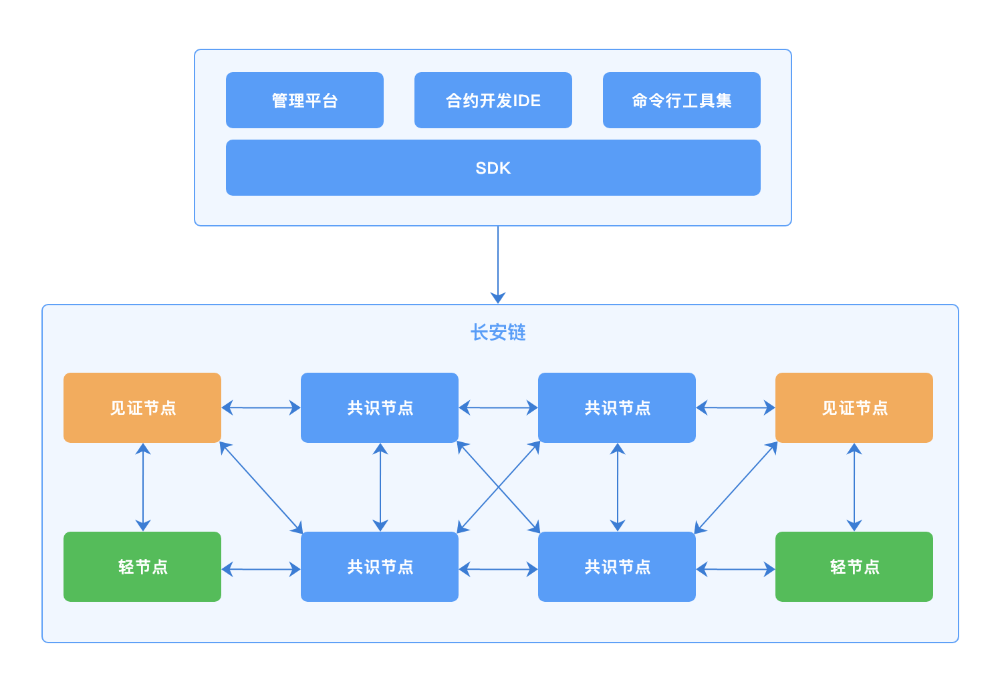

# 长安链 · ChainMaker User Manual


## 长安链简介

### 什么是长安链

长安链·ChainMaker区块链底层平台是新一代区块链开源底层软件平台，包含区块链核心框架、丰富的组件库和工具集，致力于为用户高效、精准地解决差异化区块链实现需求，构建高性能、高可信、高安全的新型数字基础设施。

### 长安链主要特性

**自主可控的底层平台**

- 独创深度模块化、可装配、高性能并行执行的区块链底层技术架构；
- 涵盖国产密码算法、基于国密证书的加密通讯和国产CA证书颁发认证机构。

**灵活高效的装配模式**

- 深度模 块化，根据用户需求，择优选择不同模块组件快速组装定制化区块链系统；
- 可插拔、可分离的自主可控核心框架，可快速接入优势底层模块/单一定制化开发模块。

**国际领先的处理性能**

- 交易处理最大程度并行化，单链峰值交易处理速度可达12万笔每秒；
- 支持基于内存的数据系统，提升交易处理性能。

**标准化下的开放生态**

- 采用友好的开源协议，开放软件源代码；
- 推动多项技术体系标准化，建立标准化下的开发生态。

**完整便捷的配套工具**

- 支持大屏、图表、界面交互多种形式的管理、监控和运维；
- 支持Java、Golang、nodeJS等多种语言区块链SDK；
- 支持定制化部署、BaaS等多种落地实施方式；
- 友好、便捷的在线智能合约开发环境；
- 支持丰富的区块、交易、订阅、事件监听等处理机制。

### 使用长安链可以做什么

**政务服务**

基于长安链·ChainMaker搭建政务数据共享平台，赋能政务数据跨区域、跨部门可信共享交换，实现业务高效协同。目前已落地海淀政务“一网通办”、海淀目录链、企业电子身份认证等场景。

**食品追溯**

基于长安链·ChainMaker建设食品追溯监管体系，及时掌握食品流转信息，增强全流程透明度，提升安全风险评估与预警能力。目前已落地“北京冷链”、北京冬奥食品追溯等场景。

**金融服务**

基于长安链·ChainMaker提供面向中小金融机构、中小企业的供应链金融服务，通过区块链线上确权，实现低成本互信，降低小微企业融资成本。目前已落地“北京市确权融资中心”、建行供应链金融平台等场景。

**供应链管理**

基于长安链·ChainMaker构建融合区块链与人工智能技术的“可信供应商”供应链协作平台，增加供应商资质审核的真实性和便利性，提升供应链管理能力。目前已落地沃尔玛供应商管理等场景。

## 整体架构

### 逻辑架构


ChainMaker的应用生态中主要包含以下元素：

- Consensus Node：共识节点，参与共识投票、交易执行、区块验证和记账的节点。

- Sync Node：同步节点，或称为见证节点，节点会同步、验证区块，执行交易，并记录完整账本数据，不参与共识投票。

- SDK：即客户端SDK，帮助用户通过RPC和链进行沟通，完成合约创建、调用、链管理等功能。

- Tools：ChainMaker提供一系列工具集方便用户命令行方式对链部署和管理操作。比如证书生成、链配置、快速部署等。

- ChainMaker Management Platform：区块链管理平台，包括链管理、区块信息检索、可视化监控等功能。

- ChainMaker IDE：智能合约在线开发环境，ChainMaker所有合约支持语言均可在该IDE上开发、编译、调试。

通常构建一条链，根据共识算法的要求部署足够的共识节点即可。根据具体业务需要选择是否增加更多的共识节点或同步节点。  


### 核心流程


区块处理流程为：

1. 提案区块。提案节点从交易池选取一批交易，并行调度执行得到结果，生成DAG，并将区块和DAG广播。
2. 验证区块。接收提案区块，基于DAG对交易并行执行，并验证结果是否一致。
3. 共识投票。基于对应的共识机制，对提案区块进行共识投票。
4. 提交区块。完成共识投票的区块，提交记录至账本。


## 核心特性

### 抽象统一的执行流程

现阶段的各种区块链实现中，整体流程差别很大。为装配出各类满足需求的区块链，ChainMaker需合理抽象出区块链整体执行流程，并基于此通用流程进行模块组合。ChainMaker后续还考虑增加整体流程的灵活性，以支持更加丰富的区块链场景。

### 深度模块化

ChainMaker不仅要求区块链模块功能的完全独立、接口定义清晰、可插拔替换，而且要求模块间通信完全虚拟化，可支持从函数调用、进程间通信（IPC）到各类网络通信协议等不同的实现模式，从而使得方便自由的模块拼装组合成为可能。

### 支持广域场景

根据业务场景特性，ChainMaker需生产出从公有链到联盟链各类基于不同信任模型的区块链，支持更加广泛的业务应用。


## 模块说明@永芯

### 智能合约@振远

【合约的分类和执行流程】

【合约引擎介绍，WASM、GASM、WXVM】

【系统合约，包含哪些】

【可支持合约开发语言】

【合约SDK】

【合约模块接口说明】

【pb数据模型】


### 共识算法@智超、殷舒

【共识算法说明：SOLO、TBFT】

每个共识算法的【主要流程、与开源版本或论文版本的不同、<u>投票签名和验签机制、共识节点间通信方式、是否有共识状态WAL存储、模块接口说明、pb数据模型</u>】

#### SOLO

- 什么是SOLO共识算法

SOLO是单节点无共识投票过程的“共识算法”。

- SOLO共识算法的用途

1. 快速部署单节点运行，降低试用门槛；
2. 供开发人员进行除网络和共识模块的全流程测试；

- 如何使用SOLO共识算法

部署一个ChainMaker节点，将链配置（参见配置模块，链配置章节）的共识算法进行如下修改，清除数据启动即可：

```yml
#共识配置
consensus:
  # 共识类型(0-POW,1-PBFT,2-TENDERMINT,3-TBFT,4-HOTSTUFF,5-RAFT,6-SOLO)
  type: 6
```

### P2P网络@瑞波

#### **组网方式**
- chainmaker的P2P网络是基于libp2p实现并改进的，节点的网络地址遵循libp2p地址格式协议。
- 通过种子节点设置可实现节点自动发现、自动连接功能，在线的每个节点默认都可作为其他节点的种子节点提供网络发现服务，从而实现了chainmaker的自动组网机制。
- chainmaker使用了改进后的libp2p-gossip-pubsub实现的消息广播/订阅功能。能够保证广播消息能最终到达在线的全部节点。多链场景下，节点上的每条链都独享一个独立的GossipPubSub服务，并通过对每个Gossip路由表的精确控制，可实现多链间广播数据隔离，保证了广播数据只在链内节点传播的确定性。也正是如此，才允许chainmaker的所有链共用一个底层P2P网络。
- chainmaker理论上可实现上万甚至更多节点同时在线组网。
- chainmaker可以提供NAT穿透、代理转发等在复杂网络环境下的场景解决方案支持。

#### **节点身份管理方式**
- 节点身份是由组织CA签发的TLS证书确定，在节点入网时，会校验TLS证书的合法性
- 每个节点都需保证TLS证书的唯一性，不可多节点共用一个TLS证书
- 每个TLS证书都可对应生成一个NodeId唯一标识，该标识是节点网络地址的组成部分，是网络通讯环节重要的标识

#### **基于libp2p的改进**
- 核心包增加对国密SM算法的支持
- libp2p-gossip-pubsub功能模块增加白名单功能，实现对Gossip路由表的控制，达到广播隔离效果。
- 引入StreamPool，实现stream复用提高性能、网络吞吐能力自动扩容等特性。

#### **模块接口**
```go

// NetType is the type of net.
type NetType int

const (
	// Libp2p is a type of p2p net.
	Libp2p NetType = iota
	// GRpc is a type of rpc net.
	GRpc

	// DefaultChainId is default chain id.
	DefaultChainId = "default_chain"
)

// ReceiveMsgHandler handle the msg received from other node.
type ReceiveMsgHandler func(from string, netMsg *pb.NetMsg) error

// SubMsgHandler handle the msg published by other node.
type SubMsgHandler func(publisher string, netMsg *pb.NetMsg) error

type ChainNodeInfo struct {
	NodeUid     string
	NodeAddress []string
	NodeTlsCert []byte
}

// Net is local net interface.
type Net interface {
	// NodeUid is the unique id of the node.
	NodeUid() string

	// InitPubsub will init new LibP2pPubsub instance with given chainId and maxMessageSize.
	InitPubsub(chainId string, maxMessageSize int) error

	// BroadcastWithChainId  will broadcast a msg to a PubSubTopic with the pubsub service which id is given chainId.
	BroadcastWithChainId(chainId string, topic string, netMsg *pb.NetMsg) error

	// SubscribeWithChainId register a SubMsgHandler to a PubSubTopic with the pubsub service which id is given chainId.
	SubscribeWithChainId(chainId string, topic string, handler SubMsgHandler) error

	// CancelSubscribeWithChainId cancel subscribe a PubSubTopic with the pubsub service which id is given chainId.
	CancelSubscribeWithChainId(chainId string, topic string) error

	// SendMsg send msg to the node which id is given string.
	// 		msgFlag: is a flag used to distinguish msg type.
	SendMsg(chainId string, node string, msgFlag string, netMsg *pb.NetMsg) error

	// ReceiveMsgHandle register a ReceiveMsgHandler to the net.
	// 		msgFlag: is a flag used to distinguish msg type.
	ReceiveMsgHandle(chainId string, msgFlag string, handler ReceiveMsgHandler) error

	// CancelReceiveMsgHandle unregister a ReceiveMsgHandler.
	// 		msgFlag: is a flag used to distinguish msg type.
	CancelReceiveMsgHandle(chainId string, msgFlag string) error

	// AddSeed add a seed node addr.
	AddSeed(seed string) error

	// RefreshSeeds refresh the seed node addr list.
	RefreshSeeds(seeds []string) error

	// AddTrustRoot add a tls root cert to the cert pool of chain.
	AddTrustRoot(chainId string, rootCertByte []byte) error

	// RefreshTrustRoots refresh the cert pool of chain.
	RefreshTrustRoots(chainId string, rootsCertsBytes [][]byte) error

	// IsRunning return true when the net instance is running.
	IsRunning() bool

	// Start the local net.
	Start() error

	// Stop the local net.
	Stop() error

	// ChainNodesInfo return base node info list of chain which id is the given chainId.
	ChainNodesInfo(chainId string) ([]*ChainNodeInfo, error)

	// GetNodeUidByCertId return node uid which mapped to the given cert id. If unmapped return error.
	GetNodeUidByCertId(certId string) (string, error)

	// AddOrg add a Organization for revoked validator.
	AddOrg(chainId string, org Organization)

	// CheckRevokeTlsCerts check whether any tls certs revoked.
	CheckRevokeTlsCerts(org Organization, certManageSystemContractPayload []byte) error
}


type MsgHandler func(from string, msg []byte, msgType pb.NetMsg_MsgType) error

// ChainNodesInfoProvider provide base node info list of chain.
type ChainNodesInfoProvider interface {
	// ChainNodesInfo return base node info list of chain.
	ChainNodesInfo() ([]*ChainNodeInfo, error)
}

//  NetService
type NetService interface {
	// ChainId return the chainId of the net service.
	ChainId() string

	// BroadcastMsg broadcast a msg to the net.
	BroadcastMsg(msg []byte, msgType pb.NetMsg_MsgType) error

	// Subscribe register a MsgHandler for subscribe.
	Subscribe(msgType pb.NetMsg_MsgType, handler MsgHandler) error

	// CancelSubscribe cancel subscribe.
	CancelSubscribe(msgType pb.NetMsg_MsgType) error

	// ConsensusBroadcastMsg broadcast a msg to the consensus nodes.
	ConsensusBroadcastMsg(msg []byte, msgType pb.NetMsg_MsgType) error

	// ConsensusSubscribe register a MsgHandler handle the msg from consensus nodes for subscribe.
	ConsensusSubscribe(msgType pb.NetMsg_MsgType, handler MsgHandler) error

	// CancelConsensusSubscribe cancel subscribe.
	CancelConsensusSubscribe(msgType pb.NetMsg_MsgType) error

	// SendMsg send msg to any nodes.
	SendMsg(msg []byte, msgType pb.NetMsg_MsgType, to ...string) error

	// ReceiveMsg register a MsgHandler to handle the msg received from other node.
	ReceiveMsg(msgType pb.NetMsg_MsgType, handler MsgHandler) error

	// Start the net service.
	Start() error

	// Stop the net service.
	Stop() error

	// GetNodeUidByCertId return node uid which mapped to the given cert id. If unmapped return error.
	GetNodeUidByCertId(certId string) (string, error)

	// GetChainNodesInfoProvider return a implementation of ChainNodesInfoProvider.
	GetChainNodesInfoProvider() ChainNodesInfoProvider
}
```
#### **使用配置**
#### chainmaker.yml
```yaml
net:
  # 底层网络类型
  provider: LibP2P
  # 本地网路监听地址及端口
  listen_addr: /ip4/0.0.0.0/tcp/6666
  # 每个节点连接stream池大小上限，不配默认为100
  peer_stream_pool_size: 100
  # 允许与本节点建立链接的节点总数量，不配默认为20
  max_peer_count_allow: 10
  # 节点链接淘汰策略，1 Random, 2 FIFO, 3 LIFO。不配默认为3
  peer_elimination_strategy: 3
  # 种子节点地址列表，用于节点发现，可选项
  seeds: 
    - "/ip4/127.0.0.1/tcp/6666/p2p/QmQZn3pZCcuEf34FSvucqkvVJEvfzpNjQTk17HS6CYMR35"
  # TLS认证相关配置
  tls:
    # TLS认证开关
    enabled: true
    # TLS证书
    priv_key_file: ./crypto-config/wx-org1.chainmaker.org/node/consensus1/consensus1.tls.key
    cert_file:     ./crypto-config/wx-org1.chainmaker.org/node/consensus1/consensus1.tls.crt
  # 组网黑名单配置，可选项
  blacklist:
    # 黑名单地址，可选项，[ip]:[port]或者[ip]两者均可
    addresses:
      - "127.0.0.1:11305"
      - "192.168.1.8"
    # 黑名单节点ID，可选项
    node_ids:
      - "QmeyNRs2DwWjcHTpcVHoUSaDAAif4VQZ2wQDQAUNDP33gH"
      - "QmVSCXfPweL1GRSNt8gjcw1YQ2VcCirAtTdLKGkgGKsHqi"
```

在链初始化阶段，net_service在初始化时会读取链配置chainconfig下的共识节点列表和trust_root。当前阶段，网络会将共识节点作为种子节点seeds的一员，并会通过ConnSupervisor维护与其之间的链接；网络还会维护一份共识节点ID列表，便于向共识节点定向广播；trust_root作为TLS认证可信根证书池，同时会根据不同链的根证书池来确定对方节点隶属于哪条链。

#### **节点地址格式说明**
chainmaker节点地址遵循libp2p网络地址格式协定，例如：
```text
/ip4/127.0.0.1/tcp/6666/p2p/QmQZn3pZCcuEf34FSvucqkvVJEvfzpNjQTk17HS6CYMR35
```

地址以"/"开始，并以"/"分段，大多数情况下，各段说明如下：
- 第一段：IP协议版本，ip4代表IPv4,ip6代表IPv6
- 第二段：IP地址，需要与第一段对应
- 第三段：通讯网络协议，默认使用tcp
- 第四段：监听端口
- 第五段：固定协议，请勿改动，固定为"p2p"
- 第六段：节点NodeId，与TLS证书配套，根据TLS证书通过特定算法计算而来

以上只是最普通常用场景下节点地址举例，在复杂网络场景下（比如需要使用节点中继、NAT穿透等）地址格式会稍有不同。


### RPC服务@Jason

【RPC服务、<u>配置说明（TLS、流量控制等）</u>、数据结构内容需要修改】

### 存储模块@长辉

【账本存储的<u>处理流程</u>、存储支持的数据库类型、模块接口说明、配置说明】

【RocksDB的编译部署方式】

【mysql的账本结构、分布式存储的支持】本次是否开源？

### 身份管理@张韬

是否发布中文

我们对证书的使用，角色划分

Serialize() ([]byte, error)，返回[]byte的结构说明

依赖模块使用的接口需要详细说明

### 权限管理@张韬

是否发布中文

### 配置模块@瑞波

#### **本地配置**
本地配置项都包含在chainmaker.yml中，具体配置如下：

```yaml
# 链配置
blockchain:
  - chainId: chain1 # 链ID
    genesis: chainconfig/bc1.yml # 链配置文件
#  - chainId: chain2
#    genesis: chainconfig/bc2.yml
#  - chainId: chain3
#    genesis: chainconfig/bc3.yml
#  - chainId: chain4
#    genesis: chainconfig/bc4.yml

# 节点配置
node:
  type:              full # 节点类型：full、spv
  org_id:            wx-org1.chainmaker.org # 所属组织ID
  priv_key_file:     ./certs/node/consensus1/consensus1.sign.key # 签名私钥
  cert_file:         ./certs/node/consensus1/consensus1.sign.crt # 签名证书
  signer_cache_size: 1000
  cert_cache_size:   1000

# 网络配置
net:
  provider: LibP2P # 网络类型，目前只支持libp2p
  listen_addr: /ip4/0.0.0.0/tcp/11301 # 网络本地监听地址，包含IP和端口号，IP若为0.0.0.0则本地所有IP都会绑定监听
  peer_stream_pool_size: 100  # 每个节点连接stream池大小上限，不配默认为100
  max_peer_count_allow: 10 # 允许与本节点建立链接的节点总数量，不配默认为20
  peer_elimination_strategy: 3 # 节点链接淘汰策略，1 Random, 2 FIFO, 3 LIFO。不配默认为3
  seeds:  # 种子节点地址列表，用于节点发现，可选项。链配置中所有共识节点地址都会作为种子节点。
    - "/ip4/127.0.0.1/tcp/6666/p2p/QmQZn3pZCcuEf34FSvucqkvVJEvfzpNjQTk17HS6CYMR35"
  tls: # TLS认证配置
    enabled: true # TLS认证开关，现阶段必须设置为true
    priv_key_file: ./certs/node/consensus1/consensus1.tls.key # TLS私钥
    cert_file:     ./certs/node/consensus1/consensus1.tls.crt # TLS证书

# 交易池配置
txpool:
  max_txpool_size: 5120 # 普通交易池上限
  max_config_txpool_size: 10 # config交易池的上限
  full_notify_again_time: 30 # 交易池溢出后，再次通知打包的时间间隔(秒)

# RPC服务配置
rpc:
  provider: grpc # 服务类型，目前只支持gRPC
  port: 12301 # 服务监听端口
  tls:
    # TLS模式:
    #   disable - 不启用TLS
    #   oneway  - 单向认证
    #   twoway  - 双向认证
    #mode: disable
    #mode: oneway
    mode:           twoway 
    priv_key_file:  ./certs/node/consensus1/consensus1.tls.key # TLS私钥
    cert_file:      ./certs/node/consensus1/consensus1.tls.crt # TLS证书

# 检测相关配置
monitor:
  enabled: false # 检测开关
  port: 14321 # 检测服务监听端口

# pprof功能配置
pprof:
  enabled: false # 开关
  port: 24321 # 性能分析监听端口

# 存储配置
storage:
  provider: leveldb # 数据库类型
  store_path: ../data/ledgerData # 数据库所在路径

# debug 相关配置
debug:
  is_cli_open: true # 是否开启CLI功能
  is_http_open: false # 是否开启http
  ...
```

#### **链配置**
链配置是作为链启动时创建创世区块的依据，所以要求每条链每个节点的链配置文件都必须保持一致。
具体链配置项如下：
```yaml
chain_id: chain1        # 链标识，链ID
version: v1.0.0         # 链版本
sequence: 1             # 配置版本
auth_type: "identity"   # 认证类型，供身份管理模块验证使用

crypto:
  hash: SHA256 # 加密算法

# 交易、区块相关配置
block:
  tx_timestamp_verify: true # 是否需要开启交易时间戳校验
  tx_timeout: 600  # 交易时间戳的过期时间(秒)
  block_tx_capacity: 100  # 区块中最大交易数
  block_size: 10  # 区块最大限制，单位MB
  block_interval: 2000 # 出块间隔，单位:ms

# core模块
core:
  tx_scheduler_timeout: 10 #  [0, 60] 交易调度器从交易池拿到交易后, 进行调度的时间
  tx_scheduler_validate_timeout: 10 # [0, 60] 交易调度器从区块中拿到交易后, 进行验证的超时时间

#共识配置
consensus:
  # 共识类型(0-POW,1-PBFT,2-TENDERMINT,3-TBFT,4-HOTSTUFF,5-RAFT,6-SOLO,7-MBFT)
  type: 3
  # 共识节点列表，组织必须出现在trust_roots的org_id中，每个组织可配置多个共识节点，节点地址采用libp2p格式
  nodes:
    - org_id: "wx-org1.chainmaker.org" # 组织ID，该值与下方trust_roots对应，需要保证在trust_roots中配有该组织的根证书
      address: # 该组织认证下的共识节点地址
        - "/ip4/127.0.0.1/tcp/11301/p2p/QmcQHCuAXaFkbcsPUj7e37hXXfZ9DdN7bozseo5oX4qiC4"
    - org_id: "wx-org2.chainmaker.org"
      address:
        - "/ip4/127.0.0.1/tcp/11302/p2p/QmeyNRs2DwWjcHTpcVHoUSaDAAif4VQZ2wQDQAUNDP33gH"
    - org_id: "wx-org3.chainmaker.org"
      address:
        - "/ip4/127.0.0.1/tcp/11303/p2p/QmXf6mnQDBR9aHauRmViKzSuZgpumkn7x6rNxw1oqqRr45"
    - org_id: "wx-org4.chainmaker.org"
      address:
        - "/ip4/127.0.0.1/tcp/11304/p2p/QmRRWXJpAVdhFsFtd9ah5F4LDQWFFBDVKpECAF8hssqj6H"
  ext_config: # 扩展字段，记录难度、奖励等其他类共识算法配置
    - key: ""
      value: ""

# 信任组织和根证书
trust_roots:
  - org_id: "wx-org1.chainmaker.org" # 信任组织ID
    root: "./certs/ca/wx-org1.chainmaker.org/ca.crt" # 信任组织根证书
  - org_id: "wx-org2.chainmaker.org"
    root: "./certs/ca/wx-org2.chainmaker.org/ca.crt"
  - org_id: "wx-org3.chainmaker.org"
    root: "./certs/ca/wx-org3.chainmaker.org/ca.crt"
  - org_id: "wx-org4.chainmaker.org"
    root: "./certs/ca/wx-org4.chainmaker.org/ca.crt"

# 权限配置
permissions:
  - resource_name: NODE_ADDR_UPDATE
    principle:
      rule: SELF # 规则（ANY，MAJORITY...，全部大写，自动转大写）
      org_list: # 组织名称（组织名称，区分大小写）
      role_list: # 角色名称（role，全部小写，自动转小写）
        - admin
  - resource_name: TRUST_ROOT_UPDATE
    principle:
      rule: SELF # 规则（ANY，MAJORITY...，全部大写）
      org_list: # 组织名称（组织名称）
      role_list: # 角色名称（role，全部小写）
        - admin
  - resource_name: CONSENSUS_EXT_DELETE
    principle:
      rule: MAJORITY
      org_list:
      role_list:
        - admin
  - resource_name: BLOCK_UPDATE
    principle:
      rule: ANY
      org_list:
      role_list:
        - admin
        - client
  - resource_name: INIT_CONTRACT
    principle:
      rule: ANY
      org_list:
      role_list:
  - resource_name: UPGRADE_CONTRACT
    principle:
      rule: ANY
      org_list:
      role_list:
  - resource_name: FREEZE_CONTRACT
    principle:
      rule: ANY
      org_list:
      role_list:
  - resource_name: UNFREEZE_CONTRACT
    principle:
      rule: ANY
      org_list:
      role_list:
  - resource_name: REVOKE_CONTRACT
    principle:
      rule: ANY
      org_list:
      role_list:
```

当节点上的某个链是第一次启动时，会读取链配置文件中相关项和值，并创建一个新的GenesisBlock作为创世块写入节点链数据库。所以需要保证链上的所有节点的创世块相同，才能保证共识生效，这就要求当前链的所有节点上配置的链配置文件内容是相同一致的，即使链配置已在中途被调用链配置相关合约改动过，新节点启动时链配置文件也必须使用最早的版本。
#### **配置变更**

链配置变更需要通过系统配置合约来完成，具体请参考《运维手册》。


### 同步模块@永芯

【重构后的实现】

### ~~SPV模块~~

【暂缓】

### 交易池@永芯

【单笔模式和批量模式】

【接口说明】

### 加密算法@张韬

【算法的支持、配置规则、接口说明】

### 核心引擎@殷舒

【处理逻辑说明】

### 日志@瑞波

【使用（全局或局部变量）、如何配置（全局、模块）】

## 数据模型@永芯

### 区块结构


### 交易结构


### 交易请求结构


### 交易响应结构


## 周边工具

### 命令行工具CMC@天乐


### SDK@天乐、Jason


### 一键部署@Jason


### crypoto-gen@Jason


### 在线IDE@振远


### ~~链调试环境~~


