[TOC]

# ChainMaker用户手册

读者对象：本文档主要面向chainmaker的开发者、产品人员和希望了解chainmaker运行机制的用户。

## 1 ChainMaker介绍

当前，区块链的发展仍处于“前工业化”时代，手工作业的运作方式是此阶段的典型特征。以比特币、以太坊为代表的公有链，以Hyperledger Fabric、Quorum为代表的联盟链各具特色，各有优劣。然而对特定的商业应用，用户往往面临两难的选择，已有区块链通常难以满足特定落地场景的特殊需求，而深度定制会导致成本高企、周期冗长。例如摩根大通银行为了满足跨银行间信息交换场景中合规及性能的需求，从权限管理、共识机制、隐私保护等多方面对以太坊进行了深度定制，将其命名为Quorum并开源。作为全球资产规模最大的银行之一，摩根大通拥有足够的资源完成这一定制项目，但对一般企业而言，这种手工定制的模式是难以接受的。

此外，现阶段的区块链底层平台还拥有以下共性问题：一是无法支持不同信任程度的场景。多方合作中，既有类似比特币这种完全不互信的场景，也有类似使用单点数据库这种完全信任的场景，在完全信任与完全不互信之间，还存在多种不同的信任层次。虽然现有区块链系统大多具备一定灵活性，但仍然无法满足多种不同的信任程度。二是国内区块链底层平台生态薄弱，影响力有限。国内区块链技术企业大多利用自身技术能力和行业影响力研发与推广各自区块链底层平台，企业间的技术交流与合作较少，尚未形成创新活跃的开源生态，业界影响力与Hyperledger Fabric等国际知名项目差距较大。三是性能有待进一步提升。各个区块链底层平台在性能测试中不断取得突破，但是测试和相应优化重点主要集中在转账类交易领域，真实场景中被频繁使用的智能合约调用类交易在性能上还有很大的提升空间。

针对目前区块链底层平台标准不统一、深度定制成本高、周期长，使用者难 以快速、高效、精准地实施基于区块链技术的各类业务场景的痛点，我们推出自主创新区块链底层平台框架——区块链工厂(ChainMaker)。ChainMaker 旨在用标准化、模块化的技术手段，将区块链的实现从现有的手工作业模式推进到自动装配生产模式，方便用户根据不同的业务需求搭建不同的区块链，从而为区块链的技术普及和规模化应用提供基础，助力形成标准化下的开放生态。使用ChainMaker作为基础可以针对不同的应用场景进行深度定制，用户无需付出高昂的开发代价即可组装出满足需求的区块链系统，这正是ChainMaker项目开发的目的和价值。

### 1.1 ChainMaker的构成

ChainMaker的应用生态中主要包含以下元素：

- APP：ChainMaker的客户端应用，用户可以根据区块链具体的应用场景编写相应的APP，在开发时可以借助客户端SDK的能力来进行快速开发。
- ChainMaker Manager：区块浏览器负责完成区块链信息的检索和链管理功能，比如区块信息查看，链配置等功能，也可以将区块浏览器认为是一种特殊通用的APP，同样也可以借助客户端SDK进行快速开发。
- Consensus Node：共识节点，组织部署的用于参与共识的节点。
- Light Node：也叫SPV节点，主要为了减少链数据的存储而构建的特殊节点，不参与共识，只同步用户关心的交易和基本的链信息（如block header）。
- SDK：包括客户端SDK和合约开发SDK，客户端SDK帮助用户通过RPC和链进行沟通，完成合约创建、调用、链管理等功能。合约开发SDK在语言层面提供给用户开发使用的接口，方便用户开发合约使用。
- Tools：ChainMaker提供一系列工具集方便用户命令行方式对链部署和管理操作。比如证书生成、链配置、快速部署等。

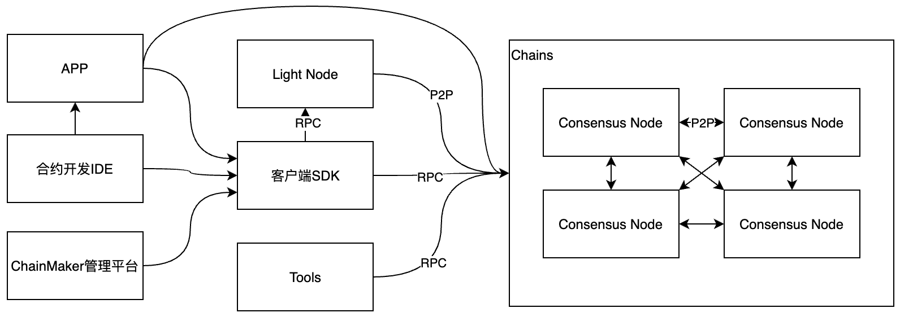

### 1.2 ChainMaker的模块交互

ChainMaker的交易分为查询类交易（包括普通合约和系统合约查询类交易，交易不会记录在上链）和写类型交易（包括合约创建、调用、升级、系统合约调用等，交易需要记录在链上）。

ChainMaker在处理写类型交易时的模块交互图如下：

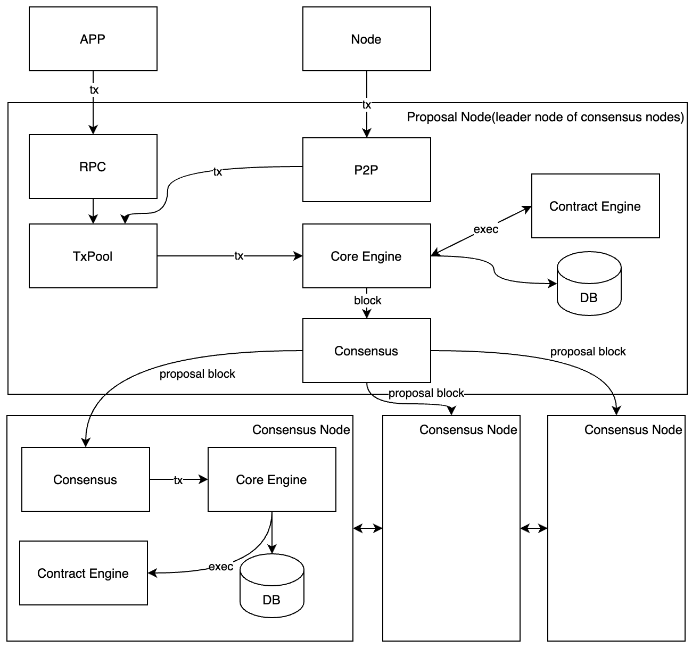

ChainMaker处理查询类交易时的模块交互图如下：

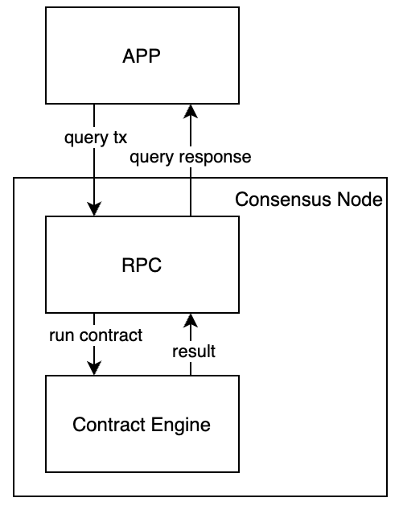

### 1.3 ChainMaker的特性

ChainMaker有以下特性：

- 抽象的区块链整体执行流程。现阶段的各种区块链实现中，整体流程差别很大。为装配出各类满足需求的区块链，ChainMaker需合理抽象出区块链整体执行流程，并基于此通用流程进行模块组合。ChainMaker后续还考虑增加整体流程的灵活性，以支持更加丰富的区块链场景。
- 将区块链深度模块化。ChainMaker不仅要求区块链模块功能的完全独立、接口定义清晰、可插拔替换，而且要求模块间通信完全虚拟化，可支持从函数调用、进程间通信（IPC）到各类网络通信协议等不同的实现模式，从而使得方便自由的模块拼装组合成为可能。
- 支持广域场景。根据业务场景特性，ChainMaker需生产出从公有链到联盟链各类基于不同信任模型的区块链，支持更加广泛的业务应用。

## 2 身份管理

ChainMaker的身份管理基于公私钥体系，验证过程也和公私钥体系一样使用私钥签名公钥验证。对公钥的存储使用X.509证书的格式。ChainMaker的身份元素如下：

- 组织：组织是链身份管理的顶级单位，对应现实世界中的公司或者企业。一个组织在拥有自己的根证书，用于向组织下的用户或节点签发用户或节点证书。
- 节点：节点是组织加入链参于共识的部署单位，一个组织在加入某条链时可以部署多个节点，节点的证书由组织使用根证书进行签发。
- 管理员：组织下管理链的用户，其证书由组织使用根证书进行签发。
- 普通用户：组织下使用链的普通用户，普通用户可以通过发送交易来发布和执行合约。普通用户的证书也由组织使用根证书进行签发。

几种身份的关系如下图：

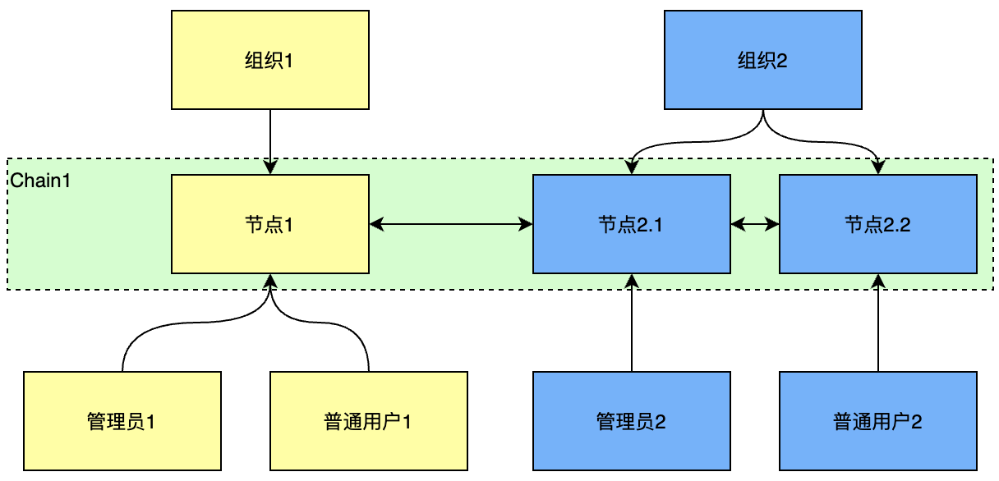

## 3 共识

ChainMaker支持mbft和tbft共识。mbft和tbft都分别是pbft的一种共识协议实现，在共识机制上也有一些细微差别。其中mbft支持共识治理，区块网络划分为同步网络、候选网络和共识网络。其中共识网络节点是从候选网络中选出，组成共识委员会，负责达成共识。

### 3.1 mbft共识机制

#### 3.1.1 mbft共识节点治理

mbft共识节点分别三种类型，分别为共识节点、候选网络节点和同步网络节点，分别组成共识网络、候选网络和同步网络。如下图所示，概念介绍如下：

- 共识网络：从候选网络中选取部分节点作为共识节点，形成共识网络。共识网络内的成员组成共识委员会，以任期为周期，每一任期委员会由选中的共识节点组成，负责对ChainMaker网络中交易打包、区块共识，维护一致性账本。常见的选取共识节点的算法包括约瑟夫环、vrf（Verifiable Random Function，可验证随机函数）等。
- 候选网络：候选网络中的节点不参与共识，但保持与共识网络的同步状态，实时将最新的公示区块更新到自己维护的账本中。候选网络也将对共识网络进行监控，监控共识网络状态，对共识区块进行验证，并协助管理网络。
- 同步网络：同步网络是普通用户所连接的节点，用于转发用户的交易。同步网络和候选网络的区别在于永远不参与共识，只同步区块和交易信息，或者转发用户交易请求。

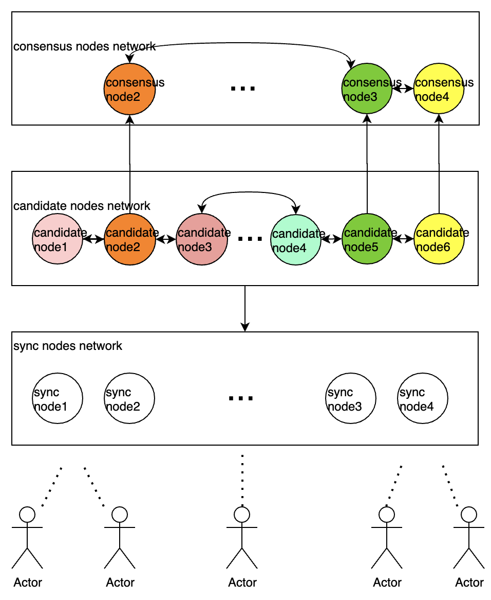

#### 3.1.2 mbft达成共识过程

mbft达成共识的过程和pbft达成共识的三阶段协议类似，基本上也是采用了三阶段协议共识，如下：

1. proposal阶段: 新的block作为提案，广播给其它节点。
2. endorse阶段：对合法的区块提案预投票签名广播给其他验证节点，用于证明大多数节点收到提案。
3. commit阶段: 对合法的区块提案预提交签名广播给其他验证节点，用于证明大多数节点同意提交提案。

另外如下图，seal阶段是用来执行block中的交易逻辑，并seal处理结果。处理结果的stateRoot作为下一轮提案的输入参数，其本身并不属于三阶段共识部分。

#### 3.1.3 mbft和pbft的差异

- mbft在三阶段共识的基础上对视图切换过程进行了简化，视图切换发生在三阶段处理过程中，并不需要独立处理视图切换。在视图切换时也不需要附带状态数据。
- mbft暂时未使用聚合签名，对于多重签名来说只是将签名附加到了签名列表。

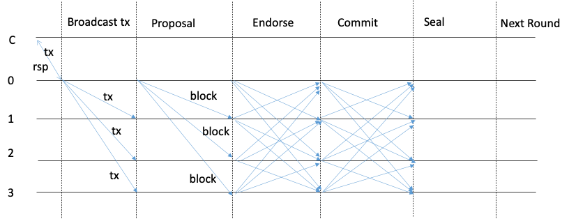


### 3.2 tbft共识机制

#### 3.2.1 tbft共识形成过程

tbft共识也是pbft的一种，共识形成也是采用三阶段协议，即propose、prevote、precommit。具体描述如下：

Every height has 0~n rounds and every round has 3 steps: Prevote、Precommit and commit.

1. Propose: The leader node generates a block of new height. Other nodes will wait for the broadcast of the leader node's block in this step. After receiving the broadcast, other nodes verify the block and vote. The vote will be collect in *Prevote*.
2. Prevote: All nodes wait and collect the votes of other nodes. When +2/3 votes are collected, the next step is taken.
3. Precommit: Second verify the block and vote. When +2/3 of the votes are collected, the block will be commited. Otherwise, it will step to next round and restart from *Propose*.
4. Commit:All nodes commit the block to blockchain and step to next height. There is a time limit in *Prevote* and *Precommit*. If the time is exceeded, it will restart in a new round.

#### 3.2.2 tbft和pbft的差异

tbft和pbft的差异之处在于没有视图切换的过程，如果中间出块节点出现故障，则进入新的轮次使用新的出块节点重新开始。

## 4 虚拟机

### 4.1 ChainMaker合约执行原理

ChainMaker的虚拟机模块负责提供执行合约代码的环境，外部经过编译的合约代码在需要时即可通过虚拟机模块提供的接口进行执行。ChainMaker使用wasm标准来执行智能合约，对wasm字节码，虚拟机同时支持以解释执行的gasm和以编译方式执行的wasmer两种执行方式。合约的编译和执行原理如下：

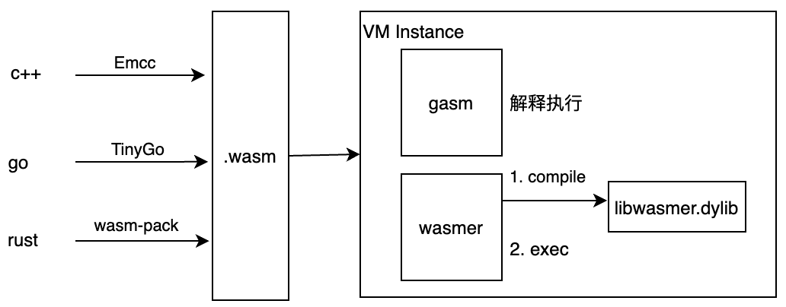

### 4.2 ChainMaker虚拟机模块

虚拟机模块通过统一的VmManager对外提供接口，包括执行系统合约和用户合约。同时支持wasmer和gasm两个虚拟机。

- wasmer虚拟机对每条链提供了一个VmPoolManager，用来管理这个链上的所有合约和vmPool的映射关系，每个合约会对应一个vmPool，vmPool用于管理合约执行的多个vm实例，每次合约执行都需要一个vm的执行实例。在使用时调用VmPoolManager创建一个vmPool（创建vmPool时会将vmPool和合约代码绑定，之后再使用vmPool创建wrappedInstance时就直接包含了代码），然后使用vmPool再创建一个RuntimeInstance，再调用RuntimeInstance的invoke方法就可以了（在invoke方法里会通过vmPool获取wrappedInstance实例执行合约，从vmPool里获取的wrappedInstance实例已经包含了合约的代码，执行时将参数带进去即可）。

- gasm虚拟机则提供了一个RuntimeInstance的实现类（RuntimeImpl），可以使用RuntimeImpl的invoke方法来执行合约。

- 虚拟机模块结构如下：


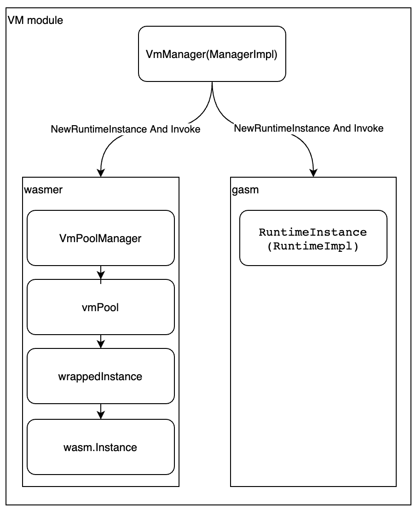

## 5 存储机制

ChainMaker存储模块负责存储区块链上的区块、交易、账本数据和历史账本数据，在提交区块时，这些数据就会被存储模块进行存储。存储模块的整体架构如下图：

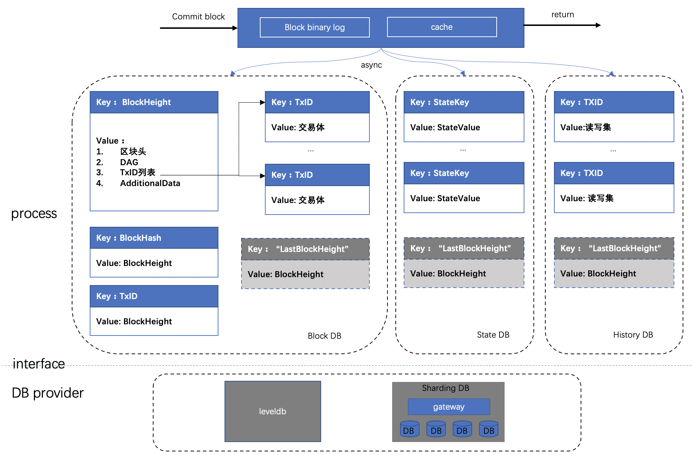

### 5.1 区块提交存储流程

1.	首先序列化后的区块数据、读写集列表、以及最新区块高度写入Block binary log，用于异常中断后的恢复。同时为了提高性能，加入cache层，新区块提交请求在更新完Block binary log之后，再将区块数据（包括区块、交易、状态数据、读写集）写入cache。更新完log和cache后即可返回，由后台线程异步更新Block DB、State DB和History DB。
2.	在Block DB中记录区块信息与交易信息，其中交易信息以TxID作为key存储，区块信息以BlockHeight作为key存储，区块信息中只记录交易ID列表，同时索引BlockHash到BlockHeight的映射关系，同时Block DB中记录最新的区块高度（LastBlockHeight）作为checkpoint，以批量事务的方式提交，保证批处理的原子性。
3.	在State DB中记录交易修改的state数据，key为合约名与对象主键的组合：<contractName, ObjectKey>，同时记录最新的区块高度（LastBlockHeight）作为checkpoint，以批量事务的方式提交，保证批处理的原子性。
4.	在History DB中记录交易的读写集，读写集以TxID作为key，同时记录最新的区块高度（LastBlockHeight）作为checkpoint，以批量事务的方式提交，保证批处理的原子性。

### 5.2 账本恢复流程

如果在提交区块过程中，单个数据库存储发生异常，将会导致数据库之间的数据不一致，程序遇到这种情况后会主动退出。然后系统在重启时会进入恢复流程：
1.	分别从Block binary log、Block DB、State DB、History DB中获取最新的区块高度，以Block binary log中的区块高度作为基准高度，判断其他DB是否落后基准高度。
2.	如果存在DB落后基准高度，则从Block bianry log中获取缺失的区块及读写集，依次提交到落后DB中。
3.	所有DB同步到基准高度后，存储模块启动完成，BlockChain模块继续调度其他模块完成启动。

### 5.3 账本查询流程

查询请求首先查询cache中的kv数据，如果cache命中则返回，cache不存在再从DB中查询。对于删除操作，cache中提供标记删除，以表明最新的key已经被删除。对于范围查询，多条数据可能同时存在cache和db中，需要进行数据合并。

### 5.4 多链存储

Chainmaker支持多链，每条链之间使用不同的DB实例，存储到不同的路径，当区块链节点退出某条链之后，可直接清理该链的数据文件夹。

### 5.5 历史数据清理

History DB中记录每个区块的交易读写集，记录着state数据的修改历史，随着区块增长，有清理历史数据的需求，单个区块链节点可以删除某个区块高度之前的读写集，以释放存储空间，由于读写集的hash已经保存在交易体中，后续仍然可以从其他节点恢复或验证读写集。

## 6 配置介绍

ChainMaker的配置主要包括节点配置（对应默认的chainmaker.yml配置文件）和链配置（对应默认的chainconfig/bcx.yml配置文件）两部分。

### 6.1 节点配置

```yaml
# 配置链Id和对应的链配置文件
blockchain:
  - chainId: chain1
    genesis: chainconfig/bc1.yml

# 配置节点信息
node:
  # 节点类型：full、spv
  type:              full
  # 组织Id
  org_id:            wx-org1.chainmaker.org
  priv_key_file:     ./certs/node/consensus1/consensus1.sign.key
  cert_file:         ./certs/node/consensus1/consensus1.sign.crt
  signer_cache_size: 1000
  cert_cache_size:   1000

# 配置节点网络信息
net:
  provider: LibP2P
  listen_addr: /ip4/0.0.0.0/tcp/11301
  tls:
    enabled: true
    priv_key_file: ./certs/node/consensus1/consensus1.tls.key
    cert_file:     ./certs/node/consensus1/consensus1.tls.crt

txpool:
  max_txpool_size: 5120 # 普通交易池上限
  max_config_txpool_size: 10 # config交易池的上限
  full_notify_again_time: 30 # 交易池溢出后，再次通知的时间间隔(秒)

rpc:
  provider: grpc
  port: 12301
  tls:
    # TLS模式:
    #   disable - 不启用TLS
    #   oneway  - 单向认证
    #   twoway  - 双向认证
    #mode: disable
    #mode: oneway
    mode:           twoway
    priv_key_file:  ./certs/node/consensus1/consensus1.tls.key
    cert_file:      ./certs/node/consensus1/consensus1.tls.crt

monitor:
  enabled: false
  port: 14321

pprof:
  enabled: false
  port: 24321

storage:
  provider: LevelDB
  store_path: ../data/ledgerData
```

### 6.2 链配置

```yaml
chain_id: chain1        # 链标识
version: v1.0.0         # 链版本
sequence: 1             # 配置版本
auth_type: "identity"   # 认证类型

crypto:
  hash: SHA256

# 交易、区块相关配置
block:
  tx_timestamp_verify: true # 是否需要开启交易时间戳校验
  tx_timeout: 600           # 交易时间戳的过期时间(秒)
  block_tx_capacity: 100    # 区块中最大交易数
  block_size: 10            # 区块最大限制，单位MB
  block_interval: 2000      # 出块间隔，单位:ms

# core模块
core:
  tx_scheduler_timeout: 10          #  [0, 60] 交易调度器从交易池拿到交易后, 进行调度的时间
  tx_scheduler_validate_timeout: 10 # [0, 60] 交易调度器从区块中拿到交易后, 进行验证的超时时间

#共识配置
consensus:
  # 共识类型(3-TBFT,6-SOLO)
  type: 3
  # 共识节点列表，组织必须出现在trust_roots的org_id中，每个组织可配置多个共识节点，节点地址采用libp2p格式
  nodes:
    - org_id: "wx-org1.chainmaker.org"
      address:
        - "/ip4/127.0.0.1/tcp/11301/p2p/QmcQHCuAXaFkbcsPUj7e37hXXfZ9DdN7bozseo5oX4qiC4"
    - org_id: "wx-org2.chainmaker.org"
      address:
        - "/ip4/127.0.0.1/tcp/11302/p2p/QmeyNRs2DwWjcHTpcVHoUSaDAAif4VQZ2wQDQAUNDP33gH"
    - org_id: "wx-org3.chainmaker.org"
      address:
        - "/ip4/127.0.0.1/tcp/11303/p2p/QmXf6mnQDBR9aHauRmViKzSuZgpumkn7x6rNxw1oqqRr45"
    - org_id: "wx-org4.chainmaker.org"
      address:
        - "/ip4/127.0.0.1/tcp/11304/p2p/QmRRWXJpAVdhFsFtd9ah5F4LDQWFFBDVKpECAF8hssqj6H"

# 信任组织和根证书
trust_roots:
  - org_id: "wx-org1.chainmaker.org"
    root: "./certs/ca/wx-org1.chainmaker.org/ca.crt"
  - org_id: "wx-org2.chainmaker.org"
    root: "./certs/ca/wx-org2.chainmaker.org/ca.crt"
  - org_id: "wx-org3.chainmaker.org"
    root: "./certs/ca/wx-org3.chainmaker.org/ca.crt"
  - org_id: "wx-org4.chainmaker.org"
    root: "./certs/ca/wx-org4.chainmaker.org/ca.crt"

# 权限配置（只能整体添加、修改、删除）
permissions:
  - resource_name: NODE_ADDR_UPDATE
    principle:
      rule: SELF # 规则（ANY，MAJORITY...，全部大写，自动转大写）
      org_list:  # 组织名称（组织名称，区分大小写）
      role_list: # 角色名称（role，全部小写，自动转小写）
        - admin
  - resource_name: TRUST_ROOT_UPDATE
    principle:
      rule: SELF # 规则（ANY，MAJORITY...，全部大写）
      org_list:  # 组织名称（组织名称）
      role_list: # 角色名称（role，全部小写）
        - admin
  - resource_name: CONSENSUS_EXT_DELETE
    principle:
      rule: MAJORITY
      org_list:
      role_list:
        - admin
  - resource_name: BLOCK_UPDATE
    principle:
      rule: ANY
      org_list:
      role_list:
        - admin
        - client
  - resource_name: INIT_CONTRACT
    principle:
      rule: ANY
      org_list:
      role_list:
  - resource_name: UPGRADE_CONTRACT
    principle:
      rule: ANY
      org_list:
      role_list:
  - resource_name: FREEZE_CONTRACT
    principle:
      rule: ANY
      org_list:
      role_list:
  - resource_name: UNFREEZE_CONTRACT
    principle:
      rule: ANY
      org_list:
      role_list:
  - resource_name: REVOKE_CONTRACT
    principle:
      rule: ANY
      org_list:
      role_list:
```

## 7 系统合约介绍

ChainMaker提供了一系列的系统合约供开发者调用，包链配置合约、系统查询合约和系统证书存储合约。分别介绍如下：

### 7.1 链配置合约

合约名称：SYSTEM_CONTRACT_CHAIN_CONFIG

链配置信息定义：

```protobuf
message ChainConfig {
    string                          chain_id         = 1; // 链标识
    string                          version          = 2; // 链版本
    string                          auth_type        = 3; // 认证类型
    uint64                          sequence         = 4; // 序列号
    CryptoConfig                    crypto           = 5; // 算法配置
    BlockConfig                     block            = 6; // 区块配置
    CoreConfig                      core             = 7; // core配置
    ConsensusConfig                 consensus        = 8; // 共识配置
    repeated TrustRootConfig        trust_roots      = 9; // 联盟成员，联盟链配置初始成员；公链无需配置。key：节点标识；value：地址，节点公钥/CA证书
    repeated Permission             permissions      = 10; // 权限配置
}

// crypto配置
message CryptoConfig {
    string hash    = 1; // 是否需要开启交易时间戳校验
}

// 区块配置
message BlockConfig {
    bool   tx_timestamp_verify      = 1; // 是否需要开启交易时间戳校验
    uint32 tx_timeout               = 2; // 交易时间戳的过期时间(秒)
    uint32 block_tx_capacity        = 3; // 区块中最大交易数
    uint32 block_size               = 4; // 区块最大限制，单位MB
    uint32 block_interval           = 5; // 出块间隔，单位:ms
}

// core配置
message CoreConfig {
    uint64 tx_scheduler_timeout                 = 1; // [0, 60] 交易调度器从交易池拿到交易后, 进行调度的时间
    uint64 tx_scheduler_validate_timeout        = 2; // [0, 60] 交易调度器从区块中拿到交易后, 进行验证的超时时间
}

// 共识配置
message ConsensusConfig {
    ConsensusType           type            = 1; // 共识类型
    repeated OrgConfig      nodes           = 2; // 节点机构列表
    repeated KeyValuePair   ext_config      = 3; // 扩展字段，记录难度、奖励等其他类共识算法配置
}
```

#### 7.1.1 查询链配置函数

函数名称：GET_CHAIN_CONFIG，说明：查询最新的链全量配置信息。

#### 7.1.2 查询指定高度之前最近的链配置函数

函数名称：GET_CHAIN_CONFIG_AT，说明：根据区块高度查询前一个最近的链配置信息。

#### 7.1.3 更新Core模块的参数配置

函数名称：CORE_UPDATE，说明：该方法需要多签

参数说明：

- tx_scheduler_timeout：uint，交易调度器从交易池拿到交易后, 进行调度的时间，其值范围为[0, 60]
- tx_scheduler_validate_timeout：uint，交易调度器从区块中拿到交易后, 进行验证的超时时间，其值范围为[0, 60]

#### 7.1.4 更新block和txpool的参数

函数名称：BLOCK_UPDATE，说明：该方法需要多签

参数说明：

- tx_timestamp_verify：bool，是否需要开启交易时间戳校验
- tx_timeout：uint，交易时间戳的过期时间(秒)
- block_tx_capacity：uint，区块中最大交易数
- block_size：uint，区块最大限制，单位MB
- block_interval：uint，出块间隔，单位:ms

#### 7.1.5 根证书添加

函数名称：TRUST_ROOT_ADD

参数说明：

- org_id：string，机构id
- root：string，机构根证书。证书格式需符合x509

处理规则：

- 该方法需要所有机构admin进行多签
- org_id在原来的trust_roots中不存在
- root机构根证书需符合x509

#### 7.1.6 根证书更新

 函数名称：TRUST_ROOT_UPDATE

参数说明：

- org_id：string，机构id
- root：string，机构根证书。证书格式需符合x509

处理规则：

- 该方法需要所有机构admin进行多签
- org_id在原来的trust_roots中存在
- root机构根证书需符合x509

#### 7.1.7 根证书删除

函数名称：TRUST_ROOT_DELETE

参数说明：

- org_id：string，机构id

处理规则：

- 该方法需要所有机构admin进行多签
- org_id在原来的trust_roots中存在
- 当org_id被删除后，其关联的共识节点均被删除

#### 7.1.8 共识节点机构添加

函数名称：NODE_ORG_ADD

参数说明：

- org_id：string，机构id
- addresses：string，节点地址列表，地址间通过逗号","隔开

处理规则：

- 该方法需要所有机构admin进行多签
- org_id在原共识节点中不存在
- 每个节点地址的都不可重复，和原来nodes中的地址不可重复，并且address中IP+端口不可相同，peerID不可相同

#### 7.1.9 共识节点机构更新

函数名称：NODE_ORG_UPDATE

参数说明：

- org_id：string，机构id
- addresses：string，节点地址列表，地址间通过逗号","隔开

处理规则：

- 该方法需要所有机构admin进行多签
- org_id在原共识节点中存在
- 每个节点地址的都不可重复，和原来除去org_idh后的nodes中的地址不可重复，并且address中IP+端口不可相同，peerID不可相同

#### 7.1.10 共识节点机构删除

函数名称：NODE_ORG_DELETE

参数说明：

- org_id：string，机构id

处理规则：

- 该方法需要所有机构admin进行多签
- org_id在原共识节点中存在
- 将和org_id关联的所有节点地址都会删除

#### 7.1.11 共识节点地址添加

 函数名称：NODE_ADDR_ADD

参数说明：

- org_id：string，机构id
- addresses：string，节点地址列表，地址间通过逗号","隔开。不可为空

处理规则：

- 该方法需要所有机构admin进行多签
- org_id必须在原来的共识节点集合中存在
- 每个节点地址的都不可重复，和原来nodes中的地址不可重复，并且address中IP+端口不可相同，peerID不可相同
- 节点地址必须符合libp2p地址格式

#### 7.1.12 共识节点地址更新

函数名称：NODE_ADDR_UPDATE

参数说明：

- org_id：string，机构id
- address：string，原节点地址
- new_address：string，新节点地址

处理规则：

- 该方法只需被修改机构的admin签名
- org_id和address 必须在原来的nodes中存在
- new_address 必须符合libp2p路径格式，并且其IP+端口、peerId不可与其他节点重复

#### 7.1.13 共识节点地址删除

函数名称：NODE_ADDR_DELETE

参数说明：

- org_id：string，机构id
- address：string，节点地址

处理规则：

- 该方法需要所有机构admin进行多签
- org_id和address 必须在原来的nodes中存在
- 若org_id就只有一个address被删除，那么最终会出现，共识节点列表中有机构，但是没有节点地址。

#### 7.1.14 共识扩展参数添加

函数名称：CONSENSUS_EXT_ADD

处理规则：

- 该方法需要所有机构admin进行多签
- 参数都是kv行添加
- 添加的key在原来的参数集合中不存在
- 添加新的参数时，会先将参数的key进行asc排序。然后逐个添加在原来参数数组的后面

#### 7.1.15 共识扩展参数更新

函数名称：CONSENSUS_EXT_UPDATE

处理规则：

- 该方法需要所有机构admin进行多签
- 参数都是kv行添加
- key在原来的参数集合中需存在
- 此方法只更新key对应的值，不会更改其在数组中的位置

#### 7.1.16 共识扩展参数删除

函数名称：CONSENSUS_EXT_DELETE

处理规则：

- 该方法需要所有机构admin进行多签
- 请求时，只需要填写key值。value不关心。
- 删除的key在原来的参数集合中需存在

#### 7.1.17 权限添加

函数名称：PERMISSION_ADD

处理规则：

- 该方法需要所有机构admin进行多签
- 权限的resourceName在原权限集合中不存在
- 如果resourceName是系统方法，此操作会覆盖系统设定的权限。

#### 7.1.18 权限更新

函数名称：PERMISSION_UPDATE

处理规则：

- 该方法需要所有机构admin进行多签
- 权限的resourceName在原权限集合中存在

#### 7.1.19 权限删除

函数名称：PERMISSION_DELETE：

处理规则：

- 该方法需要所有机构admin进行多签
- 权限的resourceName在原权限集合中不存在
- 如果resourceName是系统方法，此操作会重新启用系统默认权限。

### 7.2 系统查询合约

合约名称：SYSTEM_CONTRACT_QUERY

#### 7.2.1 根据交易ID查询交易

函数名称：GET_TX_BY_TX_ID

参数说明：

- 交易ID

返回值：

- TransactionInfo，包括交易体和块高度

#### 7.2.2 根据高度查询区块

函数名称：GET_BLOCK_BY_HEIGHT

参数说明：

- 区块高度

返回值：

- BlockInfo，包括块数据和读写集信息

#### 7.2.3 查询链信息

函数名称：GET_CHAIN_INFO

返回值：

- ChainInfo，包括区块高度和节点列表

#### 7.2.4 获取最后一个配置块

函数名称：GET_LAST_CONFIG_BLOCK

返回值：

- BlockInfo，包括块数据和读写集信息

#### 7.2.5 根据HASH值查找区块

函数名称：GET_BLOCK_BY_HASH

参数说明：

- 区块HASH值

返回值：

- BlockInfo，包括块数据和读写集信息

#### 7.2.5 查询节点加入的链列表

函数名称：GET_NODE_CHAIN_LIST

返回值：

- Chain Id列表

### 7.3 系统证书存储合约

合约名称：SYSTEM_CONTRACT_CERT_MANAGE

#### 7.3.1 添加证书

函数名称：CERT_ADD

#### 7.3.2 删除证书

函数名称：CERTS_DELETE

参数：证书哈希列表

#### 7.3.3 查询证书

函数名称：CERTS_QUERY

参数：证书哈希列表

返回值：

- CertInfos，证书列表，单个证书信息包括证书的哈希值和证书内容

## 8 合约开发

用户的合约开发的限制说明：

- ChainMaker支持用户合约的发布、调用和升级（推荐使用客户端开发中介绍的SDK完成），对组织中的成员这些过程都是免费的，为了避免合约的误操作带来的对链的消耗，ChainMaker使用gas对合约进行限制。ChainMaker当前默认对单个合约提供了可供运行的充足的gas，单个合约最大能消耗的gas是10000000。ChainMaker支持的两个虚拟机gasm和wasmer对指令集消耗的gas不太一样，gasm对应消耗的gas参考文档[《gasm-gas.md》](./gasm-gas.md)，wasmer对应消耗的gas参考文档[《wasmer-gas.md》](./wasmer-gas.md)。

- ChainMaker为了避免合约的误操作，对跨合约调用最大深度进行限制，默认最大允许的跨合约调用深度为5，可以配置。


- ChainMaker对单个块交易的执行总时进行限制，默认最长不能超过10s，可以配置。

### 8.1 C++合约开发流程

请参考：[《chain maker-contract-programing-for-c++.md》](./sdk_doc/chainmaker-contract-programing-c++.md)

### 8.2 Go合约开发流程
请参考：[《chain maker-contract-programing-for-go.md》](./sdk_doc/chainmaker-contract-programing-go.md)

### 8.3 Rust合约开发流程
请参考：[《chain maker-contract-programing-for-rust.md》](./sdk_doc/chainmaker-contract-sdk-rust.md)
## 9 客户端开发

chainmaker sdk为开发者提供了友好封装的接口，便于开发者基于chainmaker开发各种功能的应用产品。sdk一方面在用户侧为用户封装功能接口，方便用户创建各类请求和签名，另一方面通过和chainmaker节点建立连接，将用户的请求封装成节点能够识别的请求结构并通过RPC接口将请求转发给节点，并将节点的执行结果返回给调用者。

客户端在使用SDK发送请求时，可以设置是否等待执行结果，如果设置了等待方式，则在发送请求后会阻塞，直到拿到交易的执行结果。用户也可以设置不等待交易执行结果，在发送完请求后再根据交易ID通过SDK主动去查询交易，然后拿到执行结果。如果是查询类请求由于不会产生交易ID，所以是发送完请求后直接拿到响应结果。

同步等待方式获取结果过程如下：


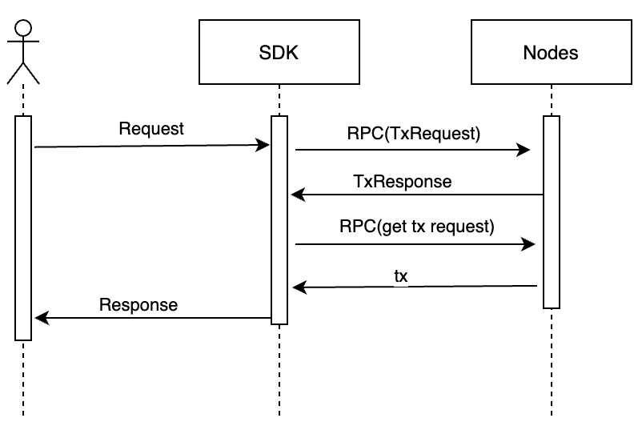

异步轮询方式获取结果过程如下：

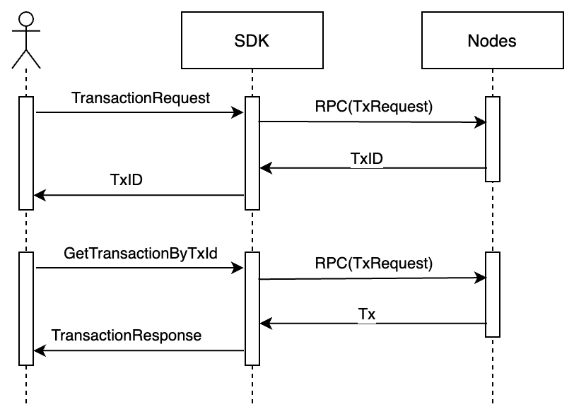

订阅方式获取结果过程如下：

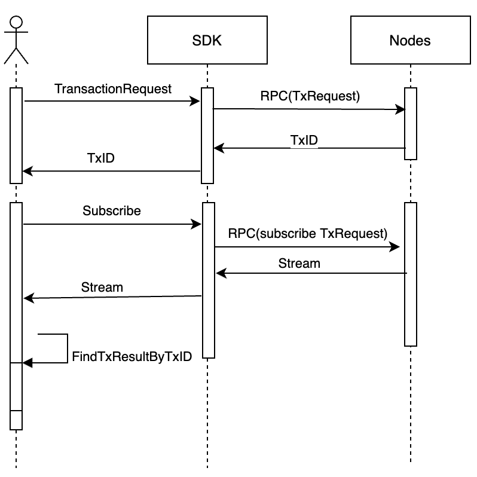

### 9.1 Java SDK

请参看：[《ChainMaker Java SDK README.md》](./sdk_doc/chainmaker-java-sdk.md)

### 9.2 Go SDK

请参看：[《ChainMaker Go SDK README.md》](./sdk_doc/chainmaker-go-sdk-doc.md)

## 10 RPC接口

ChainMaker节点使用grpc为客户端提供服务接口，协议的传输使用protobuf，方便跨语言编程使用。

### 10.1 RPC接口列表

```protobuf
service RpcNode {
   // SendRequest is a gerneral api, we can use it to do all things about transaction. 
   // We can set different transaction type to do different thing. So we can use it to create, upgrade, invoke and query contract.
   // And we can use it to modify configurations of chains and query parameters of chains.
   rpc SendRequest(TxRequest) returns (TxResponse) {};

   rpc Subscribe(TxRequest) returns (stream SubscribeResult) {};

   // RefreshLogLevelsConfig is used to change log levels of moudles
   rpc RefreshLogLevelsConfig(LogLevelsRequest) returns (LogLevelsResponse) {};
}
```

### 10.2 RPC数据结构定义

请参考：[《ChainMaker的chainmaker-pb项目》](https://git.code.tencent.com/ChainMaker/chainmaker-pb)


