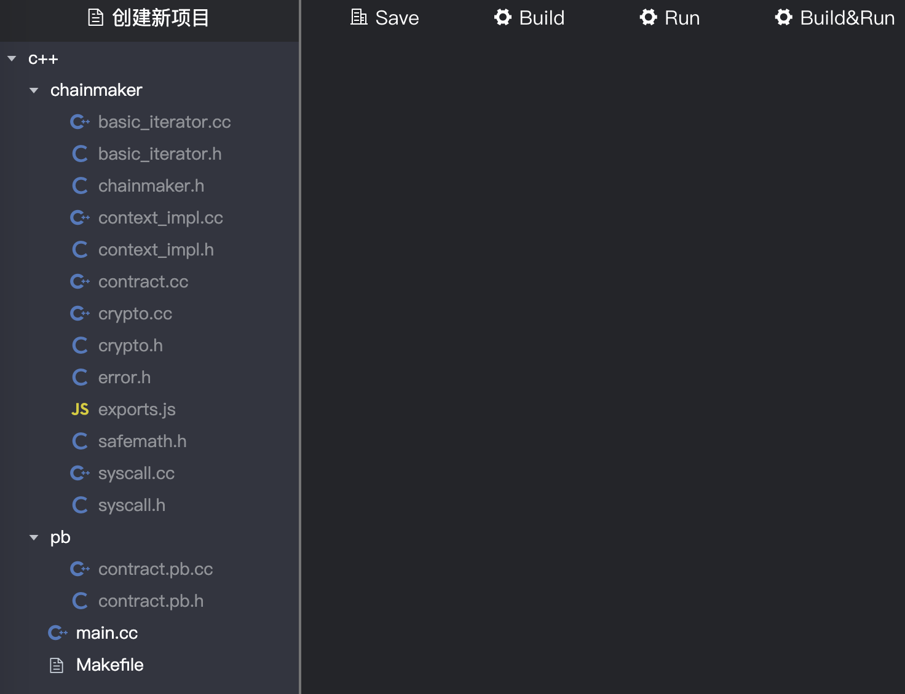

# ChainMaker Contract Programing for C++

读者对象：本文主要描述使用C++进行ChainMaker合约编写的方法，主要面向于使用C++进行ChainMaker的合约开发的开发者。

## 1 合约编写流程

## 1.1 使用IDE进行合约开发

请参考文档：[《ChainMaker IDE User Manual》](./chainmaker-ide-user-manual.md)

### 1.2 框架描述

使用IDE新建一个C++语言的合约项目之后，IDE会默认将C++ SDK和一些工具代码加到项目中去，如下图：



对IDE默认附带的框架文件描述如下：

### 1.3 示例代码说明

### 1.4 代码编写规则

### 1.5 编译说明

在《ChainMaker IDE User Manual》中集成了编译器，可以对合约进行编译，集成的编译器是emcc 1.38.48版本，protobuf 使用3.7.1版本。用户如果手工编译需要先使用emcc 编译 protobuf ，编译之后执行emmake make即可。

## 2 合约发布过程

请参考：[《chainmaker-go-sdk.md》](./chainmaker-go-sdk.md)4.1.5 发送创建合约请求，或者[《chainmaker-java-sdk.md》](./chainmaker-java-sdk.md)2.1.4 创建合约。

## 3 合约调用过程

请参考：[《chainmaker-go-sdk.md》](./chainmaker-go-sdk.md)4.1.7 合约调用，或者[《chainmaker-java-sdk.md》](./chainmaker-java-sdk.md)2.1.7 执行合约。


## 4 C++ SDK API描述

### Arg

```c++
// 该接口可返回属性名为 “name” 的参数的属性值。
// @param name: 要获取值的参数名称
// @param value: 获取的参数值
// @return: 是否成功
bool arg(const std::string& name, std::string& value){}
```

###  get_object

```c++
// 获取key为"key"的值
// @param key: 获取对象的key
// @param value: 获取的对象值
// @return: 是否成功
bool get_object(const std::string& key, std::string* value){}
```

###  put_object

```c++
// 存储key为"key"的值
// @param key: 存储的对象key
// @param value: 存储的对象值
// @return: 是否成功
bool put_object(const std::string& key, const std::string& value){}
```

###  delete_object

```c++
// 删除key为"key"的值
// @param key: 删除的对象key
// @return: 是否成功
bool delete_object(const std::string& key) {}
```

### success

```c++
// 返回成功的结果
// @param body: 成功信息
void success(const std::string& body) {}
```

### error

```c++
// 返回失败结果
// @param body: 失败信息
void error(const std::string& body) {}
```

### call

```c++
// 调用合约
// @param contract: 合约名称
// @param method: 合约方法
// @param args: 调用合约的参数
// @param response: 调用合约的响应
// @return: 是否成功
bool call(const std::string& contract,
                      const std::string& method,
                      const std::map<std::string, std::string>& args,
                      Response* response){}
```

### log

```c++
// 输出日志事件
// @param body: 事件信息
void log(const std::string& body) {}
```