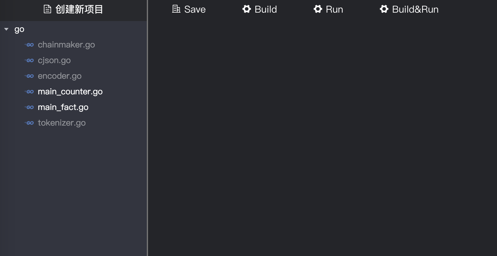

# ChainMaker Contract Programing for go

[TOC]

读者对象：本文主要描述使用C++进行ChainMaker合约编写的方法，主要面向于使用C++进行ChainMaker的合约开发的开发者。

## 1 合约编写流程

## 1.1 使用IDE进行合约开发

请参考文档：[《ChainMaker IDE User Manual》](./chainmaker-ide-user-manual.md)

### 1.2 框架描述

使用IDE新建一个Go语言的项目之后，IDE会默认将Go SDK和一些工具代码加到项目中去，如下图：



对IDE默认附带的框架文件描述如下：

go

- chainmaker.go：主要的Go SDK文件，详细接口说明见[Go SDK API描述](#api)
- cjson.go: json序列化工具类
- encoder.go: json序列化工具类
- main_fact.go: 存证合约示例
- tokenizer.go: json序列化工具类


### 1.3 示例代码说明

**存证合约示例：main_fact.go <span id="fact"></span>** 实现功能

1、存储文件哈希和文件名称和该交易的ID。

2、通过文件哈希查询该条记录

```go
package main

// 安装合约时会执行此方法，必须
//export init_contract
func init_contract() {
    // 安装时的业务逻辑，可为空

}
// 升级合约时会执行此方法，必须
//export upgrade
func upgrade() {
    // 升级时的业务逻辑，可为空

}

//export save
func save() {
	// 获取参数
	txId, _ := GetTxId()
	time, _ := Arg("time")
	fileHash, _ := Arg("file_hash")
	fileName, _ := Arg("file_name")

	// 组装
	stone := make(map[string]string,4)
	stone["txId"]=txId
	stone["time"]=time
	stone["fileHash"]=fileHash
	stone["fileName"]=fileName

	// 序列化为json bytes
	bytes,err := Marshal(stone)
	if err!=nil {
		LogMessage("marshal fail")
		ErrorResult("save fail. marshal fail")
		return
	}

	// 存储数据
	PutState("fact", fileHash, string(bytes))
	// 返回结果
	SuccessResult("ok")
}

//export find_by_file_hash
func findByFileHash() {
	// 获取参数
	fileHash, _ := Arg("file_hash")
	// 查询
	if result, resultCode := GetState("fact", fileHash); resultCode != SUCCESS {
		// 返回结果
		ErrorResult("failed to call get_state.")
	} else {
		// 记录日志
		LogMessage("get val:" + result)
		// 返回结果
		SuccessResult(result)
	}
}

func main() {

}

```


### 1.4 代码编写规则

**代码入口**

```go
func main() { // sdk代码中，有且仅有一个main()方法
	// 空，不做任何事。仅用于对tinygo编译支持
}

```


**对链暴露方法写法为：**

- //export upgrade
- func  method_name(): 不可带参数，无返回值

```rust
//export init_contract 表明对外暴露方法名称
func init_contract() {

}
```

**其中init_contract、upgrade方法必须有且对外暴露**

- init_contract：创建合约会执行该方法
- upgrade： 升级合约会执行该方法

```rust
// 安装合约时会执行此方法，必须。ChainMaker不允许用户直接调用该方法。
//export init_contract
func init_contract() {

}
// 升级合约时会执行此方法，必须。ChainMaker不允许用户直接调用该方法。
//export upgrade
func upgrade() {

}
```


### 1.5 编译说明

在《ChainMaker IDE User Manual》中集成了编译器，可以对合约进行编译。集成的编译器是 TinyGo。用户如果手工编译，需要将 SDK 和用户编写的智能合约放入同一个文件夹，并在此文件夹的当前路径执行如下编译命令：

```shell
tinygo build -no-debug -opt=s -o name.wasm -target wasm
```

命令中 “name.wasm” 为生成的WASM 字节码的文件名，由用户自行指定。

## 2 合约发布过程

请参考：[《chainmaker-go-sdk.md》](./chainmaker-go-sdk.md)4.1.5 发送创建合约请求，或者[《chainmaker-java-sdk.md》](./chainmaker-java-sdk.md)2.1.4 创建合约。

## 3 合约调用过程

请参考：[《chainmaker-go-sdk.md》](./chainmaker-go-sdk.md)4.1.7 合约调用，或者[《chainmaker-java-sdk.md》](./chainmaker-java-sdk.md)2.1.7 执行合约。


## 4 Go SDK API描述 <span id="api"></span>

### 内置链交互接口

用于链与SDK数据交互，用户无需关心。

```go
// 申请size大小内存，返回该内存的首地址
func __allocate(size int32) uintptr {}
// 释放该地址内存
func __deallocate(size int32) {}
// 获取SDK运行时环境
func __runtimeType() int32 {}
```


### 用户与链交互接口

#### GetState

```  go
// 获取合约账户信息。该接口可从链上获取类别 “key” 下属性名为 “field” 的状态信息。
// @param key: 需要查询的key值
// @param field: 需要查询的key值下属性名为field
// @return1: 查询到的value值
// @return2: 0: success, 1: failed
func GetState(key string, field string) (string, ResultCode) {} 
```

#### GetStateFromKey

```go
// 获取合约账户信息。该接口可以从链上获取类别为key的状态信息
// @param key: 需要查询的key值
// @return1: 查询到的值
// @return: 0: success, 1: failed
func GetStateFromKey(key string) (string, ResultCode) {}
```

#### PutState

```go
// 写入合约账户信息。该接口可把类别 “key” 下属性名为 “filed” 的状态更新到链上。更新成功返回0，失败则返回1。
// @param key: 需要存储的key值
// @param field: 需要存储的key值下属性名为field
// @param value: 需要存储的value值
// @return: 0: success, 1: failed
func PutState(key string, field string, value string) ResultCode {}
```

#### PutStateFromKey

```go
// 写入合约账户信息。
// @param key: 需要存储的key值
// @param value: 需要存储的value值
// @return: 0: success, 1: failed
func PutStateFromKey(key string, value string) ResultCode
```

#### DeleteState

```go
// 删除合约账户信息。该接口可把类别 “key” 下属性名为 “name” 的状态从链上删除。
// @param key: 需要删除的key值
// @param field: 需要删除的key值下属性名为field
// @return: 0: success, 1: failed
func DeleteState(key string, field string) ResultCode {}
```

#### Args

```go
// 该接口调用 getArgsMap() 接口，把 json 格式的数据反序列化，并将解析出的数据返还给用户。
// @return: 参数map
func Args() map[string]interface{} {}  
```

#### Arg

```go
// 该接口可返回属性名为 “key” 的参数的属性值。
// @param key: 获取的参数名
// @return: 获取的参数值
func Arg(key string) interface{} {}  
```

####  SuccessResult

```go
// 该接口可记录用户操作成功的信息，并将操作结果记录到链上。
// @param msg: 成功信息
func SuccessResult(msg string) {}  
```

#### ErrorResult

```go
// 该接口可记录用户操作失败的信息，并将操作结果记录到链上。
// @param msg: 失败信息
func ErrorResult(msg string) {}
```

#### LogMessage

```go
// 该接口可记录事件日志。
// @param msg: 事件信息
func LogMessage(msg string) {}
```

#### GetCreatorOrgId

```go
// 获取合约创建者所属组织ID
// @return: 合约创建者的组织ID
func GetCreatorOrgId() string {}  
```

#### GetCreatorRole

```go
// 获取合约创建者角色
// @return: 合约创建者的角色
func GetCreatorRole() string {}  
```

#### GetCreatorPk

```go
// 获取合约创建者公钥
// @return: 合约创建者的公钥
func GetCreatorPk() string {} 
```

#### GetSenderOrgId

```go
// 获取交易发起者所属组织ID
// @return: 交易发起者的组织ID
func GetSenderOrgId() string {}  
```

#### GetSenderRole

```go
// 获取交易发起者角色
// @return: 交易发起者角色
func GetSenderRole() string {} 
```

#### GetSenderPk()

```go
// 获取交易发起者公钥
// @return 交易发起者的公钥
func GetSenderPk() string {}  
```

#### GetBlockHeight

```go
// 获取当前区块高度
// @return: 当前块高度
func GetBlockHeight() string {} 
```

#### GetTxId

```go
// 获取交易ID
// @return 交易ID
func GetTxId() string {}

```
