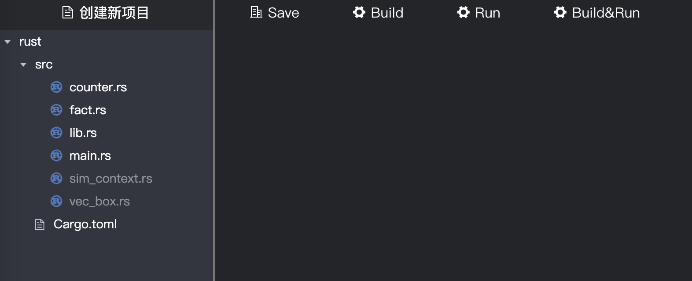

# ChainMaker Contract Programing for go

## 1 合约编写流程

## 1.1 使用IDE进行合约开发

请参考文档：[《ChainMaker IDE User Manual》](./chainmaker-ide-user-manual.md)

### 1.2 框架描述

使用IDE新建一个Rust语言的项目之后，IDE会默认将Rust SDK和一些工具代码附加上去，如下图：

对IDE默认附带的框架文件描述如下：

### 1.3 示例代码说明

### 1.4 代码编写规则

### 1.5 编译说明

## 2 合约发布过程

请参考：[《chainmaker-go-sdk.md》](./chainmaker-go-sdk.md)4.1.5 发送创建合约请求，或者[《chainmaker-java-sdk.md》](./chainmaker-java-sdk.md)2.1.4 创建合约。

## 3 合约调用过程

请参考：[《chainmaker-go-sdk.md》](./chainmaker-go-sdk.md)4.1.7 合约调用，或者[《chainmaker-java-sdk.md》](./chainmaker-java-sdk.md)2.1.7 执行合约。

## 4 Rust SDK API描述

