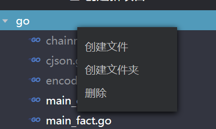

[TOC]

# ChainMaker IDE User Manual

读者对象：本文主要描述基于浏览器的ChainMaker IDE使用流程，适用于所有开发语言，主要面向于ChainMaker的合约开发者。

## 1 ChainMaker IDE简介

ChainMaker IDE是一款基于浏览器的合约开发工具，方便使用ChainMaker的开发人员进行合约开发。ChainMaker IDE提供了合约编辑、编译和运行的全流程功能。支持C++、Go和Rust三种语言，并为每种语言提供了基础的开发SDK使用，用户在新建项目时便会在新建的项目里自动添加SDK代码，而且SDK版本也会随ChainMaker的版本实时更新，方便用户使用。

使用ChainMaker IDE编写的合约代支持上传和下载功能，方便用户使用其他IDE工具进行合约编写，然后使用ChainMaker IDE进行编译和运行。

ChainMaker IDE的后端集成了合约执行的虚拟机，用户编写的合约编译时会按照WebAssembly规范编译成wasm文件，运行时后端调用虚拟机执行，从而得到合约执行结果。

## 2 ChainMaker IDE使用流程

以Go语言为例，IDE使用流程如下：

### 2.1 新建项目

如下图，点击"创建新项目"按钮，选择想要使用的开发语言，确定后，就会生成该语言的开发智能合约的模板项目文件。

创建完毕后项目模板结构如下：

### 2.2 编写合约

打开左边模板项目文件夹，可以看到有白色和灰色组成的文件列表，其中灰色文件是SDK代码，供用户调用，不可编辑。选择可编辑的文件，在右边编辑窗口进行代码的编辑和修改，编辑完成后，点击Save按钮，即使关掉和刷新浏览器，修改的代码还是保存在浏览器缓存中的，只要浏览器不清除缓存，项目文件会一直存在。点击某个文件，可以下载和删除，也可以在左边项目文件夹上右击，新建文件夹或文件，删除文件夹和文件。

### 2.3 编译合约

当智能合约编写完成后，点击上方build按钮，可以对整个智能合约项目进行编译。下方Output会打印出编译结果。编译成功后，在左边项目中可以生成对应的wasm文件。右击wasm文件可以选择删除或者下载。

### 2.4 运行

编译完成后，生成了wasm文件，就可以点击上方的run按钮，输入智能合约函数名和所需的参数的key、value，点击加号和减号可以调整参数的输入数量，然后点击run进行智能合约的调试运行。下方Output会打印出运行结果和内容。

### 2.5 编译和运行

这是编译和运行的结合，点击build&run按钮，一键输出智能合约的运行结果，并在左边项目文件下面生成相应的wasm文件。