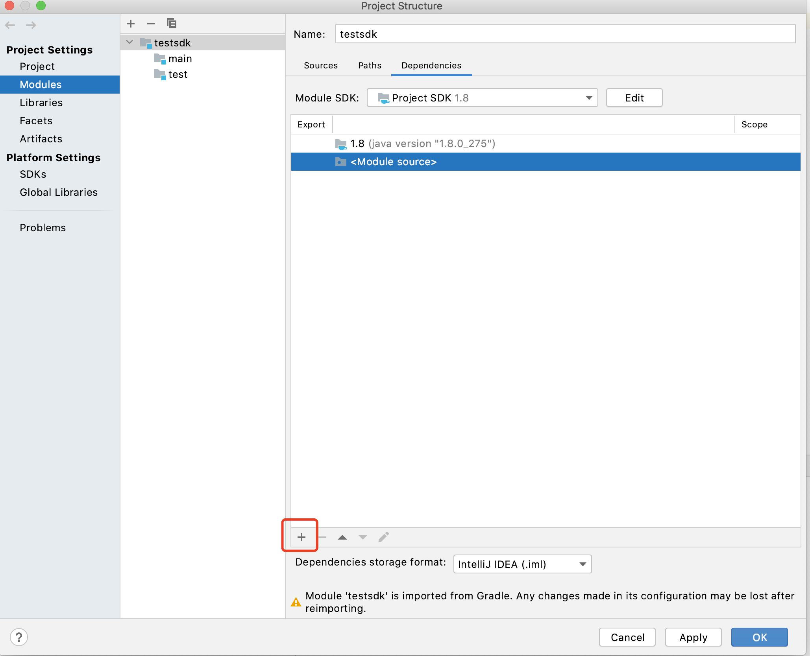

# ChainMaker Java SDK README

[TOC]

## 1 基本概念定义

Java SDK定义了ChainClient、ChainNode、ChainManager和ResponseInfo几个类，分别介绍如下：

- Node：表示链的一个节点信息，它定义了节点的各种属性，如节点连接的RPC地址，连接所用的密钥信息等，一个ChainClient对象需要包含一个或多个Node，这样才能对过节点实现各种功能。
- ChainClient：客户端开发最重要也是使用最多的类，代表逻辑上的一条链，所有客户端对链的操作接口都来自ChainClient。


- ChainManager：负责管理所有创建过的链，是一个使用单例模式的链管理类，避免用户同一条链创建多个ChainClient。用户可以使用ChainManager来检查某条链是否已经创建，或者直接创建某条链，如果这条链已经创建，ChainManager会直接返回之前已经创建过的


- ResponseInfo：对于创建合约、更新合约、调用合约和查询合约几个接口返回响应内容，其中包括交易ID，用于当用户请求超时后，后续主动查询交易结果。


ChainClient对象给用户使用。数据结构定义如下：

```java
public class ChainClient {
    // chainId is the identity of the chain
    private final String chainId;
    // the nodes of the chain
    private final List<ChainNode> chainNodes;
    // rpc client used to send rpc command
    private RpcServiceClient rpcServiceClient;

    // the organization id of the user
    private final String orgId;
    // user's private key used to sign transaction
    private final PrivateKey privateKey;
    // user's certificate
    private final Certificate certificate;
    // the bytes of user's certificate
    private final byte[] certBytes;
}

public class Node {
    // node grpc address
    private String grpcUrl;
    // rpc client private key bytes
    private byte[] clientKeyBytes;
    // rpc client certificate bytes
    private byte[] clientCertBytes;
    // the organization's ca cert bytes
    private byte[] tlsCertBytes;
    // the hostname in client certificate
    private String hostname;
    // TLS or PLAINTEXT
    private String negotiationType;
    // OPENSSL or JDK
    private String sslProvider;
}

public class ChainManager {
    // chains' map
    private final Map<String, ChainClient> chains = new HashMap<>();
    // for singleton mode
    private static final ChainManager chainManager = new ChainManager();
}

public class ResponseInfo {
		// response of request
    private ChainmakerResult.TxResponse txResponse;
    // txId of the request
    private String txId;
    // 同步获取交易执行的结果
    private ChainmakerTransaction.TransactionInfo syncResultTxInfo;
}
```

## 2 接口定义

以下描述了所有用户能够对链进行操作的接口，全部来自ChainClient类

### 2.1 用户合约接口
#### 2.1.1 生成用于创建合约的待签名payload
**参数说明**

  - contractName: 合约名
  - version: 版本号
  - runtimeType: 合约运行环境
  - params: 合约初始化参数
  - byteCodes: 合约字节数组

**返回值说明**
    返回payload字节数组
```java
    public byte[] createPayloadOfContractCreation(String contractName, String version, 
                                                  Contract.RuntimeType runtimeType, Map<String, String> params, 
                                                  byte[] byteCodes) {
    }
```

#### 2.1.2 生成用于管理（创建或升级）合约的签名后的payload
**参数说明**

  - payload: 签名前的payload

**返回值说明**

- 返回带签名的payload字节数组

```java
    public byte[] signPayloadOfContractMgmt(byte[] payload) throws InvalidProtocolBufferException {
    }
```

#### 2.1.3 将多个带签名后的payload合并成一个带多个签名的payload，所有签名都放在一个payload后面
**参数说明**
  - payloads: 多个带签名的payload

**返回值说明**
    返回带多个签名的payload字节数组
```java
    public byte[] mergeSignedPayloadsOfContractMgmt(byte[][] payloads) throws InvalidProtocolBufferException {
    }
```

#### 2.1.4 创建合约
**参数说明**
  - payloadWithEndorsementsBytes: 带签名的合约内容
  - rpcCallTimeout: 调用rcp接口超时时间, 单位：毫秒
  - syncResultTimeout: 同步获取执行结果超时时间，小于等于0代表不等待执行结果，直接返回（返回信息里包含交易ID），单位：毫秒
```java
    public ResponseInfo createContract(byte[] payloadWithEndorsementsBytes, long rpcCallTimeout,
                                       long syncResultTimeout) throws InvalidProtocolBufferException {
    }
```

#### 2.1.5 创建升级合约待签名的payload
**参数说明**
  - contractName: 合约名
  - version: 版本号
  - runtimeType: 合约运行环境
  - params: 合约初始化参数
  - byteCodes: 合约字节数组
```java
    public byte[] createPayloadOfContractUpgrade(String contractName, String version,
                                                 Contract.RuntimeType runtimeType, Map<String, String> params,
                                                 byte[] byteCodes) {
    }
```

#### 2.1.6 升级合约
**参数说明**

  - payloadWithEndorsementsBytes: 带签名的合约内容
  - rpcCallTimeout: 调用rcp接口超时时间, 单位：毫秒
  - syncResultTimeout: 同步获取执行结果超时时间，小于等于0代表不等待执行结果，
    直接返回（返回信息里包含交易ID），单位：毫秒
```java
    public ResponseInfo upgradeContract(byte[] payloadWithEndorsementsBytes, long rpcCallTimeout,
                                        long syncResultTimeout) throws InvalidProtocolBufferException {
    }
```

#### 2.1.7 执行合约
**参数说明**
  - contractName: 合约名
  - method: 方法名
  - params: 执行参数
  - rpcCallTimeout: 调用rcp接口超时时间, 单位：毫秒
  - syncResultTimeout: 同步获取执行结果超时时间，小于等于0代表不等待执行结果，直接返回（返回信息里包含交易ID），单位：毫秒
```java
    public ResponseInfo invokeContract(String contractName, String method,
                                       Map<String, String> params, long rpcCallTimeout,
                                       long syncResultTimeout) throws InvalidProtocolBufferException {
    }
```

#### 2.1.8 查询合约接口
**参数说明**
  - contractName: 合约名
  - method: 方法名
  - params: 执行参数
  - timeout: 执行超时时间，单位毫秒
```java
    public ResponseInfo queryContract(String contractName, String method,
                                      Map<String, String> params, long timeout) {
    }
```

### 2.2 系统合约接口
#### 2.2.1 根据交易Id查询交易
**参数说明**
  - txId: 交易ID
  - timeout：超时时间，单位毫秒
```java
    public ChainmakerTransaction.TransactionInfo getTxByTxId(String txId, long timeout)
            throws InvalidProtocolBufferException {
    }
```

#### 2.2.2 根据区块高度查询区块
**参数说明**
  - blockHeight: 区块高度
  - withRWSet: 是否返回读写集
  - timeout：超时时间，单位毫秒
```java
    public ChainmakerBlock.BlockInfo getBlockByHeight(long blockHeight, boolean withRWSet, long timeout)
            throws InvalidProtocolBufferException {
    }
```

#### 2.2.3 根据区块哈希查询区块
**参数说明**
  - blockHash: 区块高度
  - withRWSet: 是否返回读写集
  - timeout：超时时间，单位毫秒
```java
    public ChainmakerBlock.BlockInfo getBlockByHash(String blockHash, boolean withRWSet, long timeout)
            throws InvalidProtocolBufferException  {
    }
```

#### 2.2.4 根据交易Id查询区块
**参数说明**
  - txId: 交易Id
  - withRWSet: 是否返回读写集
  - timeout：超时时间，单位毫秒
```java
    public ChainmakerBlock.BlockInfo getBlockByTxId(String txId, boolean withRWSet, long timeout)
            throws InvalidProtocolBufferException {
    }
```

#### 2.2.5 查询上一个配置块
**参数说明**
  - withRWSet: 是否返回读写集
  - timeout：超时时间，单位毫秒
```java
    public ChainmakerBlock.BlockInfo getLastConfigBlock(boolean withRWSet, long timeout)
            throws InvalidProtocolBufferException {
    }
```

#### 2.2.6 查询节点已部署的所有合约信息

**返回值说明**

   - 包括：合约名、合约版本、运行环境、交易ID
```java
    public Contract.ContractInfo getContractInfo(long timeout)
            throws InvalidProtocolBufferException {
    }
```

#### 2.2.7 查询节点加入的链信息

**参数说明**

   - timeout：超时时间，单位毫秒

**返回值说明**

-  返回ChainId清单

```java
    public Discovery.ChainList getNodeChainList(long timeout)
            throws InvalidProtocolBufferException {
    }
```

#### 2.2.8 查询链信息

**返回值说明**

  - 包括：当前链最新高度，链节点信息
```java
    public Discovery.ChainInfo getChainInfo(long timeout)
            throws InvalidProtocolBufferException {
    }
```

### 2.3 链配置接口

链配置信息定义如下：

```protobuf
message ChainConfig {
    string                          chain_id         = 1; // 链标识
    string                          version          = 2; // 链版本
    string                          auth_type        = 3; // 认证类型
    uint64                          sequence         = 4; // 序列号
    CryptoConfig                    crypto           = 5; // 算法配置
    BlockConfig                     block            = 6; // 区块配置
    CoreConfig                      core             = 7; // core配置
    ConsensusConfig                 consensus        = 8; // 共识配置
    repeated TrustRootConfig        trust_roots      = 9; // 联盟成员，联盟链配置初始成员；公链无需配置。key：节点标识；value：地址，节点公钥/CA证书
    repeated Permission             permissions      = 10; // 权限配置
}

// crypto配置
message CryptoConfig {
    string hash    = 1; // 是否需要开启交易时间戳校验
}

// 区块配置
message BlockConfig {
    bool   tx_timestamp_verify      = 1; // 是否需要开启交易时间戳校验
    uint32 tx_timeout               = 2; // 交易时间戳的过期时间(秒)
    uint32 block_tx_capacity        = 3; // 区块中最大交易数
    uint32 block_size               = 4; // 区块最大限制，单位MB
    uint32 block_interval           = 5; // 出块间隔，单位:ms
}

// core配置
message CoreConfig {
    uint64 tx_scheduler_timeout                 = 1; // [0, 60] 交易调度器从交易池拿到交易后, 进行调度的时间
    uint64 tx_scheduler_validate_timeout        = 2; // [0, 60] 交易调度器从区块中拿到交易后, 进行验证的超时时间
}

// 共识配置
message ConsensusConfig {
    ConsensusType           type            = 1; // 共识类型
    repeated OrgConfig      nodes           = 2; // 节点机构列表
    repeated KeyValuePair   ext_config      = 3; // 扩展字段，记录难度、奖励等其他类共识算法配置
}

```

#### 3.1 查询最新链配置
```java
    public ChainmakerConfig.ChainConfig getChainConfig(long timeout)
            throws InvalidProtocolBufferException {
    }
```

#### 2.3.2 根据指定区块高度查询最近链配置
  - 如果当前区块就是配置块，直接返回当前区块的链配置
```java
    public ChainmakerConfig.ChainConfig getChainConfigByBlockHeight(int blockHeight, long timeout)
            throws InvalidProtocolBufferException {
    }
```

#### 2.3.3 查询最新链配置序号Sequence
  - 用于链配置更新
```java
    public long getChainConfigSequence(long timeout)
            throws TimeoutException, InvalidProtocolBufferException {
    }
```

#### 2.3.4 更新Core模块待签名payload生成
**参数说明**
  - txSchedulerTimeout: 交易调度器从交易池拿到交易后, 进行调度的时间，其值范围为[0, 60]，若无需修改，请置为-1
  - txSchedulerValidateTimeout: 交易调度器从区块中拿到交易后, 进行验证的超时时间，其值范围为[0, 60]，
    若无需修改，请置为-1
```java
    public byte[] createPayloadOfChainConfigCoreUpdate(int txSchedulerTimeout, int txSchedulerValidateTimeout,
    																									 long timeout)
            throws TimeoutException, InvalidProtocolBufferException {
    }
```

#### 2.3.5 更新Core模块待签名payload生成
**参数说明**
  - txTimestampVerify: 是否需要开启交易时间戳校验
  - (以下参数，若无需修改，请置为-1)
  - txTimeout: 交易时间戳的过期时间(秒)，其值范围为[600, +∞)
  - blockTxCapacity: 区块中最大交易数，其值范围为(0, +∞]
  - blockSize: 区块最大限制，单位MB，其值范围为(0, +∞]
  - blockInterval: 出块间隔，单位:ms，其值范围为[10, +∞]
```java
    public byte[] createPayloadOfChainConfigBlockUpdate(boolean txTimestampVerify, int txTimeout, 
    																										int blockTxCapacity, int blockSize, int blockInterval,
                                                        long timeout)
            throws TimeoutException, InvalidProtocolBufferException {
    }
```

#### 2.3.6 添加信任组织根证书待签名payload生成
**参数说明**
  - trustRootOrgId: 组织Id
  - trustRootCrt: 根证书
```java
    public byte[] createPayloadOfChainConfigTrustRootAdd(String trustRootOrgId, String trustRootCrt, 
    																										 long timeout)
            throws TimeoutException, InvalidProtocolBufferException {
    }
```

#### 2.3.7 更新信任组织根证书待签名payload生成
**参数说明**
  - trustRootOrgId: 组织Id
  - trustRootCrt: 根证书
```java
    public byte[] createPayloadOfChainConfigTrustRootUpdate(String trustRootOrgId, String trustRootCrt, 
    																												long timeout)
            throws TimeoutException, InvalidProtocolBufferException {
    }
```

#### 2.3.8 删除信任组织根证书待签名payload生成
**参数说明**
  - trustRootOrgId: 组织Id
```java
    public byte[] createPayloadOfChainConfigTrustRootDelete(String trustRootOrgId, long timeout)
            throws TimeoutException, InvalidProtocolBufferException {
    }
```

#### 2.3.9 添加权限配置待签名payload生成
**参数说明**
  - permissionResourceName: 权限名
  - principle: 权限规则
```java
    public byte[] createPayloadOfChainConfigPermissionAdd(String permissionResourceName,
                                                          PrincipleOuterClass.Principle principal, long timeout)
            throws TimeoutException, InvalidProtocolBufferException {
    }
```

#### 2.3.10 更新权限配置待签名payload生成
**参数说明**
  - permissionResourceName: 权限名
  - principle: 权限规则
```java
    public byte[] createPayloadOfChainConfigPermissionUpdate(String permissionResourceName,
                                                             PrincipleOuterClass.Principle principal, 
                                                             long timeout)
            throws TimeoutException, InvalidProtocolBufferException {
    }
```

#### 2.3.11 删除权限配置待签名payload生成
**参数说明**
  - permissionResourceName: 权限名
```java
    public byte[] createPayloadOfChainConfigPermissionDelete(String permissionResourceName, long timeout)
            throws TimeoutException, InvalidProtocolBufferException {
    }
```

#### 2.3.12 添加共识节点地址待签名payload生成
**参数说明**
  - nodeOrgId: 节点组织Id
  - nodeAddresses: 节点地址
```java
    public byte[] createPayloadOfChainConfigConsensusNodeAddrAdd(String nodeOrgId, String[] nodeAddresses, 
    																														 long timeout)
            throws TimeoutException, InvalidProtocolBufferException {
    }
```

#### 2.3.13 更新共识节点地址待签名payload生成
**参数说明**
  - nodeOrgId: 节点组织Id
  - nodeOldAddress: 节点原地址
  - nodeNewAddress: 节点新地址
```java
    public byte[] createPayloadOfChainConfigConsensusNodeAddrUpdate(String nodeOrgId, String nodeOldAddress,
                                                                    String nodeNewAddress, long timeout)
            throws TimeoutException, InvalidProtocolBufferException {
    }
```

#### 2.3.14 删除共识节点地址待签名payload生成
**参数说明**
  - nodeOrgId: 节点组织Id
  - nodeAddress: 节点地址
```java
    public byte[] createPayloadOfChainConfigConsensusNodeAddrDelete(String nodeOrgId, String nodeAddress, 
    																																long timeout)
            throws TimeoutException, InvalidProtocolBufferException {
    }
```

#### 2.3.15 添加共识节点待签名payload生成
**参数说明**
  - nodeOrgId: 节点组织Id
  - nodeAddresses: 节点地址
```java
    public byte[] createPayloadOfChainConfigConsensusNodeOrgAdd(String nodeOrgId, String[] nodeAddresses, 
    																														long timeout)
            throws TimeoutException, InvalidProtocolBufferException {
    }
```

#### 2.3.16 更新共识节点待签名payload生成
**参数说明**
  - nodeOrgId: 节点组织Id
  - nodeAddresses: 节点地址
```java
    public byte[] createPayloadOfChainConfigConsensusNodeOrgUpdate(String nodeOrgId, String[] nodeAddresses, 
    																															 long timeout)
            throws TimeoutException, InvalidProtocolBufferException {
    }
```

#### 2.3.17 删除共识节点待签名payload生成
**参数说明**
  - nodeOrgId: 节点组织Id
```java
    public byte[] createChainConfigConsensusNodeOrgDeletePayload(String nodeOrgId, long timeout)
            throws TimeoutException, InvalidProtocolBufferException {
    }
```

#### 2.3.18 添加共识扩展字段待签名payload生成
**参数说明**
  - params: Map<String, String>
```java
    public byte[] createPayloadOfChainConfigConsensusExtAdd(Map<String, String> params, long timeout)
            throws TimeoutException, InvalidProtocolBufferException {
    }
```

#### 2.3.19 添加共识扩展字段待签名payload生成
**参数说明**
  - params: Map<String, String>
```java
    public byte[] createPayloadOfChainConfigConsensusExtUpdatePayload(Map<String, String> params, long timeout)
            throws TimeoutException, InvalidProtocolBufferException {
    }
```

#### 2.3.20 添加共识扩展字段待签名payload生成
**参数说明**
  - keys: 待删除字段
```java
    public byte[] createPayloadOfChainConfigConsensusExtDelete(String[] keys, long timeout)
            throws TimeoutException, InvalidProtocolBufferException {
    }
```

#### 2.3.21 链配置更新获取Payload签名
```java
    public byte[] signPayloadOfChainConfig(byte[] payloadBytes) throws InvalidProtocolBufferException {
    }
```

#### 2.3.22 链配置更新Payload签名收集&合并
```java
    public byte[] mergeSignedPayloadsOfChainConfig(byte[][] payloads) throws InvalidProtocolBufferException {
    }
```

#### 2.3.23 发送链配置更新请求
```java
    public ResponseInfo updateChainConfig(byte[] payloadWithEndorsementsBytes, long timeout) {
    }
```


### 2.4 证书管理接口
#### 2.4.1 用户证书添加
**参数说明**
  - 在pb.TxResponse.ContractResult.Result字段中返回成功添加的certHash
```java
    public ResponseInfo addCert(long timeout) {
    }
```

#### 2.4.2 用户证书删除
**参数说明**
  - certHashes: 证书Hash列表
```java
    public ResponseInfo deleteCert(String[] certHashes, long timeout) {
    }
```

#### 2.4.3 用户证书查询
**参数说明**
  - certHashes: 证书Hash列表

**返回值说明**
  - *pb.CertInfos: 包含证书Hash和证书内容的列表
```java
    public ChainmakerResult.CertInfos queryCert(String[] certHashes, long timeout)
            throws InvalidProtocolBufferException {
    }
```

### 2.5 消息订阅接口
#### 2.5.1 区块订阅
**参数说明**
  - startBlock: 订阅起始区块高度，若为-1，表示订阅实时最新区块
  - endBlock: 订阅结束区块高度，若为-1，表示订阅实时最新区块
  - withRwSet: 是否返回读写集
```java
    public void subscribeBlock(long startBlock, long endBlock, boolean withRwSet,
                                StreamObserver<ChainmakerResult.SubscribeResult> blockStreamObserver) {
    }
```

#### 2.5.2 交易订阅
**参数说明**
  - startBlock: 订阅起始区块高度，若为-1，表示订阅实时最新区块
  - endBlock: 订阅结束区块高度，若为-1，表示订阅实时最新区块
  - txType: 订阅交易类型,若为pb.TxType(-1)，表示订阅所有交易类型
  - txIds: 订阅txId列表，若为空，表示订阅所有txId
```java
    public void subscribeTx(long startBlock, long endBlock, Request.TxType txType, String[] txIds,
                            StreamObserver<ChainmakerResult.SubscribeResult> txStreamObserver) {
    }
```

### 2.6 管理类接口
#### 2.6.1 SDK停止接口：关闭连接池连接，释放资源
```java
public void stop() {}
```

## 3 使用过程

客户端使用SDK的过程如下：

1. 创建ChainNode对象
2. 获取ChainManager单例对象
3. 使用ChainManager获取或创建链对象，创建ChainClient时需要将ChainNode对象作为参数传入
4. 调用ChainClient对象的接口进行操作

## 3.3 使用示例

1. 初始化，创建ChainClient

```java
   public void init() {
       try {
           ChainNode chainNode = ChainNode.builder().clientKeyBytes(FileUtils.getResourceFileBytes(GRPC_TLS_KEY_PATH))
                   .clientCertBytes(FileUtils.getResourceFileBytes(GRPC_TLS_CERT_PATH))
                   .tlsCertBytes(FileUtils.getResourceFileBytes(GRPC_CERT_PATH))
                   .hostname(TLS_HOST_NAME).grpcUrl(NODE_GRPC_URL)
                   .sslProvider("openSSL").negotiationType("TLS").build();
           chainManager = ChainManager.getInstance();
           chainClient = chainManager.getChainClient(CHAIN_ID);
           if (chainClient == null) {
               chainClient = chainManager.createChainClient(CHAIN_ID, ORG_ID, FileUtils.getResourceFileBytes(USER_KEY_PATH),
                       FileUtils.getResourceFileBytes(USER_CERT_PATH), chainNode);
           }
       } catch (Exception e) {
           System.out.printf("test init exception", e);
       }
   }
```

2. 创建合约

```java
   public void testCreateContract() throws IOException, InterruptedException, ExecutionException, TimeoutException {
       byte[] byteCode = FileUtils.getResourceFileBytes(CONTRACT_FILE_PATH);
   
       // 1. create payload
       byte[] payload = chainClient.createPayloadOfContractCreation(CONTRACT_NAME,
               "1", Contract.RuntimeType.WASMER_RUST, null, byteCode);
   
       // 2. create payloads with endorsement
       byte[] payloadWithEndorsement1 = chainClient.signPayloadOfContractMgmt(payload);
   
       // 3. merge endorsements using payloadsWithEndorsement
       byte[][] payloadsWithEndorsement = new byte[1][];
       payloadsWithEndorsement[0] = payloadWithEndorsement1;
       byte[] payloadWithEndorsement = chainClient.mergeSignedPayloadsOfContractMgmt(payloadsWithEndorsement);
   
       // 4. create contract
       ResponseInfo responseInfo = chainClient.createContract(payloadWithEndorsement, 5000, 5000);
   }
```

3. 调用合约

```java
   public void testInvokeContract() throws Exception {

       Map<String, String> params = new HashMap<>();
       params.put("time", System.currentTimeMillis()+"");
       params.put("file_hash", UUID.randomUUID().toString());
       params.put("file_name", UUID.randomUUID().toString()+System.currentTimeMillis());
       ResponseInfo responseInfo = chainClient.invokeContract(QUERY_CONTRACT_NAME, QUERY_CONTRACT_METHOD, params, 5000, 5000);
   }
```

## 4 SDK Jar包引用方式

### 4.1 编译

```
git clone https://git.code.tencent.com/ChainMaker/chainmaker-sdk-java.git
// 说明：需要使用openjdk 1.8.x并提前安装gradle，也可以使用intelliJ IDEA打开项目进行编译
cd chainamker-sdk-java
./gradle build
```

### 4.2 使用

1. 导入Jar包，这里使用IntelliJ为示例引用Jar包，将编译好的jar包拷贝到需要使用sdk的项目下（一般可以在项目下建一个libs目录），然后打开IntelliJ IDEA->File->Project Structures，如下图点击“+”号，选择JARs or Directories，选中Jar包点击open即可。



2. 引用

   在要使用sdk的源文件里使用import引用sdk包，如下：

   ```
   import org.chainmaker.sdk.*;
   ```

