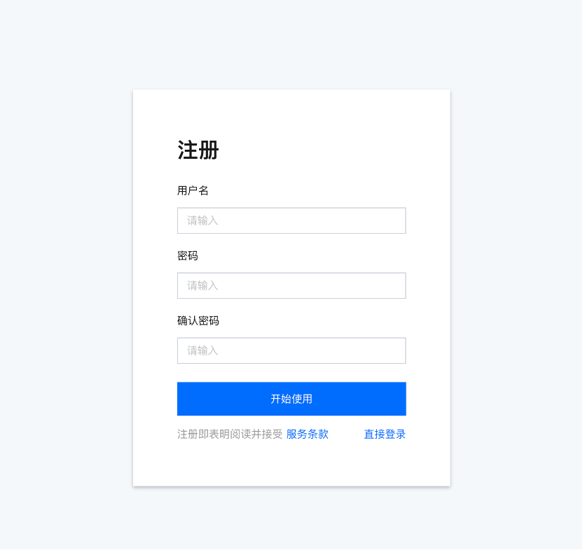

## 管理平台安装暨使用指南

### 1. 安装指南

管理平台主要包括前端（Web展示）、后端及数据库三部分组成。数据库采用的是MySQL，后端采用go语言开发，前端使用的是react框架。

#### 1.1 数据库安装

##### 1.1.1 MySQL安装

MySQL版本5.6+，下载地址：https://dev.mysql.com/downloads/installer/

具体安装方式不再赘述，请自行查找相关资料。

##### 1.1.2 数据导入

数据库sql文件保存在附件中（chainmaker-browser-db.sql）,请将数据导入到数据库中（数据库名自行指定，不限制）。

数据导入完成后会自动在数据库中插入平台管理员账号，用户名：admin，密码：123456，该用户可在管理平台部署完成后通过界面进行修改。

#### 1.2 后端模块部署

##### 1.2.1 编译打包

本地需要具有go的运行环境，go运行环境请自行查找相关资料。

将指定版本代码下载到本地，然后编译打包，可使用如下命令：

```shell
go build -o chainmaker-browser.bin
```

其中chainmaker-browser.bin为编译生成的执行文件，可自行进行修改。

##### 1.2.2 前置环境

管理平台部署需要依赖一个ChainMaker运行环境。具体的ChainMaker环境安装部署  请参考对应的文档。

##### 1.2.3 配置调整

管理平台配置文件：config.yml，它的配置内容包括四部分，以下是详细说明：

```yml
http:
  address:  # Web监听网卡地址
  port:     # Web监听端口

node:
  chain:      # chainId，所在链ID（链ID是链的唯一标识）
  org:        # 所在组织
  tls_host:   # TLS域名
  ca_path:    # CA证书所在路径（即文件夹，建议绝对路径）
  remotes:    # 远端节点地址，格式：IP:PORT
  user:
    admin_key: # 管理员私钥（具体位置，建议绝对路径）
    admin_crt: # 管理员证书（具体位置，建议绝对路径）
    user_key:  # 普通用户私钥（具体位置，建议绝对路径）
    user_crt:  # 普通用户证书（具体位置，建议绝对路径）

db:
  db_url:    # 数据库地址，格式：(IP)/DBName
  db_user:   # 数据库登录用户
  db_passwd: # 数据库登录密码

log:
log_level_default: INFO    # 默认日志级别
file_path: ../log/web.log  # 日志路径
max_age: 365               # 日志最长保存时间，单位：天
max_size: 100              # 日志最长保存时间，单位：天
rotation_time: 1           # 日志滚动时间，单位：小时
log_in_console: false      # 是否展示日志到终端，仅限于调试使用
show_color: true           # 是否打印颜色日志

```

重点说明下证书相关配置，包括私钥和证书两部分，它们代表的是用户的身份，管理员具有修改链配置，安装、冻结及销毁合约等功能，普通用户仅用于进行数据的查询或提交合约操作。无论是管理员亦或者普通用户都必须是其对应组织的一员。

##### 1.2.4 节点启停

编译成功且完成配置后，可通过startup.sh启动节点，脚本中需要配置对应的配置文件所在路径及启动文件，请按照实际情况进行设置，如下：

```shell
CONFIG_PATH="/chainmaker/config/"
BROWSER_BIN="chainmaker-browser.bin"
```

可通过shutdown.sh将该服务停掉，对应的，如果启动文件有变化，也需要在脚本中进行调整，如下：

```sh
BROWSER_BIN="chainmaker-browser.bin"
```


#### 1.3 前端模块部署

##### 1.3.1 编译打包

前端使用react进行开发，编译打包时需要npm环境，npm运行环境安装请自行查阅相关资料。打包命令：

```shell
npm run build
```

执行完该命令后会生成build.zip文件，该文件即前端代码压缩包，需要部署在nginx服务器上。

##### 1.3.2 模块部署

前端代码部署需要安装nginx环境，nginx运行环境的安装请自行查阅相关资料。

将build.zip放在指定的前端代码路径下，然后解压：

```shell
unzip build.zip
```

解压完后代码如下图所示：

```shell
-rw-r--r-- 1 root root    1147 2月   2 20:05 asset-manifest.json
-rw------- 1 root root 2419879 2月   2 20:05 build.zip
-rw-r--r-- 1 root root    3870 12月 31 17:03 favicon.ico
-rw-r--r-- 1 root root    2235 2月   2 20:05 index.html
-rw-r--r-- 1 root root    1147 2月   2 20:08 manifest.json
drwxr-xr-x 5 root root      53 2月   2 20:05 static
```

将index.html页面的路径配置到nginx中，打开nginx的配置（默认路径为：/etc/nginx/nginx.conf），修改以下标注的配置：

```conf
listen       8080;       #监听端口
server_name  localhost;  #ServerName

#charset koi8-r;

#access_log  logs/host.access.log  main;

root /opt/chainmaker/chainmaker-browser/frontend;    #index.html所在路径

index index.html;    #index.html文件

location ^~/chainmaker/ {                 #后端跳转过滤字段
    proxy_pass http://127.0.0.1:6060;     #跳转到后端的请求
}
```

其中，若前端访问地址直接请求后端，则可不配置location部分。

配置完成后重启nginx即可生效。

### 2. 用户管理

默认配置完成后，系统自动生成一个平台管理员账号，admin/123456。平台管理员账号拥有者需要尽快修改密码。

管理平台用户有三种角色，平台管理员、企业管理员及企业子账号，每个角色具有的权限不同，平台管理员可审批用户成为企业管理员，而企业管理云可审批用户成为企业子账号。

下面将以三种角色为分类进行使用说明。

#### 2.1 平台管理员

##### 2.1.1 登录


平台管理员默认账号密码为admin/123456，可在安装完成后通过主页面登录。

##### 2.1.2 修改密码

点击右上角账号选择账户中心，如下：


跳转后会进入用户基本信息及认证信息页面：


在基本信息面板中选择密码修改功能，点击确定即可：


##### 2.1.3 企业管理员审批

点击右上角账号选择权限管理，如下：


会进入企业管理员审批列表，可查看待审批信息，并进行审批：


经过耐心审查后可点击“同意”通过该用户的审批：


或可以点击“拒绝”，在弹出页面中填写拒绝请求：


在已审批列表中可查看全部审批结果，如下：


#### 2.2 企业管理员

##### 2.2.1 注册

点击主页右上角的“注册”按钮，如下：



注册页面较简单，只需要输入正确的用户名和密码即可，密码目前有限制：

+ 1、包含至少1个数字和1个大写字母；
+ 2、包含8~20个字符；

##### 2.2.2 登录/修改密码

参考 **2.1.1/2.1.2** 章节

##### 2.2.3 企业管理员认证

登录或注册成功后进入管理平台主页，可点击右上角的“工作台”按钮，进入企业身份认证界面：


选择“立即认证”，并在弹出页面的企业身份中选择 **企业管理员** ：


按照页面中的内容进行填写和上传文件即可，具体文件内容如何填写不再赘述，填写完成后需要等待平台管理员进行审批。

需要注意的是，平台管理员会对其内容进行详细、严格的审查，需按照规定真实填写，否则会被拒绝。

此时查看账户中心，会发现目前的认证信息处于“认证中“。

##### 2.2.4 消息提醒

当平台管理员认证通过后会有一个消息提醒，在右上角有一个数字显示，打开后会显示未读消息，如下：


此时可查看当前提交认证的审批状态，并可点击查看某个具体认证的情况，如下：


查看完成后，消息会变更为已读状态，可从已读消息中查看：


##### 2.2.5 企业子账号审批

当前企业下如果有对应的企业子账号提交认证申请后，会在审批列表中展示：


企业管理员可选择 **“同意“** 或 **”拒绝“** 

##### 2.2.6 人员管理

当前企业下对应的企业子账号数据审批完成后会在人员管理列表中呈现：


若管理员想取消某个子账号的访问权限，可点击“修改权限“，将其状态调整为”未认证“，如下所示：


需要注意的是，当前用户在设置为“未认证”后无法重新再将角色修改为子账号，对应子账号必须要重新进行认证才可用，因此该功能请慎用。

#### 2.3 企业子账号

##### 2.3.1 注册/登录/修改密码

参考  **2.1.1/2.1.2/2.2.1** 三个章节

##### 2.3.2 企业子账号认证

在企业认证身份中选择企业子账号，如下：


请按真实情况填写，特别需要关注的有两点：

+ 1、企业ID号码需要找企业管理员获取；
+ 2、企业ID号码与企业名称必须保持一致；

 此时查看账户中心，会发现目前的认证信息处于“认证中“。

##### 2.3.3 消息提醒

参考 **2.2.4** 章节

### 3. 数据查询

管理平台支持链、区块直到交易等信息的查询功能，该查询功能需要对应的用户认证成功后才可查看。

#### 3.1 概览

认证成功用户，默认登录后会进入概览页面，在概览页面中分为两部分，上面部分显示当前节点已接入区块链网络的汇总信息，下面显示具体每条链的信息情况，包括每条链的节点数、组织数量及区块高度等：


#### 3.2 区块链列表

##### 3.2.1 列表

点击区块链列表可看到当前节点所接入的区块链网络中链基本信息：


##### 3.2.2 链基本信息

点击列表中链的名称可跳转到对应链的信息页面，最先看到的就是“基础参数”，它描述的是链基本信息：


##### 3.2.3 区块链浏览器

###### 3.2.3.1 区块列表

区块链浏览器中显示的是当前链区块的列表，及每个区块中交易的列表信息：


###### 3.2.3.2 基础信息

基础信息显示了当前区块的信息，包括区块Hash、高度及交易数等等，如下：


###### 3.2.3.3 交易详情

点击交易ID（即高亮部分）可查看交易详情信息：


###### 3.2.3.4 依赖关系

依赖关系描述的是当前区块中交易之间的依赖关系（俗称DAG图），它主要存在三种比较常见的情况。

+ 1）当前区块中所有交易均存在依赖关系：

  

  

+ 2）当前区块中所有交易间均没有依赖关系：

  

+ 3）当前区块中部分交易间存在依赖关系：

  


##### 3.2.4 合约管理

合约管理中显示的是当前链中已经安装的合约信息，包括其名称、版本号及创建时间等，如下：

