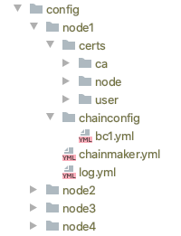
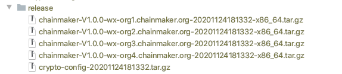
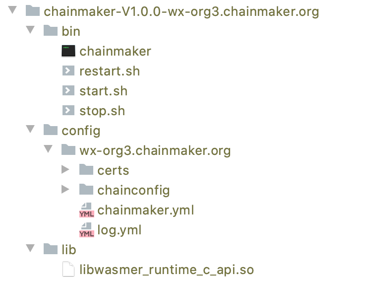
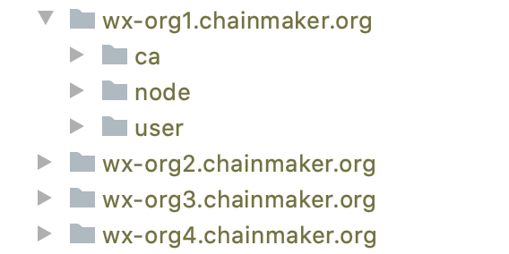

[TOC]

# ChainMaker Deploy Manual

ChainMaker支持多种共识协议，在部署时可以根据配置进行选择。为了方便部署和测试，ChainMaker支持solo模式。solo模式可以理解为一种单节点的共识协议，仅使用自己节点达成共识，不需要通过网络通信。ChainMaker另外还支持MBFT和TBFT等多种共识协议。

### 快速部署

ChainMaker提供了快速部署服务的工具，用于快速生成多节点的证书和配置文件，方便进行快速的部署和测试，过程如下：

#### 快速生成证书和配置文件

ChainMaker提供了快速生成证书和配置文件工具（一个组织对应单个节点），使用过程如下：

1. 下载chainmaker-go和chainmaker-cryptogen代码，编译chainmaker-cryptogen

   ```sh
   git clone --recurse-submodules git@git.code.tencent.com:ChainMaker/chainmaker-go.git
   cd chainmaker-go/tools
   git clone --recurse-submodules git@git.code.tencent.com:ChainMaker/chainmaker-cryptogen.git
   cd chainmaker-cryptogen
   make
   ```

2. 生成证书和配置文件

   ```shell
   cd chainmaker-go/scripts
   ./prepare.sh 4 1 ## 参数4代表节点数量（和组织数量一致），1代表链数量
   ```

3. 查看生成的配置文件
   

说明：node1、node2、node3和node4分别是生成的四个节点的配置文件，在启动程序时可以分别放置到四个节点上去。每个节点的配置文件包含主配置文件chainmaker.yml、日志配置文件log.yml、链配置目录chainconfig和证书目录certs。分别描述如下：

- certs: 证书目录
- certs/ca: 存放所有组织根证书的目录，每个组织有一个以组织名称命名的文件夹
- certs/node/consensusx: 全节点身份证证的证书目录
- certs/node/commonx: 其他类型节点身份认证的证书目录
- certs/user/adminx: 节点管理员身份认证证书目录
- certs/user/clientx: 节点普通用户身份认证证书目录
- chainconfig: 链配置目录
- chainconfig/bcx.yml: 具体的链配置文件
- chainmaker.yml: 节点主配置文件
- log.yml: 日志配置文件

#### 快速制作部署包

ChainMaker提供了快速制作部署包脚本，执行过程如下

```shell
# 制作安装包
cd chainmaker-go/script
./build_release.sh
```

制作完成后的安装包目录如下：


#### 快速部署和启动

```
cd chainmaker-go/script
./cluster_quick_start.sh normal
```

### DIY部署

手工部署节点过程主要包括编译程序、生成证书、修改配置文件和启动服务等过程。chainmaker部署完成后的目录结构如下：



bin: 存放主程序和启动、停止和重启脚本

config：存放配置文件

lib：存放依赖库

#### 生成证书

如前面快速部署所述，ChainMaker提供的工具chainmaker-cryptogen是用来生成证书的。每个节点的证书信息证书包括组织的根证书、节点证书和用户证书。每个组织需要拥有自己的根证书，然后使用根证书分别对节点的公私钥和用户的公私钥进行签名来生成节点证书和用户证书。证书整体生成过程如下：

1. 生成组织根证书。
2. 生成节点公私钥对。
3. 使用组织根证书对节点公钥进行签名，生成节点证书。
4. 生成用户公私钥对。
5. 使用组织根证书对节点公钥进行签名，生成节点证书。

```shell
./chainmaker-cryptogen
Usage:
  chainmaker-cryptogen [command]

Available Commands:
  extend      Extend existing network
  generate    Generate key material
  help        Help about any command
  showconfig  Show config

Flags:
  -c, --config string   specify config file path (default "../config/crypto_config_template.yml")
  -h, --help            help for chainmaker-cryptogen

Use "chainmaker-cryptogen [command] --help" for more information about a command.

./chainmaker-cryptogen generate
```

chainmaker-cryptogen命令默认一次生成四个组织的证书，生成后的结构如下：



其中单个组织证书目录描述如下：

- ca: 存放所有组织根证书的目录，每个组织有一个以组织名称命名的文件夹
- node/consensusx: 全节点身份证证的证书目录
- node/commonx: 其他类型节点身份认证的证书目录
- user/adminx: 节点管理员身份认证证书目录
- user/clientx: 节点普通用户身份认证证书目录

#### 编辑配置文件

参考前面配置文件

#### 编译程序

```shell
git clone --recurse-submodules git@git.code.tencent.com:ChainMaker/chainmaker-go.git
cd chainmaker-go/main
go build -o chainmaker
```

将编译好的chainmaker、启动脚本（scripts/start.sh）、停止脚本（scripts/stop.sh）、重启脚本（restart.sh）、证书文件和配置文件分别放到如前所述相应的目录下。

#### 在多机器环境下跑集群

配置模板修改

#### 启动节点

使用start.sh启动节点

#### 添加组织

如果单独部署的节点想要加入某个链，需要将自己组织的证书添加到节点中去，添加组织可以使用SDK客户端将多个组织签名后的交易发送到链上，即可添加组织。请参考[《chainmaker-go-sdk.md》4.3.6 发送链配置更新请求和4.3.9 添加信任组织根证书待签名payload生成](../用户手册/sdk_doc/chainmaker-go-sdk.md)

#### 添加节点

添加节点前需要先添加组织，然后使用客户端SDK将多个组织签名后的交易发送到链上，即可添加组织。请参考[《chainmaker-java-sdk.md》2.3.23 发送链配置更新请求和2.3.6 添加信任组织根证书待签名payload生成](../用户手册/sdk_doc/chainmaker-java-sdk.md)

